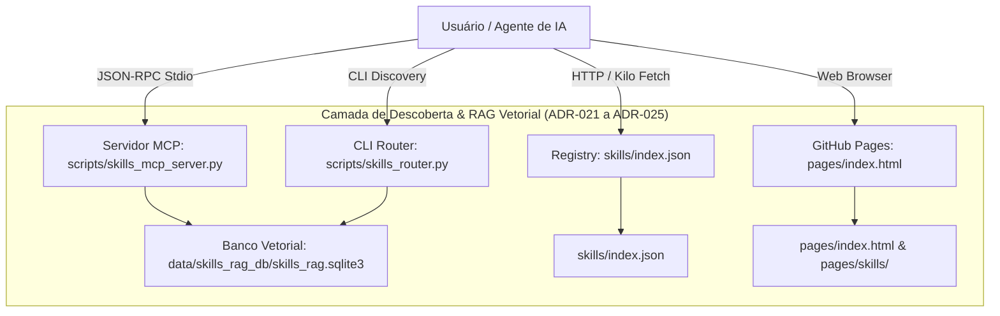

# ignite-agents-skills — SOTA Skills Ecosystem & Agent Governance

> Plataforma centralizada de skills de engenharia de software SOTA (State of the Art), roteamento semântico vetorial, servidor MCP dedicado, registry remoto para Kilo/OpenCode e governança contínua para agentes autônomos.

[](./CHANGELOG.md)
[](./skills/index.json)
[](./.github/governance/AUDIT_MASTER_INDEX.md)
[](./.github/governance/COMPLIANCE_SCORECARD.csv)
[](./.github/workflows/validate-skills.yml)
[](./docs/adr/INDEX.md)

---

## 1. Visão Geral & Arquitetura

O **ignite-agents-skills** é uma plataforma 3-em-1 para agentes de inteligência artificial aplicados à engenharia de software de alta performance:

1. **Registry Remoto de Skills:** Manifesto canônico `skills/index.json` compatível com o padrão [Agent Skills](https://agentskills.io) para **Kilo Code**, **OpenCode** e clientes HTTP.
2. **Motor Semântico & Servidor MCP:** Servidor MCP stdio nativo (`skills-rag-mcp`), RAG vetorial com busca híbrida BM25/embeddings, e CLI Router para descoberta inteligente de especializações.
3. **Hub de Documentação GitHub Pages:** Geração dinâmica de páginas HTML para todas as 60 skills e histórico completo de ADRs.



---

## 2. Estrutura do Repositório

```text
.
├── LICENSE
├── README.md                           # Documentação principal
├── USAGE.md                            # Guia completo de uso das skills
├── CHANGELOG.md                        # Histórico de versões
├── RELEASE-NOTES.md                    # Notas oficiais de release e destaques arquiteturais
├── STATE.md                            # Memória persistente e estado do repositório para agentes
├── AGENTS.md                           # SSOT de governança para agentes de IA
├── GEMINI.md                           # Stub de runtime ultraleve para Gemini CLI
├── skills/
│   ├── index.json                      # Registry centralizado (fonte única para Kilo/OpenCode)
│   ├── adr-architecture-elevation/     # Desafio adversarial e ampliação de ADRs
│   ├── adr-archive/                    # Arquivamento e governança de ADRs
│   ├── adr-generator/                  # Gerador de ADRs e Decision Sets
│   ├── ... (60 skills SOTA)
│   └── xlsx-processing/
├── scripts/                            # Toolbox e Motores Unificados
│   ├── sync-index.sh                   # Auto-gera skills/index.json
│   ├── validate-index.sh               # Valida index.json contra arquivos reais
│   ├── validate-skill.sh               # Valida qualidade Ultra-High Quality Grade
│   ├── archive-adrs.sh                 # Janitor de ciclo de vida de ADRs
│   ├── skills_mcp_server.py            # Servidor MCP Stdio (skills-rag-mcp)
│   ├── skills_rag_indexer.py           # Motor de Indexação Vetorial / FTS5
│   ├── skills_router.py                # CLI Router para busca semântica
│   ├── audit_engine.py                 # Motor de Auditoria Forense SOTA (8 Dimensões)
│   ├── translate_catalog_nim.py        # Tradutor de catálogo via NVIDIA NIM
│   └── tests/                          # Suíte de testes automatizados (42 testes)
├── pages/                              # Motor de Documentação Web
│   ├── build.py                        # Gerador de HTML estático
│   └── ...                             # Templates e artefatos renderizados
├── docs/                               # Governança e Arquitetura
│   ├── adr/                            # ADR-001 a ADR-026 (ativas + archive)
│   └── audit/                          # Ledgers de auditoria
└── data/                               # Banco SQLite vetorial e especificações
```

---

## 3. Catálogo das 60 Skills por Categoria

| Categoria | Skills |
|:---|:---|
| **Architecture & Modeling** | `adr-architecture-elevation`, `architecture-review`, `database-architecture`, `ddd` |
| **Documentation & Decision Records** | `adr-generator`, `adr-archive`, `technical-documentation`, `changelog-generator` |
| **Governance & Repository** | `governance`, `repo-bootstrap`, `agents-md-management`, `skill-audit-bulletin` |
| **Planning & Execution** | `agent-planning-execution`, `product-spec-engineering`, `implementation` |
| **Code Quality & Refactoring** | `clean-code`, `refactoring`, `code-review`, `code-review-lite`, `code-review-workflow` |
| **Testing & Verification** | `testing-mastery`, `test-driven-development`, `verification-before-completion`, `systematic-debugging` |
| **Security & Auditing** | `security-review`, `circuit-breaker`, `resilient-execution` |
| **AI, Prompting & Evaluation** | `prompt-engineering`, `llm-as-judge`, `agent-development`, `context7-mcp` |
| **Multi-Agent & Orchestration** | `agent-orchestration`, `subagent-driven-development`, `dispatching-parallel-agents`, `cap` |
| **API & Backend Frameworks** | `api-design`, `php-laravel-ecosystem` |
| **Frontend & UI/UX** | `ui-ux-pro-max`, `react-best-practices`, `artifacts-builder`, `mobile-design`, `ux-researcher-designer` |
| **Operations & Infrastructure** | `observability`, `deployment`, `performance-optimization` |
| **Git & Release Management** | `git-workflow`, `release` |
| **Tools & Extension Authoring** | `mcp-builder`, `skill-creator`, `skill-discovery`, `writing-skills` |
| **Content & Document Processing** | `content-creator`, `content-research-writer`, `email-composer`, `seo-optimizer`, `docx-processing`, `pdf-processing`, `xlsx-processing`, `brainstorming` |

---

## 4. Como Usar

### A. No Kilo Code (VS Code)

No Kilo Code: **Kilo Settings → Comportamento do Agente → Habilidades → URLs de Habilidades**, adicione:

```text
https://lscheffel.github.io/ignite-agents-skills/skills/
```

Ou no seu `kilo.json`:

```json
{
  "skills": {
    "urls": [
      "https://lscheffel.github.io/ignite-agents-skills/skills/"
    ]
  }
}
```

### B. Como Servidor MCP (`skills-rag-mcp`)

Adicione o servidor MCP ao seu arquivo `mcp_config.json` ou configuração de IDE:

```json
{
  "mcpServers": {
    "skills-rag-mcp": {
      "command": "python3",
      "args": [
        "/caminho/para/ignite-agents-skills/scripts/skills_mcp_server.py"
      ],
      "env": {
        "SKILLS_WORKSPACE_DIR": "/caminho/para/ignite-agents-skills"
      }
    }
  }
}
```

**Ferramentas expostas pelo MCP:**

- `search_skills`: Busca semântica híbrida (vetorial + BM25).
- `route_task`: Roteamento inteligente de tarefas para a skill ideal.
- `get_skill_details`: Detalhes completos, templates e instruções de uma skill.
- `list_skills_catalog`: Catálogo completo com filtros de categoria.
- `bootstrap_agent_instructions`: Provisionamento de `AGENTS.md` e stubs.
- `get_rag_telemetry`: Métricas de latência, footprint de tokens e cache hits.
- `inspect_rag_index`: Auditoria da integridade do banco semântico.

### C. Via CLI Router

```bash
# Busca semântica rápida no terminal
python3 scripts/skills_router.py "preciso modelar banco de dados relacional e índices" --top-k 3
```

---

## 5. Comandos de Manutenção e Governança

```bash
# 1. Sincronizar o skills/index.json
./scripts/sync-index.sh

# 2. Validar integridade do skills/index.json
./scripts/validate-index.sh

# 3. Validar qualidade de todas as skills
for s in skills/*/; do [ -f "$s/SKILL.md" ] && bash scripts/validate-skill.sh "$s"; done

# 4. Executar o motor de auditoria forense SOTA (8 dimensões)
python3 scripts/audit_engine.py

# 5. Re-indexar banco vetorial RAG
python3 scripts/skills_rag_indexer.py

# 6. Rodar a suíte de testes automatizados
python3 -m unittest discover -s scripts/tests -p "test_*.py"

# 7. Compilar as páginas HTML de documentação
python3 pages/build.py
```

---

## 6. Histórico de Decisões Arquiteturais (ADRs)

| ADR | Título | Status |
|:---|:---|:---:|
| **ADR-001 a ADR-015** | Fundação do Registry Kilo, Ultra-High Quality Grade, Workflows de CI/CD, Geração de Páginas HTML Dinâmicas | Implementado (Archive) |
| **ADR-021** | Dual-Engine Neural Rerank com GPU NVIDIA e Cutoff Gate | Implementado |
| **ADR-022** | RAG SOTA Quad Optimizations: Embeddings 2048-dim, Cache Rerank, Chunks Focalizados | Implementado |
| **ADR-023** | Federated Multi-Scope RAG com Descoberta em 12 Convenções de Agentes | Implementado |
| **ADR-024** | Consolidação RICE: Telemetria de Runtime no MCP e Lazy Loading de Referências | Implementado |
| **ADR-025** | Hierarchical Multi-Asset Ingestion com Damping e Parent Linking | Implementado |
| **ADR-026** | Automação SSOT de Instruções via `bootstrap_agent_instructions` | Implementado |

Veja o catálogo completo em [docs/adr/INDEX.md](./docs/adr/INDEX.md).

---

## 7. Licença

Distribuído sob licença MIT. Veja [LICENSE](./LICENSE) para mais detalhes.