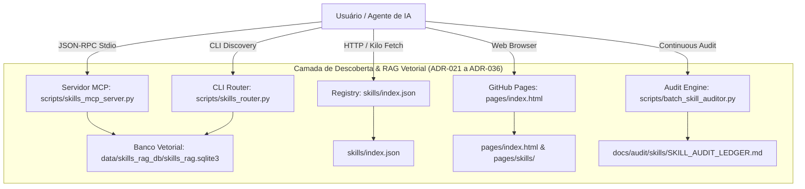

# ignite-agents-skills — SOTA Skills Ecosystem & Agent Governance

> Plataforma centralizada de skills de engenharia de software SOTA (State of the Art), roteamento semântico vetorial, servidor MCP dedicado, registry remoto para Kilo/OpenCode, motor de auditoria contínua em 8 dimensões e deploy atômico multi-target para agentes autônomos.

[](./CHANGELOG.md)
[](./skills/index.json)
[](./docs/audit/skills/SKILL_AUDIT_LEDGER.md)
[](./docs/audit/skills/SKILL_AUDIT_LEDGER.md)
[](./.github/workflows/validate-skills.yml)
[](./docs/adr/ADR-INDEX.md)

---

## 1. Visão Geral & Arquitetura

O **ignite-agents-skills** é uma plataforma 4-em-1 para agentes de inteligência artificial aplicados à engenharia de software de alta performance:

1. **Registry Remoto de Skills (v3.0.0):** Manifesto canônico `skills/index.json` compatível com o padrão [Agent Skills](https://agentskills.io) para **Kilo Code**, **OpenCode**, **Gemini CLI**, **Antigravity** e clientes HTTP.
2. **Motor Semântico & Servidor MCP:** Servidor MCP stdio nativo (`skills-rag-mcp`), RAG vetorial com busca híbrida BM25 + embeddings, e CLI Router para descoberta inteligente de especializações.
3. **Motor de Auditoria Forense Dual-Axis (8 Dimensões SOTA):** Sistema contínuo de auditoria física e cognitiva com persistência em ledgers (`SKILL_AUDIT_LEDGER.md` / `.json`), garantindo 100% das 60 skills em Grade A+ (Platinum $\ge 93.0$) e Grade S (Diamond $\ge 97.0$).
4. **Hub de Documentação GitHub Pages & Deploy Atômico Multi-Target:** Geração dinâmica de páginas HTML para todas as 60 skills e deploy sincronizado com purge de órfãos em 6 diretórios de runtime (`~/.gemini/config/skills`, `~/.kilo/skills`, etc.).



---

## 2. Estrutura do Repositório

```text
.
├── LICENSE
├── README.md                           # Documentação principal
├── USAGE.md                            # Guia completo de uso das skills
├── CHANGELOG.md                        # Histórico de versões
├── RELEASE-NOTES.md                    # Notas oficiais de release e destaques arquiteturais
├── STATE.md                            # Memória persistente e estado do repositório para agentes
├── AGENTS.md                           # SSOT de governança para agentes de IA
├── GEMINI.md                           # Stub de runtime ultraleve para Gemini CLI
├── skills/
│   ├── index.json                      # Registry centralizado (fonte única para Kilo/OpenCode)
│   ├── adr-architecture-elevation/     # Desafio adversarial e ampliação de ADRs
│   ├── adr-archive/                    # Arquivamento e governança de ADRs
│   ├── adr-generator/                  # Gerador de ADRs e Decision Sets
│   ├── ... (60 skills SOTA)
│   └── xlsx-processing/
├── scripts/                            # Toolbox e Motores Unificados
│   ├── sync-index.sh                   # Auto-gera skills/index.json
│   ├── validate-index.sh               # Valida index.json contra arquivos reais
│   ├── validate-skill.sh               # Valida qualidade Ultra-High Quality Grade
│   ├── archive-adrs.sh                 # Janitor de ciclo de vida de ADRs
│   ├── skills_mcp_server.py            # Servidor MCP Stdio (skills-rag-mcp)
│   ├── skills_rag_indexer.py           # Motor de Indexação Vetorial / FTS5
│   ├── skills_router.py                # CLI Router para busca semântica
│   ├── audit_engine.py                 # Motor de Auditoria Forense SOTA (8 Dimensões)
│   ├── batch_skill_auditor.py          # Motor de Auditoria Dual-Axis em Lote
│   ├── elevate_catalog_to_sota_aplus.py# Motor de Elevação Contínua para Grade A+/S
│   ├── translate_catalog_nim.py        # Tradutor de catálogo via NVIDIA NIM (ADR-026)
│   ├── sync_runtime.py                 # Motor de Deploy Atômico Multi-Target
│   └── tests/                          # Suíte de testes automatizados (42 testes)
├── pages/                              # Motor de Documentação Web
│   ├── build.py                        # Gerador de HTML estático
│   └── ...                             # Templates e artefatos renderizados
├── docs/                               # Governança e Arquitetura
│   ├── adr/                            # ADR-001 a ADR-036 (ativas + archive)
│   └── audit/                          # Ledgers de auditoria e grafos relacionais
└── data/                               # Banco SQLite vetorial e especificações
```

---

## 3. Catálogo das 60 Skills por Categoria

Todas as 60 skills operam no padrão **Agent Skills Standard v1.0.0**, com YAML frontmatter padronizado, triggers bilíngues, árvores de decisão visuais (Mermaid), tabelas de anti-patterns graduadas, seções de edge cases e failure modes, e suporte modular completo com templates, exemplos e checklists.

| Categoria | Skills | Destaques |
|:---|:---|:---|
| **Core Architecture & Governance** | `adr-architecture-elevation`, `adr-archive`, `adr-generator`, `architecture-review`, `governance`, `repo-bootstrap`, `technical-documentation`, `skill-audit-bulletin`, `skill-creator`, `writing-skills` | Gestão de ADRs (MADR 3.0), auditoria forense contínua, governança de tech debt. |
| **AI Agents, Loops & Tooling** | `agent-development`, `agent-orchestration`, `agent-planning-execution`, `agents-md-management`, `subagent-driven-development`, `dispatching-parallel-agents`, `context7-mcp`, `mcp-builder`, `llm-as-judge`, `skill-discovery`, `find-skills` | Orquestração de subagentes, MCP Stdio, roteamento semântico, BPE token optimization. |
| **Engineering, Coding & Quality** | `clean-code`, `code-review`, `code-review-lite`, `code-review-workflow`, `refactoring`, `systematic-debugging`, `test-driven-development`, `testing-mastery`, `implementation`, `verification-before-completion` | TDD rigoroso, análise AST, erradicação de bugs, code review com SLO de diff. |
| **Backend, Data, Cloud & Security** | `api-design`, `database-architecture`, `ddd`, `deployment`, `observability`, `security-review`, `resilient-execution`, `circuit-breaker`, `php-laravel-ecosystem`, `git-workflow`, `release` | REST/GraphQL idempotente, OpenTelemetry, Circuit Breakers, OWASP Top 10, SemVer. |
| **Frontend, UI/UX & Web** | `artifacts-builder`, `mobile-design`, `react-best-practices`, `seo-optimizer`, `ui-ux-pro-max`, `ux-researcher-designer` | WCAG 2.2 AAA, Next.js Server Actions, Design Tokens, Core Web Vitals. |
| **Product, Content & Documents** | `brainstorming`, `content-creator`, `content-research-writer`, `docx-processing`, `email-composer`, `pdf-processing`, `product-spec-engineering`, `prompt-engineering`, `xlsx-processing`, `changelog-generator` | Engenharia de PRDs, OCR de PDFs, streaming XLSX, Chain-of-Density prompts. |

---

## 4. Matriz de Comandos de Governança

| Operação | Comando Oficial |
|:---|:---|
| **Sincronizar `skills/index.json`** | `./scripts/sync-index.sh` |
| **Validar `skills/index.json`** | `./scripts/validate-index.sh` |
| **Auditoria Dual-Axis em Lote** | `python3 scripts/batch_skill_auditor.py` |
| **Auditoria Forense SOTA (8 Dimensões)** | `python3 scripts/audit_engine.py` |
| **Ingestão & Vetorização RAG** | `python3 scripts/skills_rag_indexer.py` |
| **Roteamento Semântico CLI** | `python3 scripts/skills_router.py "<consulta>"` |
| **Servidor MCP Stdio** | `python3 scripts/skills_mcp_server.py` |
| **Suíte de Testes Automatizados** | `python3 -m unittest discover -s scripts/tests -p "test_*.py"` |
| **Compilar Páginas HTML do Site** | `python3 pages/build.py` |
| **Janitor de Arquivamento de ADRs** | `python3 ~/.gemini/config/skills/adr-archive/scripts/audit.py .` |
| **Deploy & Sincronização de Runtimes (Purge)** | `python3 scripts/sync_runtime.py --deploy` |
| **Auditoria de Drift de Runtimes** | `python3 scripts/sync_runtime.py --status` |

---

## 5. Licença

Este repositório é distribuído sob a licença [MIT](./LICENSE).