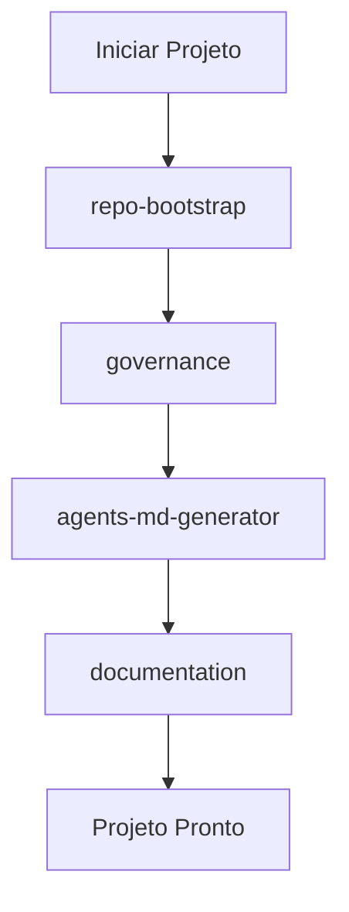
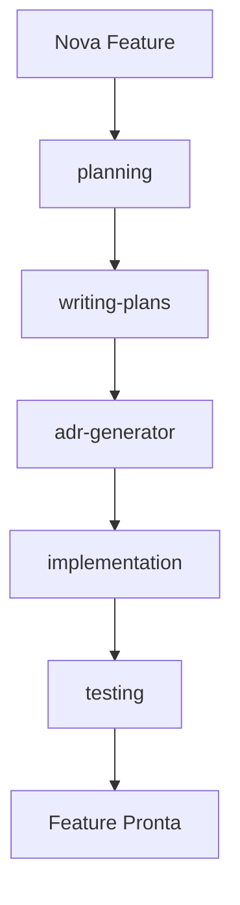
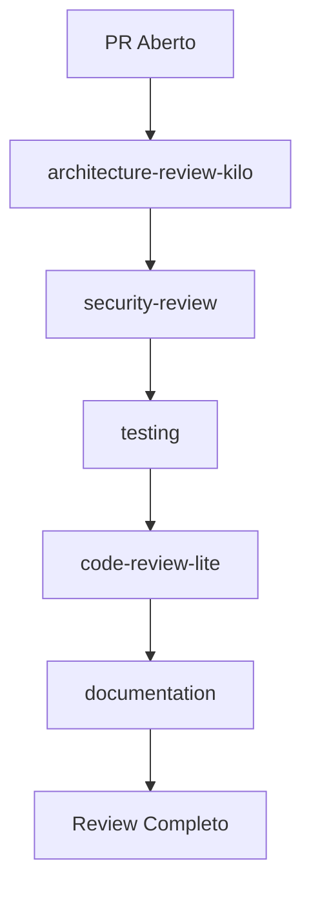
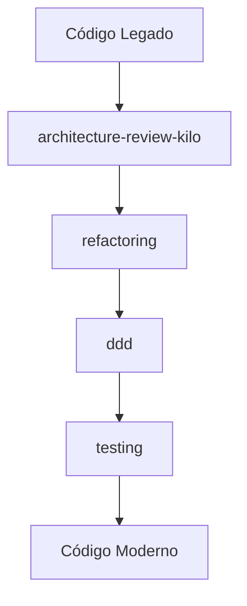
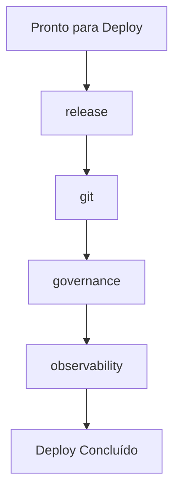
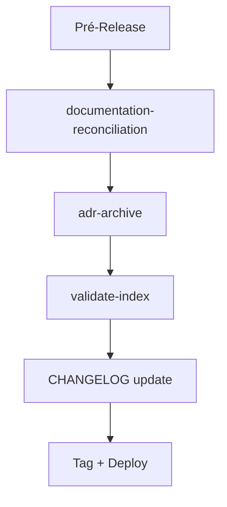

# USAGE.md — Guia Completo de Uso das Skills

> Guia abrangente de como usar cada skill do repositório `ignite-agents-skills`.

---

## Índice

1. [Visão Geral](#visão-geral)
2. [Como Configurar](#como-configurar)
3. [Skills por Categoria](#skills-por-categoria)
4. [Guia de Uso por Skill](#guia-de-uso-por-skill)
5. [Fluxos de Trabalho Comuns](#fluxos-de-trabalho-comuns)
6. [Anti-patterns Gerais](#anti-patterns-gerais)
7. [Referências](#referências)

---

## Visão Geral

O repositório `ignite-agents-skills` contém **25 skills** para agentes de IA compatíveis com o padrão [Agent Skills](https://agentskills.io). Cada skill é um módulo independente que pode ser carregado por agentes de IA para executar tarefas específicas.

### Total de Skills: 25

| Categoria | Quantidade | Skills |
|-----------|------------|--------|
| Architecture | 2 | `architecture-review-kilo`, `ddd` |
| Documentation | 3 | `documentation`, `adr-generator`, `documentation-reconciliation` |
| Governance | 3 | `governance`, `repo-bootstrap`, `agents-md-generator` |
| Planning | 2 | `planning`, `writing-plans` |
| Implementation | 1 | `implementation` |
| Quality | 2 | `testing`, `code-review-lite` |
| Security | 1 | `security-review` |
| AI | 2 | `prompt-engineering`, `vibe-coding` |
| Orchestration | 1 | `agent-orchestration` |
| Data | 1 | `data-modeling` |
| API | 1 | `api-design` |
| Operations | 1 | `observability` |
| Code Quality | 1 | `refactoring` |
| Tools | 2 | `git`, `release` |
| Audit | 2 | `skill-audit-bulletin`, `adr-archive` |

---

## Como Configurar

### No Kilo Code (VS Code)

1. Abra as configurações do Kilo
2. Navegue até **Comportamento do Agente → Habilidades → URLs de Habilidades**
3. Adicione a URL do registry:

```
https://lscheffel.github.io/ignite-agents-skills/skills/
```

### Via arquivo `kilo.json`

```json
{
  "skills": {
    "urls": [
      "https://lscheffel.github.io/ignite-agents-skills/skills/"
    ]
  }
}
```

### Via CLI

```bash
# Buscar skills disponíveis
curl -s https://lscheffel.github.io/ignite-agents-skills/skills/index.json | jq '.skills[].name'
```

---

## Skills por Categoria

### 🏗️ Architecture

#### `architecture-review-kilo`

**Descrição:** Realiza revisões arquiteturais de código, detectando violações de princípios SOLID, padrões arquiteturais (Clean Architecture, Hexagonal, DDD) e code smells estruturais.

**Quando usar:**
- Precisa de revisão de arquitetura
- Quer analisar estrutura de código
- Precisa avaliar design

**Exemplo de uso:**
```
Revise a arquitetura deste projeto e identifique violações de SOLID
```

**Skills relacionadas:** `ddd`, `adr-generator`

---

#### `ddd`

**Descrição:** Guia para modelagem de domínio com Domain-Driven Design (DDD). Define diretrizes para Entidades, Value Objects, Agregados, Repositórios, Domain Events, Serviços de Domínio e Contextos Delimitados.

**Quando usar:**
- Modelar domínios ricos
- Refatorar entidades anêmicas
- Estruturar contextos delimitados

**Exemplo de uso:**
```
Crie um Aggregate Root para o domínio de Pedidos seguindo DDD
```

**Skills relacionadas:** `architecture-review-kilo`, `testing`, `implementation`

---

### 📚 Documentation

#### `adr-generator`

**Descrição:** Cria Architecture Decision Records (ADRs) para documentar decisões arquiteturais importantes. Gera templates padronizados com contexto, decisão, consequências e status.

**Quando usar:**
- Precisa documentar decisão arquitetural
- Quer registrar trade-offs técnicos
- Precisa criar ADR

**Exemplo de uso:**
```
Crie uma ADR para documentar a decisão de usar PostgreSQL ao invés de MongoDB
```

**Skills relacionadas:** `documentation`, `architecture-review-kilo`, `implementation`

---

#### `documentation`

**Descrição:** Guia para criação e manutenção de documentação técnica de alta qualidade. Define padrões para README, ADRs, guias de API, documentação de arquitetura e docs-as-code.

**Quando usar:**
- Criar documentação
- Revisar docs
- Padronizar material técnico

**Exemplo de uso:**
```
Crie um README completo para este projeto
```

**Skills relacionadas:** `adr-generator`, `repo-bootstrap`, `implementation`

---

#### `documentation-reconciliation`

**Descrição:** Audita e reconcilia documentação canônica (README, CHANGELOG, USAGE) e específica (ADRs, BP, TODOs) contra realidade do código.

**Quando usar:**
- README/CHANGELOG/USAGE desatualizados
- ADRs/BPs/TODOs com status incorretos
- ADRs implementadas não arquivadas
- Antes de release ou deploy gh-pages
- Gaps entre documentação e implementação

**Exemplo de uso:**
```
Execute reconciliação documental completa deste repositório
```

**Skills relacionadas:** `governance`, `adr-generator`, `skill-audit-bulletin`

---

### 🏛️ Governance

#### `governance`

**Descrição:** Define diretrizes de governança para repositórios e equipes. Cobre processos de revisão, aprovação, branching strategy, versionamento semântico e gestão de issues/PRs.

**Quando usar:**
- Definir processos de equipe
- Implementar governance-as-code
- Padronizar workflows de desenvolvimento

**Exemplo de uso:**
```
Configure branch protection e CODEOWNERS para este repositório
```

**Skills relacionadas:** `git`, `release`, `repo-bootstrap`, `implementation`, `skill-audit-bulletin`

---

#### `repo-bootstrap`

**Descrição:** Gera estrutura inicial de repositório com arquivos de governança: README.md, AGENTS.md, CHANGELOG.md, CONTRIBUTING.md, CODE_OF_CONDUCT.md, SECURITY.md, LICENSE.

**Quando usar:**
- Inicializar novo repositório
- Padronizar estrutura existente
- Criar template de projeto

**Exemplo de uso:**
```
Gere a estrutura inicial para este novo repositório
```

**Skills relacionadas:** `governance`, `documentation`, `git`, `skill-audit-bulletin`

---

#### `agents-md-generator`

**Descrição:** Gera e mantém arquivos AGENTS.md adaptativos que se adaptam ao contexto do projeto. Detecta automaticamente tipo de projeto, tecnologias, padrões arquiteturais e governança.

**Quando usar:**
- Criar AGENTS.md para novo projeto
- Atualizar AGENTS.md existente
- Gerar documentação adaptativa

**Exemplo de uso:**
```
Gere um AGENTS.md para este projeto CRM
```

**Skills relacionadas:** `repo-bootstrap`, `governance`, `documentation`, `skill-audit-bulletin`

---

### 📋 Planning

#### `planning`

**Descrição:** Realiza planejamento estratégico e tático de projetos. Divide iniciativas em épicos, features, tasks, estima esforço e define priorização.

**Quando usar:**
- Planejar projeto
- Criar roadmap
- Estimar esforço
- Decompor trabalho

**Exemplo de uso:**
```
Crie um roadmap para as próximas 3 features
```

**Skills relacionadas:** `writing-plans`, `governance`, `implementation`

---

#### `writing-plans`

**Descrição:** Cria planos de implementação detalhados, passo a passo, a partir de uma especificação técnica ou requisitos. Divide trabalho em tarefas executáveis com critérios de aceitação.

**Quando usar:**
- Criar plano de implementação
- Quebrar feature em tarefas
- Criar roadmap técnico

**Exemplo de uso:**
```
Crie um plano de implementação para a feature de autenticação
```

**Skills relacionadas:** `planning`, `ddd`, `implementation`

---

### ⚙️ Implementation

#### `implementation`

**Descrição:** Executa mudanças previamente planejadas de forma governada e incremental. Consome ADRs, Blueprints e TODOs, valida Execution Contract, constrói DAG de execução.

**Quando usar:**
- Implementar ADR aprovada
- Executar mudanças governadas
- Precisa de rastreabilidade completa

**Exemplo de uso:**
```
Implemente a ADR-005 seguindo o processo governado
```

**Skills relacionadas:** `adr-generator`, `writing-plans`, `planning`, `testing`, `git`, `documentation`, `governance`, `release`, `architecture-review-kilo`, `ddd`

---

### 🧪 Quality

#### `testing`

**Descrição:** Guia para escrita de testes automatizados de qualidade. Define padrões para testes unitários, de integração, E2E e contratuais. Inclui pirâmide de testes, naming conventions e boas práticas.

**Quando usar:**
- Escrever testes
- Revisar cobertura
- Definir estratégia de testes

**Exemplo de uso:**
```
Crie testes unitários para o UserService
```

**Skills relacionadas:** `ddd`, `governance`, `implementation`

---

#### `code-review-lite`

**Descrição:** Lightweight code review optimized for AI-first and vibe-coding workflows. Use after completing features, refactors, or before commits to detect regressions, architectural drift, security mistakes, and broken assumptions while preserving development velocity.

**Quando usar:**
- Após completar features/refactors
- Antes de commits/push
- Detectar regressões óbvias
- Validar alinhamento com ADRs

**Exemplo de uso:**
```
Revise este código para bugs óbvios e drift arquitetural
```

**Skills relacionadas:** `planning`, `adr-generator`, `testing`, `security-review`, `architecture-review-kilo`

---

### 🔒 Security

#### `security-review`

**Descrição:** Realiza revisões de segurança em código, detectando vulnerabilidades, secrets, problemas de criptografia e dependências inseguras.

**Quando usar:**
- Revisar código por segurança
- Auditar dependências
- Validar práticas de criptografia

**Exemplo de uso:**
```
Revise este código vulnerabilidades de segurança
```

**Skills relacionadas:** `governance`, `architecture-review-kilo`, `testing`

---

### 🤖 AI

#### `prompt-engineering`

**Descrição:** Diretrizes para engenharia de prompts eficazes com agentes de IA. Cobre estrutura de prompts, few-shot, chain-of-thought, role prompting, constraints e técnicas avançadas.

**Quando usar:**
- Criar prompts para agentes de IA
- Otimizar interações
- Treinar equipes em IA

**Exemplo de uso:**
```
Crie um prompt eficaze para refatoração de código legado
```

**Skills relacionadas:** `vibe-coding`

---

#### `vibe-coding`

**Descrição:** Modalidade de desenvolvimento onde o desenvolvedor guia o agente de IA com intenção e direção, não comandos detalhados. Foca em resultado, velocidade e fluxo contínuo.

**Quando usar:**
- Pair programming com IA
- Desenvolvimento assistido por IA
- Session de vibe coding

**Exemplo de uso:**
```
Vamos fazer uma sessão de vibe coding para esta feature
```

**Skills relacionadas:** `prompt-engineering`, `testing`

---

### 🔀 Orchestration

#### `agent-orchestration`

**Descrição:** Orquestração de múltiplos agentes de IA para tarefas complexas. Cobre decomposição de tarefas, roteamento de modelo, handoff com contrato I/O, paralelismo fan-out/fan-in.

**Quando usar:**
- Coordenar vários agentes
- Definir papéis
- Gerenciar handoffs
- Otimizar execução paralela

**Exemplo de uso:**
```
Orquestre 3 agentes para revisar documentação, testes e segurança
```

**Skills relacionadas:** `prompt-engineering`, `vibe-coding`, `governance`

---

### 📊 Data

#### `data-modeling`

**Descrição:** Guia para modelagem de dados relacional e não-relacional. Define diretrizes para schema SQL, normalização, índices, migrações versionadas e estratégias de performance.

**Quando usar:**
- Criar bancos de dados
- Projetar schemas
- Otimizar queries
- Gerenciar migrações

**Exemplo de uso:**
```
Crie um schema SQL para o domínio de usuários
```

**Skills relacionadas:** `ddd`, `testing`, `architecture-review-kilo`

---

### 🌐 API

#### `api-design`

**Descrição:** Guia completo para design de APIs RESTful e GraphQL. Define padrões para endpoints, versionamento, contratos de erro, paginação e idempotência.

**Quando usar:**
- Projetar novas APIs
- Revisar contratos existentes
- Padronizar práticas de design

**Exemplo de uso:**
```
Crie a especificação REST para o endpoint de usuários
```

**Skills relacionadas:** `documentation`, `testing`, `governance`

---

### ⚙️ Operations

#### `observability`

**Descrição:** Guia completo para observabilidade de sistemas em produção. Define padrões para logging estruturado, métricas, tracing distribuído e alerting.

**Quando usar:**
- Configurar monitoramento
- Investigar incidentes
- Implementar observabilidade

**Exemplo de uso:**
```
Configure métricas Prometheus para esta API
```

**Skills relacionadas:** `testing`, `release`, `governance`

---

### 🧹 Code Quality

#### `refactoring`

**Descrição:** Guia completo para refatoração segura e incremental. Cobre técnicas de extração, Strangler Fig, Branch by Abstraction, testes antes de refatorar e migração de legado.

**Quando usar:**
- Refatorar código
- Melhorar estrutura existente
- Migrar sistemas legados

**Exemplo de uso:**
```
Refatore este código usando a técnica Strangler Fig
```

**Skills relacionadas:** `architecture-review-kilo`, `ddd`, `testing`

---

### 🛠️ Tools

#### `git`

**Descrição:** Padrões e workflows para Git. Cobre Conventional Commits, branching strategies, merge vs rebase, resolução de conflitos e boas práticas.

**Quando usar:**
- Fazer commits
- Criar branches
- Resolver conflitos
- Ensinar Git

**Exemplo de uso:**
```
Crie um commit seguindo Conventional Commits
```

**Skills relacionadas:** `governance`, `release`, `repo-bootstrap`, `implementation`

---

#### `release`

**Descrição:** Guia para gestão de releases e versionamento. Define processo de release, changelog, tag, deploy e rollback.

**Quando usar:**
- Preparar releases
- Publicar pacotes
- Gerenciar versionamento semântico

**Exemplo de uso:**
```
Crie uma release v1.2.0 com changelog
```

**Skills relacionadas:** `git`, `governance`, `implementation`

---

### 🔍 Audit

#### `skill-audit-bulletin`

**Descrição:** Audita skills existentes avaliando qualidade, completude, acionabilidade e risco. Gera bulletins de auditoria com scores, recomendações e veredito final.

**Quando usar:**
- Revisar skills
- Validar registry
- Decidir adoção

**Exemplo de uso:**
```
Audite a qualidade da skill governance
```

**Skills relacionadas:** `architecture-review-kilo`, `documentation`

---

#### `adr-archive`

**Descrição:** Automatiza o arquivamento de ADRs plenamente implementadas de forma token-efficient. Avalia silenciosamente o status das tarefas nos arquivos TODO e, se a ADR estiver finalizada, gerencia a criação do ER faltante e arquiva os artefatos de execução, deixando apenas os ERs e ADRs pendentes visíveis na raiz.

**Quando usar:**
- Arquivar ADRs implementadas
- Limpar artefatos de execução (BP, TODO, PI) da raiz
- Garantir que apenas ADRs ativas e ERs de ADRs finalizadas fiquem visíveis
- Executar reconciliação documental pré-release
- Automatizar governança de ADRs

**Exemplo de uso:**
```
Arquive as ADRs implementadas deste repositório
```

**Skills relacionadas:** `adr-generator`, `implementation`, `documentation-reconciliation`, `governance`

---

## Fluxos de Trabalho Comuns

### Fluxo 1: Iniciar Novo Projeto



1. **repo-bootstrap** — Gerar estrutura inicial
2. **governance** — Configurar processos
3. **agents-md-generator** — Gerar AGENTS.md
4. **documentation** — Criar documentação

---

### Fluxo 2: Implementar Nova Feature



1. **planning** — Planejar a feature
2. **writing-plans** — Criar plano de implementação
3. **adr-generator** — Documentar decisões arquiteturais
4. **implementation** — Executar implementação
5. **testing** — Validar com testes

---

### Fluxo 3: Revisão de Código



1. **architecture-review-kilo** — Revisar arquitetura
2. **security-review** — Verificar segurança
3. **testing** — Validar testes
4. **code-review-lite** — Revisão leve (AI-first)
5. **documentation** — Verificar documentação

---

### Fluxo 4: Migração de Legado



1. **architecture-review-kilo** — Analisar arquitetura atual
2. **refactoring** — Planejar refatoração
3. **ddd** — Reestruturar domínio
4. **testing** — Validar com testes

---

### Fluxo 5: Deploy e Release



1. **release** — Preparar release
2. **git** — Criar tags e branches
3. **governance** — Verificar processo
4. **observability** — Monitorar deploy

---

### Fluxo 6: Reconciliação Documental (Pré-Release)



1. **documentation-reconciliation** — Auditar docs canônicas + ADR/BP/TODO
2. **adr-archive** — Arquivar ADRs implementadas
3. **validate-index** — Verificar registry
4. **CHANGELOG update** — Entradas para commits recentes
5. **Tag + Deploy** — SemVer + gh-pages sync

---

## Anti-patterns Gerais

### 🔴 Crítico

#### Usar múltiplas skills para a mesma tarefa
**O que é:** Usar `adr-generator` + `documentation` + `repo-bootstrap` para criar documentação.
**Por que é ruim:** Conflitos, redundância, inconsistência.
**Como evitar:** Escolher a skill mais específica para a tarefa.

#### Ignorar dependências entre skills
**O que é:** Usar `implementation` sem antes usar `adr-generator` e `writing-plans`.
**Por que é ruim:** Falta de contexto, decisões não documentadas.
**Como evitar:** Seguir o fluxo de trabalho recomendado.

### 🟡 Médio

#### Não validar antes de usar
**O que é:** Usar skills sem verificar se estão atualizadas.
**Por que é ruim:** Padrões desatualizados, inconsistências.
**Como evitar:** Verificar versão e changelog antes de usar.

#### Não documentar decisões
**O que é:** Tomar decisões arquiteturais sem criar ADR.
**Por que é ruim:** Perda de contexto, dificuldade futura.
**Como evitar:** Sempre criar ADR para decisões significativas.

### 🟢 Baixo

#### Não usar templates
**O que é:** Criar do zero quando existem templates.
**Por que é ruim:** Mais trabalho, inconsistência.
**Como evitar:** Usar templates disponíveis em cada skill.

#### Não revisar output
**O que é:** Aceitar output sem verificar.
**Por que erros passam:** Erros passam despercebidos.
**Como evitar:** Sempre revisar antes de commitar.

---

## Referências

- [Agent Skills Standard](https://agentskills.io)
- [Kilo Code Documentation](https://kilocode.ai)
- [GitHub Pages Setup](https://pages.github.com/)
- [Conventional Commits](https://www.conventionalcommits.org/)
- [Semantic Versioning](https://semver.org/)
- [Domain-Driven Design](https://www.domainlanguage.com/ddd/)
- [Clean Architecture](https://blog.cleancoder.com/uncle-bob/2012/08/13/the-clean-architecture.html)

---

*Última atualização: 2026-07-15*
*Total de skills: 25*
*Versão do registry: 2.3.1*