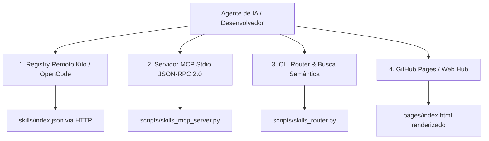

# Guia Completo de Uso e Operação (USAGE.md)

> Manual técnico e operacional de consumo, roteamento semântico, servidor MCP, registry remoto e governança do repositório `ignite-agents-skills`.

---

## 1. Modos de Consumo do Ecossistema

O `ignite-agents-skills` suporta quatro modos integrados de consumo:


```mermaid
graph TD
    A[Agente de IA / Desenvolvedor] --> B[1. Registry Remoto Kilo / OpenCode]
    A --> C[2. Servidor MCP Stdio JSON-RPC 2.0]
    A --> D[3. CLI Router & Busca Semântica]
    A --> E[4. GitHub Pages / Web Hub]

    B --> B1[skills/index.json via HTTP]
    C --> C1[scripts/skills_mcp_server.py]
    D --> D1[scripts/skills_router.py]
    E --> E1[pages/index.html renderizado]
```

---

## 2. Configuração por Ambiente

### 2.1 Kilo Code (VS Code & IDEs compatíveis)

1. Abra as configurações do Kilo Code.
2. Navegue até **Comportamento do Agente → Habilidades → URLs de Habilidades**.
3. Adicione a URL canônica:
   ```
   https://lscheffel.github.io/ignite-agents-skills/skills/
   ```

Ou edite diretamente o seu `kilo.json`:

```json
{
  "skills": {
    "urls": [
      "https://lscheffel.github.io/ignite-agents-skills/skills/"
    ]
  }
}
```

### 2.2 Servidor MCP Stdio (`skills-rag-mcp`)

No arquivo de configuração MCP do seu cliente (ex.: Gemini CLI, Claude Desktop, Antigravity):

```json
{
  "mcpServers": {
    "skills-rag-mcp": {
      "command": "python3",
      "args": [
        "/home/loupan/projetosVS/ignite-agents-skills/scripts/skills_mcp_server.py"
      ],
      "env": {
        "SKILLS_WORKSPACE_DIR": "/home/loupan/projetosVS/ignite-agents-skills"
      }
    }
  }
}
```

#### Ferramentas MCP Disponíveis:

| Tool | Descrição | Parâmetros Principais |
|:---|:---|:---|
| `search_skills` | Busca híbrida (BM25 + vetores) | `query` (string), `top_k` (int), `category` |
| `route_task` | Roteamento automático de tarefas | `task_description` (string), `top_k` |
| `get_skill_details` | Recupera o conteúdo completo e templates | `skill_id` (string) |
| `list_skills_catalog` | Lista todas as skills indexadas | `category_filter` (opcional) |
| `bootstrap_agent_instructions` | Provisiona AGENTS.md e GEMINI.md | `workspace_path` (string) |
| `get_rag_telemetry` | Métricas de latência, footprint e cache | (nenhum) |
| `inspect_rag_index` | Inventário volumétrico de chunks e tokens | `parent_skill`, `asset_type` |

---

## 3. CLI Reference & Roteamento Semântico

O script `scripts/skills_router.py` oferece busca vetorial híbrida, expansão de acrônimos e descoberta local:

```bash
# 1. Consulta simples em linguagem natural
python3 scripts/skills_router.py "como escrever testes automatizados e TDD"

# 2. Filtrar por tipo de ativo (skill_root, template, reference)
python3 scripts/skills_router.py "template de ADR e blueprint" --asset-type template

# 3. Retornar saída em JSON para automação
python3 scripts/skills_router.py "revisão de segurança e OWASP" --json --top-k 2

# 4. Obter prompt snippet XML formatado para injeção em LLM
python3 scripts/skills_router.py "planejar refatoração arquitetural" --prompt-snippet

# 5. Modo REPL interativo
python3 scripts/skills_router.py --interactive
```

---

## 4. Guia Rápido das 60 Skills SOTA

### 🏗️ Architecture & Modeling
- `adr-architecture-elevation`: Desafio adversarial independente de ADRs, exploração do espaço de design, matriz de avaliação comparativa e amplificação do Decision Set.
- `architecture-review`: Revisões arquiteturais, detecção de violações SOLID, Hexagonal, Clean Architecture e code smells estruturais.
- `database-architecture`: Modelagem de dados, otimização de índices SQL/NoSQL, migrações e auditoria de consultas.
- `ddd`: Padrões de Domain-Driven Design (Entities, Value Objects, Aggregates, Domain Services, Bounded Contexts).

### 📝 Documentation & Decision Records
- `adr-generator`: Criação de Architecture Decision Records com Decision Set completo (ADR, BP, PI, TODO).
- `adr-archive`: Governança de ciclo de vida e arquivamento automatizado de ADRs implementadas.
- `technical-documentation`: Reconciliação dos 6 pilares de documentação (README, CHANGELOG, USAGE, RELEASE-NOTES, STATE, AGENTS).
- `changelog-generator`: Geração automatizada de changelogs a partir do git log.

### 🏛️ Governance & Repository Setup
- `governance`: Políticas de branching, code review, SemVer e aprovação.
- `repo-bootstrap`: Estruturação inicial completa de novos repositórios com arquivos padrão.
- `agents-md-management`: Geração e manutenção adaptativa de arquivos AGENTS.md.
- `skill-audit-bulletin`: Auditoria forense contínua (Dual-Axis SOTA) de skills.

### 🎯 Planning & Implementation
- `agent-planning-execution`: Decomposição estruturada de épicos e roadmaps em tarefas atômicas.
- `product-spec-engineering`: Elaboração de PRDs, especificações técnicas e user stories.
- `implementation`: Execução governada e incremental de mudanças planejadas com relatórios de progresso.

### 🧼 Code Quality & Refactoring
- `clean-code`: Princípios de código limpo, legibilidade, redução de complexidade ciclomática e remoção de code smells.
- `refactoring`: Refatoração segura (Strangler Fig, Branch by Abstraction, catálogo de transformações).
- `code-review`: Revisão unificada de código com suporte a `mode: lite` e `mode: full`.
- `code-review-lite`: Revisão rápida e iterativa focada em commits e PRs pequenos.
- `code-review-workflow`: Workflow estruturado para submissão e recebimento de reviews.

### 🧪 Testing & Verification
- `testing-mastery`: Estratégia unificada de testes (unitários, integração, aceitação, e2e).
- `test-driven-development`: Ciclo rigoroso RED-GREEN-REFACTOR.
- `verification-before-completion`: Protocolo Hard-Gate de 5 passos para verificação antes de concluir tarefas.
- `systematic-debugging`: Investigação estruturada em 4 fases para eliminar depuração por tentativa e erro.

### 🔒 Security & Resilience
- `security-review`: Auditoria de vulnerabilidades OWASP, modelagem de ameaças e verificação de dependências.
- `circuit-breaker`: Proteção de loops autônomos, cooldown e prevenção de recursão infinita.
- `resilient-execution`: Mecanismo de recuperação e tentativas com abordagens alternativas.

### 🤖 AI, Prompting & Multi-Agent
- `prompt-engineering`: Técnicas avançadas de engenharia de prompts (few-shot, CoT, role prompting).
- `llm-as-judge`: Avaliação estruturada de critérios subjetivos via rubricas LLM.
- `agent-development`: Padrões para construção de agentes, memória, loop e guardrails.
- `agent-orchestration`: Orquestração de múltiplos agentes (decomposição, roteamento de modelos, handoffs).
- `subagent-driven-development`: Execução paralela de planos multi-tarefas com subagentes independentes.
- `dispatching-parallel-agents`: Despacho e coordenação de subagentes paralelos sem dependências.
- `cap`: Minimal Context Bootstrap para consumo eficiente de tokens no início de sessões.
- `context7-mcp`: Integração com documentação atualizada via Context7 MCP.

### 🌐 Frontend & UI/UX
- `ui-ux-pro-max`: Design tokens, design systems, responsividade, WCAG e heurísticas visuais.
- `react-best-practices`: Padrões modernos de React (Server Components, hooks, memoização, context).
- `artifacts-builder`: Criação de protótipos e mini-aplicações interativas em HTML/CSS/JS standalone.
- `mobile-design`: Padrões para apps móveis (React Native, Flutter, SwiftUI).
- `ux-researcher-designer`: Metodologias de pesquisa de usuário, personas e mapas de jornada.

### ⚙️ Operations & Infrastructure
- `observability`: Logs estruturados, métricas Prometheus/Grafana, traces OpenTelemetry e SLIs/SLOs.
- `deployment`: Pipelines de CI/CD, configuração de staging/production e infraestrutura como código.
- `performance-optimization`: Diagnóstico de bottlenecks, Core Web Vitals, queries SQL e caching.
- `api-design`: Design de APIs RESTful e GraphQL, versionamento, paginação e contratos de erro.
- `php-laravel-ecosystem`: Padrões e boas práticas para ecossistema PHP e framework Laravel.

### 🛠️ Git, Release & Tools
- `git-workflow`: Operações avançadas de Git, commits convencionais e worktrees.
- `release`: Gerenciamento de releases, tags SemVer, changelogs e deploys.
- `mcp-builder`: Desenvolvimento de servidores e ferramentas MCP.
- `skill-creator`: Framework para criação, validação e empacotamento de novas skills.
- `skill-discovery`: Descoberta dinâmica de especializações no catálogo canônico.
- `writing-skills`: Autoria e testes de skills para Claude Code e Gemini.

### 📄 Content & Office
- `content-creator`: Redação de conteúdo técnico, marketing e documentação.
- `content-research-writer`: Pesquisa aprofundada, citações e artigos estruturados.
- `email-composer`: Comunicação corporativa, notificações e templates de e-mail.
- `seo-optimizer`: Otimização técnica para motores de busca e metadados.
- `docx-processing`: Manipulação programática de arquivos Word (.docx).
- `pdf-processing`: Geração, extração de texto e manipulação de arquivos PDF.
- `xlsx-processing`: Processamento, fórmulas e geração de planilhas Excel (.xlsx).
- `brainstorming`: Ideação estruturada e exploração de design antes do planejamento.

---

## 5. Scripts de Automação do Repositório

```bash
# Sincronização do registry Kilo
./scripts/sync-index.sh

# Validação do registry Kilo
./scripts/validate-index.sh

# Validação de qualidade de skills
bash scripts/validate-skill.sh skills/nome-da-skill

# Janitor de arquivamento de ADRs
./scripts/archive-adrs.sh

# Auditoria forense SOTA (8 dimensões)
python3 scripts/audit_engine.py

# Re-indexação do banco vetorial RAG
python3 scripts/skills_rag_indexer.py

# Testes automatizados do ecossistema
python3 -m unittest discover -s scripts/tests -p "test_*.py"

# Build das páginas estáticas do GitHub Pages
python3 pages/build.py
```