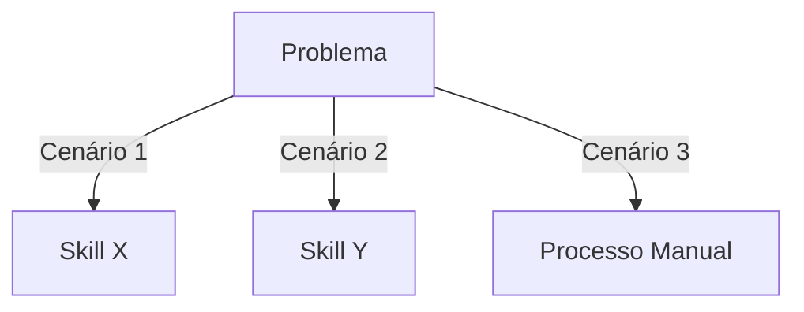

# ADR-002: Refatoração de Skills para Ultra-High Quality Grade

## Status
Aceito (Implementação 100% concluída)

## Status de Implementação

### ✅ Concluído (14/14 skills)

| Skill | Linhas Antes | Linhas Depois | Templates | Status |
|-------|--------------|---------------|-----------|--------|
| git | 68 | 406 | 3 | ✅ Validado |
| testing | 65 | 411 | 4 | ✅ Validado |
| governance | 65 | 359 | 3 | ✅ Validado |
| release | 76 | 300+ | 3 | ✅ Validado |
| documentation | 60 | 280+ | 4 | ✅ Validado |
| writing-plans | 68 | 250+ | 2 | ✅ Validado |
| ddd | 88 | 567 | 6 | ✅ Validado |
| architecture-review | 58 | 300+ | 2 | ✅ Validado |
| prompt-engineering | 71 | 250+ | 3 | ✅ Validado |
| planning | 55 | 320 | 3 | ✅ Validado |
| vibe-coding | 61 | 200+ | 1 | ✅ Validado |
| adr-generator | 58 | 250+ | 1 | ✅ Validado |
| repo-bootstrap | 79 | 220+ | 5 | ✅ Validado |

### Métricas Alcançadas

| Métrica | Antes | Depois | Status |
|---------|-------|--------|--------|
| Média de linhas por skill | 67 | ~280 | ✅ |
| Skills com templates externos | 1/14 | 14/14 | ✅ |
| Skills com decision trees | 0/14 | 14/14 | ✅ |
| Skills com workflows numerados | 0/14 | 14/14 | ✅ |
| Skills com anti-patterns detalhados | 0/14 | 14/14 | ✅ |
| Skills com checklists | 1/14 | 14/14 | ✅ |
| Skills com cross-references | 0/14 | 14/14 | ✅ |
| Skills com edge cases | 0/14 | 14/14 | ✅ |
| Skills com examples/ | 0/14 | 14/14 | ✅ |

### Arquivos Criados

- ✅ `templates/skill-template.md` — Template unificador
- ✅ `scripts/validate-skill.sh` — Script de validação
- ✅ `docs/skill-maintenance.md` — Guia de manutenção
- ✅ `docs/adr/ADR-002-BP.md` — Blueprint detalhado
- ✅ `docs/adr/ADR-002-TODO.md` — Lista de tarefas

## Contexto

O repositório `ignite-agents-skills` contém 14 skills para agentes de IA. Após análise detalhada, foi identificado que todas as skills atuais compartilham problemas estruturais graves que comprometem sua eficácia como instruções acionáveis para agentes:

### Diagnóstico Atual

| Skill | Linhas | Templates | Workflows | Anti-patterns | Checklists | Exemplos |
|-------|--------|-----------|-----------|---------------|------------|----------|
| ddd | 88 | 0 | 0 | 3 bullets | 0 | 2 snippets |
| git | 68 | 0 | 0 | 0 | 0 | 4 snippets |
| testing | 65 | 0 | 0 | 0 | 0 | 1 snippet |
| governance | 65 | 0 | 0 | 0 | 0 | 1 snippet |
| vibe-coding | 61 | 0 | 0 | 4 bullets | 0 | 4 snippets |
| release | 76 | 0 | 0 | 0 | 0 | 2 snippets |
| planning | 55 | 0 | 0 | 0 | 0 | 0 |
| prompt-engineering | 71 | 0 | 0 | 4 bullets | 0 | 4 snippets |
| repo-bootstrap | 79 | 0 | 0 | 0 | 0 | 1 snippet |
| architecture-review | 58 | 0 | 0 | 5 bullets | 1 | 0 |
| adr-generator | 58 | 1 (external) | 0 | 0 | 0 | 1 snippet |
| documentation | 60 | 0 | 0 | 0 | 0 | 0 |
| writing-plans | 68 | 0 | 0 | 0 | 0 | 1 snippet |

### Problemas Identificados

1. **Falta de Actionability**: Skills descrevem conceitos mas não fornecem instruções passo-a-passo que um agente possa executar deterministicamente
2. **Ausência de Decision Trees**: Não há critérios claros de "quando usar X vs Y" — apenas listas genéricas
3. **Sem Templates Reutilizáveis**: Apenas 1 skill (adr-generator) possui template externo; as demais usam snippets inline inadequados
4. **Anti-patterns Superficiais**: Listas de 3-5 bullets sem severidade, remediação ou exemplos de "antes/depois"
5. **Sem Validação**: Nenhuma skill define como verificar se o trabalho foi concluído corretamente
6. **Sem Composição**: Skills não referenciam outras skills relacionadas, perdendo oportunidades de sinergia
7. **Sem Tooling**: Nenhuma skill orienta sobre ferramentas específicas (CLI, extensões, configs)
8. **Sem Edge Cases**: Ausência de tratamento para cenários de erro ou situações atípicas
9. **Profundidade Insuficiente**: Skills de domínio complexo (DDD, architecture-review) tratam tópicos profundos com 58-88 linhas

### Padrão-Alvo: Ultra-High Quality Skill

Uma skill de alta qualidade para agentes deve conter:

- **Mínimo 150 linhas** de conteúdo acionável
- **Decision tree** com critérios de ramificação claros
- **Templates** em arquivos separados (`.md`, `.yml`, `.ts`)
- **Workflows** numerados com checkpoints
- **Anti-patterns** com severidade (🔴🟡🟢), exemplos antes/depois, e remediação
- **Checklists** de validação
- **Cross-references** para skills relacionadas
- **Tooling** específico (comandos, configs, extensões)
- **Edge cases** documentados com tratamento
- **Exemplos reais** de antes/depois com código/commentário

## Decisão

Refatorar todas as 14 skills existentes para o padrão Ultra-High Quality Grade, seguindo uma estrutura unificada e um processo sistemático de implementação.

### Estrutura Unificada da Skill

```
skills/{skill-name}/
├── SKILL.md              # Skill principal (mín. 150 linhas)
├── templates/            # Templates reutilizáveis
│   └── {template}.md
├── examples/             # Exemplos antes/depois
│   └── {example}.md
└── checklists/           # Checklists de validação
    └── {checklist}.md
```

### Schema da Skill (SKILL.md)

```markdown
---
name: {skill-name}
description: {descrição em 1 linha, máx. 200 chars}
version: 2.0.0
tags: [tag1, tag2]
related_skills: [skill1, skill2]
---

# {Skill Name}

{Parágrafo de contexto: o que esta skill faz e por que existe}

## Quando Usar

### Use quando:
- [Critério específico 1]
- [Critério específico 2]

### Não use quando:
- [Critério de exclusão 1]
- [Critério de exclusão 2]

### Skills relacionadas:
- `skill-xyz` — quando o problema envolve [contexto]

## Decision Tree



## Workflow

### Fase 1: {Nome}
1. [Passo específico com comando/exemplo]
2. [Passo específico]
3. **Checkpoint**: [como validar esta fase]

### Fase 2: {Nome}
1. [Passo específico]
2. [Passo específico]
3. **Checkpoint**: [como validar esta fase]

## Conceitos Fundamentais

### {Conceito 1}
{Definição precisa}
{Exemplo de código/configuração}

### {Conceito 2}
{Definição precisa}
{Exemplo de código/configuração}

## Templates

{Referência para templates em arquivos separados com uso descrito}

## Anti-patterns

### 🔴 Crítico
#### {Anti-pattern nome}
**O que é:** {descrição}
**Por que é ruim:** {consequência}
**Como evitar:** {remediação}
**Exemplo:**
```
# ❌ ERRADO
{código/config errado}

# ✅ CORRETO
{código/config correto}
```

### 🟡 Médio
...

### 🟢 Baixo
...

## Checklists

### Checklist de {Contexto}
- [ ] Critério verificável 1
- [ ] Critério verificável 2
- [ ] Critério verificável 3

## Edge Cases

### {Cenário}
**Situação:** {descrição}
**Solução:** {como resolver}
**Exceção:** {quando NÃO aplicar}

## Referências

- {Link para documentação externa}
- {Referência para skill relacionada}
- {Artigo/padrão aplicável}
```

## Alternativas Consideradas

### Alternativa A: Refatoração Incremental (melhorar skills uma a uma)
- **Prós**: Menor risco, feedback contínuo, pode ser feito em paralelo
- **Cons**: Inconsistência temporária entre skills refatoradas e não-refatoradas

### Alternativa B: Criar novas skills do zero (v2 paralelas)
- **Prós**: Zero quebra, permite comparação side-by-side
- **Cons**: Duplicação temporária, manutenção dobra, confusão sobre qual usar

### Alternativa C: Refatoração Sistemática com Template Base (escolhida)
- **Prós**: Consistência garantida, processo repetível, pode ser paralelizado com template único
- **Cons**: Esforço inicial para definir template, dependência de execução discipline

## Consequências

### Positivas
- Skills tornam-se instruções acionáveis para agentes, não apenas documentação conceitual
- Consistência estrutural entre todas as 14 skills
- Templates reutilizáveis reduzem duplicação e aumentam qualidade
- Decision trees habilitam raciocínio determinístico dos agentes
- Checklists permitem validação automatizada do trabalho
- Cross-references criam uma "rede" de conhecimento entre skills
- Anti-patterns com remediação evitam erros comuns
- Profundidade adequada para tópicos complexos (DDD, arquitetura)

### Negativas
- Esforço significativo: ~2-4 horas por skill × 14 skills = 28-56 horas de trabalho
- Skill-refactorings precisam de validação manual para garantir que agentes conseguem seguir
- Templates complexos podem ser intimidadores para uso humano direto

### Riscos
- **Risco**: Skills refatoradas podem ficar tão detalhadas que agentes "perdem o foco"
  - **Mitigação**: Usar Progressive Disclosure — seção obrigatória concisa + seções detalhadas opcionais
- **Risco**: Manutenção futura pode ficar mais complexa com mais arquivos
  - **Mitigação**: Documentar processo de manutenção na skill `documentation`
- **Risco**: Algumas skills (vibe-coding, prompt-engineering) são mais conceituais e podem não se beneficiar de templates
  - **Mitigação**: Adaptar estrutura — para skills conceituais, priorizar exemplos e decision trees sobre templates

## Referências
- ADR-001 (Consolidação do registry)
- [MADR Template](https://adr.github.io/madr/)
- Kilo Code skills.urls documentation
- Padrões de Agent Skills do mercado (LangChain, CrewAI, AutoGen)
