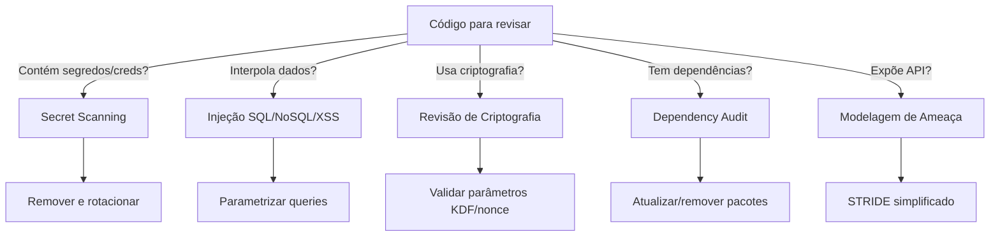
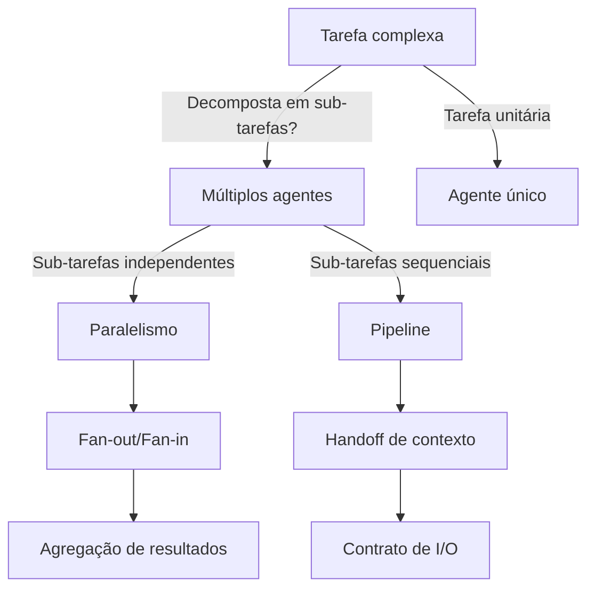
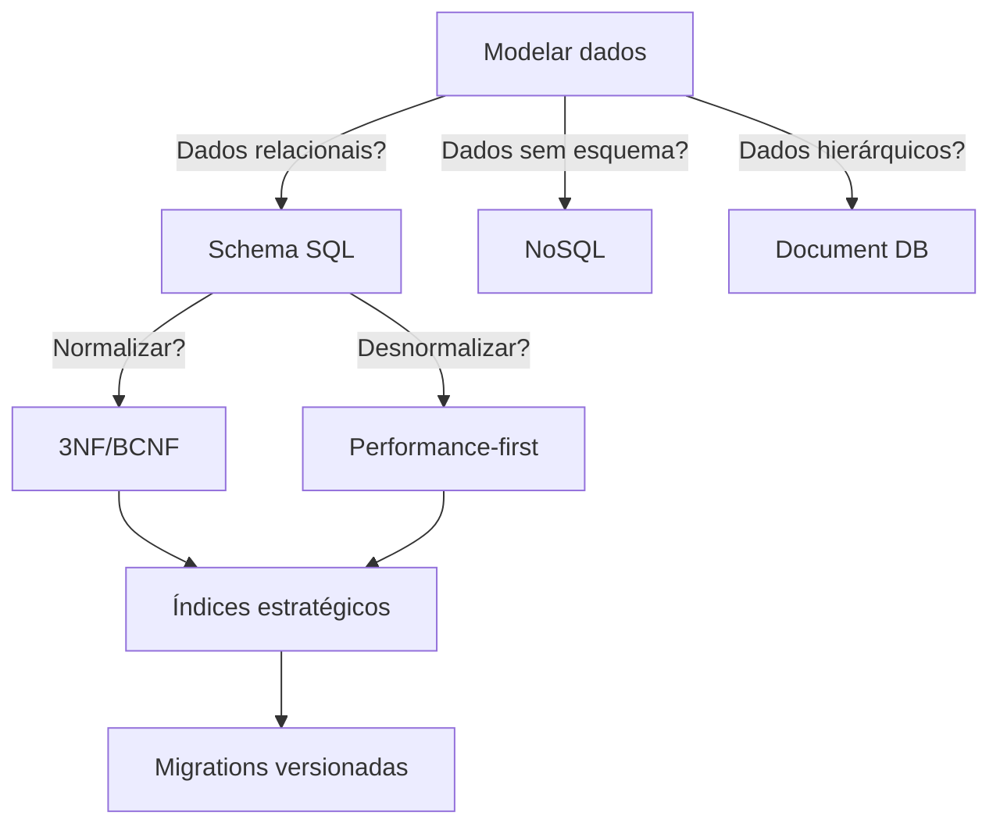
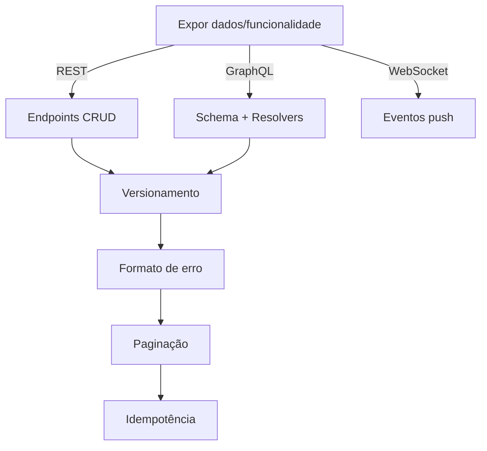
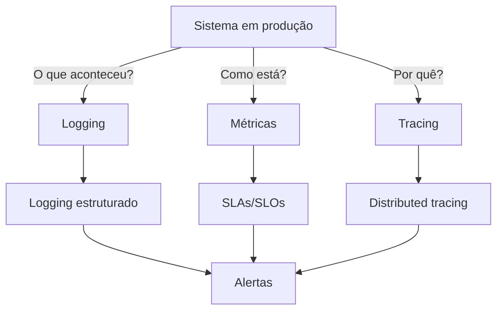
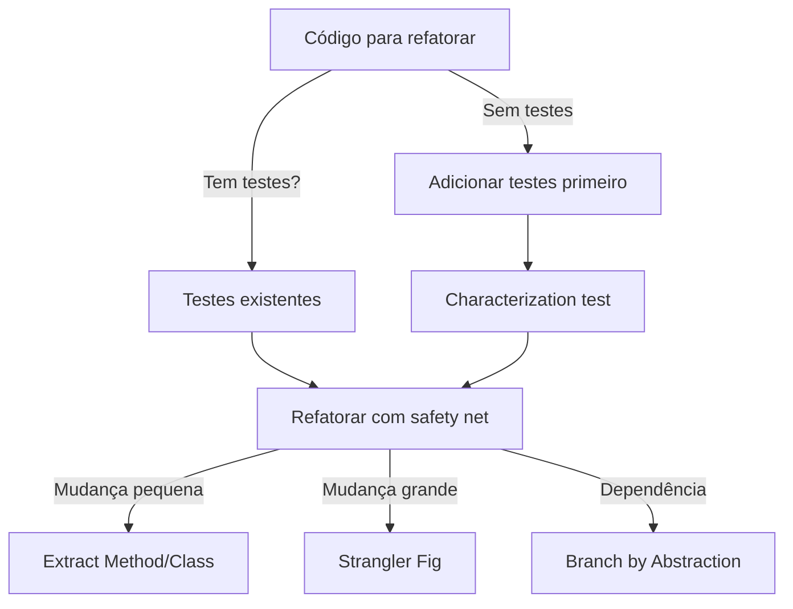

# Blueprint: Implementação das Recomendações da Ultra-Auditoria v2.0.2

> ADR-004 | Versão 1.0 | 2026-07-05 | **Status: PENDENTE**

---

## 1. Visão Geral

### Objetivo
Implementar as 7 correções de débito técnico + 6 novas skills recomendadas pela Ultra-Auditoria, elevando o pacote de 14 para 20 skills "Ultra-High Quality Grade" e fechando lacunas estruturais do SDLC.

### Métricas de Sucesso

| Métrica | Antes | Depois | Status |
|---------|-------|--------|--------|
| Total de skills | 14 | 20 | ⬜ |
| CI valida qualidade (não só estrutura) | Não | Sim | ⬜ |
| CHANGELOG reflete v2.0.x | Não | Sim | ⬜ |
| Grafo `related_skills` conexo | Não | Sim | ⬜ |
| Skills com `security-review` | 0 | 1 | ⬜ |
| Skills com `agent-orchestration` | 0 | 1 | ⬜ |
| Skills com `data-modeling` | 0 | 1 | ⬜ |
| Skills com `api-design` | 0 | 1 | ⬜ |
| Skills com `observability` | 0 | 1 | ⬜ |
| Skills com `refactoring` | 0 | 1 | ⬜ |

---

## 2. Fase A: Correção de Débitos Técnicos

### A1: Adicionar `validate-skill.sh` ao pipeline CI

**Arquivo:** `.github/workflows/validate-skills.yml`

**Mudança:** Adicionar step que executa `validate-skill.sh` em todas as skills, além do `validate-index.sh` já existente.

**Estrutura proposta do workflow:**
```yaml
steps:
  - uses: actions/checkout@v4
  - name: Validate skills/index.json against real files
    run: |
      chmod +x scripts/validate-index.sh
      ./scripts/validate-index.sh
  - name: Validate skill quality (Ultra-High Quality Grade)
    run: |
      chmod +x scripts/validate-skill.sh
      ERRORS=0
      for skill_dir in skills/*/; do
        if ! ./scripts/validate-skill.sh "$skill_dir"; then
          ERRORS=$((ERRORS + 1))
        fi
      done
      if [ $ERRORS -gt 0 ]; then
        echo "❌ $ERRORS skill(s) failed quality validation"
        exit 1
      fi
      echo "✅ All skills passed quality validation"
```

**Critérios de aceitação:**
- [ ] Workflow executa `validate-skill.sh` em todas as skills
- [ ] Pipeline falha se qualquer skill tiver erro
- [ ] Warnings são reportados mas não bloqueiam
- [ ] Trigger continua respondendo a `skills/**` e `scripts/**`

---

### A2: Escrever CHANGELOG para v2.0.0→v2.0.2

**Arquivo:** `CHANGELOG.md`

**Estrutura proposta:**
```markdown
## [2.0.2] - 2026-07-05

### Added
- Skill `skill-audit-bulletin` — audita skills existentes com rubrica de 8 eixos ponderados
- Refatoração de 13 skills existentes para padrão Ultra-High Quality Grade
- 40 templates reutilizáveis (`.md`, `.yml`, `.ts`)
- 13 examples com cenários antes/depois
- Decision trees em Mermaid para todas as 14 skills
- Workflows numerados com checkpoints
- Anti-patterns com severidade 🔴🟡🟢

### Changed
- Média de linhas por skill: 67 → ~280 (+318%)
- Skills com templates externos: 1/14 → 14/14
- Skills com decision trees: 0/14 → 14/14

## [2.0.1] - 2026-07-05

### Fixed
- Ambiguidade de fonte única no registry (3 index.json conflitantes)
- README instruía paths que quebravam resolução do Kilo
- Adicionado LICENSE (MIT)

### Added
- Registry inicial com 13 skills categorizadas
- `scripts/validate-index.sh`: valida index.json contra arquivos reais
- `.github/workflows/validate-skills.yml`: CI para validação de registry
```

**Critérios de aceitação:**
- [ ] Entrada `[2.0.2]` documenta refatoração e skill-audit-bulletin
- [ ] Entrada `[2.0.1]` movida de `[Unreleased]`
- [ ] Formato Keep a Changelog mantido
- [ ] Seção `[Unreleased]` vazia ou com novas skills planejadas

---

### A3: Resolver colisão `architecture-review`

**Arquivo:** `skills/architecture-review/SKILL.md`, `skills/index.json`, todos os `related_skills`

**Decisão:** Renomear `architecture-review` → `architecture-review-kilo` neste repo.

**Estrutura proposta:**
1. Renomear pasta `skills/architecture-review/` → `skills/architecture-review-kilo/`
2. Atualizar frontmatter em `SKILL.md`: `name: architecture-review-kilo`
3. Atualizar `index.json`: chave `name` e `files`
4. Buscar todas as referências em outros SKILL.md e atualizar:
   - `adr-generator/SKILL.md` → `related_skills: [documentation, architecture-review-kilo]`
   - `ddd/SKILL.md` → `related_skills: [architecture-review-kilo, testing]`
   - `skill-audit-bulletin/SKILL.md` → `related_skills: [architecture-review-kilo, documentation]`
5. Criar ADR-004 (esta) documentando a decisão

**Critérios de aceitação:**
- [ ] Pasta renomeada
- [ ] Frontmatter atualizado
- [ ] `index.json` reflete novo nome
- [ ] Nenhum `related_skills` apontando para nome inexistente
- [ ] ADR documenta a decisão

---

### A4: Resolver sobreposição `planning` vs `writing-plans`

**Arquivos:** `skills/planning/SKILL.md`, `skills/writing-plans/SKILL.md`

**Mudança:** Reescrever seção "Não use quando" de ambas para mencionar explicitamente a outra.

**`planning/SKILL.md` — "Não use quando" atualizado:**
```markdown
### Não use quando:
- Tarefa imediata (< 1 hora)
- Bug fix simples
- Protótipo sem planejamento
- **Precisa de plano de implementação tático a partir de uma spec → use `writing-plans`**
- **Precisa de tasks com critérios de aceitação e dependências → use `writing-plans`**
```

**`writing-plans/SKILL.md` — "Não use quando" atualizado:**
```markdown
### Não use quando:
- Tarefa é imediata (< 1 hora)
- Protótipo rápido sem planejamento
- Bug fix simples
- **Precisa de roadmap estratégico ou priorização de portfólio → use `planning`**
- **Precisa de estimativa de esforço para iniciativa inteira → use `planning`**
```

**Critérios de aceitação:**
- [ ] `planning` menciona `writing-plans` na seção "Não use quando"
- [ ] `writing-plans` menciona `planning` na seção "Não use quando"
- [ ] Decision trees de ambas incluem a desambiguação
- [ ] `related_skills` mantêm referência cruzada

---

### A5: Adicionar `skill-audit-bulletin` ao grafo de `related_skills`

**Arquivos:** `skills/governance/SKILL.md`, `skills/repo-bootstrap/SKILL.md`, `skills/index.json`

**Mudança:** Adicionar `skill-audit-bulletin` nos `related_skills` de `governance` e `repo-bootstrap`.

**Critérios de aceitação:**
- [ ] `governance/SKILL.md` frontmatter inclui `skill-audit-bulletin`
- [ ] `repo-bootstrap/SKILL.md` frontmatter inclui `skill-audit-bulletin`
- [ ] `index.json` reflete os novos `related_skills`

---

### A6: Resolver pasta `checklists/` fantasma

**Arquivo:** `templates/skill-template.md`, `docs/skill-maintenance.md`, `docs/adr/ADR-002.md`, `docs/adr/ADR-002-BP.md`

**Decisão:** Criar pelo menos 1 exemplo real de `checklists/` na skill `release` (a mais natural para checklists).

**Estrutura proposta:**
```
skills/release/checklists/
├── pre-release.md
└── post-release.md
```

Se não for viável criar examples reais, remover toda menção a `checklists/` como subpasta obrigatória.

**Critérios de aceitação:**
- [ ] `skills/release/checklists/` existe com ≥1 arquivo real
- [ ] OU todas as menções a `checklists/` como obrigatório são removidas
- [ ] `templates/skill-template.md` não lista `checklists/` como obrigatório

---

### A7: Marcar processo de Peer Review como condicional

**Arquivo:** `docs/skill-maintenance.md`

**Mudança:** Adicionar nota na seção "Peer Review":
```markdown
### Peer Review (para equipes com >1 mantenedor)

> **Nota:** O processo abaixo aplica quando houver mais de um mantenedor no
> repositório. Para operador solo, o processo de Auto-review é suficiente.

1. Abra PR com mudanças
2. Solicite review de 1 maintainer
3. Execute skill com agente real
4. Merge após aprovação
```

**Critérios de aceitação:**
- [ ] Seção "Peer Review" tem nota explícita sobre ser condicional
- [ ] Seção "Auto-review" é apresentada como processo atual para solo
- [ ] Não remove a seção de Peer Review

---

## 3. Fase B: Skills Novas (6 skills)

Cada skill segue o padrão Ultra-High Quality Grade:
- SKILL.md ≥150 linhas
- Decision tree em Mermaid
- ≥3 workflows numerados com checkpoints
- ≥3 anti-patterns com severidade 🔴🟡🟢
- Seções obrigatórias: Quando Usar, Workflow, Anti-patterns, Checklists, Edge Cases
- ≥1 template em arquivo separado
- Cross-references para skills relacionadas
- `validate-skill.sh` passa com 0 erros

### B1: `security-review` (Prioridade #1)

**Arquivos:**
- `skills/security-review/SKILL.md`
- `skills/security-review/templates/security-checklist.md`
- `skills/security-review/templates/threat-model.md`
- `skills/security-review/templates/vulnerability-report.md`
- `skills/index.json` (atualizar)

**Decision tree:**


**Workflows:**
1. Secret scanning (comandos: `trufflehog`, `gitleaks`, `.env` review)
2. Revisão de dependências (`npm audit`, `snyk`, CVE check)
3. Validação de criptografia (AES-GCM nonce, scrypt params, timing attacks)
4. Modelagem de ameaça leve (STRIDE simplificado)
5. Relatório de vulnerabilidade (template estruturado)

**Anti-patterns:**
- 🔴 Nonce reuso em AES-GCM
- 🔴 KDF com parâmetros fracos (scrypt N<16384)
- 🔴 Timing attack em comparação de tokens
- 🟡 Hardcoded secrets em testes
- 🟡 `.env` commitado sem `.gitignore`

**`related_skills`:** `[governance, architecture-review-kilo, testing]`

---

### B2: `agent-orchestration` (Prioridade #2)

**Arquivos:**
- `skills/agent-orchestration/SKILL.md`
- `skills/agent-orchestration/templates/agent-role-card.md`
- `skills/agent-orchestration/templates/handoff-protocol.md`
- `skills/agent-orchestration/templates/routing-decision.md`
- `skills/index.json` (atualizar)

**Decision tree:**


**Workflows:**
1. Decompor tarefa em papéis de agente (role card)
2. Definir protocolo de handoff (contexto + contrato I/O)
3. Roteamento de modelo por tarefa (custo/latência/capacidade)
4. Orquestração paralela (fan-out/fan-in)
5. Validação de contrato entre agentes

**Anti-patterns:**
- 🔴 Handoff sem contrato de I/O definido
- 🔴 Usar modelo caro para tarefa simples (custo desnecessário)
- 🟡 Contexto acumulado sem janela de descarte
- 🟡 Sem fallback quando agente falha
- 🟢 Agente único para tarefa paralelizável

**`related_skills`:** `[prompt-engineering, vibe-coding, governance]`

---

### B3: `data-modeling` (Prioridade #3)

**Arquivos:**
- `skills/data-modeling/SKILL.md`
- `skills/data-modeling/templates/schema.sql`
- `skills/data-modeling/templates/migration.md`
- `skills/data-modeling/templates/index-strategy.md`
- `skills/index.json` (atualizar)

**Decision tree:**


**Workflows:**
1. Analisar requisitos de dados (entidades, relacionamentos, volume)
2. Definir schema relacional (normalização vs desnormalização)
3. Estratégia de índice (B-tree, hash, composto, parcial)
4. Migrations versionadas e reversíveis
5. Validação de schema (constraints, tipos, nullable)

**Anti-patterns:**
- 🔴 Migration sem rollback testado
- 🔴 Tabela sem PK definida
- 🟡 Índice em coluna com baixa selectividade
- 🟡 Normalização excessiva em tabela de leitura pesada
- 🟢 Usar `SELECT *` em queries de produção

**`related_skills`:** `[ddd, testing, architecture-review-kilo]`

---

### B4: `api-design` (Prioridade #4)

**Arquivos:**
- `skills/api-design/SKILL.md`
- `skills/api-design/templates/endpoint-spec.md`
- `skills/api-design/templates/error-contract.md`
- `skills/api-design/templates/api-versioning.md`
- `skills/index.json` (atualizar)

**Decision tree:**


**Workflows:**
1. Definir contrato REST (recursos, métodos, status codes)
2. Versionamento de API (URL path, header, query param)
3. Formato de erro consistente (RFC 7807)
4. Paginação (cursor vs offset)
5. Idempotência em endpoints de escrita

**Anti-patterns:**
- 🔴 Endpoint sem tratamento de erro consistente
- 🔴 PUT sem idempotência
- 🟡 Usar POST para operações de leitura
- 🟡 Versionamento quebrando clientes existentes
- 🟢 Query params opcionais sem default

**`related_skills`:** `[documentation, testing, governance]`

---

### B5: `observability` (Prioridade #5)

**Arquivos:**
- `skills/observability/SKILL.md`
- `skills/observability/templates/logging-spec.md`
- `skills/observability/templates/metrics-sla.md`
- `skills/observability/templates/alert-rules.md`
- `skills/index.json` (atualizar)

**Decision tree:**


**Workflows:**
1. Definir logging estruturado (formato, níveis, campos obrigatórios)
2. Definir métricas mínimas (RED: Rate, Errors, Duration)
3. Configurar alertas (limiares, canais, escalação)
4. Instrumentar com distributed tracing (OpenTelemetry)
5. Definir SLAs/SLOs e error budgets

**Anti-patterns:**
- 🔴 Log com dados sensíveis (PII, tokens)
- 🔴 Alerta sem ação definida (alert fatigue)
- 🟡 Log sem contexto (request ID, user ID)
- 🟡 Métricas sem dimensão temporal
- 🟢 Console.log em produção

**`related_skills`:** `[testing, release, governance]`

---

### B6: `refactoring` (Prioridade #6)

**Arquivos:**
- `skills/refactoring/SKILL.md`
- `skills/refactoring/templates/refactoring-catalog.md`
- `skills/refactoring/templates/legacy-migration.md`
- `skills/refactoring/templates/test-before-refactor.md`
- `skills/index.json` (atualizar)

**Decision tree:**


**Workflows:**
1. Avaliar risco (cobertura de testes, complexidade ciclomática)
2. Adicionar testes de caracterização (se sem cobertura)
3. Aplicar refatoração segura (catálogo de refatorações)
4. Validar com testes e revisão
5. Documentar decisão (ADR se impactante)

**Anti-patterns:**
- 🔴 Refatorar sem testes (sem safety net)
- 🔴 Refatorar + mudar behavior ao mesmo tempo
- 🟡 Big bang refactoring (mudar tudo de uma vez)
- 🟡 Não commitar incrementalmente
- 🟢 Refatorar código que ninguém mantém

**`related_skills`:** `[architecture-review-kilo, ddd, testing]`

---

## 4. Fase C: Validação Final

### C1: Validação cruzada completa

**Arquivos:** Todos os arquivos modificados/criados

**Critérios de aceitação:**
- [ ] `validate-index.sh` passa: 20/20 skills, 0 erros
- [ ] `validate-skill.sh` passa para todas as 20 skills: 0 erros
- [ ] `index.json` tem 20 entradas, `version` = "2.0.2"
- [ ] Nenhum `related_skills` apontando para skill inexistente
- [ ] Todas as skills têm ≥150 linhas
- [ ] Grafo de `related_skills` é conexo

**Comandos de validação:**
```bash
# Validar índice
bash scripts/validate-index.sh

# Validar todas as skills
for skill_dir in skills/*/; do
  bash scripts/validate-skill.sh "$skill_dir"
done

# Contar skills
ls -d skills/*/ | wc -l
# Deve retornar 20

# Verificar grafo
grep -h "related_skills" skills/*/SKILL.md | grep -o '`[a-z-]*`' | sort | uniq
```

---

## 5. Dependências e Sequenciamento

```
A1 (CI) ──────────┬──→ B1 (security-review)
                  ├──→ B2 (agent-orchestration)
                  ├──→ B3 (data-modeling)
                  ├──→ B4 (api-design)
                  ├──→ B5 (observability)
                  └──→ B6 (refactoring)

A2 (CHANGELOG) ──── independente
A3 (colisão) ────── independente
A4 (sobreposição) ─ independente
A5 (grafo) ──────── independente
A6 (checklists) ─── independente
A7 (peer review) ── independente

C1 (validação) ──── depende de A1-A7 + B1-B6
```

### Ordem de Execução Recomendada

```
Semana 1 (Fase A — todos paralelizáveis, ~3-4h total)
  ├─── A1: CI com validate-skill.sh ──────────────┐
  ├─── A2: CHANGELOG v2.0.x ─────────────────────┤
  ├─── A3: Renomear architecture-review ──────────┤
  ├─── A4: Desambiguar planning/writing-plans ───┤
  ├─── A5: Adicionar skill-audit-bulletin ao grafo┤
  ├─── A6: Resolver checklists/ fantasma ─────────┤
  └─── A7: Marcar peer review como condicional ───┘
                                                    │
Semana 2-3 (Fase B — sequencial, cada uma valida contra A1)
  ├─── B1: security-review ───────────────────────┐
  ├─── B2: agent-orchestration ───────────────────┤
  ├─── B3: data-modeling ─────────────────────────┤
  ├─── B4: api-design ────────────────────────────┤
  ├─── B5: observability ─────────────────────────┤
  └─── B6: refactoring ───────────────────────────┘
                                                    │
Semana 3 (Fase C — validação final)
  └─── C1: Validação cruzada completa ─────────────┘
```

---

## 6. Riscos e Mitigações

| Risco | Impacto | Probabilidade | Mitigação |
|-------|---------|---------------|-----------|
| Skills novas ficam "thin" para bater 150 linhas | Médio | Média | Usar `validate-skill.sh` como gate + revisão editorial |
| Renomear `architecture-review` quebra referências | Alto | Baixa | Buscar todas as ocorrências antes de renomear |
| CI com `validate-skill.sh` pode ser lento | Baixo | Baixa | Cache de dependências, matrix strategy |
| `security-review` pode ficar genérica demais | Alto | Média | Foco em AES-GCM, scrypt, BIP39 (casos reais do Secure Notes) |
| `agent-orchestration` pode conflitar com `prompt-engineering` | Médio | Baixa | Definir fronteira clara: um é para prompts, outro para coordenação |
| Manutenção de 20 vs 14 skills | Médio | Alta | `validate-skill.sh` + CHANGELOG discipline |

---

## 7. Estimativas Detalhadas

| Tarefa | Complexidade | Horas Est. | Dependências |
|--------|-------------|------------|--------------|
| A1: CI validate-skill.sh | S | 30min | — |
| A2: CHANGELOG | S | 20min | — |
| A3: Renomear architecture-review | M | 30min | — |
| A4: Desambiguar planning/writing-plans | S | 20min | — |
| A5: Adicionar skill-audit-bulletin ao grafo | S | 10min | — |
| A6: Resolver checklists/ | S | 15min | — |
| A7: Peer review condicional | S | 10min | — |
| B1: security-review | L | 3-4h | A1 |
| B2: agent-orchestration | L | 3-4h | A1 |
| B3: data-modeling | L | 3-4h | A1 |
| B4: api-design | M | 2-3h | A1 |
| B5: observability | M | 2-3h | A1 |
| B6: refactoring | M | 2-3h | A1 |
| C1: Validação cruzada | S | 30min | A1-A7, B1-B6 |
| **Total** | | **~20-25h** | |

---

*Documento gerado em 2026-07-05. Referência: ADR-004.*
