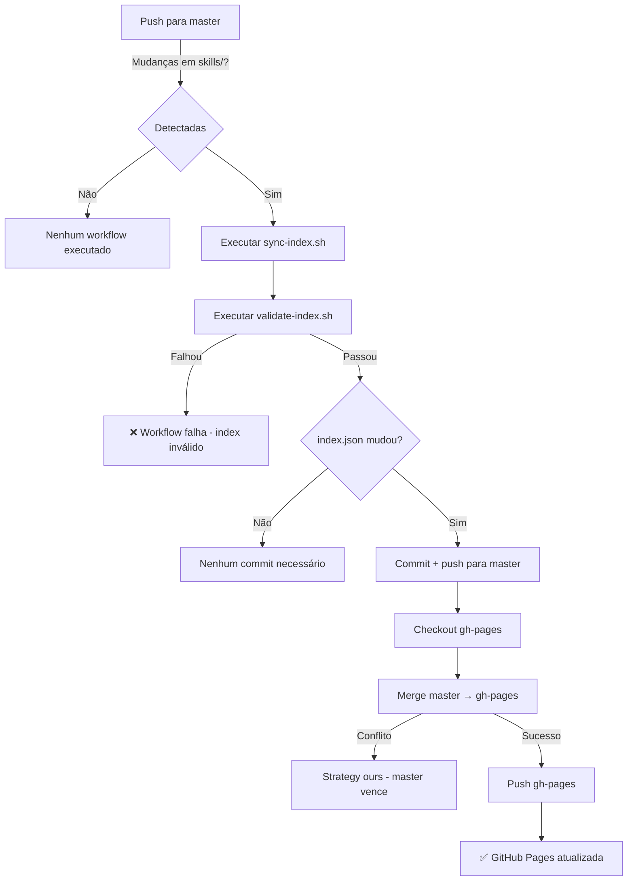

# Blueprint: Workflow CI para Auto-sync do Index e Deploy GitHub Pages

> ADR-006 | Versão 1.0 | 2026-07-05 | **Status: ✅ IMPLEMENTADO**

---

## 1. Visão Geral

### Objetivo
Criar um workflow de CI/CD que sincroniza automaticamente `skills/index.json` quando skills são adicionadas ou modificadas, e faz deploy para GitHub Pages via branch `gh-pages`.

### Métricas de Sucesso

| Métrica | Antes | Depois | Status |
|---------|-------|--------|--------|
| Sync manual do index.json | Sim | Automático | ⬜ |
| Deploy manual para gh-pages | Sim | Automático | ⬜ |
| Index desatualizado | Frequente | Impossível | ⬜ |
| Intervenção manual necessária | Sim | Não | ⬜ |
| Tempo de deploy | ~5min manual | ~1min automático | ⬜ |

---

## 2. Estrutura de Artefatos

```
.github/workflows/
├── validate-skills.yml          # Existente (não modificado)
└── sync-and-deploy.yml          # NOVO - workflow principal

scripts/
├── sync-index.sh                # Existente (não modificado)
├── validate-index.sh            # Existente (não modificado)
└── validate-skill.sh            # Existente (não modificado)
```

---

## 3. Decision Tree



---

## 4. Conceitos Fundamentais

### 4.1 Trigger Path Filtering

O workflow só é disparado quando há mudanças nos paths `skills/**`. Isso evita execuções desnecessárias quando apenas documentação ou outros arquivos são modificados.

**Configuração:**
```yaml
on:
  push:
    paths:
      - 'skills/**'
```

### 4.2 GITHUB_TOKEN Permissions

O token `GITHUB_TOKEN` fornecido automaticamente pelo GitHub Actions permite commits e pushes ao repositório. Para isso, o workflow precisa da permissão `contents: write`.

**Configuração:**
```yaml
permissions:
  contents: write
```

### 4.3 Strategy: Ours para Merge

Quando há conflito entre `master` e `gh-pages`, a strategy `ours` assume que `master` é a fonte de verdade. Isso é correto porque `master` é a branch de desenvolvimento e `gh-pages` é apenas uma cópia para deploy.

### 4.4 Idempotência

O workflow é idempotente: se `index.json` já está sincronizado, nenhum commit é gerado. Se `gh-pages` já está atualizado, nenhum push é feito. Isso permite re-executar o workflow sem efeitos colaterais.

---

## 5. Workflow

### Workflow 1: Sync and Deploy

**Objetivo:** Sincronizar index e deployar para GitHub Pages.

**Triggers:**
- Push para branch `master` com mudanças em `skills/**`

**Steps:**

1. Checkout repository com `fetch-depth: 0` e token `GITHUB_TOKEN`
2. Setup Node.js (para consistência, embora não seja estritamente necessário)
3. Instalar `jq` (para `sync-index.sh` e `validate-index.sh`)
4. Executar `./scripts/sync-index.sh`
5. Executar `./scripts/validate-index.sh`
6. Configurar git (user.name, user.email)
7. Verificar se `index.json` mudou (`git diff --quiet skills/index.json`)
8. Se mudou: `git add skills/index.json && git commit -m "chore: auto-sync index.json [skip ci]" && git push`
9. Checkout branch `gh-pages`
10. Merge `master` com strategy `ours`
11. Push para `gh-pages`

**Checkpoint:** GitHub Pages reflete o estado atual das skills.

---

## 6. Templates

### 6.1 sync-and-deploy.yml

```yaml
name: Sync Skills Index & Deploy to GitHub Pages

on:
  push:
    branches: [master]
    paths:
      - 'skills/**'

permissions:
  contents: write

jobs:
  sync-and-deploy:
    runs-on: ubuntu-latest
    steps:
      - name: Checkout repository
        uses: actions/checkout@v4
        with:
          fetch-depth: 0
          token: ${{ secrets.GITHUB_TOKEN }}

      - name: Setup Node.js
        uses: actions/setup-node@v4
        with:
          node-version: '20'

      - name: Install jq
        run: sudo apt-get update && sudo apt-get install -y jq

      - name: Sync skills index
        run: |
          chmod +x scripts/sync-index.sh
          ./scripts/sync-index.sh

      - name: Validate skills index
        run: |
          chmod +x scripts/validate-index.sh
          ./scripts/validate-index.sh

      - name: Configure git
        run: |
          git config user.name "github-actions[bot]"
          git config user.email "github-actions[bot]@users.noreply.github.com"

      - name: Check for index changes
        id: changes
        run: |
          if git diff --quiet skills/index.json; then
            echo "changed=false" >> $GITHUB_OUTPUT
          else
            echo "changed=true" >> $GITHUB_OUTPUT
          fi

      - name: Commit and push index changes
        if: steps.changes.outputs.changed == 'true'
        run: |
          git add skills/index.json
          git commit -m "chore: auto-sync skills index.json [skip ci]"
          git push

      - name: Checkout gh-pages branch
        if: steps.changes.outputs.changed == 'true'
        uses: actions/checkout@v4
        with:
          ref: gh-pages
          fetch-depth: 0
          token: ${{ secrets.GITHUB_TOKEN }}

      - name: Merge master into gh-pages
        if: steps.changes.outputs.changed == 'true'
        run: |
          git config user.name "github-actions[bot]"
          git config user.email "github-actions[bot]@users.noreply.github.com"
          git merge master --strategy=ours --no-edit

      - name: Push to gh-pages
        if: steps.changes.outputs.changed == 'true'
        run: git push origin gh-pages
```

---

## 7. Anti-patterns

### 🔴 Crítico

#### Deploy sem validação
**O que é:** Pular a etapa de validação do index antes de deployar.
**Por que é ruim:** Index quebrado pode causar erros no GitHub Pages e no Kilo.
**Como evitar:** Sempre executar `validate-index.sh` antes de commitar.
**Exemplo:**
```bash
# ❌ ERRADO
./scripts/sync-index.sh
git add skills/index.json && git commit && git push

# ✅ CORRETO
./scripts/sync-index.sh
./scripts/validate-index.sh  # Validar antes de commitar
git add skills/index.json && git commit && git push
```

#### Usar token com permissões insuficientes
**O que é:** Workflow sem `permissions: contents: write`.
**Por que é ruim:** Commits e pushes falham silenciosamente.
**Como evitar:** Sempre declarar permissões explícitas no workflow.

### 🟡 Médio

#### Não usar [skip ci] no commit automático
**O que é:** Commit do index dispara outro run do workflow.
**Por que é ruim:** Loop infinito de workflows.
**Como evitar:** Incluir `[skip ci]` na mensagem de commit.

#### Não usar strategy ours no merge
**O que é:** Merge sem estratégia clara para conflitos.
**Por que é ruim:** Pode causar conflitos não resolvidos.
**Como evitar:** Usar `--strategy=ours` para garantir que master é fonte de verdade.

### 🟢 Baixo

#### Não verificar se index realmente mudou
**O que é:** Sempre commitar, mesmo sem mudanças.
**Por que é ruim:** Commits vazios poluem histórico.
**Como evitar:** Usar `git diff --quiet` antes de commitar.

---

## 8. Checklists

### Checklist de Pré-Deploy

- [ ] `sync-index.sh` executado com sucesso
- [ ] `validate-index.sh` retornou 0 erros
- [ ] `index.json` realmente mudou (não é commit vazio)
- [ ] Token `GITHUB_TOKEN` tem permissão `contents: write`
- [ ] Branch `gh-pages` existe no repositório remoto
- [ ] `[skip ci]` incluído na mensagem de commit

### Checklist de Pós-Deploy

- [ ] Commit do index.json aparece na branch `master`
- [ ] Branch `gh-pages` contém o merge de master
- [ ] GitHub Pages reflete o estado atual das skills
- [ ] Nenhum workflow adicional foi disparado (skip ci funcionou)

---

## 9. Edge Cases

### Branch gh-pages não existe
**Situação:** Primeira execução do workflow em repositório sem branch `gh-pages`.
**Solução:** O workflow deve criar a branch `gh-pages` a partir de `master` antes do primeiro push.
**Exceção:** Se o GitHub Pages já está configurado para usar outra branch.

### Conflito entre master e gh-pages
**Situação:** Alterações manuais foram feitas diretamente na branch `gh-pages`.
**Solução:** Strategy `ours` resolve automaticamente, assumindo que `master` é fonte de verdade.
**Exceção:** Se `gh-pages` tem conteúdo único que não existe em `master`, esse conteúdo será preservado via `ours`.

### sync-index.sh falha
**Situação:** O script encontra uma skill com SKILL.md malformado.
**Solução:** Workflow falha na etapa de sync; nenhuma alteração é commitada.
**Exceção:** Nenhuma — skill deve ser corrigida antes de ser mergeada.

### Múltiplos push rápidos para master
**Situação:** Dois pushs ocorrem quase simultaneamente.
**Solução:** O segundo workflow pode encontrar conflito de merge. Strategy `ours` resolve.
**Exceção:** Se o conflito é em arquivos além de `index.json`, pode ser necessário intervention manual.

---

## 10. Integração com Skills Existentes

### Referências Diretas

| Skill | Relação com o workflow |
|-------|------------------------|
| `git` | Workflow segue padrões de conventional commits |
| `governance` | Workflow respeita processos de review |
| `documentation` | Atualiza automaticamente o registry documentado |

---

## 11. Estimativas

| Componente | Linhas Est. | Templates | Examples |
|------------|-------------|-----------|----------|
| sync-and-deploy.yml | ~80 | 1 | — |
| **Total** | **~80** | **1** | **0** |

---

## 12. Riscos e Mitigações

| Risco | Impacto | Probabilidade | Mitigação |
|-------|---------|---------------|-----------|
| Loop infinito de workflows | Alto | Baixa | `[skip ci]` no commit automático |
| Conflitos de merge | Médio | Baixa | Strategy `ours` |
| Token sem permissão | Alto | Baixa | `permissions: contents: write` explícito |
| Index quebrado deployado | Alto | Baixa | `validate-index.sh` antes de commitar |
| gh-pages não existe | Médio | Média | Criar branch no primeiro run |

---

*Documento gerado em 2026-07-05. Referência: ADR-006.*
