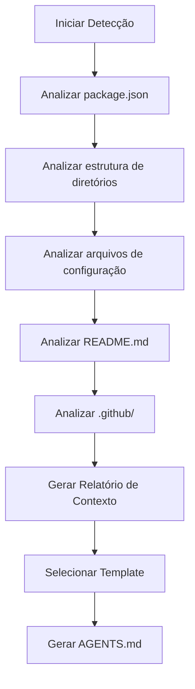
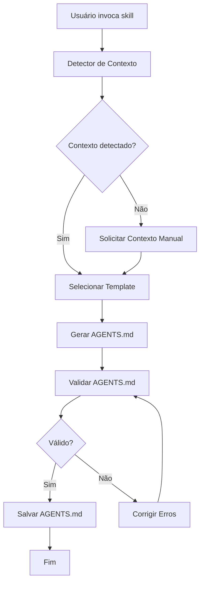
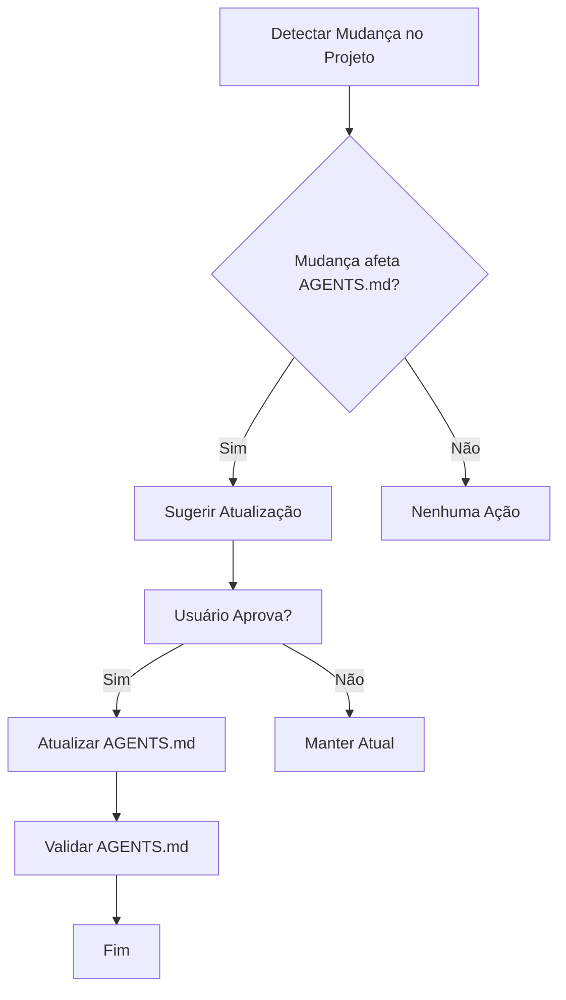

# ADR-007: Skill para Geração de AGENTS.md Adaptativo - Blueprint

## Visão Geral

Este blueprint detalha a implementação da skill `agents-md-generator` para o repositório `ignite-agents-skills`. A skill será responsável por gerar e manter arquivos `AGENTS.md` adaptativos que se adaptam ao contexto do projeto sendo desenvolvido.

## Arquitetura da Skill

### Estrutura de Diretórios

```
skills/agents-md-generator/
├── SKILL.md                    # Documentação principal
├── templates/
│   ├── AGENTS-base.md         # Template base
│   ├── AGENTS-skills-repo.md  # Template para repositórios de skills
│   ├── AGENTS-crm.md          # Template para projetos CRM
│   ├── AGENTS-api.md          # Template para projetos de API
│   ├── AGENTS-webapp.md       # Template para webapps
│   ├── AGENTS-library.md      # Template para bibliotecas
│   └── AGENTS-cli.md          # Template para CLIs
├── examples/
│   ├── before-after.md        # Exemplos de antes e depois
│   ├── context-detection.md   # Exemplos de detecção de contexto
│   └── customization.md       # Exemplos de personalização
└── checklists/
    ├── validation.md          # Checklist de validação
    └── maintenance.md         # Checklist de manutenção
```

### Componentes Principais

#### 1. Detector de Contexto

Responsável por analisar o repositório e detectar:

- **Tipo de Projeto**: CRM, API, WebApp, Biblioteca, CLI, etc.
- **Tecnologias**: Linguagens, frameworks, bancos de dados
- **Padrões**: Arquitetura (Clean, Hexagonal, DDD), padrões de código
- **Governança**: Branching strategy, processo de PR, CI/CD
- **Equipe**: Tamanho, estrutura, papéis

**Algoritmo de Detecção:**



#### 2. Gerador de Template

Responsável por:

- Selecionar o template mais adequado baseado no contexto
- Preencher placeholders automaticamente
- Personalizar seções baseado no contexto detectado
- Permitir override manual

#### 3. Mantenedor Automático

Responsável por:

- Detectar mudanças no projeto que afetem o AGENTS.md
- Sugerir atualizações quando o contexto mudar
- Validar se o AGENTS.md está atualizado

## Templates

### Template Base (AGENTS-base.md)

```markdown
# AGENTS.md

## Visão Geral

{{project_description}}

## Estrutura

{{directory_structure}}

## Padrões

{{code_patterns}}

## Comandos

{{important_commands}}

## Governança

{{governance_rules}}

## Skills Recomendadas

{{recommended_skills}}

## Anti-patterns

{{anti_patterns}}

## Edge Cases

{{edge_cases}}
```

### Template para Repositórios de Skills (AGENTS-skills-repo.md)

```markdown
# AGENTS.md - Repositório de Skills

## Visão Geral

Este repositório contém skills para agentes de IA seguindo o padrão Ultra-High Quality Grade.

## Estrutura

{{skills_structure}}

## Padrões de Skills

{{skill_patterns}}

## Validação

{{validation_rules}}

## Manutenção

{{maintenance_process}}

## Comandos

{{skill_commands}}

## Governança

{{governance_rules}}

## Skills Disponíveis

{{available_skills}}
```

### Template para Projetos CRM (AGENTS-crm.md)

```markdown
# AGENTS.md - Projeto CRM

## Visão Geral

{{crm_description}}

## Estrutura

{{crm_structure}}

## Modelagem de Dados

{{data_model}}

## Processos de Negócio

{{business_processes}}

## Integrações

{{integrations}}

## Comandos

{{crm_commands}}

## Governança

{{governance_rules}}

## Skills Recomendadas

{{recommended_skills}}
```

## Fluxo de Trabalho

### Fluxo Principal



### Fluxo de Manutenção



## Integração com Scripts

### sync-index.sh

A skill deve ser detectada automaticamente pelo `sync-index.sh`:

```bash
# O script detecta a skill e a registra no index.json
./scripts/sync-index.sh
```

### validate-index.sh

A skill deve ser validada pelo `validate-index.sh`:

```bash
# O script valida se a skill está correta
./scripts/validate-index.sh
```

### validate-skill.sh

A skill deve passar na validação do `validate-skill.sh`:

```bash
# O script valida se a skill segue o padrão Ultra-High Quality Grade
bash scripts/validate-skill.sh skills/agents-md-generator
```

## Critérios de Aceitação

### Estruturais

- [ ] Skill tem ≥150 linhas de conteúdo acionável
- [ ] Skill inclui frontmatter válido
- [ ] Skill inclui decision tree
- [ ] Skill inclui ≥3 workflows numerados
- [ ] Skill inclui checkpoints em cada workflow
- [ ] Skill inclui ≥3 anti-patterns com severidade
- [ ] Skill inclui checklists de validação
- [ ] Skill inclui ≥1 edge case documentado
- [ ] Skill inclui ≥1 template referenciado
- [ ] Skill inclui ≥1 cross-reference

### Funcionais

- [ ] Skill detecta tipo de projeto automaticamente
- [ ] Skill detecta tecnologias automaticamente
- [ ] Skill detecta padrões arquiteturais automaticamente
- [ ] Skill seleciona template baseado no contexto
- [ ] Skill preenche placeholders automaticamente
- [ ] Skill permite override manual do contexto
- [ ] Skill gera AGENTS.md válido
- [ ] Skill valida AGENTS.md gerado
- [ ] Skill detecta mudanças no projeto
- [ ] Skill sugere atualizações

### Integração

- [ ] Skill é detectada pelo `sync-index.sh`
- [ ] Skill é validada pelo `validate-index.sh`
- [ ] Skill aparece no `index.json`
- [ ] Skill funciona em ≥3 tipos de projetos diferentes
- [ ] Skill não quebra scripts existentes

## Riscos e Mitigações

### Risco 1: Detecção Incorreta

**描述**: O contexto pode ser mal interpretado pelo detector.

**Mitigação**:
- Permitir override manual do contexto detectado
- Incluir confirmação do usuário antes de gerar
- Fornecer opções de contexto quando a detecção é incerta

### Risco 2: Templates Desatualizados

**描述**: Templates podem ficar obsoletos com mudanças nas práticas.

**Mitigação**:
- Processo de revisão periódica dos templates
- Versionamento dos templates
- Comunidade pode contribuir com novos templates

### Risco 3: Complexidade Excessiva

**描述**: A skill pode ficar complexa demais para usar.

**Mitigação**:
- Começar com templates básicos
- Evoluir gradualmente baseado em feedback
- Documentar exemplos claros de uso

### Risco 4: Integração com Scripts

**描述**: Pode haver problemas de integração com scripts existentes.

**Mitigação**:
- Testar integração cedo e frequentemente
- Manter compatibilidade com versões anteriores
- Documentar mudanças de API

## Métricas de Sucesso

### Adoção

- Número de projetos usando a skill
- Número de AGENTS.md gerados
- Número de atualizações automáticas

### Qualidade

- Taxa de sucesso na detecção de contexto
- Número de erros de geração
- Satisfação dos usuários

### Manutenção

- Tempo médio de atualização dos templates
- Número de issues reportadas
- Tempo médio de resolução de issues

## Cronograma de Implementação

### Semana 1: Fundação
- Criar estrutura de diretórios
- Definir frontmatter padrão
- Implementar detecção básica

### Semana 2: Templates
- Criar templates para diferentes contextos
- Implementar lógica de seleção
- Implementar preenchimento automático

### Semana 3: Geração
- Implementar geração do AGENTS.md
- Implementar validação
- Implementar manutenção automática

### Semana 4: Documentação e Testes
- Criar documentação completa
- Criar exemplos
- Testar em diferentes contextos

## Conclusão

A skill `agents-md-generator` será uma adição valiosa ao repositório `ignite-agents-skills`, fornecendo uma maneira automatizada e adaptativa de gerar e manter arquivos `AGENTS.md` que servem como "conciliadores" entre o estado atual do projeto e as regras de governança para agentes de IA.
