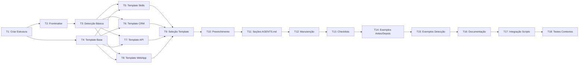

# Change Plan - ADR-007

> Plano interno de execução construído a partir da análise de dependências do TODO.

---

## Identificação

| Campo | Valor |
|-------|-------|
| ADR | docs/adr/ADR-007.md |
| Data de geração | 2026-07-05 |
| Total de tarefas | 18 |
| Estimativa total | 40h |

---

## DAG de Execução

### Legenda

| Cor | Significado |
|-----|-------------|
| ⬜ | Pendente |
| 🔄 | Em andamento |
| ✅ | Concluído |
| ❌ | Bloqueado |

---

## Ordem de Execução

| Fase | Tarefas | Dependências | Tempo Est. |
|------|---------|--------------|------------|
| 1 | T1 | Nenhuma | 1h |
| 2 | T2, T3, T4 | T1 | 3h |
| 3 | T5, T6, T7, T8 | T2, T3, T4 | 4h |
| 4 | T9 | T5, T6, T7, T8 | 2h |
| 5 | T10 | T9 | 2h |
| 6 | T11 | T10 | 3h |
| 7 | T12 | T11 | 2h |
| 8 | T13 | T12 | 1h |
| 9 | T14, T15 | T13 | 2h |
| 10 | T16 | T14, T15 | 3h |
| 11 | T17 | T16 | 2h |
| 12 | T18 | T17 | 4h |

---

## Tarefas Detalhadas

| # | Tarefa | Estado | Dependências | Prioridade | Estimativa | Arquivos |
|---|--------|--------|--------------|------------|------------|----------|
| T1 | Criar Estrutura de Diretórios | ⬜ Pendente | Nenhuma | Alta | 1h | skills/agents-md-generator/ |
| T2 | Definir Frontmatter Padrão | ⬜ Pendente | T1 | Alta | 1h | skills/agents-md-generator/SKILL.md |
| T3 | Implementar Detecção Básica | ⬜ Pendente | T1 | Alta | 1h | skills/agents-md-generator/SKILL.md |
| T4 | Criar Template Base | ⬜ Pendente | T1 | Alta | 1h | skills/agents-md-generator/templates/AGENTS-base.md |
| T5 | Criar Template Skills Repo | ⬜ Pendente | T2, T3, T4 | Média | 1h | skills/agents-md-generator/templates/AGENTS-skills-repo.md |
| T6 | Criar Template CRM | ⬜ Pendente | T2, T3, T4 | Média | 1h | skills/agents-md-generator/templates/AGENTS-crm.md |
| T7 | Criar Template API | ⬜ Pendente | T2, T3, T4 | Média | 1h | skills/agents-md-generator/templates/AGENTS-api.md |
| T8 | Criar Template WebApp | ⬜ Pendente | T2, T3, T4 | Média | 1h | skills/agents-md-generator/templates/AGENTS-webapp.md |
| T9 | Implementar Seleção de Template | ⬜ Pendente | T5, T6, T7, T8 | Alta | 2h | skills/agents-md-generator/SKILL.md |
| T10 | Implementar Preenchimento Automático | ⬜ Pendente | T9 | Alta | 2h | skills/agents-md-generator/SKILL.md |
| T11 | Implementar Seções do AGENTS.md | ⬜ Pendente | T10 | Alta | 3h | skills/agents-md-generator/SKILL.md |
| T12 | Implementar Manutenção Automática | ⬜ Pendente | T11 | Média | 2h | skills/agents-md-generator/SKILL.md |
| T13 | Criar Checklists de Validação | ⬜ Pendente | T12 | Média | 1h | skills/agents-md-generator/checklists/ |
| T14 | Criar Exemplos Antes/Depois | ⬜ Pendente | T13 | Baixa | 1h | skills/agents-md-generator/examples/before-after.md |
| T15 | Criar Exemplos Detecção | ⬜ Pendente | T13 | Baixa | 1h | skills/agents-md-generator/examples/context-detection.md |
| T16 | Criar Documentação Completa | ⬜ Pendente | T14, T15 | Alta | 3h | skills/agents-md-generator/SKILL.md |
| T17 | Integrar com Scripts | ⬜ Pendente | T16 | Alta | 2h | scripts/sync-index.sh, scripts/validate-index.sh |
| T18 | Testar em Diferentes Contextos | ⬜ Pendente | T17 | Alta | 4h | N/A |

---

## Tarefas Paralelizáveis

| Fase | Tarefas que podem rodar em paralelo |
|------|--------------------------------------|
| 2 | T2, T3, T4 |
| 3 | T5, T6, T7, T8 |
| 9 | T14, T15 |

---

## Pontos de Verificação

| Após Tarefa | Verificar | Critério |
|-------------|-----------|----------|
| T1 | Estrutura criada | Diretórios existem |
| T4 | Template base válido | Arquivo tem conteúdo |
| T8 | Templates criados | Todos os templates existem |
| T11 | SKILL.md completo | ≥150 linhas |
| T16 | Documentação válida | Todas as seções presentes |
| T17 | Integração funcionando | Scripts detectam skill |
| T18 | Testes passando | Skill funciona em ≥3 contextos |

---

## Estimativa Detalhada

| Componente | Tempo Est. | Notas |
|------------|------------|-------|
| Tarefas de infraestrutura | 3h | T1, T2, T3, T4 |
| Tarefas de implementação | 12h | T5-T12 |
| Tarefas de validação | 7h | T13, T17, T18 |
| Tarefas de documentação | 8h | T14, T15, T16 |
| Buffer (20%) | 10h | Imprevistos |
| **Total** | **40h** | |

---

## Riscos do Plano

| # | Risco | Impacto no Plano | Mitigação |
|---|-------|------------------|-----------|
| 1 | Detecção incorreta de contexto | Atraso em T9, T10 | Implementar override manual |
| 2 | Templates desatualizados | Manutenção adicional | Processo de revisão periódica |
| 3 | Complexidade excessiva | Atraso em T11, T12 | Começar com templates básicos |
| 4 | Integração com scripts | Atraso em T17 | Testar cedo e frequentemente |

---

## Validação do Plano

- [x] DAG construído sem ciclos
- [x] Todas as tarefas têm dependências definidas
- [x] Estimativas somam ao total esperado
- [x] Tarefas paralelizáveis são realmente independentes
- [x] Pontos de verificação cobrem tarefas críticas
- [x] Riscos do plano documentados
