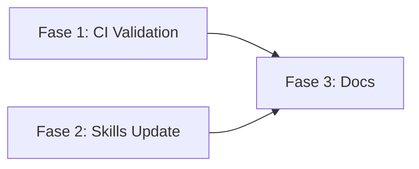

# Blueprint — ADR-009: Resolução de Débitos da Auditoria v2.1.0

> Referência: [ADR-009](./ADR-009.md)

## Visão Geral

Implementar as recomendações da auditoria v2.1.0 para elevar a nota de 94 para 95+ e garantir maturidade completa do runtime de governança.

## Fases de Implementação

### Fase 1: Validação CI — Version Sync Check

**Objetivo:** Adicionar ao `validate-index.sh` uma checagem de que `README.md` bate com `index.json.version`.

**Dependências:** Nenhuma

**Tarefas:**
- [ ] Tarefa 1.1: Extrair versão do `skills/index.json` via jq
- [ ] Tarefa 1.2: Extrair versão do `README.md` via grep
- [ ] Tarefa 1.3: Comparar e reportar erro se divergente
- [ ] Tarefa 1.4: Testar com versão consistente e inconsistente

**Critério de Aceitação:**
- `validate-index.sh` falha se README.md e index.json tiverem versões diferentes
- `validate-index.sh` passa se versões forem iguais

---

### Fase 2: Atualização de Skills

**Objetivo:** Atualizar `governance` e `agent-orchestration` para refletir modos reais de uso.

**Dependências:** Nenhuma

**Tarefas:**
- [ ] Tarefa 2.1: Adicionar seção "Solo + Agentes" em `governance/SKILL.md`
- [ ] Tarefa 2.2: Atualizar referência "Claude Opus 3" em `agent-orchestration/SKILL.md`
- [ ] Tarefa 2.3: Validar skills com `validate-skill.sh`

**Critério de Aceitação:**
- `governance/SKILL.md` menciona modo "solo + agentes" como colaboração válida
- `agent-orchestration/SKILL.md` usa nomenclatura atual de modelos
- Ambas as skills passam em `validate-skill.sh`

---

### Fase 3: Documentação e Ciclo de Vida

**Objetivo:** Documentar ciclo de vida completo da ADR no AGENTS.md e expandir exemplos.

**Dependências:** Fase 2

**Tarefas:**
- [ ] Tarefa 3.1: Verificar que AGENTS.md documenta ciclo ADR → Arquivamento → Deploy (já feito)
- [ ] Tarefa 3.2: Adicionar exemplo multi-stack em `api-design/examples/`
- [ ] Tarefa 3.3: Atualizar CHANGELOG com entries desta iteração

**Critério de Aceitação:**
- AGENTS.md contém seção "Ciclo de Vida de uma ADR" com 4 etapas
- Pelo menos 1 exemplo em Python ou PowerShell existe em `api-design/examples/`
- CHANGELOG reflete todas as mudanças

## Sequenciamento

## Riscos e Mitigações

| Risco | Likelihood | Impacto | Mitigação |
|-------|-----------|---------|-----------|
| Falso positivo na validação version | Baixo | Médio | Testar com dados reais antes de commit |
| Mudança em governance confunde usuários | Baixo | Baixo | Manter seções existentes, adicionar nova seção |

## Referências

- ADR: [ADR-009](./ADR-009.md)
- TODO: [ADR-009-TODO](./ADR-009-TODO.md)
- Audit: [Audit Bulletin](../audits/ignite-agents-skills-audit.md)
