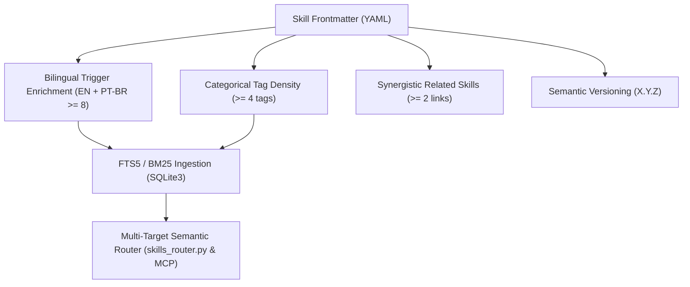

# Blueprint: ADR-027 — Multilingual Semantic Trigger & Governance Metadata Hardening

## 1. Visão Arquitetural



## 2. Contrato Canônico de YAML Frontmatter

```yaml
---
name: <skill-name>
version: <X.Y.Z>
description: <Comprehensive description in EN-US with minimum 60 characters>
domain: <core-domain>
triggers:
  - <canonical-name-en>
  - <action-verb-phrase-en>
  - <technical-keyword-en>
  - <use-case-trigger-en>
  - <nome-canonico-pt>
  - <verbo-acao-frase-pt>
  - <palavra-chave-tecnica-pt>
  - <gatilho-caso-de-uso-pt>
tags:
  - <domain-tag-1>
  - <domain-tag-2>
  - <domain-tag-3>
  - <domain-tag-4>
related_skills:
  - <synergistic-skill-1>
  - <synergistic-skill-2>
metadata:
  author: Antigravity Autonomous Architecture
  provenance: internal
  last_audited: "2026-08-26"
---
```

## 3. Matriz de Mapeamento de Triggers Bilíngues por Domínio
- **Arquitetura & ADRs:** Triggers em EN (`adr-generator`, `architectural-decision`, `record-decision`) e PT (`gerar-adr`, `criar-adr`, `decisao-arquitetural`).
- **Engenharia & Código:** Triggers em EN (`clean-code`, `code-smells`, `refactor-code`) e PT (`codigo-limpo`, `remover-code-smells`, `revisar-codigo`).
- **Segurança & QA:** Triggers em EN (`security-review`, `vulnerability-audit`, `owasp-top-10`) e PT (`revisao-de-seguranca`, `auditoria-vulnerabilidades`, `inspecao-owasp`).
