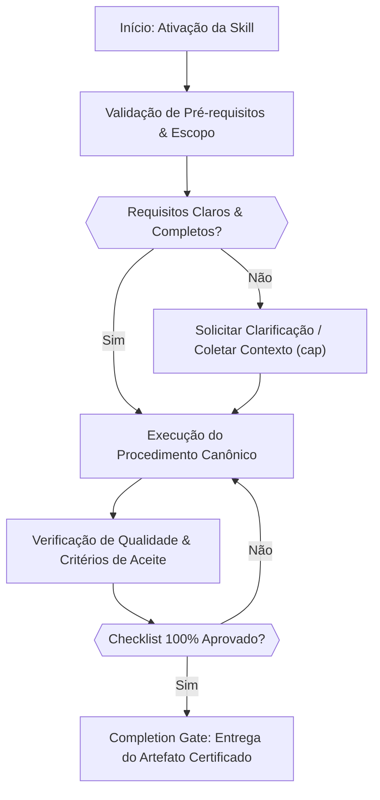

# Blueprint: ADR-028 — Visual Cognitive Ergonomics & Decision Graphs

## 1. Topologia de Fluxo Canônico em Mermaid



## 2. Estrutura Canônica das Seções de Ergonomia

### Checklist Operacional
```markdown
## Operational Verification Checklist

- [ ] Todos os pré-requisitos e arquivos-alvo foram inspecionados antes da modificação.
- [ ] O procedimento seguiu estritamente as regras e boas práticas da especialização.
- [ ] As diretrizes de segurança, tipagem e estilo foram preservadas.
- [ ] Os testes unitários ou comandos de validação foram executados com sucesso.
- [ ] O artefato final foi inspecionado contra o completion gate.
```

### Portão de Conclusão (Completion Gate)
```markdown
## Completion Gate

A tarefa associada à skill só pode ser declarada concluída quando:
1. Todas as verificações do checklist operacional foram atendidas.
2. O resultado foi validado deterministamente através de evidências de execução.
3. Não restam pendências estruturais, placeholders ou erros não tratados.
```
