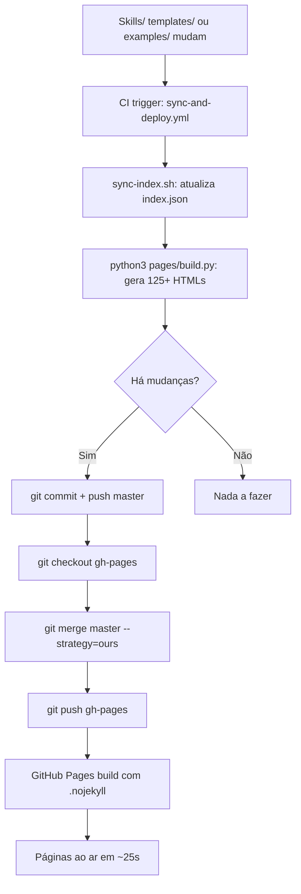

# Blueprint — ADR-012: Dynamic HTML Pages

> Referência: [ADR-012](./ADR-012.md)

---

## 1. Visão Geral

### Objetivo
Criar sistema de páginas HTML dinâmicas que converta automaticamente todo o conteúdo Markdown do repositório em páginas HTML formatadas com tema escuro profissional, com auto-geração via CI.

### Métricas de Sucesso

| Métrica | Antes | Depois | Status |
|---------|-------|--------|--------|
| Páginas HTML formatadas | 1 (root index) | 127 | ✅ |
| Skills com página dedicada | 0 | 23 | ✅ |
| Templates renderizados como HTML | 0 | 72 | ✅ |
| Examples renderizados como HTML | 0 | 18 | ✅ |
| README/USAGE como HTML | 0 | 2 | ✅ |
| Busca em tempo real | ❌ | ✅ | ✅ |
| Navegação sticky | ❌ | ✅ | ✅ |
| Auto-geração via CI | ❌ | ✅ | ✅ |

---

## 2. Estrutura de Artefatos

```
pages/
├── build.py                          # Script de build (Python puro, zero deps)
├── index.html                        # Listing principal de skills
├── readme.html                       # README.md renderizado
├── usage.html                        # USAGE.md renderizado
└── skills/
    └── {skill-name}/
        ├── index.html                # SKILL.md renderizado
        ├── templates/
        │   └── {file}.html           # Template renderizado
        ├── examples/
        │   └── {file}.html           # Example renderizado
        └── checklists/
            └── {file}.html           # Checklist renderizado
```

---

## 3. Decision Tree



---

## 4. Conceitos Fundamentais

### 4.1 Conversor Markdown→HTML Puro

O `pages/build.py` contém um conversor Markdown→HTML implementado em Python puro, sem dependências externas. Suporta:

- Headers (h1–h6) com âncoras automáticas
- Code blocks com linguagem especificada
- Tables Markdown
- Lists (ordenadas e não ordenadas)
- Blockquotes
- Inline: bold, italic, code, links, images, strikethrough
- Horizontal rules

**Configuração:**
```python
# Conversão inline
text = re.sub(r'\*\*([^*]+)\*\*', r'<strong>\1</strong>', text)
text = re.sub(r'`([^`]+)`', r'<code>\1</code>', text)
text = re.sub(r'\[([^\]]+)\]\(([^)]+)\)', r'<a href="\2">\1</a>', text)
```

### 4.2 Tema Escuro

CSS customizado com variáveis CSS para fácil manutenção:

```css
:root {
  --bg-primary: #1a1a2e;
  --bg-card: #1e2a3a;
  --accent: #ff6b2b;
  --text-primary: #f0f0f0;
  --text-secondary: #a0aec0;
  --border: #2d3a4a;
}
```

### 4.3 CI Workflow Consolidado

O `sync-and-deploy.yml` é o workflow único que:
1. Sincroniza `skills/index.json`
2. Valida o index
3. Roda `python3 pages/build.py`
4. Commita mudanças com `[skip ci]`
5. Merge em `gh-pages` para deploy

---

## 5. Workflow

### Workflow 1: Build e Deploy de Páginas

**Objetivo:** Gerar páginas HTML e deployar para GitHub Pages

**Triggers:**
- Push para `master` com mudanças em `skills/**` ou `pages/build.py`

**Steps:**
1. Checkout master (fetch-depth: 0)
2. Setup Python 3.12
3. `sync-index.sh` → sincroniza index.json
4. `validate-index.sh` → valida index.json
5. `python3 pages/build.py` → gera 125+ HTMLs
6. `git add skills/index.json pages/`
7. `git commit -m "chore: sync index.json + rebuild pages [skip ci]"`
8. `git push origin master`
9. Checkout gh-pages
10. `git merge origin/master --strategy=ours`
11. `git push origin gh-pages`

**Checkpoint:** Páginas acessíveis em `https://lscheffel.github.io/ignite-agents-skills/pages/`

---

## 6. Templates

### 6.1 Template de Página de Skill

O template gerado para cada skill inclui:
- **Nav sticky** com links para Skills, README, USAGE
- **Breadcrumb** de navegação
- **Conteúdo renderizado** do SKILL.md
- **Lista de arquivos** com links para templates, examples e checklists
- **Footer** com info do projeto

---

## 7. Anti-patterns

### 🔴 Crítico

#### Deploy sem build de páginas
**O que é:** Fazer push de skills sem rodar `pages/build.py`
**Por que é ruim:** Páginas HTML ficam desatualizadas em relação ao conteúdo Markdown
**Como evitar:** O workflow CI roda automaticamente; para manual: `python3 pages/build.py`

#### .nojekyll ausente no gh-pages
**O que é:** Branch gh-pages sem arquivo `.nojekyll`
**Por que é ruim:** Jekyll tenta processar SKILL.md e quebra paths do Kilo
**Como evitar:** Sempre manter `.nojekyll` na raiz de gh-pages

### 🟡 Médio

#### Build script sem tratamento de encoding
**O que é:** build.py não lida com UTF-8
**Por que é ruim:** Caracteres especiais (acentos, emojis) quebram a renderização
**Como evitar:** Usar `encoding="utf-8"` em todas as operações de arquivo

### 🟢 Baixo

#### Nav links apontando para .md raw
**O que é:** Navegação com links para README.md em vez de readme.html
**Por que é ruim:** Usuário vê Markdown bruto em vez de página formatada
**Como evitar:** Sempre linkar para a versão HTML renderizada

---

## 8. Checklists

### Checklist de Pré-Deploy

- [x] `pages/build.py` roda sem erros
- [x] Todos os 125+ HTMLs são gerados
- [x] Nav links apontam para páginas HTML (não .md)
- [x] Tema escuro consistente em todas as páginas
- [x] Breadcrumbs funcionais
- [x] Busca em tempo real funcional

### Checklist de Pós-Deploy

- [x] `pages/index.html` retorna 200
- [x] `pages/readme.html` retorna 200
- [x] `pages/usage.html` retorna 200
- [x] `pages/skills/{qualquer}/index.html` retorna 200
- [x] `pages/skills/{qualquer}/templates/{arquivo}.html` retorna 200
- [x] Root `/` redireciona para `pages/index.html`

---

## 9. Edge Cases

### Skill sem templates ou examples
**Situação:** Skill só tem SKILL.md, sem diretórios templates/ ou examples/
**Solução:** build.py verifica existência dos diretórios antes de gerar links
**Exceção:** Seção "Arquivos" não é renderizada se vazia

### Markdown com table complexa
**Situação:** Tabelas com cells multi-line ou formatação inline
**Solução:** Conversor trata cells como texto inline, aplica conversão MD
**Exceção:** Tabelas Muito complexas podem ter formatação imperfeita

### Encoding especial (CJK, emojis)
**Situação:** SKILL.md contém caracteres UTF-8 especiais
**Solução:** build.py usa `encoding="utf-8"` em todas as operações
**Exceção:** Caracteres fora do BMP podem não renderizar em todos os browsers

---

## 10. Integração com Skills Existentes

### Referências Diretas

| Skill | Relação com o workflow |
|-------|------------------------|
| `adr-generator` | Gera ADRs que documentam decisões do sistema de pages |
| `governance` | Define processo de deploy e branching strategy |
| `documentation` | Padrões de documentação aplicados ao HTML gerado |

---

## 11. Estimativas

| Componente | Linhas Est. | Arquivos Gerados |
|------------|-------------|------------------|
| pages/build.py | ~850 | 1 (script) |
| pages/index.html | ~200 | 1 |
| pages/readme.html | ~180 | 1 |
| pages/usage.html | ~180 | 1 |
| pages/skills/*/index.html | ~100 cada | 23 |
| pages/skills/*/templates/*.html | ~80 cada | 72 |
| pages/skills/*/examples/*.html | ~80 cada | 18 |
| **Total** | **~10.000** | **127** |

---

## 12. Riscos e Mitigações

| Risco | Impacto | Probabilidade | Mitigação |
|-------|---------|---------------|-----------|
| Conversor MD limitado | Baixo | Média | Testado com 23 SKILL.md reais; edge cases documentados |
| Build lento com muitas skills | Baixo | Baixa | Build atual < 2s; escalável para 100+ skills |
| Merge conflicts com .nojekyll | Médio | Baixa | Workflow usa --strategy=ours; .nojekyll é arquivo estático |

---

*Documento gerado em 2026-07-05. Referência: ADR-012.*
