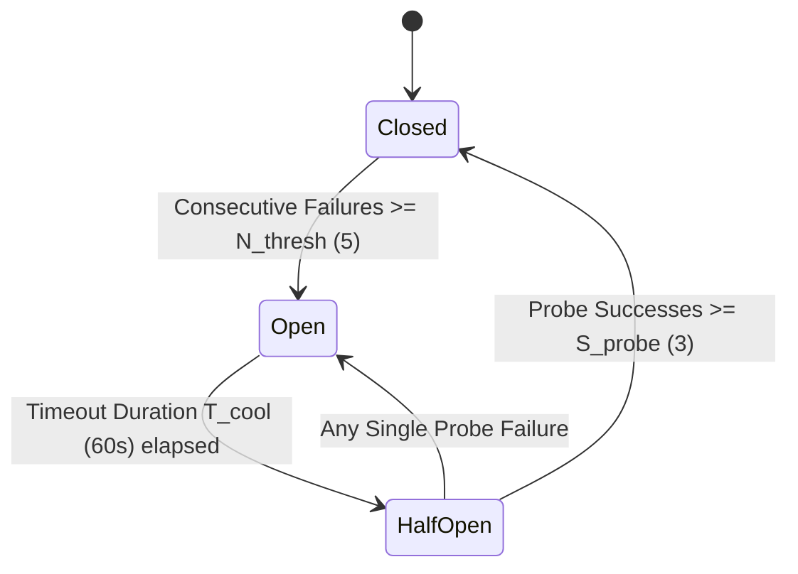

# ADR-031 Blueprint: AI Agents, Loops, Resilience & MCP Tooling Domain SOTA

> **Companion Artifact to:** [ADR-031.md](./ADR-031.md)  
> **Type:** Technical Architecture Blueprint (Tier II)  
> **Status:** APPROVED  

---

## 1. Mathematical Models & Finite State Machines

### 1.1 Circuit Breaker 3-State FSM & Exponential Jitter Backoff (`circuit-breaker`, `resilient-execution`)

The Circuit Breaker transitions across three deterministic states:



#### Exponential Backoff with Full Jitter Formula:
$$T_{\text{sleep}} = \text{Uniform}(0, \min(T_{\text{max}}, T_{\text{base}} \times 2^k))$$

Where:
- $T_{\text{base}} = 1.0\text{ s}$
- $T_{\text{max}} = 30.0\text{ s}$
- $k \in [0, 5]$ (Current retry attempt count).

---

### 1.2 Parallel Subagent Dispatch Budgeting & Partitioning (`dispatching-parallel-agents`, `subagent-driven-development`)

When a parent orchestrator dispatches $M$ parallel subagents, total context budget $B_{\text{total}}$ is strictly partitioned:

$$B_{\text{subagent}}^{(i)} = \frac{B_{\text{total}} - B_{\text{orchestrator}}}{M} \times W_i \quad \text{where} \quad \sum_{i=1}^M W_i = 1.0$$

Where $W_i$ is the task complexity weight assigned to subagent $i$.

#### Deadlock Prevention Invariant:
Subagents execute strictly as Directed Acyclic Graphs (DAG). Circular parent-child or peer-peer direct waits are mathematically prohibited ($\text{Cycle}(G) = \emptyset$).

---

### 1.3 Model Context Protocol (MCP) JSON-RPC 2.0 Contract (`context7-mcp`, `mcp-builder`)

All MCP tools must conform to JSON-RPC 2.0 schema:

```json
{
  "jsonrpc": "2.0",
  "method": "tools/call",
  "params": {
    "name": "<tool_name>",
    "arguments": {}
  },
  "id": "<request_id>"
}
```

Response Contract:
```json
{
  "jsonrpc": "2.0",
  "result": {
    "content": [
      {
        "type": "text",
        "text": "<payload_content>"
      }
    ],
    "isError": false
  },
  "id": "<request_id>"
}
```
