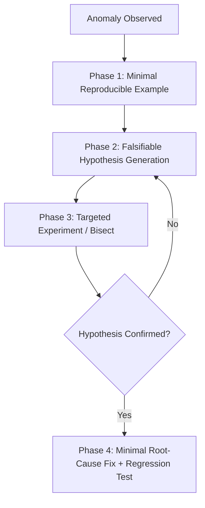

# ADR-032 Blueprint: Engineering, Coding & Quality Domain SOTA

> **Companion Artifact to:** [ADR-032.md](./ADR-032.md)  
> **Type:** Technical Architecture Blueprint (Tier II)  
> **Status:** APPROVED  

---

## 1. Mathematical Models & Complexity Metrics

### 1.1 Cyclomatic & Cognitive Complexity Bounds (`clean-code`)

Code quality gates evaluate **Thomas McCabe's Cyclomatic Complexity ($CC$)**:

$$CC = E - N + 2P$$

Where $E$ is edges, $N$ is nodes, and $P$ is connected components in the control flow graph.

**Complexity Gate Thresholds:**
- $CC \le 5$: Simple, low risk (Target for single functions).
- $6 \le CC \le 10$: Moderate complexity, acceptable with comprehensive unit tests.
- $CC > 10$: High risk (Architectural violation — **Refactoring Mandatory**).

---

### 1.2 Test Pyramid Distribution & Mutation Testing Score (`test-driven-development`, `testing-mastery`)

#### 1.2.1 Mike Cohn Test Pyramid Ratio:
The ideal test suite distribution conforms to:

$$\frac{N_{\text{unit}}}{N_{\text{total}}} \approx 0.70, \quad \frac{N_{\text{integration}}}{N_{\text{total}}} \approx 0.20, \quad \frac{N_{\text{e2e}}}{N_{\text{total}}} \approx 0.10$$

#### 1.2.2 Mutation Score ($MS$):
Quality of test assertions is verified by the ratio of killed synthetic mutants ($M_{\text{killed}}$):

$$MS = \frac{M_{\text{killed}}}{M_{\text{total}} - M_{\text{equivalent}}} \ge 0.85 \quad (85\%)$$

---

### 1.3 Scientific Debugging Search Complexity (`systematic-debugging`)

The scientific debugging process executes binary search over execution history:

$$\text{Steps}_{\text{bisect}} \le \lceil \log_2(N_{\text{commits}}) \rceil$$

#### 4-Phase Scientific Hypothesis Tree:

---

### 1.4 Code Review Severity Taxonomy (`code-review`, `code-review-lite`, `code-review-workflow`)

Reviews classify feedback into the **Google Engineering Practices 3-Tier Taxonomy**:

| Severity Badge | Definition | Action Required | Blocking? |
|:---|:---|:---|:---:|
| **`🔴 P1: BLOCKER`** | Correctness bug, security vulnerability, data loss risk, breaking change. | Must fix before merge. | **YES** |
| **`🟡 P2: MAJOR`** | Code smell, architectural violation, performance regression, missing tests. | Must resolve or record as tech debt. | **YES** |
| **`🟢 P3: POLISH`** | Naming suggestion, minor style polish, non-blocking optimization. | Author's discretion. | **NO** |
