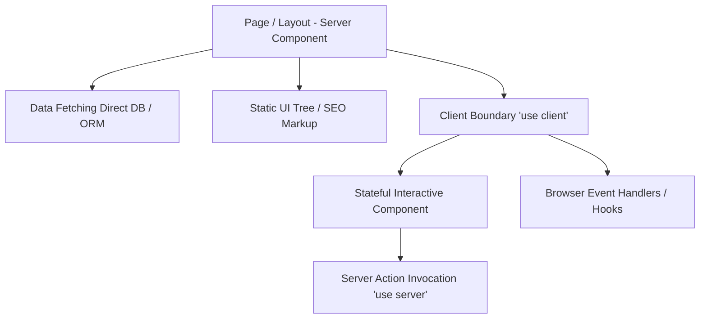

# ADR-034 Blueprint: Frontend, UI/UX & Web Domain SOTA

> **Companion Artifact to:** [ADR-034.md](./ADR-034.md)  
> **Type:** Technical Architecture Blueprint (Tier II)  
> **Status:** APPROVED  

---

## 1. Mathematical Models & Frontend Standards

### 1.1 WCAG 2.2 Relative Luminance & Contrast Ratio (`ui-ux-pro-max`)

Relative luminance $L$ of a color is calculated from sRGB components:

$$L = 0.2126 \cdot R + 0.7152 \cdot G + 0.0722 \cdot B$$

Where $C \in \{R, G, B\}$ is converted from sRGB:
$$C = \begin{cases} \frac{C_{\text{srgb}}}{12.92} & \text{if } C_{\text{srgb}} \le 0.04045 \\ \left(\frac{C_{\text{srgb}} + 0.055}{1.055}\right)^{2.4} & \text{if } C_{\text{srgb}} > 0.04045 \end{cases}$$

#### Contrast Ratio Formula:
$$\text{Ratio} = \frac{L_1 + 0.05}{L_2 + 0.05} \quad (L_1 > L_2)$$

**Accessibility Standards:**
- **WCAG AA (Normal Text):** $\text{Ratio} \ge 4.5:1$
- **WCAG AA (Large Text $\ge 18\text{pt}$ / $24\text{px}$):** $\text{Ratio} \ge 3.0:1$
- **WCAG AAA (Enhanced Normal Text):** $\text{Ratio} \ge 7.0:1$

---

### 1.2 System Usability Scale (SUS) Score Formula (`ux-researcher-designer`)

For a 10-item questionnaire on a 5-point Likert scale:

$$\text{SUS} = 2.5 \times \left( \sum_{i \in \text{Odd}} (R_i - 1) + \sum_{j \in \text{Even}} (5 - R_j) \right) \in [0, 100]$$

| SUS Score Range | Grade | Usability Category |
|:---|:---:|:---|
| **$\ge 80.3$** | **A** | Excellent / World-Class |
| **$68.0 \le \text{SUS} < 80.3$** | **B / C** | Above Average / Acceptable |
| **$< 68.0$** | **D / F** | Marginal / Unacceptable (Redesign Required) |

---

### 1.3 React 19 Server vs Client Component Boundary Invariants (`react-best-practices`)



---

### 1.4 JSON-LD Schema.org Structured Data Graph (`seo-optimizer`)

```json
{
  "@context": "https://schema.org",
  "@graph": [
    {
      "@type": "SoftwareApplication",
      "@id": "https://ignite.dev/skills#app",
      "name": "Ignite Agents Skills",
      "applicationCategory": "DeveloperApplication",
      "operatingSystem": "All",
      "offers": {
        "@type": "Offer",
        "price": "0",
        "priceCurrency": "USD"
      }
    }
  ]
}
```
