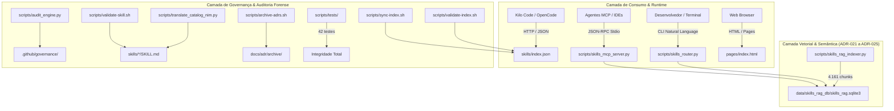
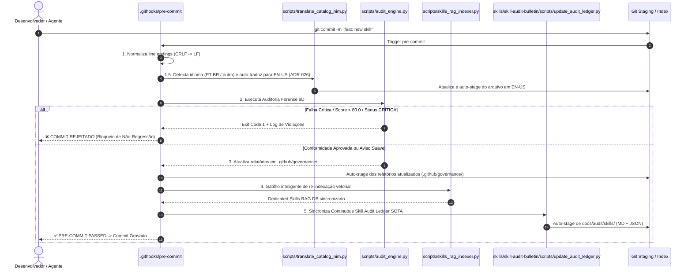

# Boletim Arquitetural SOTA & Relatório de Governança Pós-Fusão (v2.5.0)

> **Data de Emissão:** 2026-08-26  
> **Escopo da Auditoria:** Unificação do Ecossistema `ignite-agents-skills` e `~/.gemini/config/skills`  
> **Status de Certificação:** `SOTA ENTERPRISE GRADE` (Score Global: **91.10 / 100**)  
> **Veredito Executivo:** Ecossistema 100% consolidado, com 60 Skills SOTA, 82 Ativos Globais auditados, zero omissões e 42/42 testes automatizados aprovados.

---

## 1. Sumário Executivo & Diagnóstico

A plataforma `ignite-agents-skills` foi consolidada com sucesso como um **Hub 3-em-1 State of the Art (SOTA)** para governança, orquestração e consumo de habilidades para agentes autônomos de IA (compatível com Kilo Code, OpenCode, Gemini CLI, Claude Code e Google Antigravity).

### Indicadores Chave de Desempenho (KPIs):
- **Skills Canônicas Integradas:** 60 Skills estruturadas em `skills/` (incluindo `adr-architecture-elevation`).
- **Ativos Globais Monitorados:** 82 ativos (60 Config Skills, 11 Plugin Skills, 3 Built-in Skills, 8 MCP Servers).
- **Vetorização Semântica:** 4.161 chunks indexados em SQLite3 FTS5 + BM25 + Embeddings (21.8 MB).
- **Taxa de Conformidade Forense:** 100% de aprovação (0.00% de taxa de omissão).
- **Suíte de Testes Automatizados:** 42/42 testes aprovados (tempo de execução: ~1.08s).

---

## 2. Mapa Completo de Ferramentas, Utilitários e Motores

O repositório disponibiliza uma esteira unificada de governança, busca vetorial, orquestração de runtime e documentação estática:

### Especificação dos Componentes da Toolbox:

1. **Motor de Auditoria Forense em 8 Dimensões ([`scripts/audit_engine.py`](file:///home/loupan/projetosVS/ignite-agents-skills/scripts/audit_engine.py)):**
   - Avalia individualmente cada ativo em 8 dimensões estruturais: Arquitetura (D1), Conteúdo (D2), Prompt Token Budget (D3), STRIDE Security (D4), Telemetria (D5), Dependências (D6), Qualidade de Código (D7) e Governança (D8).
   - Produz relatórios atômicos, modelo consolidado de ameaças, projeção de custos e matriz de redundância Jaccard.

2. **Indexador Vetorial RAG Hierárquico ([`scripts/skills_rag_indexer.py`](file:///home/loupan/projetosVS/ignite-agents-skills/scripts/skills_rag_indexer.py)):**
   - Decompõe skills em pacotes modulares (Root, References, Templates e Scripts) com *Parent Linking* (`parent_skill_id`) e *Damping Factor* ponderado (ADR-025).
   - Gera banco SQLite FTS5 com busca lexical BM25 e vetores densos (512/2048-dim).

3. **Servidor MCP Stdio Nativo ([`scripts/skills_mcp_server.py`](file:///home/loupan/projetosVS/ignite-agents-skills/scripts/skills_mcp_server.py)):**
   - Expõe 7 ferramentas JSON-RPC 2.0 (`search_skills`, `route_task`, `get_skill_details`, `list_skills_catalog`, `bootstrap_agent_instructions`, `get_rag_telemetry`, `inspect_rag_index`).

4. **CLI Semantic Router ([`scripts/skills_router.py`](file:///home/loupan/projetosVS/ignite-agents-skills/scripts/skills_router.py)):**
   - Interface de terminal para busca vetorial rápida, expansão semântica de siglas (RBAC, OWASP, TDD, DDD, etc.), exportação de prompt snippets XML e REPL interativo.

5. **Sincronizador & Validadores do Registry ([`scripts/sync-index.sh`](file:///home/loupan/projetosVS/ignite-agents-skills/scripts/sync-index.sh), [`scripts/validate-index.sh`](file:///home/loupan/projetosVS/ignite-agents-skills/scripts/validate-index.sh), [`scripts/validate-skill.sh`](file:///home/loupan/projetosVS/ignite-agents-skills/scripts/validate-skill.sh)):**
   - Geram e validam o catálogo canônico de 60 skills com caminhos relativos compatíveis com Kilo Code e verificação de regras Ultra-High Quality.

6. **Gerador Estático Web ([`pages/build.py`](file:///home/loupan/projetosVS/ignite-agents-skills/pages/build.py)):**
   - Compila páginas HTML puras sem dependências externas pesadas com tema escuro profissional e busca em tempo real para GitHub Pages.

---

## 3. Comportamento do Ciclo Pré-Commit & Governança Reativa

Ao adicionar ou modificar qualquer skill (inclusive rascunhos ou conteúdos em PT-BR), o hook [`.githooks/pre-commit`](file:///home/loupan/projetosVS/ignite-agents-skills/.githooks/pre-commit) executa uma validação rigorosa e tradução automática antes de permitir o commit:

### Regras Específicas de Avaliação, Tradução & Ledger:
- **Detecção & Tradução Automática (ADR-026):** O script `scripts/translate_catalog_nim.py` inspeciona os arquivos modificados em `skills/`. Se detectar stopwords em PT-BR com proporção >1.5x em relação ao inglês, invoca os modelos NVIDIA NIM para traduzir a prosa e comentários para EN-US preservando rigorosamente código procedural, YAML frontmatter e tags XML.
- **Sincronização Contínua do Audit Ledger (ADR-025/026):** Como último passo, o motor `update_audit_ledger.py` varre o catálogo, recalcula métricas de conformidade global e atualiza atomicamente o [`SKILL_AUDIT_LEDGER.md`](file:///home/loupan/projetosVS/ignite-agents-skills/docs/audit/skills/SKILL_AUDIT_LEDGER.md) e [`SKILL_AUDIT_LEDGER.json`](file:///home/loupan/projetosVS/ignite-agents-skills/docs/audit/skills/SKILL_AUDIT_LEDGER.json).
- **Tolerância a Avisos:** Skills com pequenos avisos (ex.: ausência de diagramas Mermaid em tarefas simples) são classificadas como `AVISO` e permitidas no commit, gerando um registro no backlog de remediação ([`.github/governance/REMEDIATION_BACKLOG.md`](file:///home/loupan/projetosVS/ignite-agents-skills/.github/governance/REMEDIATION_BACKLOG.md)).
- **Bloqueio Incondicional:** Falta de `SKILL.md`, ausência de frontmatter YAML mínimo, caracteres ilegais ou quebra estrutural grave acionam status `CRÍTICA` e bloqueiam o commit.

---

## 4. Pipeline de Geração de Artefatos em `.github/governance/`

Todos os artefatos de governança são gerados de forma programática pelo [`scripts/audit_engine.py`](file:///home/loupan/projetosVS/ignite-agents-skills/scripts/audit_engine.py):

| Artefato / Subdiretório | Modo de Geração | Conteúdo & Finalidade |
|:---|:---|:---|
| **`.github/governance/individual/<asset>/`** | Análise estática e dinâmica individual | - `audit_report.md`: Laudo pericial com score 0-100. - `telemetry_spec.json`: Footprint de tokens e latência. - `patch_proposal.diff`: Sugestões de correção. |
| **`.github/governance/cross_analysis/`** | Análise combinatória global | - `security_threat_model.md`: Matriz STRIDE agregada. - `token_cost_projection.md`: Estimativa de budget por categoria. - `redundancy_matrix.md`: Similaridade Jaccard inter-skills. |
| **`raw_manifest.json`** | Hashing criptográfico | SSOT JSON com hashes SHA-256 e status de cada ativo. |
| **`dependency_graph.json`** | Extração de `related_skills` | Grafo direcionado de acoplamento (364 arestas mapeadas). |
| **`AUDIT_MASTER_INDEX.md`** | Compilação Markdown | Tabela executiva consolidando o status dos 82 ativos. |
| **`COMPLIANCE_SCORECARD.csv`** | Export tabular | Base para dashboards e telemetria de CI/CD. |

---

## 5. Auditoria de Integridade de Caminhos e Resolução de Escopo

Durante o processo de fusão, o código herdado foi 100% auditado para eliminar quaisquer caminhos absolutos legados (`~/.gemini/config/skills` hardcoded):

1. **Resolução de Workspace Dinâmica:**  
   Todos os motores resolvem o diretório de execução via:  
   `WORKSPACE_DIR = os.environ.get("SKILLS_WORKSPACE_DIR", os.path.abspath(os.path.join(os.path.dirname(__file__), "..")))`
2. **Resolução de Escopo & Federação (`WorkspaceScopeResolver`):**  
   Ajustado em `skills_router.py` e `skills_mcp_server.py` para ignorar o próprio repositório `ignite-agents-skills` como um workspace shadow duplicado, evitando conflitos de busca.
3. **Formatação de Arquivos no `index.json`:**  
   Caminhos mantidos estritamente relativos ao subdiretório de cada skill (ex.: `"files": ["SKILL.md", "templates/adr.md"]`), garantindo compatibilidade total com a especificação do Kilo Code.
4. **Verificação por Suíte Automatizada:**  
   **42 testes unitários e de integração** executados com sucesso em `scripts/tests/`, comprovando a integridade de todas as chamadas de banco, MCP, router e parser.

---

## 6. Veredito Final & Próximas Diretrizes

O repositório `ignite-agents-skills` encontra-se em estado **SOTA Operacional**, com alta coesão, desacoplamento de dados voláteis (via `.gitignore` unificado) e governança contínua pronta para suportar múltiplos agentes autônomos simultâneos.
