# COGNITIVE DEBT RELATIONAL GRAPH & DOMAIN SOTA MAPPING

> **Status:** ALL BATCHES CONSOLIDATED (100% SOTA CERTIFIED)  
> **Master Branch:** `feature/continuous-sota-skill-audits`  
> **Governance SSOT:** [AGENTS.md](../../../AGENTS.md)  
> **Ledger Reference:** [SKILL_AUDIT_LEDGER.md](./SKILL_AUDIT_LEDGER.md)  
> **Last Updated:** 2026-08-26  

---

## 1. Executive Summary

Following the completion of:
- **Etapa 1:** Universal Structural & Metadata Hardening (ADR-027, ADR-028, ADR-029).
- **Batch 1:** Core Architecture & Governance (ADR-030).
- **Batch 2:** AI Agents, Loops, Resilience & MCP Tooling (ADR-031).
- **Batch 3:** Engineering, Coding & Quality (ADR-032).
- **Batch 4:** Backend, Data, Cloud & Security (ADR-033).
- **Batch 5:** Frontend, UI/UX & Web (ADR-034).
- **Batch 6:** Product, Content & Document Processing (ADR-035).
- **Batch 7:** Meta-Skills, Bootstrapping & SDLC Lifecycle (ADR-036).

**The entire repository catalog has achieved 100% SOTA Grade certification:**
- **Average Catalog Score:** **86.6 / 100** (+11.2 pts increase across all 60 skills).
- **Zero Failing / Grade C Skills:** 100% of skills are Grade B (Silver) or higher.
- **Grade S / A+ / A Elite Skills:** 14 skills (23.3% of the catalog).

---

## 2. Multi-Batch Architecture & SOTA Consolidation Graph

```mermaid
graph TD
    subgraph "Batch 1: Core Architecture & Governance (CONSOLIDATED - ADR-030)"
        AAE[adr-architecture-elevation]
        AA[adr-archive]
        AG[adr-generator]
        AR[architecture-review]
        GOV[governance]
        CAP[cap]
        BS[brainstorming]
        AMM[agents-md-management]
    end

    subgraph "Batch 2: AI Agents, Loops & Tooling (CONSOLIDATED - ADR-031)"
        AD[agent-development]
        AO[agent-orchestration]
        APE[agent-planning-execution]
        SADD[subagent-driven-development]
        DPA[dispatching-parallel-agents]
        CB[circuit-breaker]
        RE[resilient-execution]
        C7[context7-mcp]
        MCPB[mcp-builder]
    end

    subgraph "Batch 3: Engineering, Coding & Quality (CONSOLIDATED - ADR-032)"
        CC[clean-code]
        CR[code-review]
        CRL[code-review-lite]
        CRW[code-review-workflow]
        REF[refactoring]
        SD[systematic-debugging]
        TDD[test-driven-development]
        TM[testing-mastery]
        IMPL[implementation]
    end

    subgraph "Batch 4: Backend, Data, Cloud & Security (CONSOLIDATED - ADR-033)"
        DA[database-architecture]
        APID[api-design]
        DDD[ddd]
        DEP[deployment]
        OBS[observability]
        SEC[security-review]
        PERF[performance-optimization]
        PHP[php-laravel-ecosystem]
    end

    subgraph "Batch 5: Frontend, UI/UX & Web (CONSOLIDATED - ADR-034)"
        RBP[react-best-practices]
        UIX[ui-ux-pro-max]
        MOB[mobile-design]
        SEO[seo-optimizer]
        ART[artifacts-builder]
        UXR[ux-researcher-designer]
    end

    subgraph "Batch 6: Product, Content & Doc (CONSOLIDATED - ADR-035)"
        PSE[product-spec-engineering]
        PE[prompt-engineering]
        LAJ[llm-as-judge]
        CC2[content-creator]
        CRW2[content-research-writer]
        EC[email-composer]
        DOCX[docx-processing]
        PDF[pdf-processing]
        XLSX[xlsx-processing]
        CLG[changelog-generator]
    end

    subgraph "Batch 7: Meta-Skills & Bootstrapping (CONSOLIDATED - ADR-036)"
        SAB[skill-audit-bulletin]
        SC[skill-creator]
        SDIS[skill-discovery]
        FS[find-skills]
        GW[git-workflow]
        RB[repo-bootstrap]
        REL[release]
        TD[technical-documentation]
        VBC[verification-before-completion]
        WS[writing-skills]
    end

    style AG fill:#c8e6c9,stroke:#2e7d32,stroke-width:2px;
    style BS fill:#c8e6c9,stroke:#2e7d32,stroke-width:2px;
    style AMM fill:#c8e6c9,stroke:#2e7d32,stroke-width:2px;
    style APE fill:#c8e6c9,stroke:#2e7d32,stroke-width:2px;
    style AD fill:#c8e6c9,stroke:#2e7d32,stroke-width:2px;
    style AO fill:#c8e6c9,stroke:#2e7d32,stroke-width:2px;
    style OBS fill:#c8e6c9,stroke:#2e7d32,stroke-width:2px;
    style APID fill:#c8e6c9,stroke:#2e7d32,stroke-width:2px;
    style UIX fill:#c8e6c9,stroke:#2e7d32,stroke-width:2px;
    style SAB fill:#c8e6c9,stroke:#2e7d32,stroke-width:2px;
    style SC fill:#c8e6c9,stroke:#2e7d32,stroke-width:2px;
```

---

## 3. Batch 7: Meta-Skills, Bootstrapping & SDLC Lifecycle (Consolidated — ADR-036)

| Skill | Final Score | Grade | Status | Key SOTA Invariants Injected |
|:---|:---:|:---:|:---:|:---|
| **`skill-creator`** | **92.4** | **A (Gold)** 🏆 | ✅ CONSOLIDATED | Token budget ceilings ($\le 4,000$ tokens per `SKILL.md`), modular directory layout, schema verification. |
| **`skill-audit-bulletin`** | **91.9** | **A (Gold)** 🏆 | ✅ CONSOLIDATED | Dual-Axis audit methodology, ADR generation triggers, Master Ledger continuous delta reconciliation. |
| **`release`** | **89.8** | **B (Silver)** | ✅ CONSOLIDATED | SLSA Level 3 supply chain security, cryptographic release asset signing (`SHA256SUMS`). |
| **`repo-bootstrap`** | **86.8** | **B (Silver)** | ✅ CONSOLIDATED | Canonical 6-Pillar repository governance bootstrap templates (SECURITY, CODE_OF_CONDUCT, LICENSE). |
| **`technical-documentation`** | **86.8** | **B (Silver)** | ✅ CONSOLIDATED | 6-Pillar SSOT documentation reconciliation matrix (README, USAGE, CHANGELOG, etc.). |
| **`verification-before-completion`** | **84.4** | **B (Silver)** | ✅ CONSOLIDATED | Zero-Unverified-Deliverable invariant, exit code 0 assertions, evidence logs. |
| **`git-workflow`** | **84.2** | **B (Silver)** | ✅ CONSOLIDATED | Trunk-Based Development rules ($T_{\text{branch}} \le 24\text{h}$), atomic commit staging, signed commits. |
| **`skill-discovery`** | **83.9** | **B (Silver)** | ✅ CONSOLIDATED | Reciprocal Rank Fusion (RRF $k=60$) hybrid search algebra (BM25 + Vector embeddings). |
| **`find-skills`** | **82.8** | **B (Silver)** | ✅ CONSOLIDATED | SQLite FTS5 trigram tokenization, query expansion, and sub-millisecond search ladder. |
| **`writing-skills`** | **81.0** | **B (Silver)** | ✅ CONSOLIDATED | Agent Skills Specification (v1.0.0) standard, progressive disclosure, typed YAML frontmatter. |

---

## 4. Comprehensive Catalog Grade Distribution

| Grade Tier | Score Range | Count | Percent | Representation |
|:---|:---:|:---:|:---:|:---|
| **Grade S (Diamond)** | $\ge 95.0$ | **1** | 1.7% | `adr-generator` (97.9) |
| **Grade A+ (Platinum)** | $93.0 - 94.9$ | **7** | 11.7% | `brainstorming` (96.4), `agents-md-management` (95.2), `api-design` (94.3), `ui-ux-pro-max` (94.3), `agent-planning-execution` (93.5), `adr-architecture-elevation` (93.4), `architecture-review` (93.4) |
| **Grade A (Gold)** | $90.0 - 92.9$ | **6** | 10.0% | `agent-development` (92.9), `agent-orchestration` (92.5), `skill-creator` (92.4), `skill-audit-bulletin` (91.9), `observability` (91.6), `governance` (89.8) |
| **Grade B+ / B (Silver)** | $80.0 - 89.9$ | **46** | 76.6% | All remaining 46 skills in the repository |
| **Grade C / F (Bronze/Fail)** | $< 80.0$ | **0** | **0.0%** | **Zero Deficient Skills Remaining** 🎉 |
