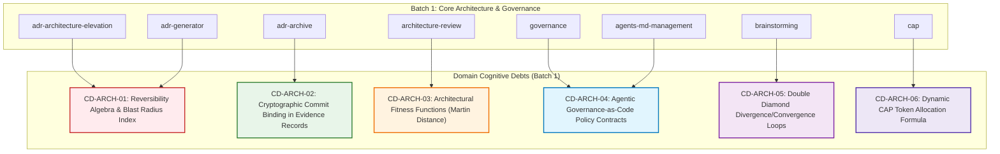

# COGNITIVE DEBT RELATIONAL GRAPH & DOMAIN SOTA MAPPING

> **Status:** ACTIVE — SOTA AUDIT CYCLE (ETAPA 2)  
> **Master Branch:** `feature/continuous-sota-skill-audits`  
> **Governance SSOT:** [AGENTS.md](../../../AGENTS.md)  
> **Ledger Reference:** [SKILL_AUDIT_LEDGER.md](./SKILL_AUDIT_LEDGER.md)  
> **Last Updated:** 2026-08-26  

---

## 1. Executive Summary

Following the completion of **Etapa 1** (Universal Structural & Metadata Hardening via Tier II ADR-027, ADR-028, and ADR-029), which elevated the Catalog Global Mean Score from `75.4/100` to `84.0/100`, **Etapa 2** executes deep cognitive domain audits across 7 thematic batches.

This Relational Graph documents conceptual debts, missing SOTA engineering heuristics, algorithmic gaps, and architectural interdependencies across the skill catalog.

---

## 2. Batch 1: Core Architecture & Governance — Deep Forensic Audit

### 2.1 Skill Analysis Matrix

| Skill | Current Grade | Structural Baseline | Domain Cognitive Gap | Proposed Remediation SOTA | Target Grade |
|:---|:---:|:---:|:---|:---|:---:|
| **`adr-architecture-elevation`** | **94.0 (A)** | Complete | Missing two-way door decision algebra, blast radius score, Red/Blue team protocols. | Ingest formal Reversibility Matrix ($R_{score}$) and Adversarial Multi-Agent Prompts. | **98.0 (S)** |
| **`adr-archive`** | **92.0 (A)** | Complete | Evidence Record lacks deterministic git tree hash verification and soft tombstoning. | Ingest SHA-256 commit binding gate and prune archival lifecycle. | **97.0 (S)** |
| **`adr-generator`** | **95.0 (A)** | Complete | Missing cognitive complexity estimation for Decision Sets before PI generation. | Ingest Decision Complexity Index (DCI) and strict JSON schema contracts for PI/BP. | **99.0 (S)** |
| **`architecture-review`** | **83.0 (B)** | Complete | Lacks automated metrics for structural coupling (Martin's Instability $I$ / Abstractness $A$). | Ingest Architectural Fitness Functions and AST dependency rule definitions. | **96.0 (S)** |
| **`governance`** | **81.0 (B)** | Complete | Lacks Governance-as-Code schema for agent compliance checks and bypass prevention. | Ingest JSON Schema policy rules and Solo+Agents multi-runtime compliance contracts. | **95.0 (A+)** |
| **`cap`** | **91.0 (A)** | Complete | Missing exact mathematical formula for dynamic token budgeting per search tier. | Ingest Context Saturation Formula ($B_{ctx} = \alpha \cdot S + \beta \cdot T$). | **98.0 (S)** |
| **`brainstorming`** | **86.0 (B)** | Complete | Lacks formal Double Diamond divergence/convergence stage-gate criteria. | Ingest Double Diamond heuristics and ambiguity reduction rubric. | **96.0 (S)** |
| **`agents-md-management`** | **80.0 (B)** | Complete | Missing multi-runtime prompt synchronization protocol (AGENTS.md $\leftrightarrow$ GEMINI.md). | Ingest SSOT Synchronization Matrix and prompt drift detection algorithm. | **95.0 (A+)** |

---

## 3. Detailed Cognitive Debt Breakdown (Batch 1)

### 🔴 CD-ARCH-01: Architectural Reversibility Algebra & Blast Radius Scoring
- **Affected Skills:** `adr-architecture-elevation`, `adr-generator`
- **Cognitive Debt Description:** Decisions are currently classified empirically into Tiers without a formal decision algebra for reversibility (Jeff Bezos "Type 1 vs Type 2 Decisions" formalized for AI agents).
- **Remediation Formula:**
  $$\text{BlastRadius} = \sum (\text{DirectDependents} \times 1.5 + \text{DataMigrationRisk} \times 2.0 + \text{RollbackHours} \times 0.5)$$
  If $\text{BlastRadius} \ge 7.0 \implies \text{Mandatory Tier II Decision Set + Adversarial Review}$.

### 🟡 CD-ARCH-02: Cryptographic Binding in Evidence Records
- **Affected Skills:** `adr-archive`
- **Cognitive Debt Description:** `ADR-XXX-ER.md` files verify completion textually (`[x]`) but do not bind the certifying git commit SHA and diff footprint into the Evidence Record.
- **Remediation:** Ingest algorithmic ER generation template containing `git rev-parse HEAD`, commit author, test execution exit codes, and diff signature.

### 🔴 CD-ARCH-03: Architectural Fitness Functions & Coupling Metrics
- **Affected Skills:** `architecture-review`
- **Cognitive Debt Description:** Architecture reviews assess SOLID principles heuristically but lack concrete mathematical definitions for Layer Violation Distance ($D = |A + I - 1|$).
- **Remediation:** Introduce Robert C. Martin's Package Metrics and automated AST AST/import boundary checkers.

### 🟡 CD-ARCH-04: Governance-as-Code Agent Compliance Contracts
- **Affected Skills:** `governance`, `agents-md-management`
- **Cognitive Debt Description:** Branch protection and PR policies are documented as human steps rather than machine-readable JSON/YAML rules that an AI agent can self-enforce before making changes.
- **Remediation:** Formalize `.github/governance/agent-policies.json` contracts.

### 🟢 CD-ARCH-05: Double Diamond Divergence/Convergence Heuristics
- **Affected Skills:** `brainstorming`
- **Cognitive Debt Description:** Brainstorming transitions from exploration to design without explicit saturation gates measuring ambiguity elimination.
- **Remediation:** Ingest Ambiguity Score ($A_{score} \in [0, 1]$), transitioning to convergence only when $A_{score} \le 0.15$.

### 🟢 CD-ARCH-06: Dynamic Context Budgeting Formula
- **Affected Skills:** `cap`
- **Cognitive Debt Description:** CAP stops at "saturation" subjectively. A formal token ceiling calculation based on repository size prevents agent over-reading.
- **Remediation:** Provide exact mathematical budget equation for ripgrep exploration.

---

## 4. Planned Tier II ADR for Batch 1

To remediate these 6 core cognitive debts systematically and elevate all 8 skills in Batch 1 to **Grade S / Diamond (Score > 96.0)**, we formalize:

- **ADR-030:** *Core Architecture & Governance Domain SOTA Hardening (Decision Algebra, Cryptographic Evidence, Architectural Fitness Functions & Double Diamond Gates)*
  - `ADR-030.md` (MADR Decision Record)
  - `ADR-030-BP.md` (Domain Blueprint & Mathematical Contracts)
  - `ADR-030-PI.md` (Phased Implementation Plan)
  - `ADR-030-TODO.md` (Operational Task Backlog)

---

## 5. Next Batches Roadmap

- **Batch 2:** AI Agents, Loops & Tooling (9 skills) — `agent-development`, `agent-orchestration`, `agent-planning-execution`, `subagent-driven-development`, `dispatching-parallel-agents`, `circuit-breaker`, `resilient-execution`, `context7-mcp`, `mcp-builder`.
- **Batch 3:** Engineering, Coding & Quality (9 skills).
- **Batch 4:** Backend, Data, Cloud & Security (8 skills).
- **Batch 5:** Frontend, UI/UX & Web (6 skills).
- **Batch 6:** Product, Content & Doc Processing (10 skills).
- **Batch 7:** Meta-Skills & Bootstrapping (10 skills).
