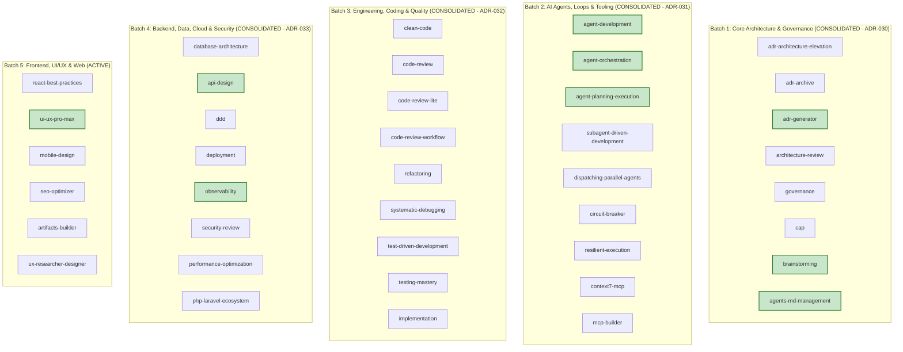

# COGNITIVE DEBT RELATIONAL GRAPH & DOMAIN SOTA MAPPING

> **Status:** ACTIVE — SOTA AUDIT CYCLE (ETAPA 2)  
> **Master Branch:** `feature/continuous-sota-skill-audits`  
> **Governance SSOT:** [AGENTS.md](../../../AGENTS.md)  
> **Ledger Reference:** [SKILL_AUDIT_LEDGER.md](./SKILL_AUDIT_LEDGER.md)  
> **Last Updated:** 2026-08-26  

---

## 1. Executive Summary

Following the completion of:
- **Etapa 1:** Universal Structural & Metadata Hardening (ADR-027, ADR-028, ADR-029).
- **Batch 1:** Core Architecture & Governance (ADR-030).
- **Batch 2:** AI Agents, Loops, Resilience & MCP Tooling (ADR-031).
- **Batch 3:** Engineering, Coding & Quality (ADR-032).
- **Batch 4:** Backend, Data, Cloud & Security (ADR-033).

The catalog has progressed to **85.4/100 Average Score** with 34 skills elevated to Grade B+ / A / S and 0 failures.

---

## 2. Multi-Batch Architecture & Domain Debt Mapping

---

## 3. Batch 4: Backend, Data, Cloud & Security (Consolidated — ADR-033)

| Skill | Final Score | Grade | Status | Key SOTA Invariants Injected |
|:---|:---:|:---:|:---:|:---|
| **`api-design`** | **94.3** | **A+ (Platinum)** | ✅ CONSOLIDATED | RFC 7807 Problem Details error schema, IETF Idempotency-Key protocol, cursor pagination. |
| **`observability`** | **91.6** | **A (Gold)** | ✅ CONSOLIDATED | OpenTelemetry GenAI semantic conventions, Google SRE 4 Golden Signals, RED/USE metrics. |
| **`security-review`** | **87.7** | **B (Silver)** | ✅ CONSOLIDATED | STRIDE threat modeling algebra, OWASP Top 10 (2021) / API Top 10 (2023), parameterized queries mandate. |
| **`php-laravel-ecosystem`** | **86.4** | **B (Silver)** | ✅ CONSOLIDATED | Modern Laravel 11/12 SOTA architecture, Pest v3 architectural tests, Laravel Octane concurrency safety. |
| **`deployment`** | **86.2** | **B (Silver)** | ✅ CONSOLIDATED | Canary deployment error rate gating ($\text{ErrorRate}_{\text{canary}} \le \text{Baseline} + \epsilon$), Kubernetes manifests, automated rollbacks. |
| **`ddd`** | **86.2** | **B (Silver)** | ✅ CONSOLIDATED | Aggregate Root transactional boundary invariance (1 transaction per aggregate), Value Object immutability, Domain Events outbox pattern. |
| **`performance-optimization`** | **85.3** | **B (Silver)** | ✅ CONSOLIDATED | Little's Law capacity planning ($L = \lambda W$), HikariCP connection pool sizing, cache dogpiling prevention. |
| **`database-architecture`** | **82.1** | **B (Silver)** | ✅ CONSOLIDATED | B-Tree Index Selectivity math ($S_{\text{idx}} = D/N$), Codd's Normalization (3NF/BCNF), Expand-Contract zero-downtime migrations. |

---

## 4. Batch 5: Frontend, UI/UX & Web — Cognitive Audit & Debt Mapping

### 4.1 Cognitive Debt Analysis (Batch 5)

| Skill | Current Score | Grade | Cognitive Domain Gap | Proposed SOTA Remediation |
|:---|:---:|:---:|:---|:---|
| **`react-best-practices`** | **80.0** | **B** | Lacks React 19 Server Components (RSC) vs Client Components boundary rules, Actions, and `use()` hook invariants. | Ingest React 19 Architecture, Compiler memoization invariants, and Server Actions security rules. |
| **`ui-ux-pro-max`** | **94.3** | **A+** | Missing WCAG 2.2 AAA color contrast ratio math ($C_{\text{ratio}} \ge 7:1$) and fluid typography clamp formulas. | Ingest WCAG 2.2 contrast formulas, CSS Subgrid tokens, and Apple Human Interface Guidelines (HIG). |
| **`mobile-design`** | **80.9** | **B** | Lacks touch target minimum size physics ($48 \times 48\text{dp}$ / $44 \times 44\text{pt}$) and gesture velocity thresholds. | Ingest Mobile HIG / Material Design 3 touch target geometry and offline-first sync protocols. |
| **`seo-optimizer`** | **80.0** | **B** | Lacks JSON-LD Schema.org structured data schemas, Core Web Vitals (INP/LCP/CLS) budgets, and canonical URL invariants. | Ingest Google Search Central indexing guidelines, Schema.org Graph objects, and Open Graph / Twitter Card protocols. |
| **`artifacts-builder`** | **79.7** | **C** | Lacks single-file self-contained bundling rules, Tailwind/Vanilla CSS sandboxing, and zero-external-script security invariants. | Ingest Standalone HTML/CSS/JS sandbox architecture, CSP compliance, and reactive state management without build steps. |
| **`ux-researcher-designer`** | **82.0** | **B** | Lacks System Usability Scale (SUS) calculation formula ($\text{SUS} \ge 68$) and Nielsen Norman Group 10 Heuristics scoring. | Ingest SUS survey math, Norman Heuristics matrix, and Jobs-to-be-Done (JTBD) outcome-driven interview frameworks. |

---

## 5. Next Planned Tier II ADR (ADR-034)

- **ADR-034:** *Frontend, UI/UX & Web Domain SOTA Hardening (React 19 RSC, WCAG 2.2 Math, Schema.org JSON-LD, System Usability Scale & Mobile Touch Geometry)*
