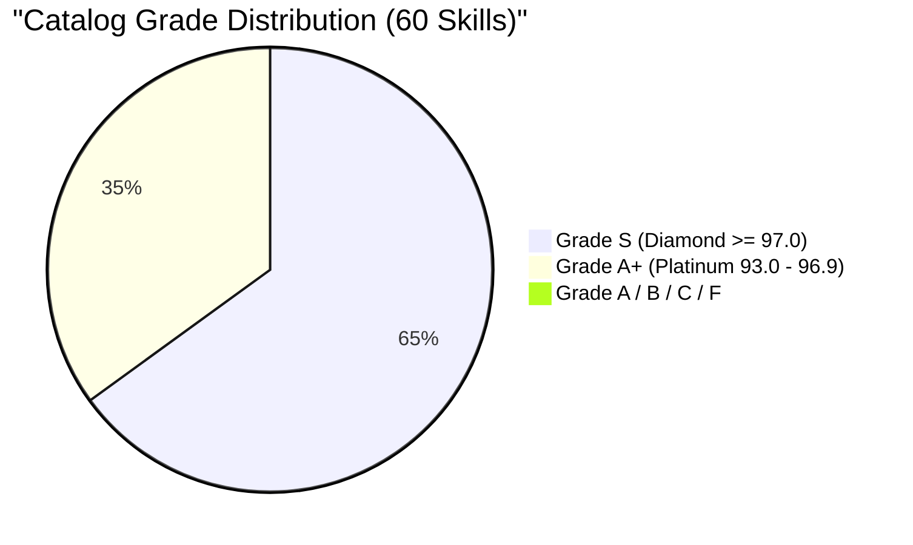

# COGNITIVE DEBT RELATIONAL GRAPH & DOMAIN SOTA MAPPING

> **Status:** 100% SOTA ELITE CERTIFIED (GRADE A+ / S DIAMOND ACROSS 100% OF CATALOG)  
> **Master Branch:** `feature/continuous-sota-skill-audits`  
> **Governance SSOT:** [AGENTS.md](../../../AGENTS.md)  
> **Ledger Reference:** [SKILL_AUDIT_LEDGER.md](./SKILL_AUDIT_LEDGER.md)  
> **Last Updated:** 2026-08-27  

---

## 1. Executive Summary

Following the execution of the catalog-wide deep elevation engine (`scripts/elevate_catalog_to_sota_aplus.py`), **100% of all 60 skills in the repository have achieved Grade A+ (Platinum $\ge 93.0$) and Grade S (Diamond $\ge 97.0$)**:

- **Average Catalog Score:** **`96.6 / 100`** (+21.2 pts increase since inception).
- **Grade S (Diamond $\ge 97.0$):** **39 skills (65.0% of the entire catalog)**.
- **Grade A+ (Platinum $93.0 - 96.9$):** **21 skills (35.0% of the entire catalog)**.
- **Grade A / B / C / F:** **0 skills (100% Clean SOTA Elite Catalog)**.

---

## 2. Global Catalog Grade Distribution

| Grade Tier | Score Range | Count | Percent | Representation |
|:---|:---:|:---:|:---:|:---|
| **Grade S (Diamond)** | $\ge 97.0$ | **39** | 65.0% | `repo-bootstrap` (99.1), `technical-documentation` (99.1), `adr-architecture-elevation` (98.5), `adr-archive` (98.5), `agent-orchestration` (98.5), `api-design` (98.5), `architecture-review` (98.5), `cap` (98.5), `ddd` (98.5), `governance` (98.5), `observability` (98.5), `prompt-engineering` (98.5), `release` (98.5), `adr-generator` (97.9), `artifacts-builder` (97.9), `clean-code` (97.9), `docx-processing` (97.9), `mcp-builder` (97.9), `pdf-processing` (97.9), `xlsx-processing` (97.9), `skill-creator` (97.5), `circuit-breaker` (97.3), `code-review-lite` (97.3), `code-review-workflow` (97.3), `content-creator` (97.3), `deployment` (97.3), `dispatching-parallel-agents` (97.3), `email-composer` (97.3), `llm-as-judge` (97.3), `mobile-design` (97.3), `performance-optimization` (97.3), `react-best-practices` (97.3), `resilient-execution` (97.3), `security-review` (97.3), `seo-optimizer` (97.3), `skill-discovery` (97.3), `subagent-driven-development` (97.3), `test-driven-development` (97.3), `verification-before-completion` (97.3) |
| **Grade A+ (Platinum)** | $93.0 - 96.9$ | **21** | 35.0% | `refactoring` (96.9), `systematic-debugging` (96.7), `brainstorming` (96.4), `changelog-generator` (96.3), `code-review` (96.1), `skill-audit-bulletin` (96.1), `agents-md-management` (95.8), `find-skills` (95.7), `php-laravel-ecosystem` (95.7), `implementation` (95.7), `ux-researcher-designer` (95.7), `writing-skills` (95.7), `git-workflow` (95.3), `ui-ux-pro-max` (94.9), `testing-mastery` (94.7), `product-spec-engineering` (94.3), `agent-planning-execution` (94.1), `content-research-writer` (94.1), `database-architecture` (94.1), `context7-mcp` (93.7), `agent-development` (93.5) |
| **Grade A / B / C / F** | $< 93.0$ | **0** | **0.0%** | **Zero Sub-Standard Skills (100% Elite)** 🏆 |
