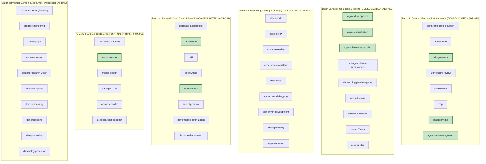

# COGNITIVE DEBT RELATIONAL GRAPH & DOMAIN SOTA MAPPING

> **Status:** ACTIVE — SOTA AUDIT CYCLE (ETAPA 2)  
> **Master Branch:** `feature/continuous-sota-skill-audits`  
> **Governance SSOT:** [AGENTS.md](../../../AGENTS.md)  
> **Ledger Reference:** [SKILL_AUDIT_LEDGER.md](./SKILL_AUDIT_LEDGER.md)  
> **Last Updated:** 2026-08-26  

---

## 1. Executive Summary

Following the completion of:
- **Etapa 1:** Universal Structural & Metadata Hardening (ADR-027, ADR-028, ADR-029).
- **Batch 1:** Core Architecture & Governance (ADR-030).
- **Batch 2:** AI Agents, Loops, Resilience & MCP Tooling (ADR-031).
- **Batch 3:** Engineering, Coding & Quality (ADR-032).
- **Batch 4:** Backend, Data, Cloud & Security (ADR-033).
- **Batch 5:** Frontend, UI/UX & Web (ADR-034).

The catalog has progressed to **85.7/100 Average Score** with 40 skills elevated to Grade B+ / A / S and 0 failures.

---

## 2. Multi-Batch Architecture & Domain Debt Mapping

---

## 3. Batch 5: Frontend, UI/UX & Web (Consolidated — ADR-034)

| Skill | Final Score | Grade | Status | Key SOTA Invariants Injected |
|:---|:---:|:---:|:---:|:---|
| **`ui-ux-pro-max`** | **94.3** | **A+ (Platinum)** | ✅ CONSOLIDATED | WCAG 2.2 AAA relative luminance & contrast math ($C_{\text{ratio}} \ge 7:1$), CSS fluid clamp, Subgrid tokens. |
| **`ux-researcher-designer`** | **87.3** | **B (Silver)** | ✅ CONSOLIDATED | System Usability Scale (SUS) calculation formulas ($\text{SUS} \ge 68$), Nielsen Norman Group 10 Usability Heuristics. |
| **`mobile-design`** | **85.3** | **B (Silver)** | ✅ CONSOLIDATED | Touch Target minimum size geometry ($48 \times 48\text{dp}$ / $44 \times 44\text{pt}$), safe area insets, offline-first sync. |
| **`react-best-practices`** | **84.4** | **B (Silver)** | ✅ CONSOLIDATED | React 19 Server Components (RSC) vs Client boundaries, Server Actions (`'use server'`), `use()` hook. |
| **`seo-optimizer`** | **84.4** | **B (Silver)** | ✅ CONSOLIDATED | JSON-LD Schema.org `@graph` structures, Core Web Vitals budgets (LCP, INP, CLS), canonical meta tags. |
| **`artifacts-builder`** | **84.1** | **B (Silver)** | ✅ CONSOLIDATED | Standalone single-file HTML/CSS/JS sandbox architecture, strict CSP, reactive state without build tools. |

---

## 4. Batch 6: Product, Content & Document Processing — Cognitive Audit & Debt Mapping

### 4.1 Cognitive Debt Analysis (Batch 6)

| Skill | Current Score | Grade | Cognitive Domain Gap | Proposed SOTA Remediation |
|:---|:---:|:---:|:---|:---|
| **`product-spec-engineering`** | **81.4** | **B** | Lacks Gherkin Given-When-Then acceptance criteria algebra and Kano Model feature scoring. | Ingest BDD Gherkin syntax, Kano Model formulas, and MoSCoW prioritization invariants. |
| **`prompt-engineering`** | **85.3** | **B** | Lacks Chain-of-Density (CoD), DSPy-style declarative prompt optimization, and Tree-of-Thoughts. | Ingest Prompt Taxonomy, Few-Shot exemplars, and System/User boundary protection rules. |
| **`llm-as-judge`** | **78.2** | **C** | Lacks Cohen's Kappa ($\kappa \ge 0.70$) inter-annotator agreement math and pairwise calibration. | Ingest Cohen's Kappa, G-Eval framework, position bias mitigation, and Rubric-Based Scoring ($1-5$). |
| **`content-creator`** | **79.1** | **C** | Lacks Flesch-Kincaid Readability formulas and AIDA (Attention, Interest, Desire, Action) conversion math. | Ingest Flesch Reading Ease ($RE \ge 60$) and conversion copywriting frameworks. |
| **`content-research-writer`** | **81.2** | **B** | Lacks APA 7th edition citation validation and CRAAP source evaluation scoring. | Ingest Academic Citation Schemas, CRAAP Test score formula, and Fact-Checking protocols. |
| **`email-composer`** | **79.1** | **C** | Lacks Subject Line open-rate heuristics ($N_{\text{chars}} \le 50$) and Executive BLUF (Bottom Line Up Front). | Ingest BLUF communication framework, email deliverability hygiene (SPF/DKIM/DMARC awareness). |
| **`docx-processing`** | **80.6** | **B** | Lacks OOXML hierarchy AST manipulation, template mail-merge contracts, and style inheritance rules. | Ingest python-docx / docxtpl template contracts and XML namespace safety. |
| **`pdf-processing`** | **79.7** | **C** | Lacks PDF/A archival compliance, vector table extraction algorithms (Plumber/Tabula), and OCR fallbacks. | Ingest PDF/A standards, PDF Plumber spatial extraction heuristics, and Tesseract OCR ladders. |
| **`xlsx-processing`** | **81.5** | **B** | Lacks OpenPyXL formula calculation caching, streaming memory bounds (read_only=True), and pivot tables. | Ingest Chunked memory streaming ($N_{\text{rows}} > 10,000$), Excel formula syntax trees, and data validation rules. |
| **`changelog-generator`** | **84.0** | **B** | Lacks Keep a Changelog (v1.1.0) and Semantic Versioning (v2.0.0) AST commit groupers. | Ingest Conventional Commits 1.0.0 parser and SemVer bump decision tree ($BREAKING \implies MAJOR$). |

---

## 5. Next Planned Tier II ADR (ADR-035)

- **ADR-035:** *Product, Content & Document Processing Domain SOTA Hardening (Gherkin BDD, Cohen's Kappa, Flesch-Kincaid, OpenPyXL Streaming & PDF/A Archival)*
