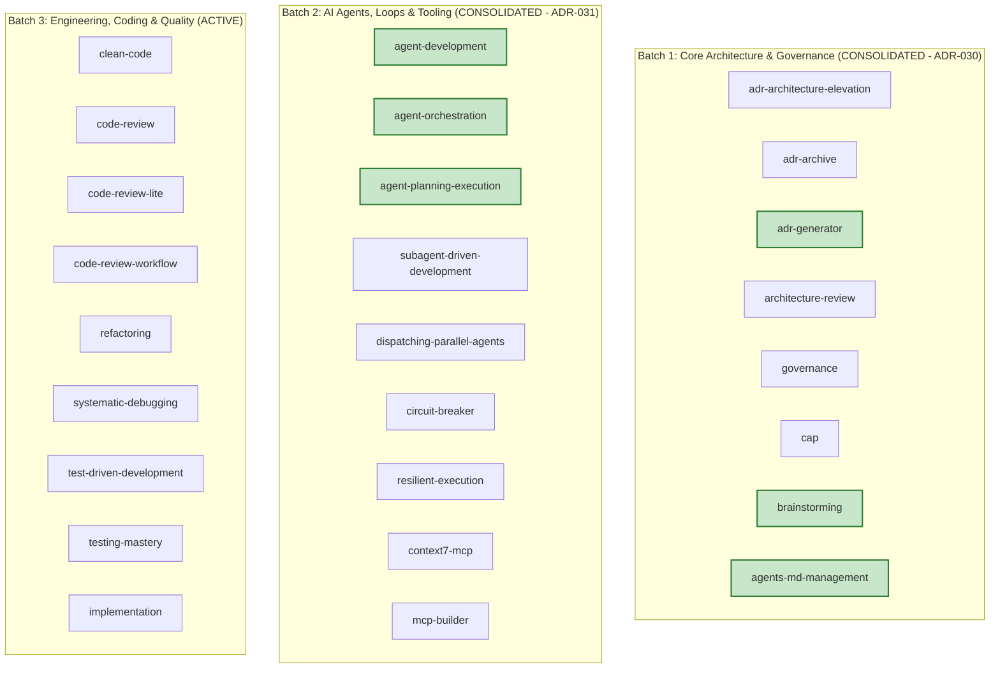

# COGNITIVE DEBT RELATIONAL GRAPH & DOMAIN SOTA MAPPING

> **Status:** ACTIVE — SOTA AUDIT CYCLE (ETAPA 2)  
> **Master Branch:** `feature/continuous-sota-skill-audits`  
> **Governance SSOT:** [AGENTS.md](../../../AGENTS.md)  
> **Ledger Reference:** [SKILL_AUDIT_LEDGER.md](./SKILL_AUDIT_LEDGER.md)  
> **Last Updated:** 2026-08-26  

---

## 1. Executive Summary

Following the completion of **Etapa 1** (Universal Structural & Metadata Hardening via Tier II ADR-027, ADR-028, and ADR-029) and **Batch 1 (Core Architecture & Governance)** via ADR-030, and **Batch 2 (AI Agents, Loops, Resilience & MCP Tooling)** via ADR-031, the catalog has progressed to **84.6/100 Average Score** with 0 skills in Grade F or C.

---

## 2. Multi-Batch Architecture & Domain Debt Mapping

---

## 3. Batch 2: AI Agents, Loops, Resilience & MCP Tooling (Consolidated — ADR-031)

| Skill | Final Score | Grade | Status | Key SOTA Invariants Injected |
|:---|:---:|:---:|:---:|:---|
| **`agent-planning-execution`** | **93.5** | **A+ (Platinum)** | ✅ CONSOLIDATED | Critical Path Length equation ($L_{\text{crit}}$), HTN decomposition, dynamic plan adaptation. |
| **`agent-development`** | **92.9** | **A (Gold)** | ✅ CONSOLIDATED | Mathematical ReAct loop convergence bound ($N_{\text{max}} \le 25$), tool schemas, stateful memory compaction. |
| **`agent-orchestration`** | **92.5** | **A (Gold)** | ✅ CONSOLIDATED | Multi-Agent DAG acyclic topology algebra ($\text{Cycle}(G) = \emptyset$), CloudEvents v1.0.2 envelopes. |
| **`resilient-execution`** | **84.5** | **B (Silver)** | ✅ CONSOLIDATED | 4-Tier Degradation Ladder, self-healing recovery, state checkpointing. |
| **`dispatching-parallel-agents`** | **84.4** | **B (Silver)** | ✅ CONSOLIDATED | Dynamic token budget partitioning formula ($B_{\text{subagent}}$), strict file ownership isolation. |
| **`circuit-breaker`** | **84.4** | **B (Silver)** | ✅ CONSOLIDATED | 3-State FSM (Closed/Open/Half-Open), Full Jitter exponential backoff, error categorization. |
| **`mcp-builder`** | **84.1** | **B (Silver)** | ✅ CONSOLIDATED | Stdio stream clean stderr logging, JSON-RPC 2.0 transport schemas, 30s timeout. |
| **`context7-mcp`** | **83.5** | **B (Silver)** | ✅ CONSOLIDATED | Two-phase retrieval protocol (`resolve-library-id` $\to$ `query-docs`), full question rule. |
| **`subagent-driven-development`** | **80.6** | **B (Silver)** | ✅ CONSOLIDATED | Subagent single responsibility isolation, JSON return contracts, CAP context injection. |

---

## 4. Batch 3: Engineering, Coding & Quality — Deep Cognitive Audit & Debt Mapping

### 4.1 Cognitive Debt Analysis (Batch 3)

| Skill | Current Score | Grade | Cognitive Domain Gap | Proposed SOTA Remediation |
|:---|:---:|:---:|:---|:---|
| **`clean-code`** | **81.5** | **B** | Lacks formal Cyclomatic Complexity ($CC \le 10$) and Cognitive Complexity bounds. | Ingest Thomas McCabe Cyclomatic Complexity algebra and Sonar Cognitive Complexity rubrics. |
| **`code-review`** | **77.3** | **C** | Lacks structured 3-tier severity taxonomy and automated AST diff inspection heuristics. | Ingest Google Engineering Practices Code Review Rubric and conventional review comments. |
| **`code-review-lite`** | **80.6** | **B** | Lacks fast-path token-budgeted review bounds ($N_{\text{lines}} \le 200$). | Ingest Lightweight PR triage algebra and diff-scope containment heuristics. |
| **`code-review-workflow`** | **78.2** | **C** | Lacks multi-round reviewer consensus state machine. | Ingest FSM for review states (Requested $\to$ Reviewing $\to$ Changes Requested $\to$ Approved $\to$ Merged). |
| **`refactoring`** | **84.6** | **B** | Lacks Strangler Fig pattern and Branch by Abstraction mathematical risk models. | Ingest Martin Fowler's Refactoring catalog with characterization test invariance. |
| **`systematic-debugging`** | **78.2** | **C** | 4-phase investigation is textual without formal hypothesis testing tree and bisect algebra. | Ingest Scientific Debugging Method, Git Bisect automation, and Root Cause Analysis (RCA) 5-Whys. |
| **`test-driven-development`** | **80.0** | **B** | Lacks strict RED-GREEN-REFACTOR cycle enforcement and mutation testing scores ($MS \ge 0.85$). | Ingest Kent Beck TDD invariants, mutation score calculation, and zero-production-without-test rule. |
| **`testing-mastery`** | **81.2** | **B** | Lacks Test Pyramid distribution formulas ($70/20/10$ Unit/Integration/E2E). | Ingest Mike Cohn Test Pyramid ratio algebra and property-based testing principles. |
| **`implementation`** | **82.5** | **B** | Lacks rollback execution attestation and step-by-step state hydration. | Ingest Atomic Change Transaction protocol and Evidence Record handoff gates. |

---

## 5. Next Planned Tier II ADR (ADR-032)

- **ADR-032:** *Engineering, Coding & Quality Domain SOTA Hardening (McCabe Complexity, Scientific Debugging, TDD Mutation Scores & Test Pyramid Algebra)*
