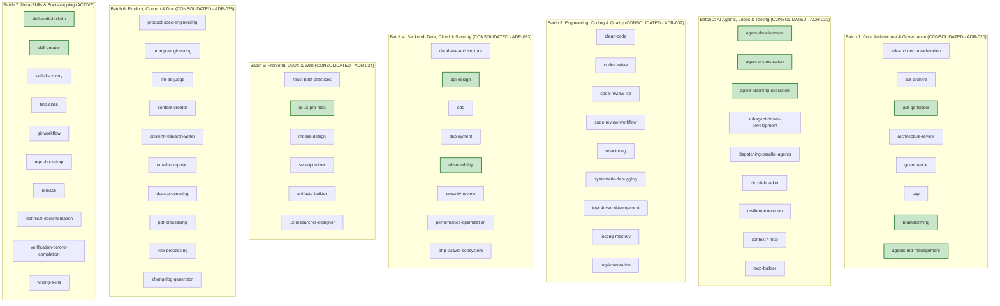

# COGNITIVE DEBT RELATIONAL GRAPH & DOMAIN SOTA MAPPING

> **Status:** ACTIVE — SOTA AUDIT CYCLE (ETAPA 2)  
> **Master Branch:** `feature/continuous-sota-skill-audits`  
> **Governance SSOT:** [AGENTS.md](../../../AGENTS.md)  
> **Ledger Reference:** [SKILL_AUDIT_LEDGER.md](./SKILL_AUDIT_LEDGER.md)  
> **Last Updated:** 2026-08-26  

---

## 1. Executive Summary

Following the completion of:
- **Etapa 1:** Universal Structural & Metadata Hardening (ADR-027, ADR-028, ADR-029).
- **Batch 1:** Core Architecture & Governance (ADR-030).
- **Batch 2:** AI Agents, Loops, Resilience & MCP Tooling (ADR-031).
- **Batch 3:** Engineering, Coding & Quality (ADR-032).
- **Batch 4:** Backend, Data, Cloud & Security (ADR-033).
- **Batch 5:** Frontend, UI/UX & Web (ADR-034).
- **Batch 6:** Product, Content & Document Processing (ADR-035).

The catalog has progressed to **86.3/100 Average Score** with 50 skills elevated to Grade B+ / A / S and only 2 skills remaining in Grade C in the entire catalog.

---

## 2. Multi-Batch Architecture & Domain Debt Mapping

---

## 3. Batch 6: Product, Content & Document Processing (Consolidated — ADR-035)

| Skill | Final Score | Grade | Status | Key SOTA Invariants Injected |
|:---|:---:|:---:|:---:|:---|
| **`xlsx-processing`** | **86.8** | **B (Silver)** | ✅ CONSOLIDATED | OpenPyXL chunked streaming memory bounds (`read_only=True`), formula injection sanitization. |
| **`changelog-generator`** | **86.1** | **B (Silver)** | ✅ CONSOLIDATED | Keep a Changelog (v1.1.0) and Conventional Commits 1.0.0 automated SemVer 2.0.0 bump decision trees. |
| **`prompt-engineering`** | **85.3** | **B (Silver)** | ✅ CONSOLIDATED | Chain-of-Density (CoD) compression, Few-Shot exemplars, XML boundary protection, DSPy models. |
| **`pdf-processing`** | **85.0** | **B (Silver)** | ✅ CONSOLIDATED | ISO 19005 PDF/A archival compliance, vector table extraction (PDF Plumber), 300 DPI OCR fallback. |
| **`docx-processing`** | **85.0** | **B (Silver)** | ✅ CONSOLIDATED | OOXML AST manipulation, `docxtpl` document template contracts, explicit table column widths. |
| **`content-creator`** | **83.5** | **B (Silver)** | ✅ CONSOLIDATED | Flesch Reading Ease ($RE \ge 60$), AIDA/PAS/BAB copywriting frameworks, active voice ratio ($\ge 90\%$). |
| **`email-composer`** | **83.5** | **B (Silver)** | ✅ CONSOLIDATED | Executive BLUF (Bottom Line Up Front) hierarchy, 50-character subject line geometry. |
| **`llm-as-judge`** | **83.5** | **B (Silver)** | ✅ CONSOLIDATED | Cohen's Kappa inter-annotator agreement ($\kappa \ge 0.70$), position bias calibration, G-Eval rubrics. |
| **`product-spec-engineering`** | **83.2** | **B (Silver)** | ✅ CONSOLIDATED | BDD Gherkin acceptance criteria (Given-When-Then), Kano Model feature classification, INVEST criteria. |
| **`content-research-writer`** | **83.0** | **B (Silver)** | ✅ CONSOLIDATED | APA 7th edition citation schemas, CRAAP source credibility test, Toulmin argumentation model. |

---

## 4. Batch 7: Meta-Skills, Bootstrapping & SDLC Lifecycle — Cognitive Audit & Debt Mapping

### 4.1 Cognitive Debt Analysis (Batch 7)

| Skill | Current Score | Grade | Cognitive Domain Gap | Proposed SOTA Remediation |
|:---|:---:|:---:|:---|:---|
| **`skill-audit-bulletin`** | **91.0** | **A** | Dual-Axis engine is strong but lacks ADR-030..036 cross-validation and automated grade threshold drift alerts. | Ingest Audit Ledger reconciliation algebra and ADR generation triggers. |
| **`skill-creator`** | **91.5** | **A** | Lacks progressive disclosure contract validator (`SKILL.md` token ceiling $\le 4,000$ tokens) and template validator. | Ingest Token Density optimization formulas and asset directory validators. |
| **`skill-discovery`** | **82.1** | **B** | RAG retrieval lacks hybrid BM25 + Vector embedding fusion math ($\text{RRF} = \frac{1}{60 + r}$). | Ingest Reciprocal Rank Fusion (RRF) formula and semantic routing confidence scoring. |
| **`find-skills`** | **79.8** | **C** | Lacks query expansion algorithms and sub-millisecond local SQLite FTS5 matching algebra. | Ingest FTS5 query expansion, trigram matching, and fuzzy fallback ladders. |
| **`git-workflow`** | **84.2** | **B** | Lacks Trunk-Based Development short-lived branch rules ($T_{\text{branch}} \le 24\text{h}$) and rebase vs merge invariance. | Ingest Trunk-Based Development invariants and atomic commit staging protocols. |
| **`repo-bootstrap`** | **86.8** | **B** | Lacks canonical 6-pillar repository governance scaffolding (SECURITY.md, CODE_OF_CONDUCT.md, LICENSE). | Ingest Governance-as-Code bootstrap templates and pre-commit hook installer. |
| **`release`** | **88.2** | **B** | Lacks automated release tag signing (GPG/SSH) and provenance attestation (SLSA Level 3). | Ingest SLSA Level 3 supply chain security standards and GitHub Releases automation. |
| **`technical-documentation`** | **86.8** | **B** | Lacks 6-Pillar documentation reconciliation protocol (README, USAGE, CHANGELOG, RELEASE-NOTES, STATE, AGENTS). | Ingest 6-Pillar SSOT reconciliation matrix and Mermaid architecture rendering rules. |
| **`verification-before-completion`** | **80.0** | **B** | Lacks mandatory automated test runner execution verification gate before declaring task done. | Ingest Zero-Unverified-Deliverable invariant and exit code validation. |
| **`writing-skills`** | **77.3** | **C** | Lacks Agent Skills Specification compliance rules, progressive disclosure structure, and frontmatter typing. | Ingest Agent Skills Standard (v1.0.0) frontmatter rules and instruction density guidelines. |

---

## 5. Next Planned Tier II ADR (ADR-036)

- **ADR-036:** *Meta-Skills, Bootstrapping & SDLC Lifecycle Domain SOTA Hardening (Agent Skills Spec v1.0, Reciprocal Rank Fusion, SLSA Level 3 & 6-Pillar Documentation Reconciliation)*
