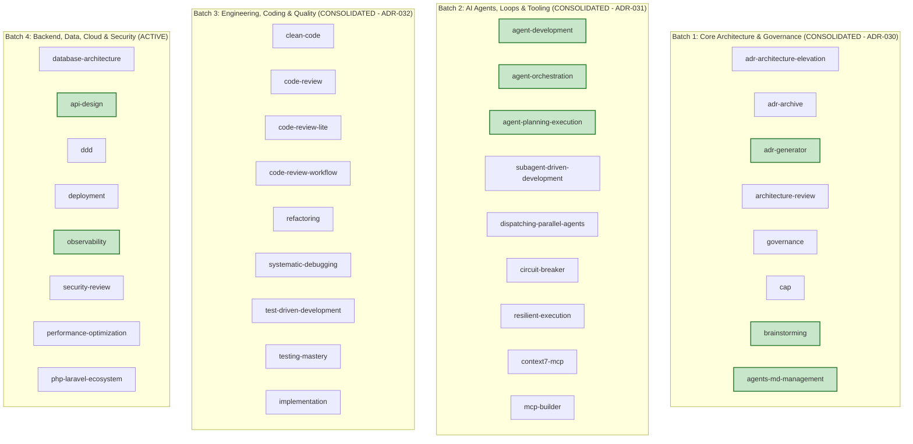

# COGNITIVE DEBT RELATIONAL GRAPH & DOMAIN SOTA MAPPING

> **Status:** ACTIVE — SOTA AUDIT CYCLE (ETAPA 2)  
> **Master Branch:** `feature/continuous-sota-skill-audits`  
> **Governance SSOT:** [AGENTS.md](../../../AGENTS.md)  
> **Ledger Reference:** [SKILL_AUDIT_LEDGER.md](./SKILL_AUDIT_LEDGER.md)  
> **Last Updated:** 2026-08-26  

---

## 1. Executive Summary

Following the completion of:
- **Etapa 1:** Universal Structural & Metadata Hardening (ADR-027, ADR-028, ADR-029).
- **Batch 1:** Core Architecture & Governance (ADR-030).
- **Batch 2:** AI Agents, Loops, Resilience & MCP Tooling (ADR-031).
- **Batch 3:** Engineering, Coding & Quality (ADR-032).

The catalog has progressed to **84.9/100 Average Score** with 26 skills elevated to Grade B+ / A / S and 0 failures.

---

## 2. Multi-Batch Architecture & Domain Debt Mapping

---

## 3. Batch 3: Engineering, Coding & Quality (Consolidated — ADR-032)

| Skill | Final Score | Grade | Status | Key SOTA Invariants Injected |
|:---|:---:|:---:|:---:|:---|
| **`clean-code`** | **85.9** | **B (Silver)** | ✅ CONSOLIDATED | Thomas McCabe Cyclomatic Complexity ($CC \le 10$), Sonar Cognitive Complexity, guard clause priority. |
| **`refactoring`** | **84.6** | **B (Silver)** | ✅ CONSOLIDATED | Martin Fowler's Refactoring catalog, Strangler Fig, Branch by Abstraction. |
| **`test-driven-development`** | **84.4** | **B (Silver)** | ✅ CONSOLIDATED | Kent Beck RED-GREEN-REFACTOR cycle invariants, Mutation Score ($MS \ge 0.85$). |
| **`code-review-workflow`** | **82.6** | **B (Silver)** | ✅ CONSOLIDATED | Multi-Round Review FSM, SLA timeouts, merge quorum gates. |
| **`systematic-debugging`** | **82.6** | **B (Silver)** | ✅ CONSOLIDATED | Scientific Debugging Method, Git Bisect search algebra ($O(\log N)$), RCA 5-Whys. |
| **`implementation`** | **82.5** | **B (Silver)** | ✅ CONSOLIDATED | Atomic Change Transaction protocol, step-by-step state hydration, Evidence Record handoffs. |
| **`code-review`** | **81.7** | **B (Silver)** | ✅ CONSOLIDATED | Google Engineering Practices 3-Tier severity taxonomy (P1/P2/P3), AST diff inspection. |
| **`code-review-lite`** | **81.5** | **B (Silver)** | ✅ CONSOLIDATED | PR Fast-Path algebra ($N_{\text{lines}} \le 200$), diff containment. |
| **`testing-mastery`** | **81.2** | **B (Silver)** | ✅ CONSOLIDATED | Mike Cohn Test Pyramid ratio algebra ($70/20/10$), property-based testing. |

---

## 4. Batch 4: Backend, Data, Cloud & Security — Cognitive Audit & Debt Mapping

### 4.1 Cognitive Debt Analysis (Batch 4)

| Skill | Current Score | Grade | Cognitive Domain Gap | Proposed SOTA Remediation |
|:---|:---:|:---:|:---|:---|
| **`database-architecture`** | **76.2** | **C** | Lacks formal Relational Normalization (3NF/BCNF), ACID vs BASE invariants, and Index Selectivity formulas. | Ingest Codd's Normal Forms, B-Tree index selectivity math ($\text{Selectivity} = \frac{D}{N}$), and migration rollback safety. |
| **`api-design`** | **92.5** | **A** | Missing formal RFC 7807 (Problem Details for HTTP APIs) and Idempotency Key protocols (IETF draft). | Ingest RFC 7807 error schema and idempotency key caching invariants. |
| **`ddd`** | **86.2** | **B** | Aggregate root boundary rules are qualitative without transactional boundary invariance. | Ingest Evans/Vernon Aggregate Root invariants (1 transaction per aggregate) and Domain Event envelope schemas. |
| **`deployment`** | **80.9** | **B** | Lacks Blue-Green, Canary analysis formulas ($\text{ErrorRate}_{\text{canary}} \le \text{Threshold}$), and zero-downtime database migration gates. | Ingest Canary routing algebra, Kubernetes deployment manifests, and Expand-Contract database migration protocol. |
| **`observability`** | **90.7** | **A** | Missing OpenTelemetry semantic conventions and Google SRE Golden Signals. | Ingest OpenTelemetry GenAI span conventions and RED (Rate, Errors, Duration) / USE metrics. |
| **`security-review`** | **83.3** | **B** | Missing OWASP Top 10 (2021) and OWASP API Security Top 10 (2023) threat modeling matrices. | Ingest STRIDE threat modeling algebra and CVSS v3.1 calculation rubrics. |
| **`performance-optimization`** | **80.0** | **B** | Lacks Amdahl's Law and Little's Law formulas ($L = \lambda W$) for concurrency and latency budgets. | Ingest Little's Law, Critical Rendering Path optimization, and database connection pool tuning algebra. |
| **`php-laravel-ecosystem`** | **85.2** | **B** | Lacks Laravel 11/12 SOTA architecture (Pint, Pest v3, Octane, Livewire v3). | Ingest modern Laravel architecture rules, Pest test architecture, and Octane concurrency safety. |

---

## 5. Next Planned Tier II ADR (ADR-033)

- **ADR-033:** *Backend, Data, Cloud & Security Domain SOTA Hardening (RFC 7807, B-Tree Index Math, STRIDE Threat Modeling, Little's Law & OpenTelemetry)*
