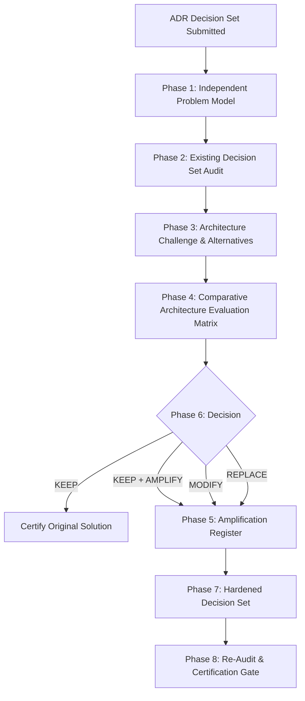

# ADR Architecture Elevation — Independent Architecture Challenger (SOTA Edition)

## Purpose

Transform an ADR Decision Set from "functional" to "industrial-grade" through an 8-phase independent architecture challenge process. This skill does not merely validate — it reconstructs, challenges, explores alternatives, compares, amplifies, reconciles, and re-audits to certify the solution is the best reasonable approach given constraints.

---

## When to Use

### Use when:
- An agent has produced an ADR Decision Set (ADR + Blueprint + Plan + TODO) and you need independent architectural challenge
- The stakes are high enough to justify a second architectural intelligence (production systems, core infrastructure, irreversible decisions)
- You suspect the solution may be locally correct but globally suboptimal
- You need to prove whether a materially better alternative exists before committing to implementation
- You want to elevate a "working" architecture to "SOTA execution-grade" through systematic amplification

### Do not use when:
- Creating initial ADR scaffolding from scratch (use `adr-generator`)
- Simple code style or linting checks (use `clean-code` or `code-review-lite`)
- Archiving already completed and executed ADRs (use `adr-archive`)

---

## Decision Tree



---

## The 8-Phase Pipeline

### Phase 1 — Independent Problem Model (Reconstruction)

**Mandatory first step.** Do not read the existing ADR as truth. Extract and build your own problem representation:

```text
Problem Statement
Goals (primary, secondary, tertiary)
Constraints (hard, soft, regulatory, budget, timeline)
Invariants (must always hold)
Non-goals (explicitly out of scope)
Actors (human, system, external)
Inputs (data, events, triggers)
Outputs (deliverables, side effects, state changes)
State (persistent, ephemeral, distributed)
Dependencies (upstream, downstream, lateral)
Failure Conditions (what constitutes failure)
Operational Requirements (SLOs, SLAs, observability, recovery)
```

Output: `Phase1_Independent_Problem_Model.md`

### Phase 2 — Existing Decision Set Audit

Compare the existing Decision Set against your independent problem model:

```text
For each artifact (ADR, BP, PI, TODO):
  - Correctness: Does it solve the stated problem?
  - Completeness: Are all problem dimensions addressed?
  - Coherence: Do artifacts agree with each other?
  - Implementability: Can this be built as specified?
  - Robustness: Does it handle failure conditions?
  - Traceability: Can every decision trace to a goal/constraint?
```

Output: `Phase2_Audit_Report.md` with findings categorized as CRITICAL / MAJOR / MINOR / OBSERVATION

### Phase 3 — Architecture Challenge (Adversarial Review)

Assume the existing architecture may be locally correct but globally suboptimal. Actively search for:

**A. Architectural Alternatives** (at least 2, max 5):
- Does an approach exist that reduces complexity/coupling/cost?
- Does an approach exist that improves reliability/testability/extensibility?
- Does an approach exist that eliminates a dependency or failure surface?
- Is the current approach over-engineered for the actual problem?

**B. Implementation Alternatives** (same architecture, better execution):
- Substantially better patterns, libraries, or techniques?

**C. Generalization Opportunities**:
- Is the design excessively specific? Can it solve a broader class?

**D. Simplification Opportunities**:
- Can the problem be solved more simply without loss of capability?

**E. Anticipation Opportunities**:
- Predictable future needs that should inform current boundaries?

**Constraint**: Alternatives must earn their complexity. Use the Comparative Evaluation Matrix (Phase 4).

Output: `Phase3_Architecture_Challenge.md` documenting each alternative with rationale.

### Phase 4 — Comparative Architecture Evaluation

Evaluate Original (A) vs Alternatives (B, C...) against the matrix:

| Criterion | Current (A) | Alt B | Alt C | Winner |
|---|:---:|:---:|:---:|:---:|
| Correctness | | | | |
| Complexity (code/ops) | | | | |
| Robustness | | | | |
| Testability | | | | |
| Operability | | | | |
| Performance | | | | |
| Security | | | | |
| Maintainability | | | | |
| Cost (build/run) | | | | |
| Reversibility | | | | |
| Operational Complexity | | | | |

**Rule**: Do not recommend an alternative merely because it is different. The alternative must demonstrate material gain on multiple criteria without unjustified complexity.

Output: `Phase4_Comparative_Evaluation.md` with scored matrix and recommendation.

### Phase 5 — Amplification Register

Amplification ≠ Expansion. Amplification means increasing architectural quality, robustness, capability, or future leverage **without unjustified complexity or scope expansion**.

Seek five amplification types:

1. **Completeness Amplification**: Add necessary requirements not explicitly stated; close gaps between problem model and solution.
2. **Robustness Amplification**: Add protection against failures, concurrency, corruption, intermediate states, retries, restarts, stampedes, cascading failures.
3. **Capability Amplification**: Discover capabilities that significantly improve outcome without altering core.
4. **Architectural Amplification**: Improve boundaries, abstractions, contracts, decoupling, extensibility.
5. **Operational Amplification**: Add observability, diagnostics, rollout/rollback, metrics, health checks, recovery procedures.
6. **Opportunity Discovery**: Classify collateral capabilities as NOW / LATER / DO NOT DO.

Output: `Phase5_Amplification_Register.md` with specific, actionable amplifications.

### Phase 6 — Decision

One of:
- **KEEP** — No material improvement demonstrated.
- **KEEP + AMPLIFY** — Original stands, apply amplifications.
- **MODIFY** — Original architecture, significant changes from amplification.
- **REPLACE** — Alternative architecture demonstrably superior.

Output: `Phase6_Decision.md` with justification.

### Phase 7 — Hardened Decision Set

Produce the final, amplified artifacts:
- `ADR-HARDENED.md` — Updated ADR with all amplifications integrated
- `BP-HARDENED.md` — Updated Blueprint with implementation-grade detail
- `PI-HARDENED.md` — Updated Plan with amplification tasks
- `TODO-HARDENED.md` — Updated TODO with execution-ready items

### Phase 8 — Re-Audit

Audit your own hardened decision set against the independent problem model (Phase 1). Verify:
- All amplifications are integrated and consistent
- No new gaps introduced
- Complexity remains justified
- Traceability maintained end-to-end

Output: `Phase8_Reaudit_Report.md` — Certification or required fixes.

---

## Anti-Patterns & Pitfalls

| Severity | Anti-Pattern | Description & Remediation |
|---|---|---|
| 🔴 **CRITICAL** | **Rubber-Stamping / Confirmation Bias** | Accepting the input ADR's assumptions without independent first-principles problem reconstruction. **Remedy**: Always complete Phase 1 before deep analysis. |
| 🔴 **CRITICAL** | **Scope Creep as Amplification** | Adding heavy infrastructure, microservices, or unwanted third-party dependencies disguised as "improvements". **Remedy**: Enforce that every amplification must earn its complexity in Phase 4. |
| 🟡 **ALARM** | **Novelty Bias** | Recommending an alternative simply because it uses newer or more fashionable technology without measurable trade-off gains. |
| 🟢 **GENTLE** | **Dismissing KEEP Outcomes** | Believing an evaluation is only valuable if it proposes massive rewrites. Certifying a truly sound architecture with minor hardening is an optimal result. |

---

## Checklists & Verification Gates

### Pre-Challenge Checklist
- [ ] ADR Decision Set (ADR, BP, PI, TODO) present and accessible
- [ ] Problem domain, constraints, and runtime environment identified
- [ ] Independent Problem Model (Phase 1) completed without reading ADR implementation details

### Post-Challenge Quality Gate
- [ ] At least 2 architectural alternatives rigorously compared in Phase 4 matrix
- [ ] Amplifications mapped to specific robustness, operational, or architectural gaps
- [ ] Final Decision Set (`ADR-HARDENED`, `BP-HARDENED`, `PI-HARDENED`, `TODO-HARDENED`) internally consistent
- [ ] Phase 8 Re-audit certified with zero CRITICAL findings

---

## Output Structure

```text
architecture-elevation-report/
├── Phase1_Independent_Problem_Model.md
├── Phase2_Audit_Report.md
├── Phase3_Architecture_Challenge.md
├── Phase4_Comparative_Evaluation.md
├── Phase5_Amplification_Register.md
├── Phase6_Decision.md
├── Phase7_Hardened_Decision_Set/
│   ├── ADR-HARDENED.md
│   ├── BP-HARDENED.md
│   ├── PI-HARDENED.md
│   └── TODO-HARDENED.md
├── Phase8_Reaudit_Report.md
└── EXECUTIVE_SUMMARY.md
```

---

## Reference Files & Scripts

- [`references/evaluation-criteria.md`](./references/evaluation-criteria.md) — Detailed rubrics for the Comparative Evaluation Matrix
- [`references/amplification-patterns.md`](./references/amplification-patterns.md) — Catalog of common amplification patterns by type
- [`references/anti-patterns.md`](./references/anti-patterns.md) — Common architectural anti-patterns to detect during challenge
- [`references/output-templates.md`](./references/output-templates.md) — Templates for each phase output document
- [`scripts/run_elevation.py`](./scripts/run_elevation.py) — Orchestrates the 8-phase pipeline and produces final package
- [`scripts/comparative_matrix.py`](./scripts/comparative_matrix.py) — Helper for Phase 4 matrix scoring and visualization
- [`scripts/reconstruct_problem.py`](./scripts/reconstruct_problem.py) — Guided problem reconstruction questionnaire