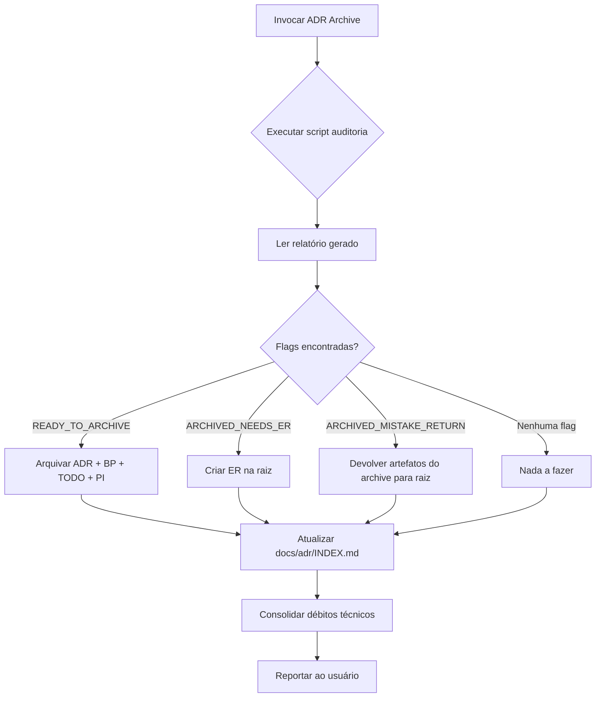

# ADR Archive (Janitor)

Audita todas as ADRs do repositório para manter a pasta de governança organizada. Funciona como um "garbage collector" para artefatos de execução.

## Quando Usar

### Use quando:
- Precisar arquivar ADRs implementadas
- Limpar artefatos de execução (BP, TODO, PI) da raiz
- Garantir que apenas ADRs ativas e ERs de ADRs finalizadas fiquem visíveis
- Executar reconciliação documental pré-release
- Automatizar governança de ADRs

### Não use quando:
- ADR ainda estiver em implementação
- Houver tarefas pendentes no TODO
- ER ainda não foi gerado
- Apenas leitura de status for necessária (use `./scripts/archive-adrs.sh --dry-run`)

### Skills relacionadas:
- `adr-generator` — criação de ADRs
- `implementation` — execução governada que gera ERs
- `documentation-reconciliation` — auditoria documental completa
- `governance` — processos de arquivamento obrigatório

---

## Decision Tree



---

## Workflow

### Fase 1: Auditoria Nativa (Zero Tokens)

1. Execute o script Python interno para mapear ADRs:
   ```bash
   python scripts/adr_archive_audit.py .
   ```

2. O script imprime flags no terminal e gera relatório em `docs/reports/adr-archive-report-*.md`

**Checkpoint:** [ ] Script executado [ ] Flags e relatório disponíveis

---

### Fase 2: Análise de Flags e Ação

| Flag | Significado | Ação Obrigatória |
|------|-------------|------------------|
| `READY_TO_ARCHIVE: ADR-XXX` | ADR + TODO concluídos, ER existe na raiz | `python scripts/adr_archive_audit.py . --archive ADR-XXX` |
| `ARCHIVED_NEEDS_ER: ADR-XXX` | ADR arquivada mas sem ER na raiz | Criar `docs/adr/ADR-XXX-ER.md` manualmente na raiz |
| `ARCHIVED_MISTAKE_RETURN: ADR-XXX` | ADR arquivada prematuramente (TODO incompleto) | `mv docs/adr/archive/ADR-XXX* docs/adr/` |

**Checkpoint:** [ ] Todas as flags processadas [ ] Ações executadas

---

### Fase 3: Consolidação de Débitos Técnicos

1. Ler relatório gerado (`docs/reports/adr-archive-report-*.md`)
2. Avaliar seção "Débitos Técnicos Consolidados"
3. Se débitos relevantes existirem → sugerir nova ADR de Refatoração e Débito Técnico

**Checkpoint:** [ ] Débitos avaliados [ ] Sugestão feita se aplicável

---

### Fase 4: Atualização de Índice

1. Executar `./scripts/archive-adrs.sh` (move arquivos, atualiza INDEX.md)
2. Verificar `docs/adr/INDEX.md` reflete estado atual

**Checkpoint:** [ ] INDEX.md sincronizado [ ] Arquivamento completo

---

## Conceitos Fundamentais

### Estratégia de Visibilidade

- **Raiz `docs/adr/`**: Apenas ADRs ativas (pendentes) + ERs de ADRs finalizadas
- **Archive `docs/adr/archive/`**: ADRs implementadas + BP + TODO + PI
- **ER (Execution Report)**: Certificado de implementação, sempre na raiz

### Ciclo de Vida da ADR

```
Criação (ADR+BP+TODO) → Implementação → ER gerado → Arquivamento (ADR+BP+TODO+PI → archive) → ER permanece na raiz
```

---

## Templates

### adr_archive_audit.py
Localização: `scripts/adr_archive_audit.py`

Script de auditoria nativa (Python, zero LLM tokens).

**Uso:**
```bash
# Auditoria completa com relatório
python scripts/adr_archive_audit.py .

# Arquivar ADR específica
python scripts/adr_archive_audit.py . --archive ADR-007

# Dry run
python scripts/adr_archive_audit.py . --dry-run
```

### archive_report.md
Localização: `templates/archive_report.md`

Template para relatório de auditoria gerado pelo script.

**Uso:**
```bash
cp templates/archive_report.md docs/reports/adr-archive-report-$(date +%Y%m%d).md
```

---

## Anti-patterns

### 🔴 Crítico

#### Arquivar ADR sem ER
**O que é:** Mover ADR para archive sem ter `ADR-XXX-ER.md` na raiz.
**Por que é ruim:** Perde o certificado de implementação, governança quebrada.
**Como evitar:** Sempre verificar flag `ARCHIVED_NEEDS_ER` antes de arquivar. ER é pré-requisito.

#### Arquivar ADR com TODO incompleto
**O que é:** Mover ADR para archive enquanto `ADR-XXX-TODO.md` tem tarefas `[ ]`.
**Por que é ruim:** ADR volta como "mistake return", polui histórico, confunde auditoria.
**Como evitar:** Script valida TODO 100% completo antes de permitir arquivamento.

#### Deletar ER da raiz
**O que é:** Remover `docs/adr/ADR-XXX-ER.md` achando que é lixo.
**Por que é ruim:** ER é o único registro visível de que a ADR foi implementada.
**Como evitar:** ERs NUNCA vão para archive. Regra imutável.

### 🟡 Médio

#### Não atualizar INDEX.md após arquivar
**O que é:** Executar arquivamento mas esquecer de mover entrada no INDEX.md.
**Por que é ruim:** Índice mostra ADR ativa que já foi arquivada.
**Como evitar:** `./scripts/archive-adrs.sh` atualiza INDEX.md automaticamente.

#### Ignorar débitos técnicos consolidados
**O que é:** Relatório mostra débitos mas não se cria ADR de refatoração.
**Por que é ruim:** Débitos acumulam, tornam-se ingerenciáveis.
**Como evitar:** Sempre avaliar seção "Débitos Técnicos" do relatório.

### 🟢 Baixo

#### Executar auditoria manual sem script
**O que é:** Ler ADRs uma a uma em vez de usar `adr_archive_audit.py`.
**Por que é ruim:** Gasta tokens, propenso a erro humano, não escala.
**Como evitar:** Sempre usar script nativo primeiro.

---

## Checklists

### Checklist Pré-Arquivamento
- [ ] `./scripts/archive-adrs.sh --dry-run` retorna ADRs para arquivar
- [ ] Cada ADR candidata tem `ER` correspondente na raiz `docs/adr/`
- [ ] Cada ADR candidata tem `TODO` 100% completo (`[x]` em todas tarefas)
- [ ] Nenhuma ADR ativa (status "Proposto" ou "Em Implementação") será arquivada

### Checklist Pós-Arquivamento
- [ ] `docs/adr/INDEX.md` atualizado (entradas movidas para "Archived ADRs")
- [ ] `docs/adr/archive/ADR-XXX.md` + BP + TODO + PI presentes
- [ ] `docs/adr/ADR-XXX-ER.md` permanece na raiz
- [ ] Relatório de auditoria salvo em `docs/reports/`

### Checklist de Débitos Técnicos
- [ ] Ler seção "Débitos Técnicos Consolidados" do relatório
- [ ] Classificar cada débito: Crítico / Médio / Baixo
- [ ] Se ≥1 Crítico ou ≥3 Médios → sugerir ADR de Refatoração
- [ ] Documentar decisão no relatório ou criar nova ADR

---

## Edge Cases

### ADR arquivada mas ER corrompido/ausente
**Situação:** `ARCHIVED_NEEDS_ER` flagged mas ER foi deletado acidentalmente.
**Solução:** Recriar ER a partir do `execution-report.md` no archive (se existir) ou gerar novo resumindo implementação.
**Exceção:** Se nem execution-report existe, documentar como "ER perdido - reconstruído".

### ADR com múltiplas implementações parciais
**Situação:** ADR implementada em múltiplos branches/PRs, TODO nunca 100% completo.
**Solução:** Não arquivar. Criar ADRs filhas para cada implementação parcial, manter ADR-mãe ativa até consolidação.
**Exceção:** Se implementação é contínua e intencional, documentar no TODO e manter ativa.

### ER criado mas ADR não arquivada por meses
**Situação:** ER existe na raiz, ADR+BP+TODO ainda na raiz (não arquivados).
**Solução:** Executar `./scripts/archive-adrs.sh` — script detecta `READY_TO_ARCHIVE` e arquiva automaticamente.
**Exceção:** Se equipe decide manter ADR visível por contexto, documentar exceção no ER.

### Conflito entre archive-adrs.sh e script Python
**Situação:** Dois mecanismos de arquivamento com lógica diferente.
**Solução:** `archive-adrs.sh` é wrapper que chama script Python. Usar apenas o script Python diretamente para controle fino.
**Exceção:** Para arquivamento em lote padrão, usar shell script.

---

## Referências

- `scripts/adr_archive_audit.py` — Auditoria nativa
- `scripts/archive-adrs.sh` — Arquivamento em lote + INDEX.md update
- `docs/adr/INDEX.md` — Índice de ADRs
- [ADR-011](./docs/adr/archive/ADR-011.md) — Documentation Reconciliation Skill