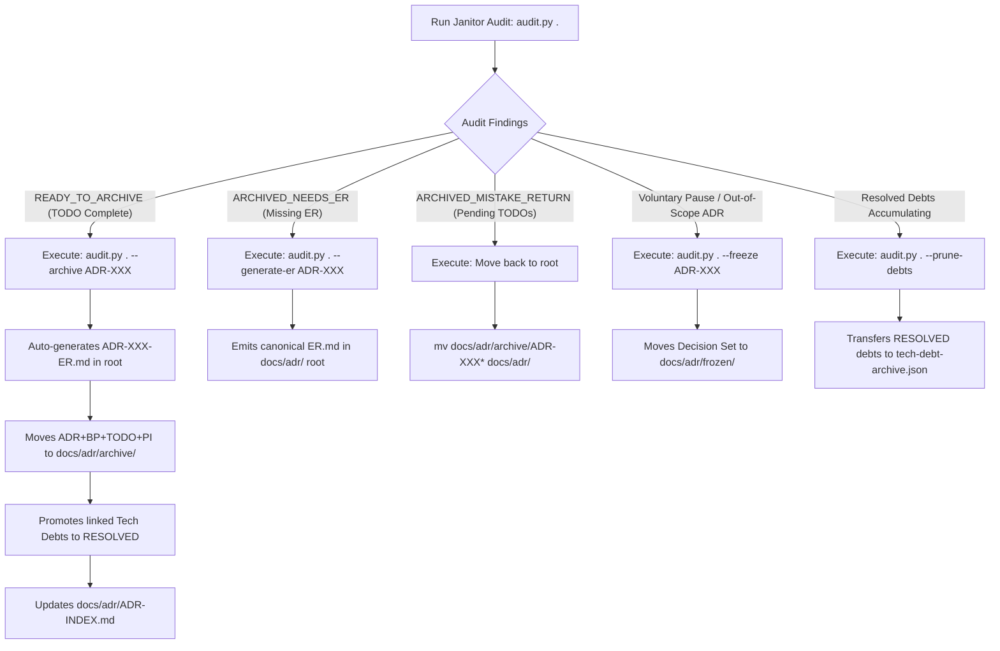

# ADR Archive (Janitor & Governance Gatekeeper)

Governs the completion, archival, and hygiene of Architecture Decision Records (ADRs), serving as the algorithmic gatekeeper for **Evidence Records (`*-ER.md`)** and the garbage collector for the **Tech Debt Registry** (`docs/governance/tech-debt-registry.json`).

The Janitor enforces root directory hygiene so agents and developers immediately perceive which architectures are **in progress** (visible ADRs in root) and which are **concluded** (visible `ER.md` certificates in root, with working artifacts archived).

---

## When to Use

### Use When:
- An ADR and its associated TODO/PI have been fully implemented (100% of checklist tasks checked).
- You need to generate the official, structured Evidence Record (`ADR-XXX-ER.md`) algorithmically.
- Auditing the repository's ADR governance state for anomalies (e.g. prematurely archived ADRs or missing ERs).
- Synchronizing the Tech Debt Registry (`tech-debt-registry.json`) to promote mitigated debts to `RESOLVED`.
- Running garbage collection on resolved/obsolete technical debts (`--prune-debts`) to minimize token overhead.
- Voluntarily freezing approved ADRs that are out of active scope (`--freeze`).
- Regenerating the consolidated `docs/adr/ADR-INDEX.md` table.

### Do Not Use When:
- The implementation of the ADR is still in progress (use `implementation` to continue executing tasks).
- Designing, creating, or planning new ADRs (use `adr-generator`).
- Reviewing software code quality or architectural patterns (use `architecture-review`).
- The project does not use ADR-based governance.

### Related Skills:
- `adr-generator` — creates the Decision Set (ADR, BP, TODO, PI) consumed by the Janitor.
- `implementation` — executes code changes and hands off completed TODOs to `audit.py`.
- `technical-documentation` — synchronizes repository documentation pillars with ADR decisions.
- `governance` — repository lifecycle policies and architectural standards.

---

## Decision Tree


```mermaid
graph TD
    A["Run Janitor Audit: audit.py ."] --> B{"Audit Findings"}
    
    B -->|"READY_TO_ARCHIVE (TODO Complete)"| C["Execute: audit.py . --archive ADR-XXX"]
    C --> C1["Auto-generates ADR-XXX-ER.md in root"]
    C1 --> C2["Moves ADR+BP+TODO+PI to docs/adr/archive/"]
    C2 --> C3["Promotes linked Tech Debts to RESOLVED"]
    C3 --> C4["Updates docs/adr/ADR-INDEX.md"]
    
    B -->|"ARCHIVED_NEEDS_ER (Missing ER)"| D["Execute: audit.py . --generate-er ADR-XXX"]
    D --> D1["Emits canonical ER.md in docs/adr/ root"]
    
    B -->|"ARCHIVED_MISTAKE_RETURN (Pending TODOs)"| E["Execute: Move back to root"]
    E --> E1["mv docs/adr/archive/ADR-XXX* docs/adr/"]
    
    B -->|"Voluntary Pause / Out-of-Scope ADR"| F["Execute: audit.py . --freeze ADR-XXX"]
    F --> F1["Moves Decision Set to docs/adr/frozen/"]
    
    B -->|"Resolved Debts Accumulating"| G["Execute: audit.py . --prune-debts"]
    G --> G1["Transfers RESOLVED debts to tech-debt-archive.json"]
```

---

## Archiving Strategy & Root Hygiene

To maintain minimal token consumption for AI agents and absolute visual clarity:

| Location | Contents | Purpose |
|---|---|---|
| **Root (`docs/adr/`)** | 1. **Active ADR Decision Sets:** `ADR-XXX.md`, `ADR-XXX-BP.md`, `ADR-XXX-TODO.md`, `ADR-XXX-PI.md`<br>2. **Evidence Records:** `ADR-XXX-ER.md` (all completed ADRs) | High visibility of active work and verifiable proof of completed decisions. |
| **Archive (`docs/adr/archive/`)** | Working artifacts of completed ADRs: `ADR-XXX.md`, `ADR-XXX-BP.md`, `ADR-XXX-TODO.md`, `ADR-XXX-PI.md` | Historical trail preserved without cluttering active agent context. |
| **Frozen (`docs/adr/frozen/`)** | Voluntarily paused/deferred ADRs (`implementation_status: FROZEN`) | Parked architectures excluded from active implementation loops. |

---

## Tech Debt Management Lifecycle

The Janitor automatically reconciles and cleans `docs/governance/tech-debt-registry.json`:

1. **Auto-Resolution:** When an ADR linked via `mitigation_ref` has its `ER.md` generated, `audit.py` automatically updates the debt's status to `RESOLVED` and records the resolution timestamp.
2. **Atomic Registration (`--register-debt`):** Allows agents during implementation to register out-of-scope discoveries without drive-by refactoring:
   ```bash
   python3 ~/.gemini/config/skills/adr-archive/scripts/audit.py . --register-debt --severity MEDIUM --domain <DOMAIN> --desc "<DESCRIPTION>" --origin "implementation:ADR-XXX"
   ```
3. **Garbage Collection of Tokens (`--prune-debts`):** Moves `RESOLVED` and obsolete debts from the active registry to `docs/governance/archive/tech-debt-archive.json`. This keeps the active registry microscopically small (< 1KB), preventing context dilution.

---

## Workflow (Step-by-Step for the Agent)

### Phase 1: Diagnostic Sweep
Run the native auditor against the target repository root:
```bash
python3 ~/.gemini/config/skills/adr-archive/scripts/audit.py .
```
- The script runs in milliseconds, parses all ADRs/TODOs, synchronizes tech debts, generates `docs/adr/ADR-INDEX.md`, and writes a detailed audit report to `docs/reports/adr-archive-report-*.md`.

### Phase 2: Anomaly Resolution & Action Routing
Inspect the CLI stdout and report flags:

#### 1. `READY_TO_ARCHIVE: ADR-XXX`
- **Condition:** All checklist items in `ADR-XXX-TODO.md` (or `ADR-XXX-PI.md`) are marked `[x]` or `✅`.
- **Action:** Execute automated archival and ER emission:
  ```bash
  python3 ~/.gemini/config/skills/adr-archive/scripts/audit.py . --archive ADR-XXX
  ```
- **Checkpoint:** `docs/adr/ADR-XXX-ER.md` created in root, working files moved to `docs/adr/archive/`, index updated.

#### 2. `ARCHIVED_NEEDS_ER: ADR-XXX`
- **Condition:** An ADR was archived in `docs/adr/archive/` but lacks its implementation certificate (`ER.md`) in root.
- **Action:** Trigger algorithmic ER generation:
  ```bash
  python3 ~/.gemini/config/skills/adr-archive/scripts/audit.py . --generate-er ADR-XXX
  ```
  *(Never create or edit `*-ER.md` files manually — see Anti-patterns).*

#### 3. `ARCHIVED_MISTAKE_RETURN: ADR-XXX`
- **Condition:** An ADR is in `docs/adr/archive/` but still has incomplete tasks in its TODO.
- **Action:** Restore the Decision Set to the active root:
  ```bash
  mv docs/adr/archive/ADR-XXX* docs/adr/
  ```

#### 4. `FREEZE_REQUEST: ADR-XXX`
- **Condition:** An approved ADR needs to be deferred to a future cycle without triggering tech debt alerts.
- **Action:**
  ```bash
  python3 ~/.gemini/config/skills/adr-archive/scripts/audit.py . --freeze ADR-XXX
  ```

### Phase 3: Token Garbage Collection (Tech Debts)
When resolved technical debts accumulate in the active registry:
```bash
python3 ~/.gemini/config/skills/adr-archive/scripts/audit.py . --prune-debts
```
- **Checkpoint:** Active `tech-debt-registry.json` contains only open/in-progress items.

### Phase 4: Verification & Handoff
1. Review the generated markdown report in `docs/reports/adr-archive-report-*.md`.
2. Present a concise summary to the user highlighting:
   - Archived ADRs and generated Evidence Records.
   - Status of active vs resolved technical debts.
   - Restored or frozen items.

---

## CLI Reference & Flags Matrix

The script `audit.py` provides a complete CLI interface:

| Operation | Command | Description |
|---|---|---|
| **Audit & Sync** | `python3 ~/.gemini/config/skills/adr-archive/scripts/audit.py .` | Audits ADRs, syncs debt statuses, generates ADR-INDEX and report. |
| **Archive ADR** | `python3 ~/.gemini/config/skills/adr-archive/scripts/audit.py . --archive ADR-XXX` | Validates completion, creates `ER.md`, moves files to archive. |
| **Generate ER** | `python3 ~/.gemini/config/skills/adr-archive/scripts/audit.py . --generate-er ADR-XXX` | Emits missing `ER.md` from archived or root Decision Set. |
| **Freeze ADR** | `python3 ~/.gemini/config/skills/adr-archive/scripts/audit.py . --freeze ADR-XXX` | Moves unexecuted ADR to `docs/adr/frozen/` and updates status. |
| **Register Debt** | `python3 ~/.gemini/config/skills/adr-archive/scripts/audit.py . --register-debt --severity <S> --domain <D> --desc "<T>"` | Appends new technical debt atomically. |
| **Prune Debts** | `python3 ~/.gemini/config/skills/adr-archive/scripts/audit.py . --prune-debts` | Archives resolved debts to keep active registry token-efficient. |
| **Verify Tests** | `python3 ~/.gemini/config/skills/adr-archive/scripts/audit.py . --archive ADR-XXX --verify-test "npm test"` | Runs test command before allowing archival. |

---

## Anti-patterns

### 🔴 Critical

#### Premature Archiving without Completed TODO
- **What is it:** Archiving an ADR while tasks in `ADR-XXX-TODO.md` or `ADR-XXX-PI.md` remain unchecked.
- **Why is it bad:** Falsely marks architecture as finished, creating invisible technical debt.
- **How to avoid:** Always let `audit.py . --archive ADR-XXX` verify task completion programmatically.

#### Manual Creation or Editing of Evidence Records (`*-ER.md`)
- **What is it:** An agent manually authoring or mocking files ending in `*-ER.md`.
- **Why is it bad:** Bypasses algorithmic verification and metric calculations, breaking SDLC audit integrity.
- **How to avoid:** Hard-gate: ER creation is the exclusive domain of `audit.py --archive` or `audit.py --generate-er`.

### 🟡 Medium

#### Accumulating Stale Resolved Debts in Active Registry
- **What is it:** Leaving hundreds of `RESOLVED` items inside `docs/governance/tech-debt-registry.json`.
- **Why is it bad:** Bloats agent prompt context and degrades token budget on every governance read.
- **How to avoid:** Run `audit.py . --prune-debts` periodically to archive resolved entries.

#### Deleting Working Artifacts Instead of Archiving
- **What is it:** Deleting `ADR-XXX-BP.md` or `ADR-XXX-TODO.md` once implementation finishes.
- **Why is it bad:** Destroys historical decision rationale and execution decomposition.
- **How to avoid:** Move them to `docs/adr/archive/` via `audit.py . --archive ADR-XXX`.

### 🟢 Low

#### Missing Date in Debt Registration
- **What is it:** Registering a technical debt without provenance or timestamp.
- **How to avoid:** Always use the `--register-debt` CLI flag which automatically injects ISO timestamps and origin metadata.

---

## Checklists

### Pre-Archival Checklist
- [ ] All code changes for the ADR are committed and tested.
- [ ] Every checklist item in `ADR-XXX-TODO.md` (and `ADR-XXX-PI.md`) is physically marked `[x]` or `✅`.
- [ ] No peripheral refactoring was performed (incidental debts registered via `--register-debt`).
- [ ] Executed `audit.py . --archive ADR-XXX`.
- [ ] Verified that `ADR-XXX-ER.md` is present in `docs/adr/` root.

### Janitor Health Checklist
- [ ] `docs/adr/ADR-INDEX.md` is up to date and reflects true implementation states.
- [ ] `docs/governance/tech-debt-registry.json` is clean and free of stale resolved items.
- [ ] Zero uncertified ADRs in `docs/adr/archive/` (all archived items have corresponding root ERs).

---

## References

- [Skill adr-generator](../adr-generator/SKILL.md) — Source for ADR creation and Decision Set templates.
- [Skill implementation](../implementation/SKILL.md) — Consumes Quadra and respects ER Hard-Gate.
- [Skill technical-documentation](../technical-documentation/SKILL.md) — Standards for documentation reconciliation.

## Edge Cases & Failure Modes

- **Ambiente Restrito / Read-Only:** Se o filesystem ou sandbox estiver bloqueado contra escrita, reportar o bloqueio com evidência imediata e gerar o patch em markdown diff.
- **Conflito de Especificação:** Caso encontre contradições entre a intenção do usuário e o SSOT (`AGENTS.md`), interromper e sinalizar as opções com trade-offs.
- **Timeout ou Exaustão de Contexto:** Em tarefas volumosas, decompor em sub-lotes atômicos utilizando a skill `subagent-driven-development`.


## Completion Gate

A tarefa associada à skill `adr-archive` só pode ser declarada concluída quando:
1. Todas as verificações do checklist operacional foram atendidas.
2. O resultado foi validado deterministamente através de evidências de execução.
3. Não restam pendências estruturais, placeholders ou erros não tratados.

