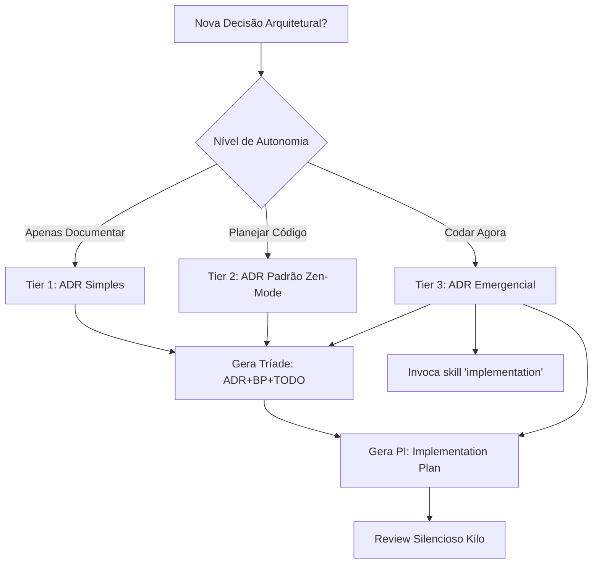

# ADR Generator

Gera Architecture Decision Records (ADRs) seguindo o formato MADR ou similar.

## Quando Usar

### Use quando:
- Decisão arquitetural significativa precisa ser documentada
- Usuário solicita criação de ADR
- Registro de trade-offs técnicos
- Decisões que afetam múltiplos módulos ou equipes

### Não use quando:
- Decisão é óbvia (ex: usar tabs vs spaces)
- Decisão é reversível sem custo
- Protótipo rápido

### Skills relacionadas:
- `documentation` — para padrões de documentação
- `architecture-review-kilo` — para revisar decisões arquiteturais

## Decision Tree



## Workflow

O processo de criação de ADRs agora suporta três níveis (Tiers) baseados no grau de autonomia desejada:

### Tier 1: ADR Simples (Tríade Base)

Use para documentação pura e planejamento macro, sem gerar código de imediato.

1. Gere a Tríade de artefatos simultaneamente:
   - `docs/adr/ADR-XXX.md` (A decisão e contexto)
   - `docs/adr/ADR-XXX-BP.md` (Fases de implementação macro)
   - `docs/adr/ADR-XXX-TODO.md` (Critérios de aceite e checklist macro)
2. Preencha os três arquivos com base na solicitação.
3. **Checkpoint Final:** Tríade gerada e linkada. (Pare aqui).

### Tier 2: ADR Padrão ("Zen-Mode" Quadra)

Use quando a arquitetura está definida e deseja-se gerar o plano de código imediato, porém com gatekeeper autônomo.

1. **Round 1:** Siga todos os passos do Tier 1 (Gere a Tríade completa).
2. **Round 2:** Leia o conteúdo recém-gerado no `ADR-XXX-TODO.md`.
3. **Round 3:** Invoque as regras e diretrizes da skill `writing-plans` nativamente. **Antes de gerar o PI, leia atentamente a pasta `examples/quadra/`** para usar como *Few-Shot Prompt* e garantir qualidade Enterprise. Crie o 4º artefato: `docs/adr/ADR-XXX-PI.md` (Implementation Plan), usando o template `templates/adr-pi.md` para quebrar os requisitos do TODO em passos microscópicos (TDD, arquivos específicos, edge cases, rollback e comandos de terminal).
4. **Round 4:** Acione a skill `architecture-review-kilo` em modo **silencioso** para analisar a Quadra gerada. O output visível para o usuário deve ser apenas a confirmação dos 4 arquivos gerados e aprovados.
5. **Checkpoint Final:** Apresente os links para a Quadra finalizada.

### Tier 3: ADR Emergencial (Execução Direta)

Use para correções urgentes ou tarefas óbvias que devem ser codadas no mesmo instante.

1. **Round 1:** Execute os Rounds 1 a 3 do "ADR Padrão" (Gere a Quadra). O review silencioso (Round 4) é opcional e pode ser pulado para velocidade.
2. **Round 2:** Acione automaticamente a skill `implementation` (passando a Quadra recém-criada) para que os agentes já comecem a escrever o código e modificar o repositório no mesmo momento.

> **Regra obrigatória:** Uma decisão nunca existe isoladamente. Sempre que uma ADR é criada, seja qual for o Tier, a Tríade inicial (ADR + BP + TODO) deve ser preenchida para manter a governança ativa. O 4º arquivo (PI) entra para Tiers elevados.

### Fase 2: Revisar ADR Existente

1. Leia ADR:
   ```bash
   cat docs/adr/ADR-00X.md
   ```
2. Verifique se ainda é válido:
   - Contexto mudou?
   - Alternativas mudaram?
3. Atualize status:
   - Aceito → Substituído (se aplicável)
4. **Checkpoint**: ADR revisado ou mantido

### Fase 3: Substituir ADR

1. Crie novo ADR:
   ```bash
   cp templates/adr.md docs/adr/ADR-NEW.md
   ```
2. No ADR antigo, atualize status:
   ```markdown
   ## Status
   Substituído por ADR-NEW
   ```
3. Link no novo ADR:
   ```markdown
   ## Referências
   - Substitui ADR-OLD
   ```
4. **Checkpoint**: Substituição documentada

### Fase 4: Auto-Repair e Retroactive Governance

Use para projetos legado ou para "consertar" uma governança quebrada que a skill `implementation` tenha rejeitado.

1. **Diagnóstico:** Analise o que está faltando:
   - Só existe código, mas sem decisão formal documentada? → Criar "ADR Retrospectivo" usando a flag emergencial de auto-repair.
   - Existe ADR, mas não BP nem TODO? → Gerar a Tríade (ou Quadra) faltante, extraindo dados do ADR original e do código existente.
   - Artefatos estão com formato errado (sem frontmatter)? → Reescrever usando os templates obrigatórios.
2. **Auto-Correção:** Gere os artefatos faltantes e linke-os entre si.
3. **Checkpoint:** Governança restaurada; a skill `implementation` pode continuar.

## Conceitos Fundamentais

### Estrutura do ADR

```markdown
# ADR-XXX: [Título da Decisão]

## Status
Proposto | Aceito | Rejeitado | Suspenso | Substituído

## Contexto
Descreva o problema, motivação e restrições.

## Decisão
Descreva a solução escolhida.

## Alternativas Consideradas
- Alternativa A: descrição, prós e contras
- Alternativa B: descrição, prós e contras

## Consequências
### Positivas
- ...

### Negativas
- ...
```

### Status Values

- **Proposto**: Em discussão
- **Aceito**: Aprovado e implementado
- **Rejeitado**: Rejeitado, não implementado
- **Suspenso**: Em espera
- **Substituído**: Reemplazado por outro ADR

## Templates

### adr.md
Localização: `templates/adr.md`

Template para Architecture Decision Record.

**Uso:**
```bash
cp templates/adr.md docs/adr/ADR-00X.md
```

### adr-bp.md
Localização: `templates/adr-bp.md`

Template para Blueprint de Implementação do ADR. Define fases, dependências e critérios de aceitação.

**Uso:**
```bash
cp templates/adr-bp.md docs/adr/ADR-00X-BP.md
```

### adr-todo.md
Localização: `templates/adr-todo.md`

Template para lista de tarefas verificáveis do ADR. Cada tarefa deve ter um comando de validação.

**Uso:**
```bash
cp templates/adr-todo.md docs/adr/ADR-00X-TODO.md
```

### adr-emergency.md
Localização: `templates/adr-emergency.md`

Template para ADR emergencial (implementação imediata sem BP/TODO). Use para correções críticas.

**Uso:**
```bash
cp templates/adr-emergency.md docs/adr/ADR-00X.md
```

### adr-simple.md
Localização: `templates/adr-simple.md`

Template para ADR simples (sem necessidade de BP/TODO). Use para decisões menores.

**Uso:**
```bash
cp templates/adr-simple.md docs/adr/ADR-00X.md
```

### adr-pi.md
Localização: `templates/adr-pi.md`

Template para Implementation Plan (PI) Nível Enterprise. Focado em TDD granular, isolamento de escopo, mocks, tratamento de exceções (edge cases) e regras estritas de Rollback. 

**Uso:**
```bash
cp templates/adr-pi.md docs/adr/ADR-00X-PI.md
```

## Anti-patterns

### 🔴 Crítico

#### ADR sem Blueprint e TODO
**O que é:** Criar ADR sem gerar simultaneamente seu BP e TODO.
**Por que é ruim:** ADR fica sem plano de implementação e sem tarefas verificáveis — quebra o ciclo ADR→Blueprint→TODO→Implementation.
**Como evitar:** Sempre crie os 3 arquivos juntos: `ADR-XXX.md`, `ADR-XXX-BP.md`, `ADR-XXX-TODO.md`.
**Exemplo:**
```
# ❌ ERRADO
mkdir -p docs/adr
cp templates/adr.md docs/adr/ADR-009.md
# (esqueceu BP e TODO)

# ✅ CORRETO
cp templates/adr.md docs/adr/ADR-009.md
cp templates/adr-bp.md docs/adr/ADR-009-BP.md
cp templates/adr-todo.md docs/adr/ADR-009-TODO.md
```

#### ADR Retrospectivo
**O que é:** Criar ADR após decisão já implementada.
**Por que é ruim:** Não registra trade-offs reais, parece justificação.
**Como evitar:** Crie ADR antes da implementação.
**Exceção de Auto-Repair:** É permitido gerar um ADR retrospectivamente EXCLUSIVAMENTE para fins de **Retroactive Governance** em projetos legados que estão sendo padronizados para o Zen-Mode.
**Exemplo:**
```
# ❌ ERRADO
Decisão tomada em 2024-01-01
ADR criado em 2024-06-01 (sem ser projeto legado)

# ✅ CORRETO (em modo regular)
ADR criado em 2024-01-01
Decisão implementada em 2024-01-15
```

#### ADR sem Alternativas
**O que é:** ADR que não lista alternativas consideradas.
**Por que é ruim:** Não mostra trade-offs, parece decisão aleatória.
**Como evitar:** Sempre liste pelo menos 2 alternativas.
**Exemplo:**
```
# ❌ ERRADO
Escolhemos React porque é bom

# ✅ CORRETO
Alternativas:
- React: comunidade grande, curva aprendizado média
- Vue: curva aprendizado baixa, comunidade menor
- Svelte: performance alta, comunidade pequena
Escolhemos React por comunidade e documentação
```

### 🟡 Médio

#### ADR Vago
**O que é:** ADR sem contexto ou decisão clara.
**Por que é ruim:** Futuro desenvolvedor não entende motivação.
**Como evitar:** Seja específico, inclua dados.
**Exemplo:**
```
# ❌ ERRADO
Usamos PostgreSQL

# ✅ CORRETO
Usamos PostgreSQL por:
- Suporte a JSONB para queries flexíveis
- Replicação síncrona para HA
- Equipe já tem experiência
```

### 🟢 Baixo

#### ADR sem Data
**O que é:** ADR sem data de criação.
**Por que é ruim:** Difícil rastrear histórico.
**Como evitar:** Sempre inclua data.
**Exemplo:**
```markdown
# ✅ CORRETO
# ADR-001: Database Choice
## Status
Aceito

## Date
2024-01-15
```

## Checklists

### Checklist de ADR
- [ ] Título claro e descritivo
- [ ] Contexto completo
- [ ] Alternativas listadas
- [ ] Decisão justificada
- [ ] Consequências documentadas
- [ ] Data incluída
- [ ] Stakeholders identificados
- [ ] **Blueprint (BP) criado em `ADR-XXX-BP.md`**
- [ ] **TODO criado em `ADR-XXX-TODO.md`**
- [ ] **PI (Implementation Plan) criado em `ADR-XXX-PI.md` (Para Tiers 2 e 3)**
- [ ] **Arquivos linkados entre si no ADR**

### Checklist de Review
- [ ] Contexto ainda relevante?
- [ ] Decisão ainda válida?
- [ ] Alternativas precisam atualização?
- [ ] Status atualizado

## Edge Cases

### ADR de Emergência
**Situação:** Decisão urgente precisa ser documentada.
**Solução:** Crie ADR simplificado, detalhe depois.
**Exceção:** Se emergência é crítica, documente imediatamente.

```markdown
## Status
Aceito (emergencial)
```

### ADR para Experimento
**Situação:** Decisão experimental precisa ser documentada.
**Solução:** Use status "Suspenso" ou "Experimental".
**Exceção:** Se experimento é pequeno, use Decision Doc.

```markdown
## Status
Suspenso (experimental)
```

## Referências

- [MADR](https://adr.github.io/madr/)
- `documentation` — para padrões
- `architecture-review-kilo` — para revisões
