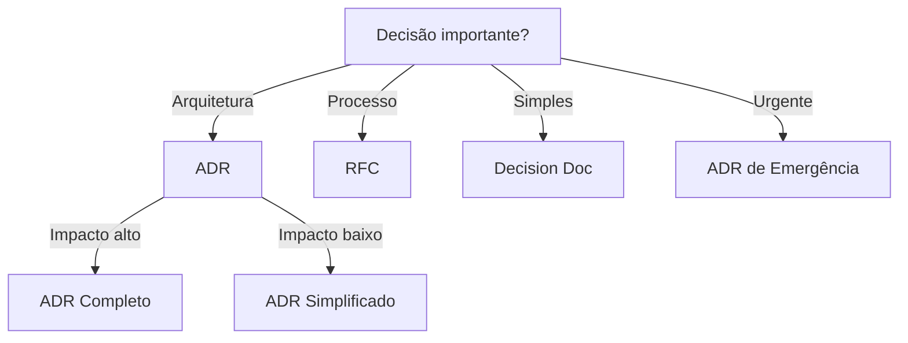

# ADR Generator

Gera Architecture Decision Records (ADRs) seguindo o formato MADR ou similar.

## Quando Usar

### Use quando:
- Decisão arquitetural significativa precisa ser documentada
- Usuário solicita criação de ADR
- Registro de trade-offs técnicos
- Decisões que afetam múltiplos módulos ou equipes

### Não use quando:
- Decisão é óbvia (ex: usar tabs vs spaces)
- Decisão é reversível sem custo
- Protótipo rápido

### Skills relacionadas:
- `documentation` — para padrões de documentação
- `architecture-review-kilo` — para revisar decisões arquiteturais

## Decision Tree



## Workflow

### Fase 1: Criar ADR Completo + BP + TODO

Ao criar uma nova ADR, **sempre** gere os três arquivos em conjunto:

1. Crie o ADR em `docs/adr/ADR-XXX.md`:
   ```bash
   cp templates/adr.md docs/adr/ADR-00X.md
   ```
2. Crie o Blueprint (BP) em `docs/adr/ADR-XXX-BP.md`:
   ```bash
   cp templates/adr-bp.md docs/adr/ADR-00X-BP.md
   ```
3. Crie o TODO em `docs/adr/ADR-XXX-TODO.md`:
   ```bash
   cp templates/adr-todo.md docs/adr/ADR-00X-TODO.md
   ```

> **Regra obrigatória:** Uma ADR nunca existe isoladamente. Sempre que uma ADR é criada, seu BP e TODO devem ser gerados simultaneamente. O BP define as fases de implementação, e o TODO lista as tarefas verificáveis.

4. Preencha o ADR:
   - Contexto: Problema, Motivação, Restrições
   - Alternativas: A/B com prós/contras
   - Decisão justificada
   - Consequências positivas e negativas
5. Preencha o BP:
   - Fases de implementação com dependências
   - Critérios de aceitação por fase
   - Sequenciamento lógico
6. Preencha o TODO:
   - Tarefas granulares numeradas
   - Cada tarefa verificável por comando
   - Status inicial: `[ ]`
7. **Checkpoint**: ADR + BP + TODO criados e linkados entre si

### Fase 2: Revisar ADR Existente

1. Leia ADR:
   ```bash
   cat docs/adr/ADR-00X.md
   ```
2. Verifique se ainda é válido:
   - Contexto mudou?
   - Alternativas mudaram?
3. Atualize status:
   - Aceito → Substituído (se aplicável)
4. **Checkpoint**: ADR revisado ou mantido

### Fase 3: Substituir ADR

1. Crie novo ADR:
   ```bash
   cp templates/adr.md docs/adr/ADR-NEW.md
   ```
2. No ADR antigo, atualize status:
   ```markdown
   ## Status
   Substituído por ADR-NEW
   ```
3. Link no novo ADR:
   ```markdown
   ## Referências
   - Substitui ADR-OLD
   ```
4. **Checkpoint**: Substituição documentada

## Conceitos Fundamentais

### Estrutura do ADR

```markdown
# ADR-XXX: [Título da Decisão]

## Status
Proposto | Aceito | Rejeitado | Suspenso | Substituído

## Contexto
Descreva o problema, motivação e restrições.

## Decisão
Descreva a solução escolhida.

## Alternativas Consideradas
- Alternativa A: descrição, prós e contras
- Alternativa B: descrição, prós e contras

## Consequências
### Positivas
- ...

### Negativas
- ...
```

### Status Values

- **Proposto**: Em discussão
- **Aceito**: Aprovado e implementado
- **Rejeitado**: Rejeitado, não implementado
- **Suspenso**: Em espera
- **Substituído**: Reemplazado por outro ADR

## Templates

### adr.md
Localização: `templates/adr.md`

Template para Architecture Decision Record.

**Uso:**
```bash
cp templates/adr.md docs/adr/ADR-00X.md
```

### adr-bp.md
Localização: `templates/adr-bp.md`

Template para Blueprint de Implementação do ADR. Define fases, dependências e critérios de aceitação.

**Uso:**
```bash
cp templates/adr-bp.md docs/adr/ADR-00X-BP.md
```

### adr-todo.md
Localização: `templates/adr-todo.md`

Template para lista de tarefas verificáveis do ADR. Cada tarefa deve ter um comando de validação.

**Uso:**
```bash
cp templates/adr-todo.md docs/adr/ADR-00X-TODO.md
```

## Anti-patterns

### 🔴 Crítico

#### ADR sem Blueprint e TODO
**O que é:** Criar ADR sem gerar simultaneamente seu BP e TODO.
**Por que é ruim:** ADR fica sem plano de implementação e sem tarefas verificáveis — quebra o ciclo ADR→Blueprint→TODO→Implementation.
**Como evitar:** Sempre crie os 3 arquivos juntos: `ADR-XXX.md`, `ADR-XXX-BP.md`, `ADR-XXX-TODO.md`.
**Exemplo:**
```
# ❌ ERRADO
mkdir -p docs/adr
cp templates/adr.md docs/adr/ADR-009.md
# (esqueceu BP e TODO)

# ✅ CORRETO
cp templates/adr.md docs/adr/ADR-009.md
cp templates/adr-bp.md docs/adr/ADR-009-BP.md
cp templates/adr-todo.md docs/adr/ADR-009-TODO.md
```

#### ADR Retrospectivo
**O que é:** Criar ADR após decisão já implementada.
**Por que é ruim:** Não registra trade-offs, parece justificação.
**Como evitar:** Crie ADR antes da implementação.
**Exemplo:**
```
# ❌ ERRADO
Decisão tomada em 2024-01-01
ADR criado em 2024-06-01

# ✅ CORRETO
ADR criado em 2024-01-01
Decisão implementada em 2024-01-15
```

#### ADR sem Alternativas
**O que é:** ADR que não lista alternativas consideradas.
**Por que é ruim:** Não mostra trade-offs, parece decisão aleatória.
**Como evitar:** Sempre liste pelo menos 2 alternativas.
**Exemplo:**
```
# ❌ ERRADO
Escolhemos React porque é bom

# ✅ CORRETO
Alternativas:
- React: comunidade grande, curva aprendizado média
- Vue: curva aprendizado baixa, comunidade menor
- Svelte: performance alta, comunidade pequena
Escolhemos React por comunidade e documentação
```

### 🟡 Médio

#### ADR Vago
**O que é:** ADR sem contexto ou decisão clara.
**Por que é ruim:** Futuro desenvolvedor não entende motivação.
**Como evitar:** Seja específico, inclua dados.
**Exemplo:**
```
# ❌ ERRADO
Usamos PostgreSQL

# ✅ CORRETO
Usamos PostgreSQL por:
- Suporte a JSONB para queries flexíveis
- Replicação síncrona para HA
- Equipe já tem experiência
```

### 🟢 Baixo

#### ADR sem Data
**O que é:** ADR sem data de criação.
**Por que é ruim:** Difícil rastrear histórico.
**Como evitar:** Sempre inclua data.
**Exemplo:**
```markdown
# ✅ CORRETO
# ADR-001: Database Choice
## Status
Aceito

## Date
2024-01-15
```

## Checklists

### Checklist de ADR
- [ ] Título claro e descritivo
- [ ] Contexto completo
- [ ] Alternativas listadas
- [ ] Decisão justificada
- [ ] Consequências documentadas
- [ ] Data incluída
- [ ] Stakeholders identificados
- [ ] **Blueprint (BP) criado em `ADR-XXX-BP.md`**
- [ ] **TODO criado em `ADR-XXX-TODO.md`**
- [ ] **BP e TODO linkados no ADR**

### Checklist de Review
- [ ] Contexto ainda relevante?
- [ ] Decisão ainda válida?
- [ ] Alternativas precisam atualização?
- [ ] Status atualizado

## Edge Cases

### ADR de Emergência
**Situação:** Decisão urgente precisa ser documentada.
**Solução:** Crie ADR simplificado, detalhe depois.
**Exceção:** Se emergência é crítica, documente imediatamente.

```markdown
## Status
Aceito (emergencial)
```

### ADR para Experimento
**Situação:** Decisão experimental precisa ser documentada.
**Solução:** Use status "Suspenso" ou "Experimental".
**Exceção:** Se experimento é pequeno, use Decision Doc.

```markdown
## Status
Suspenso (experimental)
```

## Referências

- [MADR](https://adr.github.io/madr/)
- `documentation` — para padrões
- `architecture-review-kilo` — para revisões