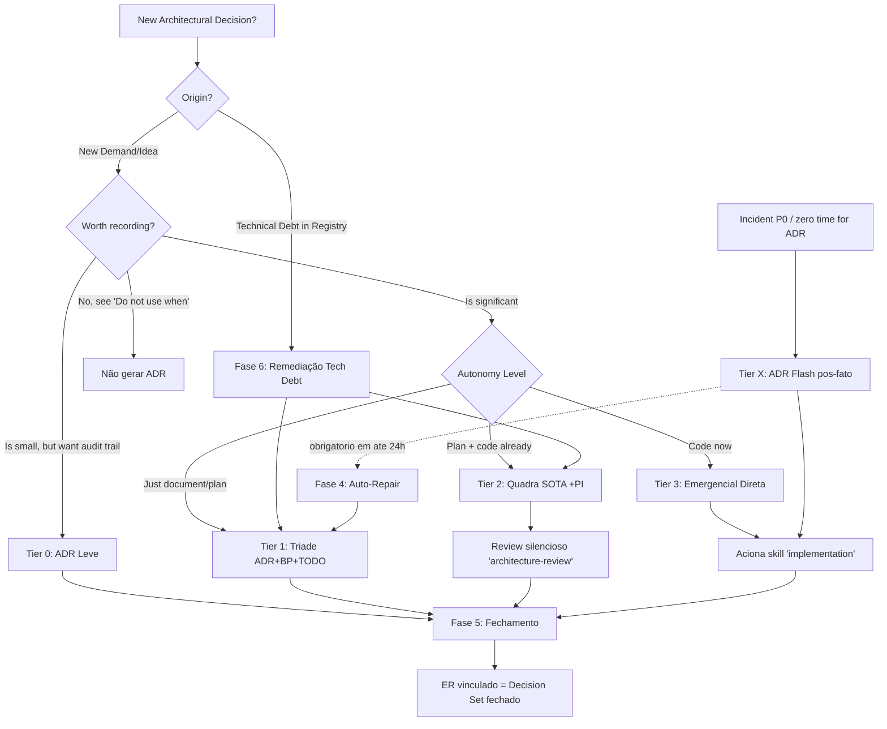

# ADR Generator

Generates and governs the complete Decision Set of an architectural decision — not just the isolated ADR document. Follows the extended MADR (Markdown ADR) format with Blueprint, TODO, and, for more autonomous decisions, an Implementation Plan (PI). Also provides native integration with the Tech Debt Registry (`docs/governance/tech-debt-registry.json`) for deterministic conversion of technical debts into refactoring/remediation ADRs.

## When to Use

### Use when:

- A significant architectural decision needs to be documented
- The user requests the creation of an ADR
- Recording technical trade-offs between competing alternatives
- Decisions affecting multiple modules, services, or teams
- Governance of a legacy project needs to be reconstructed retroactively
- Converting technical debts from `tech-debt-registry.json` into remediation ADRs

### Do not use when:

- The decision is obvious and does not generate real debate (e.g., using tabs vs spaces)
- The decision is trivially reversible and of very low cost
- It is just a disposable prototype, with no intention of becoming production

> If the decision is small but still worth a light audit trail, this is not "do not use" — it is the use case for **Tier 0** (see Workflow). The threshold between "not worth a note" and "worth a light note" is the only thing that changes.

### Related Skills:

- `documentation` — for documentation standards
- `architecture-review` — for reviewing architectural decisions and for the silent gate of Tier 2
- `adr-archive` — for archiving, auditing, and synchronizing technical debts
- `implementation` — consumes the Quadra, writes code, registers incidental debts in `tech-debt-registry.json`, and produces the Evidence Record (ER)
- `agent-planning-execution` — rules and guidelines used to generate the PI

## Decision Tree


```mermaid
graph TD
    A[New Architectural Decision?] --> B{Origin?}
    B -->|Technical Debt in Registry| TDR[Fase 6: Remediação Tech Debt]
    B -->|New Demand/Idea| C{Worth recording?}
    C -->|No, see 'Do not use when'| SKIP[Não gerar ADR]
    C -->|Is small, but want audit trail| T0[Tier 0: ADR Leve]
    C -->|Is significant| D{Autonomy Level}
    D -->|Just document/plan| T1[Tier 1: Triade ADR+BP+TODO]
    D -->|Plan + code already| T2[Tier 2: Quadra SOTA +PI]
    D -->|Code now| T3[Tier 3: Emergencial Direta]
    P0[Incident P0 / zero time for ADR] --> TX[Tier X: ADR Flash pos-fato]

    TDR --> T1
    TDR --> T2
    T0 --> Z[Fase 5: Fechamento]
    T1 --> Z
    T2 --> REV[Review silencioso 'architecture-review'] --> Z
    T3 --> IMPL[Aciona skill 'implementation'] --> Z
    TX --> IMPL
    TX -.obrigatorio em ate 24h.-> AR[Fase 4: Auto-Repair]
    AR --> T1

    Z --> ER[ER vinculado = Decision Set fechado]
```

## Workflow

### Phase 1: Creation — Five Tiers by Autonomy Grade

| Tier | When to use | Artifacts | Templates to copy |
|------|-------------|-----------|---------------------|
| **0 — ADR Leve** | Small decision, but want audit trail; below the threshold of a complete Triade | 1: ADR standalone | `adr-simple.md` |
| **1 — Triade** | Document and plan macro, without coding yet | 3: ADR + BP + TODO | `adr.md`, `adr-bp.md`, `adr-todo.md` |
| **2 — Quadra SOTA** | Architecture defined, want code plan ready with autonomous gate | 4: Triade + PI | + `adr-pi.md` |
| **3 — Emergencial Direta** | Urgent correction or obvious task that must be coded immediately | 4: Quadra (review skipped) | same as Tier 2 |
| **X — ADR Flash** | Critical incident, decision already made and coded by necessity — zero time for ADR before | 1 now, 3 later (obligatory) | `adr-emergency.md`, then complete via Phase 4 |

#### Tier 0: ADR Leve (Note of Decision)

For small decisions that still merit a record — without the overhead of Blueprint/TODO.

1. `cp templates/adr-simple.md docs/adr/ADR-XXX.md`
2. Fill in Context, Decision, Consequences. Do not generate BP nor TODO.
3. **Checkpoint:** ADR Leve created. (Stop here — do not scale to Triade.)

#### Tier 1: Triade Base

Use for pure documentation and macro planning, without generating code immediately.

1. Generate the Triade of artifacts simultaneously:
   ```bash
   cp templates/adr.md docs/adr/ADR-XXX.md
   cp templates/adr-bp.md docs/adr/ADR-XXX-BP.md
   cp templates/adr-todo.md docs/adr/ADR-XXX-TODO.md
   ```
2. Fill in the three files based on the request, linking them between each other (the BP and TODO reference the ADR; see frontmatter `adr_ref`).
3. **Checkpoint Final:** Triade generated and linked. (Stop here.)

#### Tier 2: Quadra SOTA (State of the Art)

Use when the architecture is defined and wants to generate the code plan immediately, but with autonomous gate.

1. **Round 1:** Follow all steps of Tier 1 (Generate the complete Triade).
2. **Round 2:** Read the newly generated content in `ADR-XXX-TODO.md`.
3. **Round 3:** Invoke the rules and guidelines of the `agent-planning-execution` skill natively. **Before generating the PI, read attentively the `examples/quadra/` folder** to use as a *Few-Shot Prompt* and ensure Enterprise quality. Create the 4th artifact level SOTA:
   ```bash
   cp templates/adr-pi.md docs/adr/ADR-XXX-PI.md
   ```
   to break down the TODO requirements into microscopic steps (TDD, specific files, edge cases, rollback, and terminal commands).
4. **Round 4:** Activate the `architecture-review` skill in **silent mode** to analyze the generated Quadra. The visible output for the user should be only the confirmation of the 4 generated and approved artifacts.
5. **Checkpoint Final:** Present the links to the final Quadra.

#### Tier 3: ADR Emergencial (Direct Execution)

Use for urgent corrections or obvious tasks that must be coded immediately — but that still comport generating the complete Quadra first (the difference with Tier 2 is only speed, not rigor).

1. **Round 1:** Execute Rounds 1 to 3 of Tier 2 (Generate the complete Quadra: ADR + BP + TODO + PI). The silent review (Round 4) is optional and can be skipped for speed.
2. **Round 2:** Automatically invoke the `implementation` skill (passing the newly created Quadra) to start the agents writing the code and modifying the repository at the same time.

#### Tier X: ADR Flash (Post-Facto Hotfix)

Reserved for real incidents (P0) where there is **no** time available to generate even the Triade before acting — the code is already being or has been written to contain the incident. This is the only legitimate case of "code before documenting," and therefore requires follow-up.

1. **Immediate:**
   ```bash
   cp templates/adr-emergency.md docs/adr/ADR-XXX.md
   ```
   Fill in only the essentials: what was broken, what was done, assumed risks.
2. **Obligatory in up to 24 hours (or at the start of the next work session):**
   Trigger the **Phase 4 (Auto-Repair)** to promote this ADR Flash to a complete Triade (BP + TODO retroactively). An ADR Flash without this follow-up is governance debt — treat as a TODO of high priority.

> **Obligatory Rule:** A decision never exists in isolation. Outside of Tier 0 (which is intentionally standalone) and Tier X (which is an exception with obligatory follow-up), whenever an ADR is created, the initial Triade (ADR + BP + TODO) must be filled to maintain active governance. The 4th artifact (PI) enters for Tiers 2 and 3.

### Phase 2: Review Existing ADR

1. Read ADR:
   ```bash
   cat docs/adr/ADR-00X.md
   ```
2. Check if still valid:
   - Context changed?
   - Alternatives changed?
3. Update status:
   - Proposed → Accepted (if applicable)
4. **Checkpoint:** ADR reviewed or maintained

### Phase 3: Replace ADR

1. Create new ADR:
   ```bash
   cp templates/adr.md docs/adr/ADR-NEW.md
   ```
2. In the old ADR, update status:

   ```markdown
   ## Status

   Replaced by ADR-NEW
   ```

3. Link in the new ADR:

   ```markdown
   ## References

   - Replaces ADR-OLD
   ```

4. **Checkpoint Final:** Replacement documented

### Phase 4: Auto-Repair and Retroactive Governance

Use for legacy projects, to "fix" a broken governance that the `implementation` skill has rejected, or to promote an ADR Flash (Tier X) pending.

1. **Diagnosis:** Analyze what is missing:
   - Only code exists, but no formal decision is documented? → Create "ADR Retrospectivo" using the emergency flag of auto-repair.
   - ADR (including a pending Tier X) exists, but no BP nor TODO? → Generate the missing Triade (or Quadra) by extracting data from the original ADR and existing code.
   - Artifacts are in the wrong format (without frontmatter)? → Rewrite using the obligatory templates.
2. **Auto-Correction:** Generate the missing artifacts and link them between each other.
3. **Checkpoint:** Governance restored; the `implementation` skill can continue, or the Decision Set can proceed to Phase 5.

### Phase 5: Cycle Closure (Evidence Record)

A Decision Set is not considered closed just because the Quadra exists — it closes when the implementation is **evidenced**. This skill does not generate the Evidence Record (this is the responsibility of `implementation` and/or `adr-archive`, which have the real execution context); however, it is responsible for leaving the Decision Set ready to receive it:

1. Confirm that the ADR has a placeholder reference for the ER in `## References` (e.g., `- Evidence Record: (pending)`).
2. Do not treat `implementation_status` in the frontmatter as a definitive signal of completion — it is a cache of convenience. **The source of truth is the existence of a linked ER**. If an agent asks "has this decision been implemented?", the correct answer is to verify the ER link, not just read the frontmatter.
3. **Checkpoint:** ADR ready to receive the ER as soon as `implementation` (or `adr-archive`) produces it.

### Phase 6: Technical Debt Remediation (Tech Debt Registry)

Use when the ADR has the goal of solving one or more registered technical debts in `docs/governance/tech-debt-registry.json`.

1. **Reading and Selection:** Inspect `docs/governance/tech-debt-registry.json`. Identify the items with status `OPEN` targeted for remediation (either by specific ID `TD-YYYY-NNN`, or by grouping correlated debts by domain or severity).
2. **Generating the Decision Set:** Create the Triade (Tier 1) or Quadra (Tier 2/3) of remediation:
   - In the Context of the ADR, formally reference the IDs of the debts attacked.
   - In the TODO and BP, define the exact steps to mitigate and test the debt solution.
3. **Vinculation in Registry:** In the `docs/governance/tech-debt-registry.json` file, update the item of the debt:
   - `status`: `"IN_PROGRESS"`
   - `mitigation_ref`: `"ADR-XXX"`
4. **Checkpoint:** Debt formally linked to the ADR of mitigation and in progress. The definitive closure to `RESOLVED` will occur automatically via `audit.py` when the ADR is implemented.

## Fundamental Concepts

### ADR Structure

```markdown
---
id: ADR-XXX
type: adr
title: [Decision Title]
created: YYYY-MM-DD
updated: YYYY-MM-DD
---

# ADR-XXX: [Decision Title]

## Status

Proposed | Accepted | Rejected | Suspended | Replaced

## Context

Describe the problem, motivation, and restrictions. (If originated from technical debt, cite TD-YYYY-NNN).

## Decision

Describe the chosen solution.

## Alternatives Considered

- Alternative A: description, pros, and cons
- Alternative B: description, pros, and cons

## Consequences

### Positive

- ...

### Negative

- ...

## References

- Evidence Record: (pending)
- Tech Debt Registry: TD-YYYY-NNN (if applicable)
```

### Status Values

- **Proposed**: In discussion
- **Accepted**: Approved for implementation
- **Frozen / Congelado**: Approved, but waiting voluntarily for future execution. Should not be considered in the active scope, does not generate technical debts, and remains archived in `docs/adr/frozen/`.
- **Rejected**: Rejected, not implemented
- **Suspended**: Waiting / pause in discussion
- **Replaced**: Replaced by another ADR

The frontmatter of each artifact can carry a `implementation_status` field (`PENDING`, `IN_PROGRESS`, `FROZEN`, `CONCLUDED`) as a **cache of quick read** for tooling and dashboards. It is never the source of truth: in case of divergence between this field and the existence (or not) of a linked Evidence Record, the ER wins. See [Phase 5](#phase-5-cycle-closure-evidence-record).

## Templates

| Template | Location | Use | Command |
|----------|-------------|-----|---------|
| `adr.md` | `templates/adr.md` | Complete ADR (Tiers 1–3) | `cp templates/adr.md docs/adr/ADR-00X.md` |
| `adr-simple.md` | `templates/adr-simple.md` | Lightweight ADR, standalone (Tier 0) | `cp templates/adr-simple.md docs/adr/ADR-00X.md` |
| `adr-emergency.md` | `templates/adr-emergency.md` | Post-facto ADR Flash (Tier X, hotfix) | `cp templates/adr-emergency.md docs/adr/ADR-00X.md` |
| `adr-bp.md` | `templates/adr-bp.md` | Implementation Blueprint (phases, dependencies, criteria) | `cp templates/adr-bp.md docs/adr/ADR-00X-BP.md` |
| `adr-todo.md` | `templates/adr-todo.md` | Verifiable checklist, elastic scope | `cp templates/adr-todo.md docs/adr/ADR-00X-TODO.md` |
| `adr-pi.md` | `templates/adr-pi.md` | Enterprise Implementation Plan (Tiers 2–3): TDD granular, mocks, edge cases, rollback | `cp templates/adr-pi.md docs/adr/ADR-00X-PI.md` |

## Anti-patterns

### Critical

#### ADR without Blueprint and TODO

**What is it:** Creating an ADR of Tier 1+ without generating the Blueprint and TODO simultaneously.
**Why is it bad:** ADR remains without an implementation plan and verifiable tasks — breaks the ADR→Blueprint→TODO→Implementation cycle.
**How to avoid:** Always create the 3 artifacts together, except for Tier 0 (intentionally standalone) and Tier X (exception with obligatory follow-up).

#### ADR Retrospectivo

**What is it:** Creating an ADR after a decision has already been implemented.
**Why is it bad:** Does not record real trade-offs, seems like justification.
**How to avoid:** Create the ADR before implementation.
**Exceptions:** (1) **Auto-Repair** — permitted exclusively for **Retroactive Governance** in legacy projects being standardized. (2) **Tier X (ADR Flash)** — permitted for P0 incidents, with obligatory follow-up in up to 24 hours via Phase 4.

#### ADR without Alternatives

**What is it:** An ADR that does not list considered alternatives.
**Why is it bad:** Does not show trade-offs, seems like a random decision. This also applies to examples used as few-shot — an example canonical without alternatives teaches the agent to skip this section.
**How to avoid:** Always list at least 2 alternatives, including in examples of reference in `examples/`.

#### Template Orphan

**What is it:** A template cataloged in the "Templates" section of the SKILL.md, but which no Tier or Phase of the workflow actually references or copies.
**Why is it bad:** The agent does not know when to use it, so either it is never used (dead weight) or it is used incorrectly by analogy.

#### Divergent Status (Frontmatter vs. Evidence Record)

**What is it:** Trusting the `implementation_status` field in the frontmatter as if it were the source of truth about whether a decision has been implemented.
**Why is it bad:** The field is manually filled or cached and can desynchronize from the real state — breaks the principle that the implementation status is signaled by the existence of a linked ER.
**How to avoid:** Treat `implementation_status` as a cache of quick read. Before declaring a decision "implemented," verify the ER link (see [Phase 5](#phase-5-cycle-closure-evidence-record)).

### Medium

#### Vague ADR

**What is it:** An ADR without clear context or decision.
**Why is it bad:** Future developer does not understand motivation.
**How to avoid:** Be specific, include data.

#### TODO with Fabricated Phases

**What is it:** Filling phases/sub-phases of a TODO just to reach a "standard" count of tasks, even when the real scope of the decision does not justify it.
**Why is it bad:** Inflates the checklist with artificial tasks, dilutes the signal of the tasks that really matter.
**How to avoid:** Use exactly the phases and steps that the real scope requires — the `adr-todo.md` template is elastic, not a fixed grid to fill.

### Low

#### ADR without Date

**What is it:** An ADR without a creation date.
**Why is it bad:** Difficult to track history.
**How to avoid:** Always include the date in the frontmatter (`created`).

#### Placeholders with Accentuation

**What is it:** Using accented characters within template placeholders, e.g., `{{ação}}`, `{{contexto}}`.
**Why is it bad:** Simple substitution scripts (regex, encoding poorly configured) may silently fail on these placeholders.
**How to avoid:** Template placeholders always in pure ASCII (e.g., `{{action_summary}}`), even if the filled content is in Portuguese.

## Checklists

### ADR Checklist

- [ ] Clear and descriptive title
- [ ] Complete context (including mention of technical debt TD-YYYY-NNN if applicable)
- [ ] Listed alternatives (at least 2, even in few-shot examples)
- [ ] Justified decision
- [ ] Documented consequences
- [ ] Included date (`created` in frontmatter)
- [ ] **Blueprint (BP) created in `ADR-XXX-BP.md`** (except Tier 0)
- [ ] **TODO created in `ADR-XXX-TODO.md`** (except Tier 0)
- [ ] **PI (Implementation Plan) created in `ADR-XXX-PI.md`** (Tiers 2 and 3)
- [ ] Artifacts linked between each other (`adr_ref` in frontmatter of derivatives)
- [ ] Reference to Evidence Record present (even if "pending")
- [ ] Technical debt updated to `IN_PROGRESS` in `tech-debt-registry.json` (if originated from debt)

### Review Checklist

- [ ] Context still relevant?
- [ ] Decision still valid?
- [ ] Alternatives need update?
- [ ] Status updated
- [ ] `implementation_status` in frontmatter reflects the existence (or not) of a linked ER?

## References

- [MADR](https://adr.github.io/madr/)
- `technical-documentation` — for standards
- `architecture-review` — for reviews
- `adr-archive` — for auditing and archiving
- Governance principle of the Decision Set: implementation status is signaled by the existence of a linked Evidence Record (ER), not by a standalone frontmatter field.
