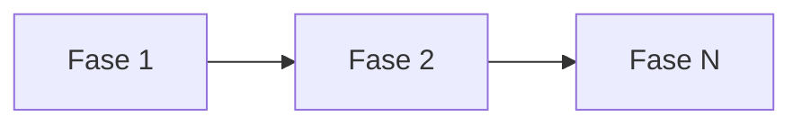

# Blueprint — ADR-{{id}}: {{title}}

> Referência: [ADR-{{id}}](./ADR-{{id}}.md)

## Visão Geral

Breve descrição do escopo desta implementação.

## Fases de Implementação

### Fase 1: {{phase-1-title}}

**Objetivo:** {{phase-1-goal}}

**Dependências:** Nenhuma

**Tarefas:**
- [ ] Tarefa 1.1: {{description}}
- [ ] Tarefa 1.2: {{description}}

**Critério de Aceitação:**
- {{acceptance-criteria-1}}

---

### Fase 2: {{phase-2-title}}

**Objetivo:** {{phase-2-goal}}

**Dependências:** Fase 1

**Tarefas:**
- [ ] Tarefa 2.1: {{description}}
- [ ] Tarefa 2.2: {{description}}

**Critério de Aceitação:**
- {{acceptance-criteria-2}}

---

### Fase N: {{phase-n-title}}

**Objetivo:** {{phase-n-goal}}

**Dependências:** Fase {{n-1}}

**Tarefas:**
- [ ] Tarefa N.1: {{description}}

**Critério de Aceitação:**
- {{acceptance-criteria-n}}

## Sequenciamento

## Riscos e Mitigações

| Risco | Likelihood | Impacto | Mitigação |
|-------|-----------|---------|-----------|
| {{risk-1}} | {{likelihood}} | {{impact}} | {{mitigation}} |

## Referências

- ADR: [ADR-{{id}}](./ADR-{{id}}.md)
- TODO: [ADR-{{id}}-TODO](./ADR-{{id}}-TODO.md)
