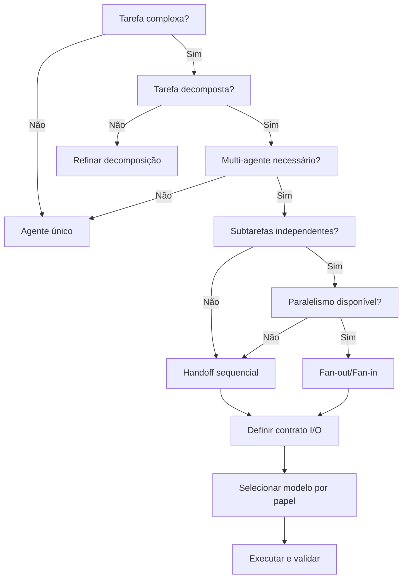

# Agent Orchestration

Orquestração de múltiplos agentes de IA para tarefas complexas.

## Quando Usar

### Use quando:
- Tarefa complexa precisa ser decomposta em subtarefas
- Múltiplos agentes com papéis distintos precisam cooperar
- Subtarefas são independentes e podem rodar em paralelo
- Precisa definir contratos de handoff entre agentes
- Precisa rotear para modelos com custo/performance adequados
- Fluxo de trabalho envolve múltiplas etapas com validação

### Não use quando:
- Tarefa é simples e pode ser feita por um único agente
- Não há dependências entre subtarefas (basta paralelismo simples)
- Prompt único resolve o problema

### Skills relacionadas:
- `prompt-engineering` — para estruturar prompts de cada agente
- `vibe-coding` — para desenvolvimento guiado por IA
- `governance` — para processos de aprovação e revisão

## Decision Tree



## Conceitos Fundamentais

### Papel do Agente

Cada agente possui um papel definido com responsabilidades, entrada e saída esperadas.

- **Orchestrator**: coordena fluxo, delega subtarefas, valida resultados
- **Specialist**: executa tarefa específica com expertise focada
- **Reviewer**: valida output de outros agentes antes de prosseguir
- **Formatter**: transforma output em formato consumível por downstream

### Contrato I/O

Todo handoff entre agentes deve ter contrato explícito:

| Campo | Descrição |
|-------|-----------|
| Input schema | Formato e campos de entrada |
| Output schema | Formato e campos de saída |
| Validação | Regras de validação do output |
| Fallback | O que fazer se output inválido |

### Roteamento de Modelo

Selecione modelo com base em complexidade e custo:

| Complexidade | Modelo sugerido | Custo |
|-------------|----------------|-------|
| Simples (extração, formatação) | Modelo leve | $ |
| Média (análise, síntese) | Modelo padrão | $$ |
| Complexa (raciocínio, código) | Modelo avançado | $$$ |

### Paralelismo

- **Fan-out**: distribui trabalho para múltiplos agentes simultaneamente
- **Fan-in**: agrega resultados de múltiplos agentes em output final
- **Gate**: ponto de sincronização onde todos os resultados devem estar prontos

## Workflow

### Fase 1: Decompor Tarefa

1. Analise a tarefa complexa
2. Identifique subtarefas independentes
3. Defina dependências entre subtarefas
4. Crie grafo de dependências
5. **Checkpoint**: Grafo de dependências validado com pelo menos 2 revisores

### Fase 2: Definir Papéis e Contratos

1. Para cada subtarefa, defina o papel do agente
2. Crie card de papel com template `templates/agent-role-card.md`
3. Defina contrato I/O para cada handoff
4. Valide que schemas são consistentes entre agentes
5. **Checkpoint**: Todos os contratos I/O validados e documentados

### Fase 3: Selecionar Modelos

1. Para cada papel, avalie complexidade da tarefa
2. Consulte `templates/routing-decision.md` para roteamento
3. Equilibre custo vs qualidade
4. Defina fallback para cada modelo
5. **Checkpoint**: Matriz de roteamento aprovada com estimativa de custo

### Fase 4: Executar com Paralelismo

1. Identifique subtarefas que podem rodar em paralelo
2. Implemente fan-out para subtarefas independentes
3. Implemente fan-in para agregar resultados
4. Use gate para sincronização
5. **Checkpoint**: Resultados parciais validados antes de prosseguir

### Fase 5: Handoff e Validação

1. Execute handoff seguindo protocolo em `templates/handoff-protocol.md`
2. Valide output com contrato I/O definido
3. Se output inválido, ative fallback
4. Registre métricas de qualidade
5. **Checkpoint**: Todos os handoffs concluídos com output válido

### Fase 6: Consolidar Resultado

1. Agregue resultados de todos os agentes
2. Valide consistência do output final
3. Formate para consumo do usuário
4. Documente decisões e lições aprendidas
5. **Checkpoint**: Output final validado e entregue

## Templates

### agent-role-card.md
Localização: `templates/agent-role-card.md`

Template para definição de papel do agente.

**Uso:**
```bash
cat templates/agent-role-card.md
```

### handoff-protocol.md
Localização: `templates/handoff-protocol.md`

Template para protocolo de handoff entre agentes.

**Uso:**
```bash
cat templates/handoff-protocol.md
```

### routing-decision.md
Localização: `templates/routing-decision.md`

Template para decisão de roteamento de modelo.

**Uso:**
```bash
cat templates/routing-decision.md
```

## Anti-patterns

### 🔴 Crítico

#### Handoff sem Contrato I/O
**O que é:** Passar output de um agente para outro sem schema explícito.
**Por que é ruim:** Output incompatível, falhas em runtime, difícil de debugar.
**Como evitar:** Sempre defina contrato I/O antes de implementar handoff.
**Exemplo:**
```
# ❌ ERRADO
Agente A gera JSON livre → Agente B tenta parsear

# ✅ CORRETO
Contrato definido:
  input: { schema: UserRequest, required: [name, email] }
  output: { schema: UserCreated, required: [id, status] }
Agente A gera JSON válido → Agente B valida com schema → prossegue
```

#### Usar Modelo Caro para Tarefa Simples
**O que é:** Usar modelo avançado para extração, formatação ou tarefas triviais.
**Por que é ruim:** Custo desnecessário, latência maior, throughput menor.
**Como evitar:** Roteie por complexidade, use modelo leve para tarefas simples.
**Exemplo:**
```
# ❌ ERRADO
Tarefa: "Extraia o nome do JSON"
Modelo: Claude Sonnet 4 (custo alto)

# ✅ CORRETO
Tarefa: "Extraia o nome do JSON"
Modelo: Modelo leve (custo baixo)
```

### 🟡 Médio

#### Contexto sem Janela de Descarte
**O que é:** Acumular contexto de todos os agentes sem limite de janela.
**Por que é ruim:** Excede limite de tokens, degrada performance, aumenta custo.
**Como evitar:** Defina janela de contexto, resuma conversas anteriores.
**Exemplo:**
```
# ❌ ERRADO
Acumular 50 mensagens de histórico sem resumo

# ✅ CORRETO
A cada 10 mensagens:
  1. Resumo da conversa até aqui
  2. Mantém apenas últimos 5 exchanges
  3. Descarta contexto antigo
```

#### Sem Fallback quando Agente Falha
**O que é:** Não ter plano B quando um agente retorna erro ou output inválido.
**Por que é ruim:** Fluxo para completamente, sem recuperação.
**Como evitar:** Defina fallback para cada agente (retry, modelo alternativo, regra heurística).
**Exemplo:**
```
# ❌ ERRADO
Agente A falha → fluxo para

# ✅ CORRETO
Agente A falha:
  1. Retry com prompt reformulado (1x)
  2. Se falhar, usar modelo alternativo
  3. Se falhar, usar regra heurística
  4. Se falhar, notificar usuário
```

### 🟢 Baixo

#### Agente Único para Tarefa Paralelizável
**O que é:** Usar um agente sequencialmente para subtarefas que poderiam rodar em paralelo.
**Por que é ruim:** Tempo de execução desnecessariamente longo.
**Como evitar:** Identifique subtarefas independentes e use fan-out.
**Exemplo:**
```
# ❌ ERRADO
Agente processa: arquivo1 → arquivo2 → arquivo3 (sequencial)

# ✅ CORRETO
Fan-out para 3 agentes:
  Agente 1: arquivo1
  Agente 2: arquivo2
  Agente 3: arquivo3
Fan-in: consolidar resultados
```

## Checklists

### Checklist de Decomposição
- [ ] Tarefa decomposta em subtarefas claras
- [ ] Dependências mapeadas
- [ ] Grafo de dependências validado
- [ ] Subtarefas independentes identificadas para paralelismo

### Checklist de Contrato I/O
- [ ] Input schema definido para cada handoff
- [ ] Output schema definido para cada handoff
- [ ] Regras de validação documentadas
- [ ] Fallback definido para cada handoff
- [ ] Schemas consistentes entre agentes

### Checklist de Roteamento
- [ ] Complexidade avaliada para cada papel
- [ ] Modelo selecionado por complexidade
- [ ] Custo estimado documentado
- [ ] Fallback de modelo definido

### Checklist de Execução
- [ ] Fan-out implementado para subtarefas independentes
- [ ] Fan-in implementado para agregação
- [ ] Gate de sincronização definido
- [ ] Janela de contexto configurada
- [ ] Métricas de qualidade registradas

## Edge Cases

### Agente com Output Ambíguo
**Situação:** Agente retorna output que pode ser interpretado de múltiplas formas.
**Solução:** Adicione validação estrita com schema, inclua exemplos de output esperado.
**Exceção:** Se ambiguidade é intencional (ex: brainstorming), documente como aceitável.

```
# Validação estrita
output_schema = {
  "type": "object",
  "required": ["action", "confidence"],
  "properties": {
    "action": { "enum": ["approve", "reject", "review"] },
    "confidence": { "minimum": 0.5 }
  }
}
```

### Cascata de Falhas
**Situação:** Falha em um agente causa falha em todos os downstream.
**Solução:** Implemente circuit breaker, retry com backoff, fallback isolado.
**Exceção:** Se dependência é absoluta, documente como ponto único de falha.

```
# Circuit breaker pattern
if agent_failures[circuit] >= threshold:
    use_fallback(circuit)
    alert("Circuit {circuit} opened")
```

### Conflito entre Agentes
**Situação:** Dois agentes produzem output contraditório para mesma entrada.
**Solução:** Use agente reconciliador, defina regra de prioridade, ou merge com heurística.
**Exceção:** Se conflito é esperado (ex: votação), documente processo de resolução.

```
# Reconciliação
agent_a_output = agent_a(input)
agent_b_output = agent_b(input)

if agent_a_output != agent_b_output:
    reconciler_output = reconciler(agent_a_output, agent_b_output)
    output = reconciler_output
else:
    output = agent_a_output
```

## Referências

- `prompt-engineering` — para estruturar prompts de cada agente
- `vibe-coding` — para desenvolvimento guiado por IA
- `governance` — para processos de aprovação
- [CrewAI Documentation](https://docs.crewai.com/)
- [LangGraph Multi-Agent](https://langchain-ai.github.io/langgraph/)
