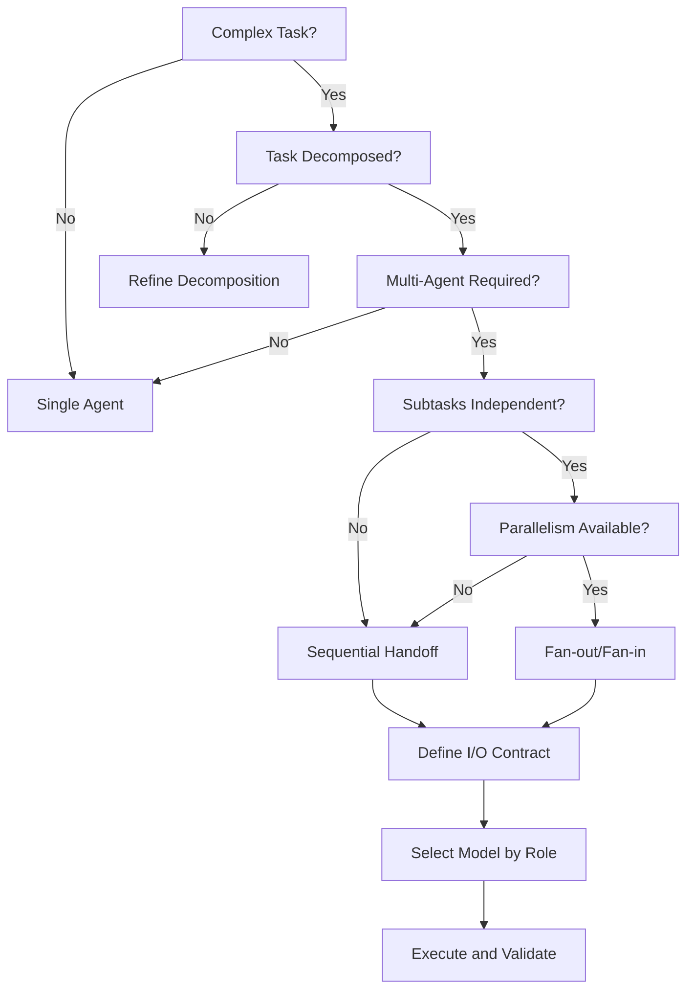

# Agent Orchestration

Orchestrates multiple AI agents for complex tasks.

## When to Use

### Use When:
- Complex task needs to be decomposed into subtasks
- Multiple agents with distinct roles need to collaborate
- Subtasks are independent and can run in parallel
- Need to define contracts for handoffs between agents
- Need to route to models with suitable cost/performance
- Workflow involves multiple stages with validation

### Do Not Use When:
- Task is simple and can be handled by a single agent
- There are no dependencies between subtasks (simple parallelism suffices)
- A single prompt resolves the issue

### Related Skills:
- `prompt-engineering` — for structuring prompts for each agent
- `vibe-coding` — for AI-guided development
- `governance` — for approval and review processes

## Decision Tree


```mermaid
graph TD
    A[Complex Task?] -->|No| B[Single Agent]
    A -->|Yes| C[Task Decomposed?]
    C -->|No| D[Refine Decomposition]
    C -->|Yes| E[Multi-Agent Required?]
    E -->|No| B
    E -->|Yes| F[Subtasks Independent?]
    F -->|No| G[Sequential Handoff]
    F -->|Yes| H[Parallelism Available?]
    H -->|No| G
    H -->|Yes| I[Fan-out/Fan-in]
    G --> J[Define I/O Contract]
    I --> J
    J --> K[Select Model by Role]
    K --> L[Execute and Validate]
```

## Fundamental Concepts

### Agent Role

Each agent has a defined role with responsibilities, expected input, and output.

- **Orchestrator**: coordinates flow, delegates subtasks, validates results
- **Specialist**: executes specific task with focused expertise
- **Reviewer**: validates output of other agents before proceeding
- **Formatter**: transforms output into consumable format for downstream

### I/O Contract

Every handoff between agents must have an explicit contract:

| Field | Description |
|-------|-------------|
| Input schema | Input format and fields |
| Output schema | Output format and fields |
| Validation | Output validation rules |
| Fallback | What to do if output is invalid |

### Model Routing

Select model based on complexity and cost:

| Complexity | Suggested Model | Cost |
|------------|-----------------|------|
| Simple (extraction, formatting) | Lightweight model | $ |
| Medium (analysis, synthesis) | Standard model | $$ |
| Complex (reasoning, coding) | Advanced model | $$$ |

### Parallelism

- **Fan-out**: distributes work to multiple agents simultaneously
- **Fan-in**: aggregates results from multiple agents into final output
- **Gate**: synchronization point where all results must be ready

## Workflow

### Phase 1: Decompose Task

1. Analyze complex task
2. Identify independent subtasks
3. Define dependencies between subtasks
4. Create dependency graph
5. **Checkpoint**: Validated dependency graph with at least 2 reviewers

### Phase 2: Define Roles and Contracts

1. For each subtask, define agent role
2. Create role card with template `templates/agent-role-card.md`
3. Define I/O contract for each handoff
4. Validate that schemas are consistent between agents
5. **Checkpoint**: All I/O contracts validated and documented

### Phase 3: Select Models

1. For each role, evaluate task complexity
2. Consult `templates/routing-decision.md` for routing
3. Balance cost vs quality
4. Define fallback for each model
5. **Checkpoint**: Approved routing matrix with estimated cost

### Phase 4: Execute with Parallelism

1. Identify subtasks that can run in parallel
2. Implement fan-out for independent subtasks
3. Implement fan-in to aggregate results
4. Use gate for synchronization
5. **Checkpoint**: Partial results validated before proceeding

### Phase 5: Handoff and Validation

1. Execute handoff following protocol in `templates/handoff-protocol.md`
2. Validate output with defined I/O contract
3. If output is invalid, activate fallback
4. Record quality metrics
5. **Checkpoint**: All handoffs completed with valid output

### Phase 6: Consolidate Result

1. Aggregate results from all agents
2. Validate consistency of final output
3. Format for user consumption
4. Document decisions and lessons learned
5. **Checkpoint**: Final output validated and delivered

## Templates

### agent-role-card.md
Location: `templates/agent-role-card.md`

Template for defining agent role.

**Usage:**
```bash
cat templates/agent-role-card.md
```

### handoff-protocol.md
Location: `templates/handoff-protocol.md`

Template for handoff protocol between agents.

**Usage:**
```bash
cat templates/handoff-protocol.md
```

### routing-decision.md
Location: `templates/routing-decision.md`

Template for model routing decision.

**Usage:**
```bash
cat templates/routing-decision.md
```

## Anti-patterns

### Critical

#### Handoff without I/O Contract
**What is it:** Passing output from one agent to another without explicit schema.
**Why is it bad:** Incompatible output, runtime failures, difficult to debug.
**How to avoid:** Always define I/O contract before implementing handoff.
**Example:**
```
# ❌ WRONG
Agent A generates free-form JSON → Agent B tries to parse

# ✅ RIGHT
Defined contract:
  input: { schema: UserRequest, required: [name, email] }
  output: { schema: UserCreated, required: [id, status] }
Agent A generates JSON with schema → Agent B validates with schema → proceeds
```

#### Using Expensive Model for Simple Task
**What is it:** Using advanced model for extraction, formatting, or trivial tasks.
**Why is it bad:** Unnecessary cost, higher latency, lower throughput.
**How to avoid:** Route by complexity, use lightweight model for simple tasks.
**Example:**
```
# ❌ WRONG
Task: "Extract the name from JSON"
Model: Claude Sonnet 4 (high cost)

# ✅ RIGHT
Task: "Extract the name from JSON"
Model: Lightweight model (low cost)
```

### Medium

#### Accumulating Context without Expiration Window
**What is it:** Accumulating context from all agents without a limit.
**Why is it bad:** Exceeds token limit, degrades performance, increases cost.
**How to avoid:** Define context window, summarize previous conversations.
**Example:**
```
# ❌ WRONG
Accumulate 50 message history without summarization

# ✅ RIGHT
Every 10 messages:
  1. Summarize conversation up to now
  2. Keep only last 5 exchanges
  3. Discard old context
```

#### No Fallback when Agent Fails
**What is it:** Not having a plan B when an agent returns error or invalid output.
**Why is it bad:** Workflow fails completely, no recovery.
**How to avoid:** Define fallback for each agent (retry, alternative model, heuristic rule).
**Example:**
```
# ❌ WRONG
Agent A fails → workflow fails

# ✅ RIGHT
Agent A fails:
  1. Retry with reformulated prompt (1x)
  2. If fails, use alternative model
  3. If fails, use heuristic rule
  4. If fails, notify user
```

### Low

#### Single Agent for Parallelizable Task
**What is it:** Using a single agent sequentially for subtasks that could run in parallel.
**Why is it bad:** Unnecessary long execution time.
**How to avoid:** Identify independent subtasks and use fan-out.
**Example:**
```
# ❌ WRONG
Agent processes: file1 → file2 → file3 (sequential)

# ✅ RIGHT
Fan-out to 3 agents:
  Agent 1: file1
  Agent 2: file2
  Agent 3: file3
Fan-in: consolidate results
```

## Checklists

### Decomposition Checklist
- [ ] Task decomposed into clear subtasks
- [ ] Dependencies mapped
- [ ] Validated dependency graph
- [ ] Independent subtasks identified for parallelism

### I/O Contract Checklist
- [ ] Input schema defined for each handoff
- [ ] Output schema defined for each handoff
- [ ] Validation rules documented
- [ ] Fallback defined for each handoff
- [ ] Schemas consistent between agents

### Routing Checklist
- [ ] Complexity evaluated for each role
- [ ] Model selected by complexity
- [ ] Estimated cost documented
- [ ] Fallback model defined

### Execution Checklist
- [ ] Fan-out implemented for independent subtasks
- [ ] Fan-in implemented for aggregation
- [ ] Gate defined for synchronization
- [ ] Context window configured
- [ ] Quality metrics recorded

## Edge Cases

### Agent with Ambiguous Output
**Situation:** Agent returns output that can be interpreted in multiple ways.
**Solution:** Add strict validation with schema, include examples of expected output.
**Exception:** If ambiguity is intentional (e.g., brainstorming), document as acceptable.

```
# Strict validation
output_schema = {
  "type": "object",
  "required": ["action", "confidence"],
  "properties": {
    "action": { "enum": ["approve", "reject", "review"] },
    "confidence": { "minimum": 0.5 }
  }
}
```

### Cascading Failures
**Situation:** Failure in one agent causes failure in all downstream.
**Solution:** Implement circuit breaker, retry with backoff, isolated fallback.
**Exception:** If dependency is absolute, document as single point of failure.

```
# Circuit breaker pattern
if agent_failures[circuit] >= threshold:
    use_fallback(circuit)
    alert("Circuit {circuit} opened")
```

### Conflict between Agents
**Situation:** Two agents produce contradictory output for the same input.
**Solution:** Use reconciliator agent, define priority rule, or merge with heuristic.
**Exception:** If conflict is expected (e.g., voting), document resolution process.

```
# Reconciliation
agent_a_output = agent_a(input)
agent_b_output = agent_b(input)

if agent_a_output != agent_b_output:
    reconciler_output = reconciler(agent_a_output, agent_b_output)
    output = reconciler_output
else:
    output = agent_a_output
```

## References

- `prompt-engineering` — for structuring prompts for each agent
- `vibe-coding` — for AI-guided development
- `governance` — for approval processes
- [CrewAI Documentation](https://docs.crewai.com/)
- [LangGraph Multi-Agent](https://langchain-ai.github.io/langgraph/)

## Completion Gate

A tarefa associada à skill `agent-orchestration` só pode ser declarada concluída quando:
1. Todas as verificações do checklist operacional foram atendidas.
2. O resultado foi validado deterministamente através de evidências de execução.
3. Não restam pendências estruturais, placeholders ou erros não tratados.


## Domain SOTA & Industry Engineering Standards

- **Multi-Agent Orchestration Patterns:** Directed Acyclic Graph (DAG) Workflow Execution, Hierarchical Supervisor-Worker, and Peer-to-Peer Consensus.
- **Data Exchange Contracts:** Immutable JSON Schema payloads and CloudEvents (v1.0.2) message encapsulation.
- **Deadlock & Cycle Prevention:** Tarjan's Strongly Connected Components algorithm for runtime DAG dependency verification.
- **Fault Isolation:** Bulkhead Pattern and Circuit Breaker isolation per agent worker node.

### Multi-Agent DAG Execution Algebra:
The orchestration graph $G = (V, E)$ must be strictly acyclic:

$$\text{Cycle}(G) = \emptyset \quad \text{and} \quad \text{InDegree}(v_{\text{sink}}) \ge 1$$

### Exhaustive Heuristic Decision Rules:
1. **Rule of Thumb 1 (Zero Shared Mutable State):** Agents must never share mutable memory; all state handoffs occur via explicit, validated message envelopes.
2. **Rule of Thumb 2 (Worker Timeout Bound):** Every delegated worker task must specify a strict wall-clock timeout ($T_{\text{worker}} \le 120\text{s}$) with automated fallback.
3. **Rule of Thumb 3 (Fan-In Synthesis Gate):** An aggregator agent must validate the completeness of all parent nodes before emitting the final consolidated response.
4. **Rule of Thumb 4 (Role Containment Invariant):** Specialized subagents are prohibited from executing tasks outside their defined system prompt boundary.