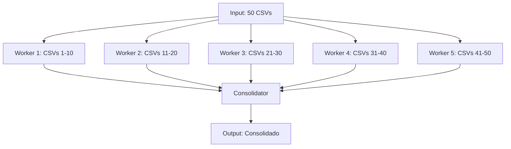

# Example: Fan-Out/Fan-In

Exemplo de paralelismo com fan-out e fan-in.

## Tarefa

"Processar 50 arquivos CSV e gerar consolidado"

## Padrão Sequencial (❌)

```
Agente processa: arquivo1 → arquivo2 → ... → arquivo50
Tempo: 50 x 2s = 100s
```

## Padrão Fan-Out/Fan-In (✅)



## Implementação

### Fan-Out

```yaml
parallel_workers: 5
batch_size: 10
strategy: round-robin
```

### Fan-In

```yaml
aggregation: merge
deduplication: true
validation: schema-check
timeout: 60s
```

## Métricas

| Métrica | Sequencial | Paralelo |
|---------|-----------|----------|
| Tempo | 100s | 22s |
| Custo | $0.50 | $0.55 |
| Throughput | 0.5/s | 2.3/s |

## Trade-off

Paralelismo aumenta custo levemente ($0.05) mas reduz tempo em 78%.
