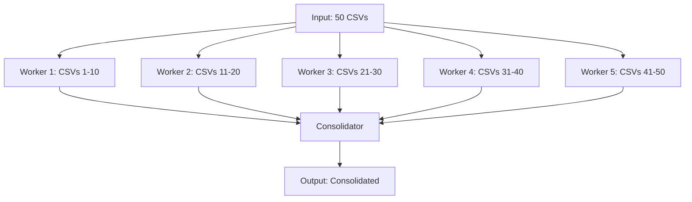

# Example: Fan-Out/Fan-In

Example of parallelism with fan-out and fan-in.

## Task

"Process 50 CSV files and generate consolidated output"

## Sequential Pattern (❌)

```markdown
Agent processes: file1 → file2 → ... → file50
Time: 50 x 2s = 100s
```

## Fan-Out/Fan-In Pattern (✅)


```mermaid
graph TD
    A[Input: 50 CSVs] --> B1[Worker 1: CSVs 1-10]
    A --> B2[Worker 2: CSVs 11-20]
    A --> B3[Worker 3: CSVs 21-30]
    A --> B4[Worker 4: CSVs 31-40]
    A --> B5[Worker 5: CSVs 41-50]
    B1 --> C[Consolidator]
    B2 --> C
    B3 --> C
    B4 --> C
    B5 --> C
    C --> D[Output: Consolidated]
```

## Implementation

### Fan-Out

```yaml
parallel_workers: 5
batch_size: 10
strategy: round-robin
```

### Fan-In

```yaml
aggregation: merge
deduplication: true
validation: schema-check
timeout: 60s
```

## Metrics

| Metric | Sequential | Parallel |
|---------|-----------|----------|
| Time | 100s | 22s |
| Cost | $0.50 | $0.55 |
| Throughput | 0.5/s | 2.3/s |

## Trade-off

Parallelism increases cost slightly ($0.05) but reduces time by 78%.
