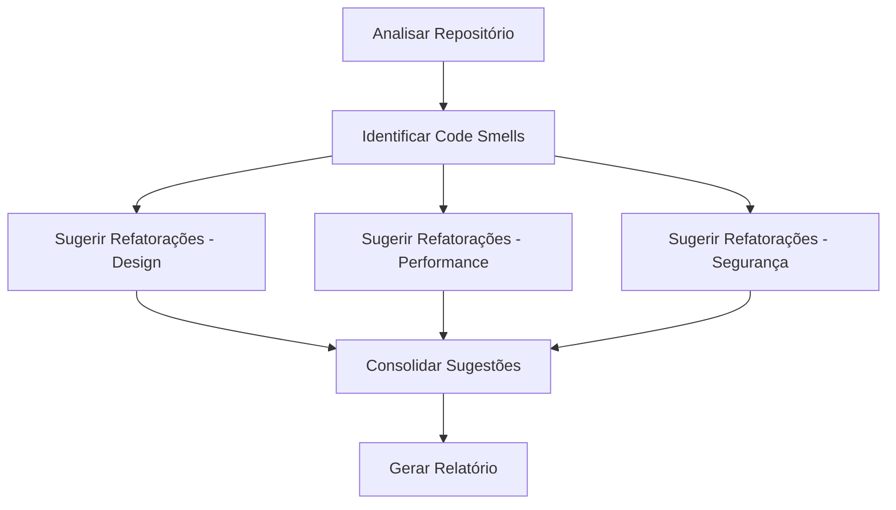

# Example: Multi-Agent Decomposition

Exemplo de decomposição de tarefa complexa em multi-agente.

## Tarefa Original

"Analisar repositório, identificar code smells, sugerir refatorações e gerar relatório"

## Decomposição



## Papéis

| Agente | Papel | Modelo |
|--------|-------|--------|
| Scanner | Specialist | Standard |
| Design Analyzer | Specialist | Advanced |
| Performance Analyzer | Specialist | Standard |
| Security Analyzer | Specialist | Advanced |
| Consolidator | Specialist | Standard |
| Report Generator | Formatter | Lightweight |

## Contratos

### Scanner → Analyzer

```yaml
input:
  schema: RepositoryScan
  fields:
    - name: files
      type: array
      required: true
    - name: languages
      type: array
      required: true

output:
  schema: CodeSmells
  fields:
    - name: smells
      type: array
      required: true
    - name: severity
      type: string
      required: true
```

### Analyzer → Consolidator

```yaml
input:
  schema: RefactoringSuggestions
  fields:
    - name: suggestions
      type: array
      required: true
    - name: category
      type: string
      required: true

output:
  schema: ConsolidatedSuggestions
  fields:
    - name: all_suggestions
      type: array
      required: true
    - name: priorities
      type: array
      required: true
```

## Execução

1. Scanner analisa repositório (paralelo)
2. 3 Analyzers processam code smells (paralelo - fan-out)
3. Consolidator agrega sugestões (fan-in)
4. Report Generator formata relatório

## Resultado

- Tempo total: 45s (vs 180s sequencial)
- Custo: $0.12 (vs $0.45 com modelo único avançado)
- Qualidade: 95% code smells identificados
