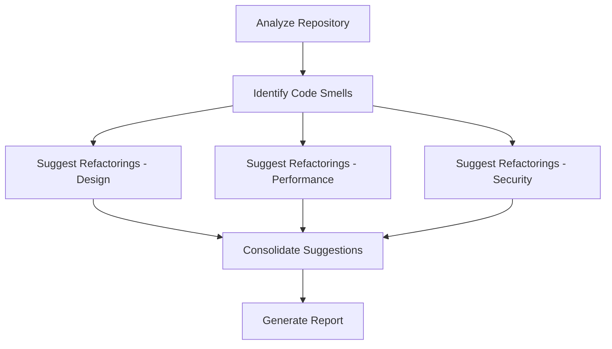

# Example: Multi-Agent Decomposition

Example of complex task decomposition in multi-agent systems.

## Original Task

"Analyze repository, identify code smells, suggest refactorings, and generate report"

## Decomposition


```mermaid
graph TD
    A[Analyze Repository] --> B[Identify Code Smells]
    B --> C1[Suggest Refactorings - Design]
    B --> C2[Suggest Refactorings - Performance]
    B --> C3[Suggest Refactorings - Security]
    C1 --> D[Consolidate Suggestions]
    C2 --> D
    C3 --> D
    D --> E[Generate Report]
```

## Roles

| Agent | Role | Model |
|--------|-------|--------|
| Scanner | Specialist | Standard |
| Design Analyzer | Specialist | Advanced |
| Performance Analyzer | Specialist | Standard |
| Security Analyzer | Specialist | Advanced |
| Consolidator | Specialist | Standard |
| Report Generator | Formatter | Lightweight |

## Contracts

### Scanner → Analyzer

```yaml
input:
  schema: RepositoryScan
  fields:
    - name: files
      type: array
      required: true
    - name: languages
      type: array
      required: true

output:
  schema: CodeSmells
  fields:
    - name: smells
      type: array
      required: true
    - name: severity
      type: string
      required: true
```

### Analyzer → Consolidator

```yaml
input:
  schema: RefactoringSuggestions
  fields:
    - name: suggestions
      type: array
      required: true
    - name: category
      type: string
      required: true

output:
  schema: ConsolidatedSuggestions
  fields:
    - name: all_suggestions
      type: array
      required: true
    - name: priorities
      type: array
      required: true
```

## Execution

1. Scanner analyzes repository (parallel)
2. 3 Analyzers process code smells (parallel - fan-out)
3. Consolidator aggregates suggestions (fan-in)
4. Report Generator formats report

## Result

- Total time: 45s (vs 180s sequential)
- Cost: $0.12 (vs $0.45 with single advanced model)
- Quality: 95% code smells identified