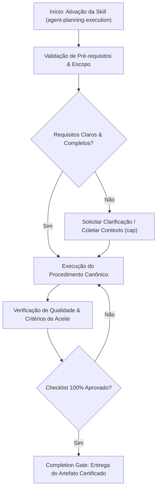

# Agent Planning & Execution Hub

Comprehensive planning, roadmap management, task decomposition, and plan execution hub.


## Sub-Domain / Component: `planning`

# Structured Planning

## Overview

Structured planning converts vague requirements into approved, documented implementation plans before any code is written. It forces clarifying questions, approach comparison with trade-offs, and explicit user approval — preventing the most common cause of wasted effort: building the wrong thing. Every task, regardless of perceived simplicity, goes through this process.

**Announce at start:** "I'm using the planning skill to create a structured implementation plan."

## Trigger Conditions

- User requests a new feature, enhancement, or change
- A bug fix requires more than a one-line change
- Refactoring work spanning multiple files
- Any task where the approach is not already documented and approved
- Transition from brainstorming skill with an approved design
- `/plan` command invoked

---

## Phase 1: Context Gathering

**Goal:** Understand the codebase and existing patterns before asking questions.

1. Read relevant files, docs, recent commits, and CLAUDE.md
2. Check memory files for known project context, stack, and conventions
3. Review existing plans in `docs/plans/` for related work
4. Identify existing patterns the new work should follow
5. Note technical constraints discovered during exploration

**STOP — Do NOT proceed to Phase 2 until:**
- [ ] You have explored the relevant parts of the codebase
- [ ] You understand the existing architecture and patterns
- [ ] You have checked memory files for prior decisions

---

## Phase 2: Clarifying Questions

**Goal:** Eliminate ambiguity by asking targeted questions one at a time.

1. Ask ONE question per message — never overwhelm with multiple questions
2. Prefer multiple choice questions when possible
3. Study the codebase before asking — do not ask what you can discover
4. Convert vague requirements into specific, testable criteria

### Question Category Priority

| Priority | Category | Example Question |
|----------|----------|-----------------|
| 1 | Purpose | "What problem does this solve? Who is it for?" |
| 2 | Success criteria | "How will we know it works? What does 'done' look like?" |
| 3 | Constraints | "Are there performance, compatibility, or timeline constraints?" |
| 4 | Non-goals | "What should we explicitly NOT build?" |
| 5 | Existing patterns | "Should we follow the pattern used in X, or is a new approach needed?" |
| 6 | Edge cases | "What should happen when [boundary condition]?" |

### Question Rules

| Rule | Rationale |
|------|-----------|
| One question per message | Prevents cognitive overload |
| Multiple choice preferred | Faster to answer, reduces ambiguity |
| Research before asking | Respect user's time — discover what you can |
| Testable criteria | Vague answers lead to vague implementations |

**STOP — Do NOT proceed to Phase 3 until:**
- [ ] You understand the purpose and success criteria
- [ ] You have identified constraints and non-goals
- [ ] No- writing-plans
- reverse-engineering-specs

## ⚠️ Token Optimization (Skip Consolidated ADRs)
Quando você precisar varrer as ADRs do repositório para obter contexto, faça **PRIMEIRO** a leitura do `docs/adr/ADR-INDEX.md` ou um `grep` no frontmatter das ADRs. 
Você está **PROIBIDO** de ler o conteúdo completo (via `view_file` ou `cat`) de qualquer arquivo que possua a tag `implementation_status: CONSOLIDADA` no seu frontmatter YAML. Aplique o 'SKIP' sumário a esses arquivos, pois o conteúdo é passado e estático. Só faça a leitura profunda caso o usuário solicite especificamente uma auditoria, ou se a tarefa atual exigir a modificação daquela exata arquitetura.

## Condições de Ativação

## Phase 3: Approach Design

**Goal:** Propose 2-3 concrete approaches with trade-offs and a clear recommendation.

For each approach, include:

| Section | Content |
|---------|---------|
| Architecture summary | 2-3 sentences describing the approach |
| Key files | Exact paths to create/modify |
| Dependencies | External deps or breaking changes |
| Trade-offs | Explicit pros and cons |
| Effort estimate | Number of tasks (not hours) |
| Risk level | Low / Medium / High with explanation |

### Approach Selection Decision Table

| Factor | Weight | How to Evaluate |
|--------|--------|----------------|
| Alignment with existing patterns | High | Does it match current codebase conventions? |
| Simplicity | High | Fewest moving parts that meet requirements |
| Testability | Medium | Can each component be independently tested? |
| Future extensibility | Low | Only consider if user mentioned future plans |
| Performance | Varies | Only if user specified performance constraints |

**Lead with your recommended approach.** Explain why it is the best choice given the constraints. Present alternatives to show you considered the trade-off space.

**STOP — Do NOT proceed to Phase 4 until:**
- [ ] You have proposed at least 2 approaches
- [ ] Each approach has trade-offs documented
- [ ] You have made a clear recommendation with reasoning

---

## Phase 4: Plan Documentation

**Goal:** Write a detailed, executable plan document and get explicit approval.

### Plan Document Format

```markdown
# [Feature Name] Implementation Plan

**Goal:** [One sentence]
**Architecture:** [2-3 sentences]
**Approach:** [Which approach was chosen and why]

---

### Task N: [Component Name]

**Files:**
- Create: `exact/path/to/file.ext`
- Modify: `exact/path/to/existing.ext`
- Test: `tests/exact/path/to/test.ext`

**Steps:**
1. Write the failing test
2. Run test to verify it fails
3. Write minimal implementation
4. Run test to verify it passes
5. Commit

**Verification:** [Exact command to verify this task]
```

### Plan Quality Checklist

| Criterion | Check |
|-----------|-------|
| Every task has exact file paths | No "somewhere in src/" |
| Every task has a verification command | No "eyeball it" |
| Tasks are ordered by dependency | No forward references |
| Tasks are 2-5 minutes each | No "implement the whole module" |
| TDD steps are explicit | RED-GREEN-REFACTOR per task |

## Fallback e Governança (ADR-002)

**ATENÇÃO:** O planejamento deve idealmente ser derivado de uma ADR aprovada e refletido no Roadmap.
Se o repositório já segue o padrão de governança de ADRs (`docs/adr/`), **NÃO** crie arquivos isolados.
1. **Fallback**: Se a feature solicitada é complexa e não possui ADR, acione a skill `adr-generator` antes de prosseguir.
2. Salve o plano detalhado no formato `docs/adr/ADR-XXX-PI.md` (Implementation Plan).
3. **Roadmap**: Exija o preenchimento ou atualização do Roadmap do projeto (via `roadmap-update` ou atualizando o arquivo de roadmap aplicável) para refletir o planejamento recém-criado.

Se o repositório for legado (Fallback silencioso), salve provisoriamente o plano em `docs/plans/YYYY-MM-DD-<feature>.md`.

**STOP — Do NOT proceed to Phase 5 until:**
- [ ] Plan document is written and saved (preferencialmente atrelado a uma ADR)
- [ ] Every task has file paths, steps, and verification
- [ ] User has explicitly approved the plan (said "yes", "approved", "go ahead", etc.)
- [ ] Roadmap atualizado (se aplicável)

---

## Phase 5: Transition to Execution

**Goal:** Hand off the approved plan to the appropriate execution skill.

### Transition Decision Table

| Situation | Next Skill | Rationale |
|-----------|-----------|-----------|
| Standard implementation (< 10 tasks) | `task-management` | Sequential tracked execution |
| Large implementation (10+ independent tasks) | `subagent-driven-development` | Parallel execution with review gates |
| Autonomous development session | `autonomous-loop` | Ralph-style iterative execution |
| Single focused task | `executing-plans` | Direct plan execution |

Invoke the chosen skill and pass the plan document path.

---

## Anti-Patterns / Common Mistakes

| Anti-Pattern | Why It Fails | Correct Approach |
|-------------|-------------|-----------------|
| "This is too simple to plan" | Simple tasks have unexamined assumptions | Plan anyway — the plan can be short |
| "I already know the approach" | Your approach may conflict with project patterns | Document it and get approval |
| "The user wants it fast" | Bad code is slower than planned code | Planning prevents rework |
| "It's just a bug fix" | Bug fixes need root cause analysis | Plan the fix, not just the patch |
| "I'll plan as I go" | That is improvising, not planning | Plan first, execute second |
| Asking 5 questions at once | Overwhelms the user, gets vague answers | One question per message |
| Proposing only 1 approach | No trade-off analysis, may miss better options | Always propose 2-3 approaches |
| Vague file references | "Update the tests" — which tests? | Exact file paths always |
| Tasks that take 30+ minutes | Too large to track and verify | Break into 2-5 minute tasks |
| Starting code before approval | Wastes effort if direction changes | Wait for explicit "yes" |

---

## Anti-Rationalization Guards

<HARD-GATE>
Do NOT write any code, create any files, or take any implementation action until:
1. You have asked clarifying questions and understood the requirements
2. You have proposed approaches with trade-offs
3. The user has explicitly approved the plan

This applies to EVERY task regardless of perceived simplicity.
</HARD-GATE>

**Iron Law: NO CODE WITHOUT AN APPROVED PLAN.** No exceptions. No "just this small thing." No "it's obvious."

If you catch yourself thinking any of the following, STOP immediately:
- "Let me just quickly..." — No. Plan first.
- "This doesn't need a full plan..." — Yes it does. The plan can be brief.
- "I'll document it after..." — No. Document before.

---

## Subagent Dispatch Opportunities

| Task Pattern | Dispatch To | When |
|---|---|---|
| Independent research tasks during planning | `Agent` tool with `subagent_type="Explore"` | When gathering context from multiple codebase areas |
| Plan validation across architecture layers | `Agent` tool dispatching `planner` agent | When plan covers multiple system boundaries |
| After plan approval, independent implementation tasks | `Agent` tool (multiple parallel, per `dispatching-parallel-agents` skill) | When plan steps have no dependencies between them |

Follow the `dispatching-parallel-agents` skill protocol when dispatching.

---

## Integration Points

| Skill | Relationship | When |
|-------|-------------|------|
| `brainstorming` | Upstream — provides design context | Planning follows brainstorming |
| `task-management` | Downstream — receives approved plan | Standard execution path |
| `executing-plans` | Downstream — executes plan directly | Single-task execution |
| `subagent-driven-development` | Downstream — parallel execution | Large independent task sets |
| `autonomous-loop` | Downstream — iterative execution | Ralph-style sessions |
| `self-learning` | Bidirectional — informs and learns from planning | Context loading and pattern storage |
| `verification-before-completion` | Downstream — verifies plan completeness | Before claiming plan is done |
| `task-decomposition` | Complementary — provides WBS for complex plans | When plan needs hierarchical breakdown |

---

## Concrete Examples

### Example: Small Bug Fix Plan

```markdown
# Fix: Login button disabled state not clearing

**Goal:** Fix login button remaining disabled after failed login attempt
**Architecture:** State management bug in LoginForm component
**Approach:** Reset `isSubmitting` state in the catch block of handleSubmit

### Task 1: Write failing test
**Files:** Test: `tests/components/LoginForm.test.tsx`
**Steps:** Write test that submits invalid credentials and verifies button re-enables
**Verification:** `npm test -- --grep "re-enables button after failed login"`

### Task 2: Fix the bug
**Files:** Modify: `src/components/LoginForm.tsx`
**Steps:** Add `setIsSubmitting(false)` to catch block in handleSubmit
**Verification:** `npm test -- --grep "LoginForm"` — all pass
```

### Example: Transition Command

After plan approval:
```
Plan approved and saved to docs/plans/2026-03-15-login-fix.md.
Invoking task-management skill to begin tracked execution.
```

---

## Verification Gate

Before claiming the plan is complete, verify:
1. IDENTIFY: Plan document exists at `docs/plans/`
2. RUN: Review plan for completeness against quality checklist
3. READ: Verify all sections are filled with specific details
4. VERIFY: User has explicitly approved
5. CLAIM: Only then transition to implementation

---

## Key Principles

- **DRY** — Do not repeat yourself
- **YAGNI** — Do not build what is not needed yet
- **TDD** — Write tests first when applicable
- **Frequent commits** — Small, atomic commits after each task
- **Exact paths** — Always specify exact file paths in the plan

---

## Skill Type

**RIGID** — Follow this process exactly for every implementation task. The phases are sequential and non-negotiable. No code without an approved plan.

---


## Sub-Domain / Component: `writing-plans`

# Writing Plans

## Overview

Write comprehensive implementation plans assuming the engineer has zero context for our codebase and questionable taste. Document everything they need to know: which files to touch for each task, code, testing, docs they might need to check, how to test it. Give them the whole plan as bite-sized tasks. DRY. YAGNI. TDD. Frequent commits.

Assume they are a skilled developer, but know almost nothing about our toolset or problem domain. Assume they don't know good test design very well.

**Announce at start:** "I'm using the writing-plans skill to create the implementation plan."

**Context:** If working in an isolated worktree, it should have been created via the `superpowers:using-git-worktrees` skill at execution time.

## ⚠️ Token Optimization (Skip Consolidated ADRs)
Quando você precisar varrer as ADRs do repositório para obter contexto, faça **PRIMEIRO** a leitura do `docs/adr/ADR-INDEX.md` ou um `grep` no frontmatter das ADRs. 
Você está **PROIBIDO** de ler o conteúdo completo (via `view_file` ou `cat`) de qualquer arquivo que possua a tag `implementation_status: CONSOLIDADA` no seu frontmatter YAML. Aplique o 'SKIP' sumário a esses arquivos, pois o conteúdo é passado e estático. Só faça a leitura profunda caso o usuário solicite especificamente uma auditoria, ou se a tarefa atual exigir a modificação daquela exata arquitetura.

## Fallback e Governança (ADR-002)

**ATENÇÃO:** Planos de implementação (PI) devem idealmente derivar de uma ADR aprovada.
Se o repositório já segue o padrão de governança de ADRs (`docs/adr/`), **NÃO** crie arquivos isolados.
1. Se não houver ADR para a feature solicitada, acione o **Fallback**: peça para o usuário gerar a ADR (usando a skill `adr-generator`) antes de detalhar o plano, a menos que seja uma tarefa trivial.
2. Ao gerar o plano, escreva-o em `docs/adr/ADR-XXX-PI.md` (Implementation Plan).
3. Exija o uso e atualização do arquivo `docs/adr/ADR-XXX-TODO.md` para rastrear as tarefas criadas no PI. (Não use formatos antigos como `task-card`).

<HARD-GATE: UNIFIED-TODO>
**É TERMINANTEMENTE PROIBIDO** criar múltiplos arquivos TODO para a mesma ADR (ex: `ADR-XXX-P2-TODO.md` ou `ADR-XXX-Fase2-TODO.md`). O formato da Quadra exige mapeamento 1:1 rigoroso. 
Se uma ADR tiver múltiplas fases, mapeie TODAS ELAS em um único arquivo `ADR-XXX-TODO.md` usando cabeçalhos markdown (`## Fase 1`, `## Fase 2`). 
Se o escopo da ADR for gigantesco a ponto de inviabilizar um único TODO, oriente o usuário a desmembrar a própria ADR-mãe em sub-ADRs independentes (ex: `ADR-008-A`, `ADR-008-B`), cada qual com sua própria Quadra.
</HARD-GATE>

Se o repositório for legado e não possuir governança de ADRs (Fallback silencioso), salve provisoriamente em: `docs/superpowers/plans/YYYY-MM-DD-<feature-name>.md` e ignore o `todo`.

## Scope Check

If the spec covers multiple independent subsystems, it should have been broken into sub-project specs during brainstorming. If it wasn't, suggest breaking this into separate plans — one per subsystem. Each plan should produce working, testable software on its own.

## File Structure

Before defining tasks, map out which files will be created or modified and what each one is responsible for. This is where decomposition decisions get locked in.

- Design units with clear boundaries and well-defined interfaces. Each file should have one clear responsibility.
- You reason best about code you can hold in context at once, and your edits are more reliable when files are focused. Prefer smaller, focused files over large ones that do too much.
- Files that change together should live together. Split by responsibility, not by technical layer.
- In existing codebases, follow established patterns. If the codebase uses large files, don't unilaterally restructure - but if a file you're modifying has grown unwieldy, including a split in the plan is reasonable.

This structure informs the task decomposition. Each task should produce self-contained changes that make sense independently.

## Task Right-Sizing

A task is the smallest unit that carries its own test cycle and is worth a
fresh reviewer's gate. When drawing task boundaries: fold setup,
configuration, scaffolding, and documentation steps into the task whose
deliverable needs them; split only where a reviewer could meaningfully
reject one task while approving its neighbor. Each task ends with an
independently testable deliverable.

## Bite-Sized Task Granularity

**Each step is one action (2-5 minutes):**
- "Write the failing test" - step
- "Run it to make sure it fails" - step
- "Implement the minimal code to make the test pass" - step
- "Run the tests and make sure they pass" - step
- "Commit" - step

## Plan Document Header

**Every plan MUST start with this header:**

```markdown
# [Feature Name] Implementation Plan

> **For agentic workers:** REQUIRED SUB-SKILL: Use superpowers:subagent-driven-development (recommended) or superpowers:executing-plans to implement this plan task-by-task. Steps use checkbox (`- [ ]`) syntax for tracking.

**Goal:** [One sentence describing what this builds]

**Architecture:** [2-3 sentences about approach]

**Tech Stack:** [Key technologies/libraries]

## Global Constraints

[The spec's project-wide requirements — version floors, dependency limits,
naming and copy rules, platform requirements — one line each, with exact
values copied verbatim from the spec. Every task's requirements implicitly
include this section.]

---
```

## Task Structure

````markdown
### Task N: [Component Name]

**Files:**
- Create: `exact/path/to/file.py`
- Modify: `exact/path/to/existing.py:123-145`
- Test: `tests/exact/path/to/test.py`

**Interfaces:**
- Consumes: [what this task uses from earlier tasks — exact signatures]
- Produces: [what later tasks rely on — exact function names, parameter
  and return types. A task's implementer sees only their own task; this
  block is how they learn the names and types neighboring tasks use.]

- [ ] **Step 1: Write the failing test**

```python
def test_specific_behavior():
    result = function(input)
    assert result == expected
```

- [ ] **Step 2: Run test to verify it fails**

Run: `pytest tests/path/test.py::test_name -v`
Expected: FAIL with "function not defined"

- [ ] **Step 3: Write minimal implementation**

```python
def function(input):
    return expected
```

- [ ] **Step 4: Run test to verify it passes**

Run: `pytest tests/path/test.py::test_name -v`
Expected: PASS

- [ ] **Step 5: Commit**

```bash
git add tests/path/test.py src/path/file.py
git commit -m "feat: add specific feature"
```
````

## No Placeholders

Every step must contain the actual content an engineer needs. These are **plan failures** — never write them:
- "TBD", "TODO", "implement later", "fill in details"
- "Add appropriate error handling" / "add validation" / "handle edge cases"
- "Write tests for the above" (without actual test code)
- "Similar to Task N" (repeat the code — the engineer may be reading tasks out of order)
- Steps that describe what to do without showing how (code blocks required for code steps)
- References to types, functions, or methods not defined in any task

## Remember
- Exact file paths always
- Complete code in every step — if a step changes code, show the code
- Exact commands with expected output
- DRY, YAGNI, TDD, frequent commits

## Self-Review

After writing the complete plan, look at the spec with fresh eyes and check the plan against it. This is a checklist you run yourself — not a subagent dispatch.

**1. Spec coverage:** Skim each section/requirement in the spec. Can you point to a task that implements it? List any gaps.

**2. Placeholder scan:** Search your plan for red flags — any of the patterns from the "No Placeholders" section above. Fix them.

**3. Type consistency:** Do the types, method signatures, and property names you used in later tasks match what you defined in earlier tasks? A function called `clearLayers()` in Task 3 but `clearFullLayers()` in Task 7 is a bug.

If you find issues, fix them inline. No need to re-review — just fix and move on. If you find a spec requirement with no task, add the task.

## Execution Handoff

After saving the plan, offer execution choice:

**"Plan complete and saved to `docs/superpowers/plans/<filename>.md`. Two execution options:**

**1. Subagent-Driven (recommended)** - I dispatch a fresh subagent per task, review between tasks, fast iteration

**2. Inline Execution** - Execute tasks in this session using executing-plans, batch execution with checkpoints

**Which approach?"**

**If Subagent-Driven chosen:**
- **REQUIRED SUB-SKILL:** Use superpowers:subagent-driven-development
- Fresh subagent per task + two-stage review

**If Inline Execution chosen:**
- **REQUIRED SUB-SKILL:** Use superpowers:executing-plans
- Batch execution with checkpoints for review

---


## Sub-Domain / Component: `executing-plans`

# Executing Plans

## Overview

This skill turns an approved plan document into working code through disciplined, batch-based execution. Each step is implemented with TDD, verified before proceeding, and reviewed at checkpoints. It provides the structural framework for moving from plan to production code with consistent quality gates.

**Announce at start:** "I'm using the executing-plans skill to implement the approved plan at [plan path]."

## Trigger Conditions

- An approved plan document exists and is ready for implementation
- `/execute` command invoked with a plan reference
- Resuming a partially completed plan execution
- Transition from planning skill after plan approval

---

## Phase 1: Read the Plan

**Goal:** Thoroughly understand the plan before writing any code.

1. Read the entire plan document from start to finish
2. Identify all implementation steps and count them
3. Map dependencies between steps (what must be done first)
4. Note any ambiguities or open questions
5. Confirm understanding with the user before proceeding

### Plan Comprehension Checklist

| Check | Question |
|-------|---------|
| Goal clarity | Can you explain the plan's goal in one sentence? |
| Step count | How many implementation steps are there? |
| Dependencies | Which steps depend on which? |
| Ambiguities | Are there any unclear or underspecified steps? |
| Verification | Does every step have a verification method? |

**STOP — Do NOT proceed to Phase 2 until:**
- [ ] You can explain the plan's goal in one sentence
- [ ] You can list all implementation steps
- [ ] Dependencies are mapped
- [ ] Any ambiguities are noted and resolved with user
- [ ] User has confirmed you may proceed

---

## Phase 2: Create Task Batch

**Goal:** Break the plan into small, executable task batches.

### Batch Size Decision Table

| Task Complexity | Batch Size | Examples |
|----------------|-----------|---------|
| Simple (config, boilerplate) | Up to 5 tasks | ENV vars, imports, type definitions |
| Standard (features, logic) | 3 tasks | Endpoints, services, components |
| Complex (integrations, security) | 2 tasks | OAuth flows, payment processing |
| Critical (data migration, auth) | 1 task | Database migrations, credential handling |

### Task Requirements (STIC)

| Criterion | Description |
|-----------|------------|
| **S**pecific | Clear definition of what to implement |
| **T**estable | Can be verified with automated tests |
| **I**ndependent | Minimal coupling to other tasks in the batch (where possible) |
| **C**ompact | Completable in a focused session (2-5 minutes) |

### Task Template

```
Task: [concise description]
Plan Step: [reference to plan section]
Files to Create/Modify: [list of exact file paths]
Acceptance Criteria:
  - [specific, testable criterion 1]
  - [specific, testable criterion 2]
Dependencies: [other tasks that must be done first, or "none"]
Verification: [exact command to run]
```

**STOP — Do NOT proceed to Phase 3 until:**
- [ ] Tasks created for the current batch
- [ ] Each task has clear acceptance criteria
- [ ] Dependencies are satisfied (previous tasks complete)
- [ ] Tasks ordered by dependency (independent tasks first)

---

## Phase 3: Execute Tasks

**Goal:** Execute each task one at a time using TDD.

### Per-Task Workflow

```
1. ANNOUNCE which task you are starting
2. IMPLEMENT using test-driven-development skill:
   a. Write failing test (RED)
   b. Write minimal code to pass (GREEN)
   c. Refactor (REFACTOR)
   d. Repeat RED-GREEN-REFACTOR for each behavior
3. VERIFY using verification-before-completion skill:
   a. Run full test suite (not just new tests)
   b. Run lint, type-check, build as applicable
   c. Confirm all checks pass
4. MARK task as complete
5. PROCEED to next task
```

### Execution Rules

| Rule | Rationale |
|------|-----------|
| One task at a time | Do not start task 2 until task 1 is verified |
| Follow TDD strictly | No production code without a failing test |
| Do not deviate from the plan | If plan needs changes, stop and discuss with user |
| Do not skip verification | Every task must pass verification before marking complete |
| Report progress | Announce start and completion of each task |

### Task Outcome Decision Table

| Outcome | Action | Next Step |
|---------|--------|-----------|
| Verification passes | Mark complete | Next task |
| Test failure, obvious fix | Fix and re-verify | Same task |
| Test failure, unclear cause | Invoke `systematic-debugging` | Same task after fix |
| Plan step is ambiguous | Stop and ask user | Wait for clarification |
| Plan step is not feasible | Report blocker | Wait for direction |
| Unexpected dependency found | Report and reorder | Adjust batch |

**STOP — Do NOT proceed to next task until:**
- [ ] Current task's acceptance criteria are met
- [ ] All tests pass (new and existing)
- [ ] Verification-before-completion has been executed
- [ ] Task marked as complete

---

## Phase 4: Batch Checkpoint

**Goal:** After completing all tasks in a batch, perform a full checkpoint review.

### Checkpoint Steps

1. Run full test suite — all tests, not just those from the current batch
2. Run all verification commands — lint, type-check, build, format
3. Review what was implemented — summarize completed tasks and outcomes
4. Assess progress against the plan — how far through are we?
5. Identify any issues or risks that came up during execution
6. Report to user and ask for direction

### Checkpoint Report Template

```
BATCH CHECKPOINT
================
Batch: [N] of [estimated total]
Tasks Completed: [list]

Verification Results:
  Tests:      [X passed, Y failed, Z skipped]
  Build:      [pass/fail]
  Lint:       [pass/fail, N warnings]
  Type-check: [pass/fail]

Progress: [N of M plan steps complete] ([percentage]%)

Issues Encountered:
  - [issue 1 and how it was resolved]

Risks or Concerns:
  - [risk 1]

Next Batch Preview:
  - [task 1]
  - [task 2]
  - [task 3]

Awaiting direction: Continue with next batch / Adjust plan / Other?
```

**STOP — Do NOT proceed to next batch until:**
- [ ] Full test suite passes
- [ ] All verification commands pass
- [ ] Checkpoint report presented to user
- [ ] User has confirmed to continue

---

## Phase 5: Continue, Adjust, or Complete

**Goal:** Act on user direction after each checkpoint.

### Direction Decision Table

| User Direction | Action | Next Phase |
|---------------|--------|-----------|
| "Continue" | Create next batch of tasks | Phase 2 |
| "Adjust plan" | Discuss changes, update plan document | Phase 2 (with updated plan) |
| "Stop here" | Summarize progress, note remaining work | Completion |
| "Skip ahead to [step]" | Verify dependencies are met, then jump | Phase 2 (at new step) |
| "Go back and redo [task]" | Revert if needed, re-execute with corrections | Phase 3 |

Never proceed to the next batch without explicit user approval.

---

## Critical Blocker Handling

When you encounter something that prevents task completion, do NOT work around it. Stop and escalate.

### Blocker Classification

| Type | Examples | Action |
|------|---------|--------|
| Ambiguous spec | Plan step could mean multiple things | Present interpretations, ask user |
| Missing dependency | Required API or library unavailable | Report with alternatives |
| Contradiction | Step conflicts with another part of the plan | Identify both sides, ask user |
| Security concern | Planned approach has vulnerability | Report risk, propose safer alternative |
| Feasibility | Step cannot be implemented as described | Explain why, propose alternatives |

### Blocker Report Format

```
CRITICAL BLOCKER
================
Task: [which task is blocked]
Blocker: [clear description of the problem]
Impact: [what cannot proceed until this is resolved]
Options:
  A. [option with tradeoffs]
  B. [option with tradeoffs]
  C. [skip this step and continue]

Awaiting direction before proceeding.
```

**Do NOT** guess what the user intended. **Do NOT** implement a workaround without approval. **Do NOT** skip the blocked task silently. **DO** present options with clear tradeoffs. **DO** continue with non-blocked tasks if possible (but flag the skip).

---

## Subagent Dispatch Option

For larger plans, individual tasks can be dispatched to subagents for parallel execution.

### When to Suggest Subagent Dispatch

| Condition | Threshold |
|-----------|-----------|
| Independent tasks in plan | 10+ tasks with few dependencies |
| Task specification quality | Each task has clear acceptance criteria |
| Speed requirement | User has indicated urgency |
| Task interdependency | Low coupling between tasks |

When conditions are met, suggest switching to the `subagent-driven-development` skill for the remaining work.

---

## Anti-Patterns / Common Mistakes

| Anti-Pattern | Why It Fails | Correct Approach |
|-------------|-------------|-----------------|
| Implementing entire plan at once | No checkpoints, no quality gates | Batch-based execution with checkpoints |
| Skipping TDD because "it's simple" | Bugs accumulate, regressions appear | Every task uses TDD, no exceptions |
| Working around blockers silently | User unaware, wrong assumptions baked in | Stop and escalate blockers |
| Proceeding without approval after batch | Direction may have changed | Always checkpoint and wait |
| Deviating from the plan | Unauthorized changes, scope creep | Discuss changes before implementing |
| Running only new tests | Regressions go undetected | Full test suite at checkpoints |
| Marking tasks complete without verification | False progress, accumulated bugs | Verification is mandatory |
| Batches larger than 5 tasks | Hard to review, too much risk per batch | Keep batches small |
| Skipping checkpoint report | User loses visibility into progress | Always present full checkpoint |
| Not committing at batch boundaries | Huge diffs, hard to revert | Commit after each batch |

---

## Anti-Rationalization Guards

<HARD-GATE>
Do NOT skip any verification step. Do NOT proceed past a checkpoint without user approval. Do NOT deviate from the approved plan without discussion.
**ER.md GENERATION BAN**: You are STRICTLY PROHIBITED from creating or generating `*ER.md` (Execution Report) files. For ADR implementations, you must only check the boxes in the `TODO.md` file and run the audit tool (`python3 ~/.gemini/config/skills/adr-archive/scripts/audit.py .`), which is the exclusive gatekeeper authorized to generate ERs.
</HARD-GATE>

If you catch yourself thinking:
- "I know what comes next, I'll skip the checkpoint..." — No. Report and wait.
- "This verification is redundant..." — Run it anyway. Fresh evidence only.
- "The plan is close enough, I'll adjust as I go..." — Discuss adjustments first.

---

## Subagent Dispatch Opportunities

| Task Pattern | Dispatch To | When |
|---|---|---|
| Independent plan steps with no shared state | Parallel subagents via `Agent` tool | When dependency analysis shows no blockers between steps |
| Code review of completed step | `code-reviewer` agent | After each major plan step completion |
| Test execution for completed features | Background `Bash` task | When tests can run independently of ongoing work |

Follow the `dispatching-parallel-agents` skill protocol when dispatching.

---

## Integration Points

| Skill | Relationship | When |
|-------|-------------|------|
| `planning` | Upstream — provides approved plan document | Plan is the input to this skill |
| `test-driven-development` | Per-task — TDD cycle for every code task | Phase 3 execution |
| `verification-before-completion` | Per-task — verification gate | Before marking any task complete |
| `systematic-debugging` | On failure — investigate unexpected failures | When task encounters errors |
| `code-review` | At checkpoints — review code quality | Phase 4 batch review |
| `subagent-driven-development` | Alternative — parallel execution path | For large independent task sets |
| `resilient-execution` | On failure — retry with alternatives | When task approaches fail |
| `task-management` | Complementary — provides task tracking | Can be used together |

---

## Concrete Examples

### Example: Batch Creation from Plan

Plan: "Add user authentication with JWT"

```
Batch 1 (3 tasks):
  Task 1: Write failing test for JWT token generation
    Files: tests/auth/jwt.test.ts
    Verification: npm test -- --grep "JWT generation" → FAIL (expected)

  Task 2: Implement JWT token generation
    Files: src/auth/jwt.ts
    Verification: npm test -- --grep "JWT generation" → PASS

  Task 3: Write failing test for auth middleware
    Files: tests/middleware/auth.test.ts
    Verification: npm test -- --grep "auth middleware" → FAIL (expected)

[CHECKPOINT after batch 1]

Batch 2 (3 tasks):
  Task 4: Implement auth middleware
  Task 5: Write failing test for login endpoint
  Task 6: Implement login endpoint

[CHECKPOINT after batch 2]
```

---

## Completion Criteria

The plan execution is complete when:
1. All plan steps have been implemented as tasks
2. All tasks have passed verification
3. Full test suite passes
4. Final checkpoint report presented to user
5. User confirms the plan is complete
6. **FINAL STEP (For ADR-based plans):** You MUST run `python3 ~/.gemini/config/skills/adr-archive/scripts/audit.py .`, read the generated audit report from `docs/reports`, and present its verdict (success or pending debts) to the user.

---

## Skill Type

**RIGID** — Follow this process exactly. Batches, checkpoints, and verification gates are non-negotiable. No task is complete without verification. No batch proceeds without user approval.

---


## Sub-Domain / Component: `task-decomposition`

# Task Decomposition

## Overview

Task decomposition breaks complex tasks into manageable, well-defined subtasks with clear dependencies, effort estimates, and parallelization opportunities. It covers hierarchical work breakdown structures (WBS), dependency graph construction, critical path analysis, task sizing, and identification of concurrent execution opportunities. Essential for planning multi-step implementations, project estimation, and autonomous loop task selection.

**Announce at start:** "I'm using the task-decomposition skill to break this work into a structured hierarchy with dependencies and estimates."

## Trigger Conditions

- Complex task needs to be broken into subtasks
- Dependency mapping is needed between work items
- Effort estimation is required for planning
- Parallelization opportunities need to be identified
- `/decompose` command invoked
- Transition from planning skill for complex plans
- Autonomous loop needs task selection guidance

---

## Phase 1: Scope Definition

**Goal:** Define clear boundaries for the decomposition.

1. Define the overall deliverable and acceptance criteria
2. Identify the boundaries (what is in scope, what is not)
3. Determine the decomposition granularity level
4. Identify stakeholders and their requirements
5. Establish constraints (time, resources, dependencies)

### Granularity Decision Table

| Context | Target Level | Typical Duration | Rationale |
|---------|-------------|-----------------|-----------|
| Autonomous loop (Ralph) | L3-L4 (Task/Subtask) | 15 min - 4 hours | ONE task per loop iteration |
| Sprint planning | L2-L3 (Story/Task) | 0.5-2 days | Sprint-sized work items |
| Roadmap planning | L0-L1 (Epic/Feature) | 2-8 weeks | High-level milestone tracking |
| Bug fix | L3-L4 (Task/Subtask) | 15 min - 2 hours | Focused, specific fixes |

### Granularity Levels

| Level | Name | Typical Duration | Example |
|-------|------|-----------------|---------|
| L0 | Epic | 2-8 weeks | "User authentication system" |
| L1 | Feature | 2-5 days | "OAuth2 login flow" |
| L2 | Story | 0.5-2 days | "Google OAuth provider integration" |
| L3 | Task | 1-4 hours | "Implement Google callback handler" |
| L4 | Subtask | 15-60 minutes | "Parse OAuth token response" |

**STOP — Do NOT proceed to Phase 2 until:**
- [ ] Deliverable and acceptance criteria are defined
- [ ] Scope boundaries are clear (in/out)
- [ ] Target granularity level is chosen
- [ ] Constraints are identified

---

## Phase 2: Hierarchical Breakdown

**Goal:** Decompose the work into a tree structure meeting the INVEST criteria.

1. Identify top-level work streams (epics or major components)
2. Break each work stream into features or milestones
3. Decompose features into implementable tasks
4. Apply the "2-hour rule" — no task should exceed 2 hours of focused work
5. Ensure each task has a clear definition of done
6. Verify MECE (Mutually Exclusive, Collectively Exhaustive) coverage

### The INVEST Criteria for Tasks

| Criterion | Question | Bad Example | Good Example |
|-----------|---------|-------------|-------------|
| **I**ndependent | Can this be done without waiting for others? | "Implement auth after DB is ready" | "Implement auth with mock DB" |
| **N**egotiable | Is the approach flexible? | "Use Redis for caching" | "Add caching layer for user sessions" |
| **V**aluable | Does completing this deliver value? | "Set up folder structure" | "Create user registration endpoint" |
| **E**stimable | Can you estimate the effort? | "Improve performance" | "Add database index for user lookup query" |
| **S**mall | Can one person finish it in < 2 hours? | "Build the dashboard" | "Create dashboard chart component for revenue data" |
| **T**estable | Can you verify it is done? | "Make it better" | "Response time < 200ms for /api/users" |

### MECE Verification

| Check | Question |
|-------|---------|
| Mutually Exclusive | Does any task overlap with another? (Should not) |
| Collectively Exhaustive | Do all tasks together cover the full deliverable? (Should) |
| No orphans | Does every task contribute to the deliverable? |
| No gaps | Is there any work needed that has no task? |

**STOP — Do NOT proceed to Phase 3 until:**
- [ ] All work streams are identified
- [ ] Tasks meet INVEST criteria
- [ ] MECE coverage is verified
- [ ] No task exceeds 2 hours

---

## Phase 3: Dependency Mapping

**Goal:** Build a directed acyclic graph (DAG) of task dependencies.

1. Identify input/output dependencies between tasks
2. Classify dependency types
3. Build a directed acyclic graph (DAG)
4. Identify the critical path (longest dependency chain)
5. Flag circular dependencies as errors to resolve
6. Mark external dependencies (API access, approvals, third-party)

### Dependency Types

| Type | Symbol | Meaning | Example |
|------|--------|---------|---------|
| Finish-to-Start (FS) | A -> B | B cannot start until A finishes | "Deploy" after "Build passes" |
| Start-to-Start (SS) | A => B | B can start when A starts | "Write docs" when "Write code" starts |
| Finish-to-Finish (FF) | A =>> B | B cannot finish until A finishes | "Testing" finishes after "Development" |
| Start-to-Finish (SF) | A ~> B | B cannot finish until A starts | Rare — shift handoff scenarios |

### Dependency Notation Format

```
Task 1: Set up database schema
Task 2: Create data access layer         [depends: 1]
Task 3: Implement API endpoints          [depends: 2]
Task 4: Write unit tests for DAL         [depends: 2]
Task 5: Write API integration tests      [depends: 3, 4]
Task 6: Create frontend components       [depends: none]
Task 7: Connect frontend to API          [depends: 3, 6]
Task 8: End-to-end testing               [depends: 5, 7]

Parallel tracks:
  Track A: 1 -> 2 -> 3 -> 5 -> 8
  Track B: 1 -> 2 -> 4 -> 5 -> 8
  Track C: 6 -> 7 -> 8
  Critical path: 1 -> 2 -> 3 -> 7 -> 8
```

### Circular Dependency Resolution

| Detection | Resolution |
|-----------|-----------|
| A depends on B, B depends on A | Break into smaller tasks that remove the cycle |
| A depends on B's interface, B depends on A's interface | Define interfaces first as a separate task |
| Tight coupling between components | Introduce an abstraction layer task |

**STOP — Do NOT proceed to Phase 4 until:**
- [ ] All dependencies are mapped
- [ ] No circular dependencies exist
- [ ] Critical path is identified
- [ ] External dependencies are flagged

---

## Phase 4: Parallelization Planning

**Goal:** Identify independent task clusters that can run concurrently.

1. Identify independent task clusters (no dependencies between them)
2. Group tasks by resource type (read, write, build, test)
3. Determine maximum parallelism based on resource constraints
4. Sequence tasks within each parallel track
5. Plan synchronization points (merge gates)

### Resource-Based Parallelism Limits

| Resource Type | Max Parallel | Rationale |
|--------------|-------------|-----------|
| Code reading / analysis | Unlimited | No side effects |
| File creation / editing | 3-5 | Avoid merge conflicts |
| Build / compile | 1 | Resource contention |
| Test execution | 1-2 | Shared state, ports |
| Database migrations | 1 | Sequential by nature |
| Documentation | Unlimited | Independent files |

### Parallelization Pattern Decision Table

| Pattern | When to Use | Example |
|---------|-----------|---------|
| Independent Clusters | Work streams with no shared state | Backend, Frontend, Infra |
| By Layer | Layers touch different files | API, Service, Data |
| By Feature Area | Independent vertical slices | Auth, Profile, Billing |
| By Task Type | Code, tests, docs touch different files | Implement, Test, Document |

### Synchronization Points

```
  +------+     +------+     +------+
  |Task A|     |Task B|     |Task C|
  +--+---+     +--+---+     +--+---+
     |            |            |
     v            v            v
  ======================================
     SYNC GATE: All Complete
     Verify: no conflicts, tests pass
  ======================================
                 |
                 v
          +----------+
          |Next Phase|
          +----------+
```

**STOP — Do NOT proceed to Phase 5 until:**
- [ ] Independent clusters are identified
- [ ] Resource constraints are considered
- [ ] Synchronization points are defined
- [ ] Maximum parallelism is determined

---

## Phase 5: Estimation and Prioritization

**Goal:** Estimate effort for each task and create an execution timeline.

### T-Shirt Sizing to Hours

| Size | Hours | Confidence | Example |
|------|-------|-----------|---------|
| XS | 0.5-1h | High | Rename a variable, fix a typo |
| S | 1-2h | High | Add a simple endpoint, write a test |
| M | 2-4h | Medium | Implement a feature with known pattern |
| L | 4-8h | Low | New feature with research needed |
| XL | 8h+ | Very Low | **Must be decomposed further** |

### Estimation Heuristics

| Scenario | Multiplier | Rationale |
|----------|-----------|-----------|
| Known pattern | 1.2x base estimate | 20% buffer for unknowns |
| Unknown pattern | 2x base estimate | Add research spike task first |
| Integration work | 1.5x sum of components | Integration is harder than parts |
| First-time technology | 3x "if I knew how" estimate | Learning curve |
| Bug fixes | Time-box 2h investigation | Then re-estimate |

### Three-Point Estimation

```
Expected = (Optimistic + 4 * Most Likely + Pessimistic) / 6

Example:
  Optimistic:  2 hours (everything goes smoothly)
  Most Likely: 4 hours (normal development pace)
  Pessimistic: 10 hours (major unexpected issues)
  Expected:    (2 + 16 + 10) / 6 = 4.7 hours
```

### Prioritization Decision Table

| Factor | Weight | How to Evaluate |
|--------|--------|----------------|
| On critical path | Highest | Delays here delay everything |
| Blocks other tasks | High | Unblocking multiplies throughput |
| Business value | High | User-facing impact |
| Risk reduction | Medium | De-risks unknowns early |
| Quick win | Medium | Low effort, high morale |
| Nice to have | Low | Only after core work is done |

---

## Work Breakdown Structure Template

```markdown
# WBS: [Project Name]

## 1. [Work Stream A]
### 1.1 [Feature]
- [ ] 1.1.1 [Task] — Est: 2h — Deps: none — Priority: P0
- [ ] 1.1.2 [Task] — Est: 1h — Deps: 1.1.1 — Priority: P0
- [ ] 1.1.3 [Task] — Est: 3h — Deps: 1.1.1 — Priority: P1

### 1.2 [Feature]
- [ ] 1.2.1 [Task] — Est: 1h — Deps: none — Priority: P0
- [ ] 1.2.2 [Task] — Est: 2h — Deps: 1.2.1, 1.1.2 — Priority: P1

## 2. [Work Stream B]
### 2.1 [Feature]
- [ ] 2.1.1 [Task] — Est: 1h — Deps: none — Priority: P0
- [ ] 2.1.2 [Task] — Est: 4h — Deps: 2.1.1 — Priority: P0

## Summary
- Total tasks: N
- Estimated total effort: Xh
- Critical path duration: Yh
- Max parallelism: Z tracks
- External dependencies: [list]
```

---

## Critical Path Analysis

### How to Find the Critical Path

1. List all tasks with durations and dependencies
2. Forward pass: calculate earliest start (ES) and earliest finish (EF)
3. Backward pass: calculate latest start (LS) and latest finish (LF)
4. Float = LS - ES (tasks with zero float are on the critical path)
5. The critical path is the longest chain through the dependency graph

### Optimization Strategies

| Strategy | When | Effect | Risk |
|----------|------|--------|------|
| Parallelize | Independent tasks on critical path | Reduces calendar time | Low |
| Fast-track | Overlap sequential tasks | Reduces duration | Medium — may cause rework |
| Crash | Add resources to critical tasks | Reduces duration | Medium — coordination cost |
| Scope reduction | Remove non-essential tasks | Reduces total work | Low — if non-essential is correct |
| Spike first | Unknown tasks blocking the path | De-risks estimates | Low |

---

## Anti-Patterns / Common Mistakes

| Anti-Pattern | Why It Fails | Correct Approach |
|-------------|-------------|-----------------|
| Tasks too large to estimate | "Build the backend" is not a task | Decompose until estimable (< 2h) |
| Missing dependencies | Surface during implementation, cause rework | Map ALL dependencies upfront |
| Circular dependencies | Indicate unclear architecture | Break the cycle with interface tasks |
| All tasks sequential | No parallelism possible | Identify independent clusters |
| Estimation without decomposition | Guessing at L0 level, always wrong | Estimate at leaf level, sum up |
| Ignoring external dependencies | Block progress unexpectedly | Flag and plan for them |
| Over-decomposition | Noise, not signal (50 subtasks for a form) | Stop at meaningful, testable units |
| Ignoring critical path | Priorities work on non-critical tasks | Always prioritize critical path |
| Not re-estimating | Estimates drift as you learn | Re-estimate after each phase |
| Tasks without acceptance criteria | Cannot verify completion | Every task has definition of done |

---

## Anti-Rationalization Guards

<HARD-GATE>
Do NOT skip dependency mapping. Do NOT leave tasks larger than 2 hours. Do NOT estimate without decomposing first. Every task must have dependencies, estimates, and acceptance criteria.
</HARD-GATE>

If you catch yourself thinking:
- "I can estimate the whole thing without breaking it down..." — No. Decompose first.
- "Dependencies are obvious, I don't need to map them..." — Map them. Hidden dependencies cause failures.
- "This task is fine at 8 hours..." — Decompose it. XL tasks must be broken down.
- "The critical path doesn't matter for small projects..." — It does. It tells you what to prioritize.

---

## Subagent Dispatch Opportunities

| Task Pattern | Dispatch To | When |
|---|---|---|
| Parallelizable leaf tasks identified during decomposition | Parallel subagents via `Agent` tool | When tasks have no shared dependencies |
| Architecture analysis of task boundaries | `planner` agent | When decomposition reveals cross-cutting concerns |
| Validation of decomposition completeness | `spec-reviewer` agent | When task tree is complete but unverified |

Mark each decomposed task with a `parallelizable: yes/no` flag in the output table. Follow the `dispatching-parallel-agents` skill protocol when dispatching.

---

## Integration Points

| Skill | Relationship | When |
|-------|-------------|------|
| `planning` | Upstream — provides the plan to decompose | Complex plans need WBS |
| `task-management` | Downstream — receives decomposed tasks | For execution tracking |
| `dispatching-parallel-agents` | Downstream — receives parallelizable clusters | For concurrent execution |
| `autonomous-loop` | Downstream — task selection from WBS | Ralph task selection |
| `executing-plans` | Downstream — batch creation from WBS | Plan execution |
| `subagent-driven-development` | Downstream — independent tasks for subagents | Delegated implementation |
| `spec-writing` | Complementary — specs inform decomposition | Understanding requirements |

---

## Concrete Examples

### Example: Decomposition of "Add User Authentication"

```
# WBS: User Authentication

## 1. Core Auth
### 1.1 Token Management
- [ ] 1.1.1 Implement JWT generation — Est: 1h — Deps: none — P0
- [ ] 1.1.2 Implement JWT validation — Est: 1h — Deps: 1.1.1 — P0
- [ ] 1.1.3 Implement refresh token rotation — Est: 2h — Deps: 1.1.2 — P1

### 1.2 Auth Middleware
- [ ] 1.2.1 Create auth middleware — Est: 1h — Deps: 1.1.2 — P0
- [ ] 1.2.2 Add role-based access control — Est: 2h — Deps: 1.2.1 — P1

## 2. Auth Endpoints
### 2.1 Registration
- [ ] 2.1.1 POST /auth/register endpoint — Est: 1h — Deps: 1.1.1 — P0
- [ ] 2.1.2 Email validation — Est: 30m — Deps: none — P0

### 2.2 Login
- [ ] 2.2.1 POST /auth/login endpoint — Est: 1h — Deps: 1.1.1, 1.2.1 — P0
- [ ] 2.2.2 POST /auth/refresh endpoint — Est: 1h — Deps: 1.1.3 — P1

## Summary
- Total tasks: 8
- Estimated total effort: 10.5h
- Critical path: 1.1.1 -> 1.1.2 -> 1.2.1 -> 2.2.1 (4h)
- Max parallelism: 3 tracks (Token, Middleware, Endpoints)
- External dependencies: none
```

---

## Skill Type

**RIGID** — Follow the decomposition phases in order. Every task must meet the INVEST criteria and have explicit dependencies, estimates, and acceptance criteria. The dependency graph and critical path analysis are mandatory for multi-day work.

---


## Sub-Domain / Component: `task-management`

# Task Management

## Overview

Task management converts approved plans into bite-sized, trackable tasks and orchestrates their execution with progress reporting and checkpoint reviews. Each task is a single action that takes 2-5 minutes. The skill provides structured progress tracking, regular checkpoints, and integration with code review to maintain quality throughout execution.

**Announce at start:** "I'm using the task-management skill to break this plan into tracked tasks."

## Trigger Conditions

- An approved plan document needs to be converted into executable tasks
- Multi-step implementation needs structured progress tracking
- Work needs checkpoint reviews at regular intervals
- `/execute` command used with a plan that needs task breakdown
- Transition from planning skill with an approved plan

---

## Phase 1: Plan Parsing

**Goal:** Extract all tasks from the approved plan with correct ordering and dependencies.

1. Read the approved plan document from start to finish
2. Extract every implementation step as a discrete task
3. Identify dependencies between tasks (what must complete first)
4. Order tasks by dependency — independent tasks first
5. Confirm task list with the user before beginning execution

### Task Granularity Rules

| Granularity | Example | Verdict |
|------------|---------|---------|
| Single action, 2-5 min | "Write the failing test for UserService.create" | Correct |
| Single action, 2-5 min | "Run the test to verify it fails" | Correct |
| Single action, 2-5 min | "Implement the minimal code to pass the test" | Correct |
| Multiple actions, 30+ min | "Implement the authentication system" | Too large — decompose |
| Trivial, < 1 min | "Add a blank line" | Too small — merge with adjacent task |

### Task Specification Template

```
Task N: [Clear, specific description]
Files: [Exact paths to create/modify/test]
Depends on: [Task numbers that must complete first, or "none"]
Verification: [Exact command to confirm completion]
```

**STOP — Do NOT proceed to Phase 2 until:**
- [ ] Every plan step has been converted to 2-5 minute tasks
- [ ] Dependencies are mapped (no circular dependencies)
- [ ] Every task has a verification command
- [ ] Task list is confirmed with user

---

## Phase 2: Task Execution

**Goal:** Execute tasks one at a time with verification after each.

### Per-Task Workflow

1. **Announce** — Report which task is starting: `[N/Total] Starting: <description>`
2. **Set status** — Mark task as `in_progress`
3. **Execute** — Perform the task (follow TDD if writing code)
4. **Verify** — Run the verification command
5. **Read output** — Confirm verification matches success criteria
6. **Report** — Show completion: `[N/Total] Completed: <description>`
7. **Set status** — Mark task as `completed`

### Execution Rules

| Rule | Rationale |
|------|-----------|
| One task at a time | Prevents context switching errors |
| Verify before marking complete | No false completions |
| Read verification output fully | Do not assume success from partial output |
| Follow TDD for code tasks | RED-GREEN-REFACTOR cycle |
| Do not skip ahead | Dependencies may not be satisfied |

### Task Status Flow

```
pending → in_progress → completed
                     → blocked (needs user input)
                     → failed (invoke resilient-execution)
```

### Status Decision Table

| Outcome | New Status | Action |
|---------|-----------|--------|
| Verification passes | `completed` | Proceed to next task |
| Verification fails, fixable | `in_progress` | Fix and re-verify |
| Verification fails, unclear cause | `failed` | Invoke `resilient-execution` skill |
| Needs user decision | `blocked` | Report blocker, pause task |
| Task depends on blocked task | `pending` | Skip to next non-blocked task |

**Do NOT proceed to next task until current task verification passes.**

---

## Phase 3: Checkpoint Review

**Goal:** Pause every 3 tasks to assess progress and quality.

### Checkpoint Trigger Table

| Condition | Action |
|-----------|--------|
| 3 tasks completed since last checkpoint | Mandatory checkpoint |
| Logical batch complete (e.g., one component) | Checkpoint recommended |
| Test failure encountered | Immediate checkpoint |
| User requests status | Ad-hoc checkpoint |

### Checkpoint Steps

1. Show progress summary
2. Run full test suite (not just new tests)
3. Run lint, type-check, build as applicable
4. Dispatch `code-review` skill if significant code was written
5. Ask user if direction is still correct

### Progress Report Format

After each task:
```
[3/15] Task completed: Write failing test for UserService.create
       Files: tests/services/user.test.ts
       Verification: npm test -- --grep "UserService.create" — PASS
```

After each checkpoint:
```
── Checkpoint [6/15] ──
Completed: 6 | Remaining: 9 | Blocked: 0
Tests: 12 passing, 0 failing
Lint: clean | Build: passing
Next batch: Tasks 7-9 (API endpoint implementation)
Continue? [yes / adjust plan / stop here]
```

**STOP — Do NOT proceed to next batch until:**
- [ ] Full test suite passes
- [ ] Checkpoint report presented to user
- [ ] User has confirmed to continue

---

## Phase 4: Batch Review

**Goal:** After completing a logical group of tasks, perform quality review.

1. Dispatch `code-reviewer` agent to review the batch
2. Fix any Critical or Important issues before proceeding
3. Commit the batch with a descriptive conventional commit message
4. Update the plan document with completed status

### Review Issue Handling

| Severity | Action | Continue? |
|----------|--------|-----------|
| Critical | Must fix immediately | No — fix first |
| Important | Should fix before next batch | Conditional — user decides |
| Suggestion | Note for future | Yes — proceed |

**STOP — Do NOT start next batch until:**
- [ ] Review issues at Critical severity are resolved
- [ ] Batch is committed
- [ ] Plan document is updated

---

## Phase 5: Completion

**Goal:** Verify all tasks are done and report final status.

1. Confirm all tasks have `completed` status
2. Run final full test suite
3. Run all verification commands
4. Present final summary to user
5. Invoke `verification-before-completion` skill

### Final Summary Format

```
── FINAL SUMMARY ──
Total tasks: 15 | Completed: 15 | Failed: 0
Tests: 42 passing, 0 failing
Build: passing | Lint: clean
Commits: 5 (conventional format)

All tasks from plan docs/plans/2026-03-15-feature.md are complete.
Verification-before-completion: PASS
```

---

## Anti-Patterns / Common Mistakes

| Anti-Pattern | Why It Fails | Correct Approach |
|-------------|-------------|-----------------|
| Marking complete without verification | False progress, bugs accumulate | Run verification command, read output |
| Tasks larger than 5 minutes | Hard to track, prone to scope creep | Break into 2-5 minute tasks |
| Skipping checkpoints | Quality degrades, direction drifts | Checkpoint every 3 tasks |
| Running only new tests | Regressions go undetected | Full test suite at checkpoints |
| Parallelizing dependent tasks | Race conditions, merge conflicts | One task at a time unless truly independent |
| Proceeding past blocked tasks silently | User unaware of skipped work | Report all blockers explicitly |
| Not committing at batch boundaries | Large, hard-to-review changesets | Commit after each logical batch |
| "It works, I'll verify later" | Later never comes | Verify NOW |

---

## Anti-Rationalization Guards

<HARD-GATE>
NO TASK MARKED COMPLETE WITHOUT VERIFICATION. Run the verification command. Read the output. Confirm it matches expectations. Only then mark complete.
</HARD-GATE>

If you catch yourself thinking:
- "The code looks right, I don't need to run it..." — Run it. Always.
- "I'll batch the verifications..." — No. Verify each task individually.
- "This task is trivial, it obviously works..." — Prove it with verification.

---

## Integration Points

| Skill | Relationship | When |
|-------|-------------|------|
| `planning` | Upstream — provides approved plan | Task list source |
| `executing-plans` | Complementary — handles plan execution flow | Can be used together |
| `test-driven-development` | Per-task — TDD cycle for code tasks | Every code task |
| `verification-before-completion` | Per-task — verification gate | Before marking any task complete |
| `resilient-execution` | On failure — retry with alternatives | When task verification fails |
| `code-review` | At checkpoints — batch quality review | Every 3 tasks or batch boundary |
| `subagent-driven-development` | Alternative — parallel execution path (via `Agent` tool) | For independent task batches |
| `Agent` tool | Dispatch mechanism for all subagent work | When parallelizing independent tasks |
| `circuit-breaker` | Safety net — detects stagnation | When tasks repeatedly fail |

---

## Concrete Examples

### Example: Task Extraction from Plan

Plan step: "Add user registration endpoint with validation"

Extracted tasks:
```
Task 1: Write failing test for POST /api/users input validation
  Files: tests/api/users.test.ts
  Depends on: none
  Verification: npm test -- --grep "POST /api/users validation" → FAIL (expected)

Task 2: Implement input validation schema
  Files: src/schemas/user.ts
  Depends on: Task 1
  Verification: npm test -- --grep "POST /api/users validation" → PASS

Task 3: Write failing test for POST /api/users success case
  Files: tests/api/users.test.ts
  Depends on: Task 2
  Verification: npm test -- --grep "POST /api/users creates user" → FAIL (expected)

Task 4: Implement registration endpoint handler
  Files: src/routes/users.ts
  Depends on: Task 3
  Verification: npm test -- --grep "POST /api/users" → ALL PASS

Task 5: Commit registration endpoint
  Files: none (git operation)
  Depends on: Task 4
  Verification: git log --oneline -1 → shows conventional commit
```

### Example: Blocked Task Report

```
BLOCKED: Task 7 — Write integration test for payment webhook
Reason: Stripe test API key not configured in .env.test
Impact: Tasks 7-9 (payment flow) cannot proceed
Non-blocked tasks: Tasks 10-12 (profile page) can continue

Options:
A. User provides Stripe test key → unblocks Tasks 7-9
B. Skip payment tasks, continue with profile → revisit later
C. Mock Stripe entirely → reduces test fidelity

Awaiting direction.
```

---

## Key Principles

- **One task at a time** — Do not parallelize unless tasks are truly independent
- **Verify after each task** — Run the verification command before marking complete
- **Checkpoint regularly** — Every 3 tasks, pause and assess
- **Track everything** — No task without a status
- **Small commits** — Commit after each logical batch

---

## Skill Type

**RIGID** — Follow this process exactly. Every task gets verified. Every 3 tasks get a checkpoint. No exceptions.

---


## Sub-Domain / Component: `roadmap-planning`

# Roadmap Planning

## Purpose
Guide product managers through strategic roadmap planning by orchestrating prioritization, epic definition, stakeholder alignment, and release sequencing skills into a structured process. Use this to move from disconnected feature requests to a cohesive, outcome-driven roadmap that aligns stakeholders, sequences work logically, and communicates strategic intent—avoiding "feature factory" roadmaps that lack strategic narrative or customer-centric framing.

This is not a Gantt chart—it's a strategic communication tool that shows what you're building, why it matters, and how it ladders up to business outcomes.

## Key Concepts

### What is Strategic Roadmap Planning?

Roadmap planning is the process of:
1. **Gathering inputs** — Customer problems, business goals, technical constraints
2. **Defining initiatives** — Epics with clear hypotheses and success metrics
3. **Prioritizing** — Rank initiatives by impact, effort, strategic fit
4. **Sequencing** — Organize into releases/quarters with logical dependencies
5. **Communicating** — Present roadmap to stakeholders with strategic narrative

### Types of Roadmaps

**Now/Next/Later Roadmap:**
- **Now:** Current quarter (committed)
- **Next:** Following quarter (high confidence)
- **Later:** Future exploration (low confidence)
- **Best for:** Agile teams, uncertainty, continuous discovery

**Theme-Based Roadmap:**
- Organize by strategic themes (e.g., "Retention," "Enterprise Expansion," "Mobile Experience")
- **Best for:** Communicating to execs, showing strategic intent

**Timeline Roadmap (Quarters):**
- Q1: Epics A, B; Q2: Epics C, D; Q3: Epics E, F
- **Best for:** Resource planning, stakeholder communication

**Feature-Based Roadmap (Anti-Pattern):**
- Lists features without context (e.g., "Dark mode," "SSO," "Advanced reporting")
- **Why it fails:** No strategic narrative, no customer problems framed

### Why This Works
- **Outcome-driven:** Ties initiatives to business/customer outcomes
- **Stakeholder alignment:** Transparent process reduces political friction
- **Strategic clarity:** Shows not just "what" but "why"
- **Flexible:** Adapts as you learn from discovery/delivery

### Anti-Patterns (What This Is NOT)
- **Not a commitment:** Roadmaps are strategic plans, not contracts
- **Not a feature list:** Roadmaps frame problems, not just solutions
- **Not waterfall:** Roadmaps evolve quarterly based on learning

### When to Use This
- Annual or quarterly planning cycles
- After product strategy session (translate strategy to roadmap)
- Onboarding new stakeholders (align on direction)
- Reframing existing roadmap (shift from feature-driven to outcome-driven)


## Decision Workflow



### When NOT to Use This
- For tactical sprint planning (use backlog instead)
- When strategy is unclear (run product-strategy-session first)
- When stakeholders expect date commitments (address expectations first)

---

### Facilitation Source of Truth

When running this workflow as a guided conversation, use [`workshop-facilitation`](../workshop-facilitation/SKILL.md) as the interaction protocol.

It defines:
- session heads-up + entry mode (Guided, Context dump, Best guess)
- one-question turns with plain-language prompts
- progress labels (for example, Context Qx/8 and Scoring Qx/5)
- interruption handling and pause/resume behavior
- numbered recommendations at decision points
- quick-select numbered response options for regular questions (include `Other (specify)` when useful)

This file defines the workflow sequence and domain-specific outputs. If there is a conflict, follow this file's workflow logic.

## Application

Use `template.md` for the full fill-in structure.

This workflow orchestrates **5 phases** over **1-2 weeks**, using multiple component and interactive skills.

---

## Phase 1: Gather Inputs (Day 1-2)

**Goal:** Collect business goals, customer problems, technical constraints, stakeholder requests.

### Activities

**1. Review Business Goals (OKRs, Strategic Initiatives)**
- **Source:** Company OKRs, exec strategy memos, board decks
- **Questions:**
  - What are the company's top 3 priorities this year?
  - What metrics must we move? (revenue, retention, acquisition, efficiency)
  - Are there strategic bets? (new markets, partnerships, product lines)
- **Output:** 3-5 business outcomes to optimize for

**2. Review Customer Problems (Discovery Insights)**
- **Source:** Discovery interviews, support tickets, NPS feedback, churn surveys
- **Use:** Insights from `skills/discovery-process/SKILL.md` (if recently completed)
- **Questions:**
  - What are the top 3-5 customer pain points?
  - Which problems affect the most customers?
  - Which problems have highest intensity?
- **Output:** 3-5 validated customer problems

**3. Review Technical Constraints & Opportunities**
- **Source:** Engineering leadership, tech debt assessments
- **Questions:**
  - Are there technical blockers? (scaling, performance, security)
  - Are there enabling investments? (platform upgrades, API rewrites)
  - What's the technical roadmap? (migrations, deprecations)
- **Output:** List of technical investments required

**4. Review Stakeholder Requests**
- **Source:** Sales, marketing, customer success, execs
- **Questions:**
  - What are sales asking for? (enterprise features, integrations)
  - What's marketing requesting? (growth initiatives, positioning)
  - What's customer success flagging? (churn risks, expansion blockers)
- **Output:** List of stakeholder requests (not yet committed)

### Outputs from Phase 1

- **Business outcomes:** 3-5 OKRs or strategic goals
- **Customer problems:** 3-5 validated pain points
- **Technical investments:** Platform/tech debt items
- **Stakeholder requests:** Feature requests from internal teams

---

## Phase 2: Define Initiatives (Epics) (Day 3-4)

**Goal:** Turn inputs into epics with hypotheses, success metrics, and effort estimates.

### Activities

**1. Define Epic Hypotheses**
- **Use:** `skills/epic-hypothesis/SKILL.md` (component)
- **For each initiative:** Write hypothesis statement
- **Format:** "We believe that [building X] for [persona] will achieve [outcome] because [assumption]."
- **Participants:** PM
- **Duration:** 60 minutes per epic
- **Output:** 10-15 epic hypotheses

**Example Epics (SaaS Product):**

```
Epic 1: Guided Onboarding
Hypothesis: We believe that adding a step-by-step onboarding checklist for non-technical users will increase activation rate from 40% to 60% because users currently drop off due to lack of guidance.

Success Metric: Activation rate (% completing first action within 24 hours)
Target: 40% → 60%

Epic 2: Enterprise SSO
Hypothesis: We believe that adding SSO for enterprise accounts will increase enterprise deals closed from 2/quarter to 5/quarter because enterprise buyers require SSO for security compliance.

Success Metric: Enterprise deals closed per quarter
Target: 2 → 5

Epic 3: Mobile-Optimized Workflows
Hypothesis: We believe that optimizing core workflows for mobile will increase mobile DAU from 5% to 20% because mobile-first users currently can't complete workflows on the go.

Success Metric: Mobile DAU as % of total DAU
Target: 5% → 20%
```

**2. Estimate Effort (T-Shirt Sizing)**
- **Participants:** PM + engineering lead
- **Duration:** 90 minutes
- **Method:**
  - **Small (S):** 1-2 weeks (1-2 engineers)
  - **Medium (M):** 3-4 weeks (2-3 engineers)
  - **Large (L):** 2-3 months (3-5 engineers)
  - **Extra Large (XL):** 3+ months (5+ engineers)
- **Output:** Effort estimate per epic

**3. Map to Business Outcomes**
- **For each epic:** Tag with primary business outcome
- **Example:**
  - Epic 1 (Guided Onboarding) → Retention
  - Epic 2 (Enterprise SSO) → Acquisition (enterprise)
  - Epic 3 (Mobile Workflows) → Engagement

### Outputs from Phase 2

- **10-15 epics:** Each with hypothesis, success metric, effort estimate
- **Business outcome mapping:** Which epics drive which OKRs

---

## Phase 3: Prioritize Initiatives (Day 5)

**Goal:** Rank epics by impact, effort, and strategic fit.

### Activities

**1. Choose Prioritization Framework**
- **Use:** `skills/prioritization-advisor/SKILL.md` (interactive)
- **Participants:** PM
- **Duration:** 30 minutes
- **Output:** Recommended framework (RICE, ICE, Value/Effort, etc.)

**2. Score Epics**
- **Participants:** PM, engineering lead, product leadership
- **Duration:** 120 minutes
- **Method:** Apply framework to all epics
- **Example (RICE scoring):**

| Epic | Reach | Impact | Confidence | Effort | RICE Score |
|------|-------|--------|------------|--------|------------|
| Guided Onboarding | 10,000 users | 3 (massive) | 80% | 1 month | 24,000 |
| Enterprise SSO | 500 users | 3 (massive) | 90% | 2 months | 675 |
| Mobile Workflows | 5,000 users | 2 (high) | 60% | 3 months | 2,000 |
| Advanced Reporting | 2,000 users | 2 (high) | 50% | 2 months | 1,000 |

**3. Adjust for Strategic Fit**
- **Review scores:** Do they align with business goals?
- **Strategic overrides:** Promote epics that align with strategic bets (even if score is lower)
- **Example:** Enterprise SSO scores lower, but it's critical for enterprise expansion strategy → boost priority

### Outputs from Phase 3

- **Ranked backlog:** Epics sorted by priority (RICE score + strategic adjustments)
- **Top 10 epics:** Highest-priority initiatives for roadmap

---

## Phase 4: Sequence Roadmap (Day 6-7)

**Goal:** Organize epics into quarters/releases with logical dependencies.

### Activities

**1. Map Dependencies**
- **Questions:**
  - Does Epic B depend on Epic A? (e.g., "Advanced Reporting" requires "Data Pipeline Upgrade")
  - Are there technical blockers? (e.g., "Mobile App" requires "API Redesign")
- **Output:** Dependency graph (Epic A → Epic B → Epic C)

**2. Sequence by Quarter (or Release)**
- **Now (Q1):** Top 3-5 epics, no dependencies
- **Next (Q2):** Next 3-5 epics, may depend on Q1 completion
- **Later (Q3+):** Remaining epics, lower confidence

**Example Roadmap (Timeline-Based):**

```
Q1 2026 (Now - Committed):
├─ Guided Onboarding (Retention)
├─ Enterprise SSO (Acquisition)
└─ Mobile-Optimized Workflows (Engagement)

Q2 2026 (Next - High Confidence):
├─ Advanced Reporting (depends on Data Pipeline, Q1)
├─ Slack Integration (Engagement)
└─ Pricing Page Redesign (Acquisition)

Q3 2026 (Later - Lower Confidence):
├─ Mobile App (depends on API Redesign)
├─ AI-Powered Recommendations
└─ Multi-Language Support

Q4 2026 (Exploration):
├─ Marketplace/Plugin Ecosystem
└─ Enterprise Onboarding Concierge
```

**Alternative: Now/Next/Later Roadmap**

```
NOW (Current Quarter):
- Guided Onboarding
- Enterprise SSO
- Mobile-Optimized Workflows

NEXT (Following Quarter):
- Advanced Reporting
- Slack Integration
- Pricing Page Redesign

LATER (Future):
- Mobile App
- AI Recommendations
- Multi-Language Support
```

**3. Validate with Engineering**
- **Participants:** PM + engineering lead
- **Questions:**
  - Is sequencing realistic? (capacity, dependencies)
  - Are there hidden technical blockers?
  - Do we need to adjust scope?
- **Output:** Validated roadmap sequence

### Outputs from Phase 4

- **Sequenced roadmap:** Epics organized by Q1, Q2, Q3
- **Dependency map:** What depends on what
- **Capacity check:** Engineering agrees sequence is feasible

---

## Phase 5: Communicate Roadmap (Week 2)

**Goal:** Present roadmap to stakeholders, gather feedback, build alignment.

### Activities

**1. Create Roadmap Presentation**
- **Format:** 30-45 min presentation
- **Structure:**
  - **Slide 1:** Strategic context (business goals, customer problems)
  - **Slide 2-3:** Roadmap overview (Q1, Q2, Q3)
  - **Slide 4-6:** Deep dive per quarter (epics, hypotheses, success metrics)
  - **Slide 7:** What's NOT on roadmap (and why)
  - **Slide 8:** Dependencies and risks
- **Participants:** PM, design
- **Duration:** 2-3 hours to prepare

**2. Present to Stakeholders**
- **Audience:** Execs, product leadership, engineering, sales, marketing, CS
- **Duration:** 45 min presentation + 15 min Q&A
- **Focus:**
  - Strategic narrative: "Here's why we're prioritizing X over Y"
  - Outcome focus: "Each epic drives [business outcome]"
  - Flexibility: "This roadmap is a plan, not a commitment; we'll adjust as we learn"

**3. Gather Feedback**
- **Questions to ask:**
  - Do these priorities align with business goals?
  - Are we missing critical customer problems?
  - Are dependencies clear?
  - What concerns do you have?
- **Output:** List of feedback, concerns, questions

**4. Refine Roadmap**
- **Based on feedback:** Adjust priorities, add missing epics, clarify dependencies
- **Duration:** 1-2 days
- **Output:** Final roadmap v1.0

**5. Publish Roadmap**
- **Internal:** Share with team (Confluence, Notion, Productboard, etc.)
- **External (Optional):** Public roadmap for customers (use Now/Next/Later format)
- **Format:** Visual roadmap + narrative doc

### Outputs from Phase 5

- **Roadmap presentation:** 30-45 min deck
- **Stakeholder alignment:** Feedback incorporated, concerns addressed
- **Published roadmap:** Accessible to team (internal) or customers (external)

---

## Complete Workflow: End-to-End Summary

```
Week 1:
├─ Day 1-2: Gather Inputs
│  ├─ Review business goals (OKRs)
│  ├─ Review customer problems (discovery insights)
│  ├─ Review technical constraints
│  └─ Review stakeholder requests
│
├─ Day 3-4: Define Initiatives (Epics)
│  ├─ skills/epic-hypothesis/SKILL.md (60 min per epic)
│  ├─ Estimate effort (90 min)
│  └─ Map to business outcomes
│
├─ Day 5: Prioritize Initiatives
│  ├─ skills/prioritization-advisor/SKILL.md (30 min)
│  ├─ Score epics (120 min)
│  └─ Adjust for strategic fit
│
└─ Day 6-7: Sequence Roadmap
   ├─ Map dependencies
   ├─ Sequence by quarter (Q1, Q2, Q3)
   └─ Validate with engineering

Week 2:
└─ Communicate Roadmap
   ├─ Create presentation (2-3 hours)
   ├─ Present to stakeholders (60 min)
   ├─ Gather feedback
   ├─ Refine roadmap (1-2 days)
   └─ Publish roadmap
```

**Total Time Investment:**
- **Fast track:** 1 week (existing epics, quick alignment)
- **Typical:** 1.5-2 weeks (define epics, stakeholder review)

---

## Examples

See `examples/sample.md` for full roadmap examples.

Mini example excerpt:

```markdown
Now: Guided onboarding (activation +20%)
Next: Enterprise SSO (deal velocity)
Later: Mobile workflows (DAU lift)
```

## Common Pitfalls

### Pitfall 1: Feature-Driven Roadmap (No Outcomes)
**Symptom:** Roadmap lists features ("Dark mode," "SSO," "Advanced filters") with no context

**Consequence:** No strategic clarity, stakeholders don't understand "why"

**Fix:** Frame epics as hypotheses with success metrics (not just feature names)

---

### Pitfall 2: Prioritizing by HiPPO (Highest Paid Person's Opinion)
**Symptom:** Execs dictate roadmap, no data-driven prioritization

**Consequence:** Build wrong things, ignore customer problems

**Fix:** Use prioritization framework (RICE, ICE) to transparently score epics

---

### Pitfall 3: Roadmap as Commitment (Waterfall Thinking)
**Symptom:** Roadmap treated as contract, no flexibility to adjust

**Consequence:** Can't pivot when you learn new information

**Fix:** Communicate roadmap as "strategic plan, subject to change based on learning"

---

### Pitfall 4: No Dependencies Mapped
**Symptom:** Sequence epics without checking technical dependencies

**Consequence:** Q2 epic blocked because Q1 dependency didn't finish

**Fix:** Map dependencies explicitly in Phase 4, validate with engineering

---

### Pitfall 5: Solo PM Roadmap (No Stakeholder Input)
**Symptom:** PM creates roadmap alone, presents finished plan

**Consequence:** No buy-in, stakeholders feel excluded

**Fix:** Gather inputs (Phase 1) from all stakeholders, present draft (Phase 5) for feedback

---

## References

### Related Skills (Orchestrated by This Workflow)

**Phase 2:**
- `skills/epic-hypothesis/SKILL.md` (component)

**Phase 3:**
- `skills/prioritization-advisor/SKILL.md` (interactive)

**Phase 4:**
- (Dependencies mapped manually, no specific skill)

**Phase 5:**
- (Presentation created manually, no specific skill)

**Optional/Related:**
- `skills/product-strategy-session/SKILL.md` (workflow) — Run before roadmap planning to establish strategy
- `skills/discovery-process/SKILL.md` (workflow) — Provides customer problem inputs for Phase 1
- `skills/user-story-mapping-workshop/SKILL.md` (interactive) — For complex epics requiring release planning

### External Frameworks
- Bruce McCarthy, *Product Roadmaps Relaunched* (2017) — Outcome-driven roadmaps
- C. Todd Lombardo, *Product Roadmaps Relaunched* (2017) — Now/Next/Later framework
- Intercom, "RICE Prioritization" (2016) — Prioritization framework

### Dean's Work
- [If Dean has roadmap planning resources, link here]

---

**Skill type:** Workflow
**Suggested filename:** `roadmap-planning.md`
**Suggested placement:** `/skills/workflows/`
**Dependencies:** Orchestrates `skills/epic-hypothesis/SKILL.md`, `skills/prioritization-advisor/SKILL.md`, plus manual activities

---


## Sub-Domain / Component: `roadmap-update`

# Roadmap Update

> If you see unfamiliar placeholders or need to check which tools are connected, see [CONNECTORS.md](../../CONNECTORS.md).

Update, create, or reprioritize a product roadmap.

## Usage

```
/roadmap-update $ARGUMENTS
```

## Workflow

### 1. Understand Current State

If **~~project tracker** is connected:
- Pull current roadmap items with their statuses, assignees, and dates
- Identify items that are overdue, at risk, or recently completed
- Surface any items without clear owners or dates

If no project management tool is connected:
- Ask the user to describe their current roadmap or paste/upload it
- Accept any format: list, table, spreadsheet, screenshot, or prose description

### 2. Determine the Operation

Ask what the user wants to do:

**Add item**: New feature, initiative, or work item to the roadmap
- Gather: name, description, priority, estimated effort, target timeframe, owner, dependencies
- Suggest where it fits based on current priorities and capacity

**Update status**: Change status of existing items
- Options: not started, in progress, at risk, blocked, completed, cut
- For "at risk" or "blocked": ask for the blocker and mitigation plan

**Reprioritize**: Change the order or priority of items
- Ask what changed (new information, strategy shift, resource change, customer feedback)
- Apply a prioritization framework if helpful — see **Prioritization Frameworks** below for RICE, MoSCoW, ICE, and value-vs-effort
- Show before/after comparison

**Move timeline**: Shift dates for items
- Ask why (scope change, dependency slip, resource constraint)
- Identify downstream impacts on dependent items
- Flag items that move past hard deadlines

**Create new roadmap**: Build a roadmap from scratch
- Ask about timeframe (quarter, half, year)
- Ask about format preference (Now/Next/Later, quarterly columns, OKR-aligned) — see **Roadmap Frameworks** below
- Gather the list of initiatives to include

### 3. Generate Roadmap Summary

Produce a roadmap view with:

#### Status Overview
Quick summary: X items in progress, Y completed this period, Z at risk.

#### Roadmap Items
For each item, show:
- Name and one-line description
- Status indicator (on track / at risk / blocked / completed / not started)
- Target timeframe or date
- Owner
- Key dependencies

Group items by:
- Timeframe (Now / Next / Later) or quarter, depending on format
- Or by theme/goal if the user prefers

#### Risks and Dependencies
- Items that are blocked or at risk, with details
- Cross-team dependencies and their status
- Items approaching hard deadlines

#### Changes This Update
If this is an update to an existing roadmap, summarize what changed:
- Items added, removed, or reprioritized
- Timeline shifts
- Status changes

### 4. Follow Up

After generating the roadmap:
- Offer to format for a specific audience (executive summary, engineering detail, customer-facing)
- Offer to draft communication about roadmap changes
- If project management tool is connected, offer to update ticket statuses

## Roadmap Frameworks

### Now / Next / Later
The simplest and often most effective roadmap format:

- **Now** (current sprint/month): Committed work. High confidence in scope and timeline. These are the things the team is actively building.
- **Next** (next 1-3 months): Planned work. Good confidence in what, less confidence in exactly when. Scoped and prioritized but not yet started.
- **Later** (3-6+ months): Directional. These are strategic bets and opportunities we intend to pursue, but scope and timing are flexible.

When to use: Most teams, most of the time. Especially good for communicating externally or to leadership because it avoids false precision on dates.

### Quarterly Themes
Organize the roadmap around 2-3 themes per quarter:

- Each theme represents a strategic area of investment (e.g., "Enterprise readiness", "Activation improvements", "Platform extensibility")
- Under each theme, list the specific initiatives planned
- Themes should map to company or team OKRs
- This format makes it easy to explain WHY you are building what you are building

When to use: When you need to show strategic alignment. Good for planning meetings and executive communication.

### OKR-Aligned Roadmap
Map roadmap items directly to Objectives and Key Results:

- Start with the team's OKRs for the period
- Under each Key Result, list the initiatives that will move that metric
- Include the expected impact of each initiative on the Key Result
- This creates clear accountability between what you build and what you measure

When to use: Organizations that run on OKRs. Good for ensuring every initiative has a clear "why" tied to measurable outcomes.

### Timeline / Gantt View
Calendar-based view with items on a timeline:

- Shows start dates, end dates, and durations
- Visualizes parallelism and sequencing
- Good for identifying resource conflicts
- Shows dependencies between items

When to use: Execution planning with engineering. Identifying scheduling conflicts. NOT good for communicating externally (creates false precision expectations).

## Prioritization Frameworks

### RICE Score
Score each initiative on four dimensions, then calculate RICE = (Reach x Impact x Confidence) / Effort

- **Reach**: How many users/customers will this affect in a given time period? Use concrete numbers (e.g., "500 users per quarter").
- **Impact**: How much will this move the needle for each person reached? Score on a scale: 3 = massive, 2 = high, 1 = medium, 0.5 = low, 0.25 = minimal.
- **Confidence**: How confident are we in the reach and impact estimates? 100% = high confidence (backed by data), 80% = medium (some evidence), 50% = low (gut feel).
- **Effort**: How many person-months of work? Include engineering, design, and any other functions.

When to use: When you need a quantitative, defensible prioritization. Good for comparing a large backlog of initiatives. Less good for strategic bets where impact is hard to estimate.

### MoSCoW
Categorize items into Must have, Should have, Could have, Won't have:

- **Must have**: The roadmap is a failure without these. Non-negotiable commitments.
- **Should have**: Important and expected, but delivery is viable without them.
- **Could have**: Desirable but clearly lower priority. Include only if capacity allows.
- **Won't have**: Explicitly out of scope for this period. Important to list for clarity.

When to use: Scoping a release or quarter. Negotiating with stakeholders about what fits. Good for forcing prioritization conversations.

### ICE Score
Simpler than RICE. Score each item 1-10 on three dimensions:

- **Impact**: How much will this move the target metric?
- **Confidence**: How confident are we in the impact estimate?
- **Ease**: How easy is this to implement? (Inverse of effort — higher = easier)

ICE Score = Impact x Confidence x Ease

When to use: Quick prioritization of a feature backlog. Good for early-stage products or when you do not have enough data for RICE.

### Value vs Effort Matrix
Plot initiatives on a 2x2 matrix:

- **High value, Low effort** (Quick wins): Do these first.
- **High value, High effort** (Big bets): Plan these carefully. Worth the investment but need proper scoping.
- **Low value, Low effort** (Fill-ins): Do these when you have spare capacity.
- **Low value, High effort** (Money pits): Do not do these. Remove from the backlog.

When to use: Visual prioritization in team planning sessions. Good for building shared understanding of tradeoffs.

## Dependency Mapping

### Identifying Dependencies
Look for dependencies across these categories:

- **Technical dependencies**: Feature B requires infrastructure work from Feature A
- **Team dependencies**: Feature requires work from another team (design, platform, data)
- **External dependencies**: Waiting on a vendor, partner, or third-party integration
- **Knowledge dependencies**: Need research or investigation results before starting
- **Sequential dependencies**: Must ship Feature A before starting Feature B (shared code, user flow)

### Managing Dependencies
- List all dependencies explicitly in the roadmap
- Assign an owner to each dependency (who is responsible for resolving it)
- Set a "need by" date: when does the depending item need this resolved
- Build buffer around dependencies — they are the highest-risk items on any roadmap
- Flag dependencies that cross team boundaries early — these require coordination
- Have a contingency plan: what do you do if the dependency slips?

### Reducing Dependencies
- Can you build a simpler version that avoids the dependency?
- Can you parallelize by using an interface contract or mock?
- Can you sequence differently to move the dependency earlier?
- Can you absorb the work into your team to remove the cross-team coordination?

## Capacity Planning

### Estimating Capacity
- Start with the number of engineers and the time period
- Subtract known overhead: meetings, on-call rotations, interviews, holidays, PTO
- A common rule of thumb: engineers spend 60-70% of time on planned feature work
- Factor in team ramp time for new members

### Allocating Capacity
A healthy allocation for most product teams:

- **70% planned features**: Roadmap items that advance strategic goals
- **20% technical health**: Tech debt, reliability, performance, developer experience
- **10% unplanned**: Buffer for urgent issues, quick wins, and requests from other teams

Adjust ratios based on team context:
- New product: more feature work, less tech debt
- Mature product: more tech debt and reliability investment
- Post-incident: more reliability, less features
- Rapid growth: more scalability and performance

### Capacity vs Ambition
- If roadmap commitments exceed capacity, something must give
- Do not solve capacity problems by pretending people can do more — solve by cutting scope
- When adding to the roadmap, always ask: "What comes off?"
- Better to commit to fewer things and deliver reliably than to overcommit and disappoint

## Communicating Roadmap Changes

### When the Roadmap Changes
Common triggers for roadmap changes:
- New strategic priority from leadership
- Customer feedback or research that changes priorities
- Technical discovery that changes estimates
- Dependency slip from another team
- Resource change (team grows or shrinks, key person leaves)
- Competitive move that requires response

### How to Communicate Changes
1. **Acknowledge the change**: Be direct about what is changing and why
2. **Explain the reason**: What new information drove this decision?
3. **Show the tradeoff**: What was deprioritized to make room? Or what is slipping?
4. **Show the new plan**: Updated roadmap with the changes reflected
5. **Acknowledge impact**: Who is affected and how? Stakeholders who were expecting deprioritized items need to hear it directly.

### Avoiding Roadmap Whiplash
- Do not change the roadmap for every piece of new information. Have a threshold for change.
- Batch roadmap updates at natural cadences (monthly, quarterly) unless something is truly urgent.
- Distinguish between "roadmap change" (strategic reprioritization) and "scope adjustment" (normal execution refinement).
- Track how often the roadmap changes. Frequent changes may signal unclear strategy, not good responsiveness.

## Output Format

Use a clear, scannable format. Tables work well for roadmap items. Use text status labels: **Done**, **On Track**, **At Risk**, **Blocked**, **Not Started**.

## Tips

- A roadmap is a communication tool, not a project plan. Keep it at the right altitude — themes and outcomes, not tasks.
- When reprioritizing, always ask what changed. Priority shifts should be driven by new information, not whim.
- Flag capacity issues early. If the roadmap has more work than the team can handle, say so.
- Dependencies are the biggest risk to roadmaps. Surface them explicitly.
- If the user asks to add something, always ask what comes off or moves. Roadmaps are zero-sum against capacity.

## Anti-Patterns & Operational Guardrails

| Anti-Pattern | Severidade | Impacto Negativo | Mitigação Canônica |
|:---|:---:|:---|:---|
| **Execução Prematura sem Contexto** | 🔴 Critical | Alucinação de contexto e refatoração destrutiva | Ativar a skill `cap` para adquirir evidências mínimas antes de editar. |
| **Omissão de Checklists de Validação** | 🟡 Medium | Entrega de artefatos com inconsistências sintáticas | Executar rigorosamente o checklist passo a passo antes do handoff. |
| **Falta de Documentação de Decisões** | 🟢 Low | Perda de rastreabilidade técnica e drift arquitetural | Registrar trade-offs relevantes via skill `adr-generator`. |


## Edge Cases & Failure Modes

- **Ambiente Restrito / Read-Only:** Se o filesystem ou sandbox estiver bloqueado contra escrita, reportar o bloqueio com evidência imediata e gerar o patch em markdown diff.
- **Conflito de Especificação:** Caso encontre contradições entre a intenção do usuário e o SSOT (`AGENTS.md`), interromper e sinalizar as opções com trade-offs.
- **Timeout ou Exaustão de Contexto:** Em tarefas volumosas, decompor em sub-lotes atômicos utilizando a skill `subagent-driven-development`.


## Domain SOTA & Industry Engineering Standards

- **Planning Paradigms:** Hierarchical Task Network (HTN) Planning, Least-to-Most Prompting, and Tree of Thoughts (ToT).
- **Execution Tracking:** Milestone-driven State Machine with explicit rollback vectors.
- **Software Quality Gates:** Test-Driven Development (TDD) cycle integration within execution loops.
- **Artifact Governance:** Bidirectional cross-linking between Implementation Plans (`*-PI.md`), Task Backlogs (`*-TODO.md`), and Evidence Records (`*-ER.md`).

### Task Decomposition & Dependency Graph Formula:
The complexity of plan decomposition is bounded by the Critical Path Length ($L_{\text{crit}}$):

$$L_{\text{crit}} = \max_{p \in \text{Paths}} \sum_{t \in p} \text{Duration}(t)$$

### Exhaustive Heuristic Decision Rules:
1. **Rule of Thumb 1 (Atomicity Rule):** No single plan step should touch $>3$ files or exceed 50 lines of code changes without intermediate test verification.
2. **Rule of Thumb 2 (Fail-Fast Checkpoints):** If a validation step fails, halt forward execution immediately; never proceed to downstream dependent tasks.
3. **Rule of Thumb 3 (Explicit Pre/Post-Conditions):** Every task in the roadmap must define deterministic entry prerequisites and verifiable exit deliverables.
4. **Rule of Thumb 4 (Dynamic Plan Adaptation):** When runtime surprises occur, update the written plan artifact first before modifying additional code.