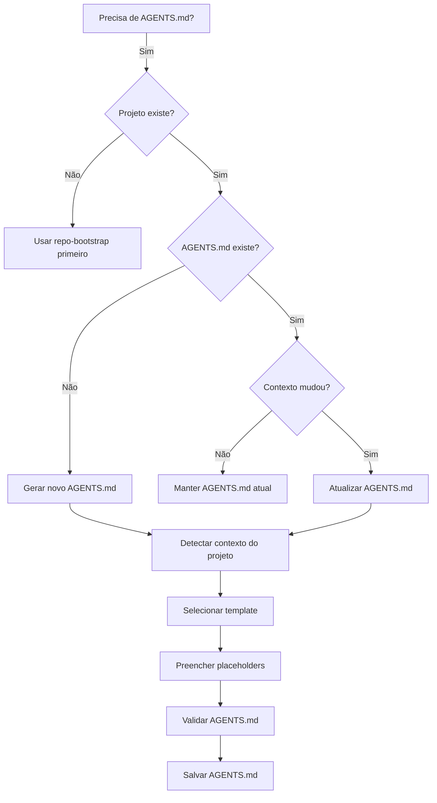

# Agents MD Generator

Gera e mantém arquivos `AGENTS.md` adaptativos que se adaptam ao contexto do projeto.

## Quando Usar

### Use quando:
- Precisa criar um AGENTS.md para um novo projeto
- Precisa atualizar um AGENTS.md existente
- O projeto mudou de contexto (ex: de CRM para API)
- Precisa de um AGENTS.md que se adapte automaticamente
- Precisa de governança para agentes de IA

### Não use quando:
- Projeto já tem um AGENTS.md completo e atualizado
- Projeto é muito pequeno e não justifica AGENTS.md
- Precisa de apenas uma documentação estática (use `documentation`)

### Skills relacionadas:
- `repo-bootstrap` — para estrutura inicial de repositório
- `governance` — para processos de governança
- `documentation` — para padrões de documentação
- `skill-audit-bulletin` — para auditar qualidade de skills

## Decision Tree



## Conceitos Fundamentais

### Context Detection

A skill detecta automaticamente:

- **Tipo de Projeto**: CRM, API, WebApp, Biblioteca, CLI, etc.
- **Tecnologias**: Linguagens, frameworks, bancos de dados
- **Padrões**: Arquitetura (Clean, Hexagonal, DDD), padrões de código
- **Governança**: Branching strategy, processo de PR, CI/CD
- **Equipe**: Tamanho, estrutura, papéis

### Adaptive Templates

Templates que se adaptam ao contexto detectado:

- **AGENTS-base.md**: Template genérico para qualquer projeto
- **AGENTS-skills-repo.md**: Para repositórios de skills
- **AGENTS-crm.md**: Para projetos CRM
- **AGENTS-api.md**: Para projetos de API
- **AGENTS-webapp.md**: Para webapps
- **AGENTS-library.md**: Para bibliotecas
- **AGENTS-cli.md**: Para CLIs

### Placeholder System

Placeholders que são preenchidos automaticamente:

- `{{project_description}}`: Descrição do projeto
- `{{directory_structure}}`: Estrutura de diretórios
- `{{code_patterns}}`: Padrões de código
- `{{important_commands}}`: Comandos importantes
- `{{governance_rules}}`: Regras de governança
- `{{recommended_skills}}`: Skills recomendadas
- `{{anti_patterns}}`: Anti-patterns
- `{{edge_cases}}`: Edge cases

## Workflow

### Workflow 1: Context Detection

**Objetivo:** Detectar automaticamente o contexto do projeto.

1. Analisar `package.json` ou `Cargo.toml` para tecnologias
2. Analisar estrutura de diretórios para arquitetura
3. Analisar `.github/` para governança
4. Analisar `README.md` para descrição
5. Analisar `docs/` para documentação existente
6. Gerar relatório de contexto
7. **Checkpoint**: Contexto detectado com confiança ≥80%

### Workflow 2: Template Selection

**Objetivo:** Selecionar o template mais adequado baseado no contexto.

1. Ler relatório de contexto (Workflow 1)
2. Mapear contexto para template disponível
3. Se nenhum template se encaixa perfeitamente, usar `AGENTS-base.md`
4. Selecionar template escolhido
5. **Checkpoint**: Template selecionado e validado

### Workflow 3: Placeholder Population

**Objetivo:** Preencher placeholders do template automaticamente.

1. Ler template selecionado (Workflow 2)
2. Identificar todos os placeholders
3. Preencher cada placeholder com dados do contexto
4. Se dado não disponível, usar valor padrão
5. Validar que todos os placeholders foram preenchidos
6. **Checkpoint**: Todos os placeholders preenchidos

### Workflow 4: AGENTS.md Generation

**Objetivo:** Gerar o arquivo AGENTS.md final.

1. Ler template com placeholders preenchidos (Workflow 3)
2. Validar formato e estrutura
3. Validar que todas as seções estão presentes
4. Gerar arquivo AGENTS.md
5. **Checkpoint**: AGENTS.md gerado e válido

### Workflow 5: Validation

**Objetivo:** Validar que o AGENTS.md está correto e completo.

1. Verificar que arquivo existe
2. Verificar que tem ≥30 linhas
3. Verificar que tem todas as seções obrigatórias
4. Verificar que placeholders não foram esquecidos
5. Verificar que conteúdo faz sentido para o contexto
6. **Checkpoint**: AGENTS.md válido e pronto para uso

### Workflow 6: Maintenance

**Objetivo:** Manter AGENTS.md atualizado conforme o projeto evolui.

1. Detectar mudanças no projeto que afetem AGENTS.md
2. Sugerir atualizações quando contexto mudar
3. Validar se AGENTS.md está atualizado
4. Atualizar se necessário
5. **Checkpoint**: AGENTS.md sempre atualizado

## Anti-patterns

### 🔴 Crítico

#### AGENTS.md Genérico Demais
**O que é:** AGENTS.md que não se adapta ao contexto específico do projeto.
**Por que é ruim:** Agentes de IA não têm contexto adequado para tomar decisões.
**Como evitar:** Usar templates adaptativos baseados no contexto detectado.
**Exemplo:**
```
# ❌ ERRADO
# AGENTS.md
Este projeto usa JavaScript.

# ✅ CORRETO
# AGENTS.md - Projeto CRM
Este projeto é um sistema CRM built com React + Node.js + PostgreSQL.
Estrutura: src/domain/, src/application/, src/infrastructure/
```

#### Ignorar Mudanças de Contexto
**O que é:** Não atualizar AGENTS.md quando o projeto muda significativamente.
**Por que é ruim:** AGENTS.md fica desatualizado e confunde agentes.
**Como evitar:** Implementar detecção de mudanças e atualizações automáticas.
**Exemplo:**
```
# ❌ ERRADO
Projeto mudou de CRM para API, mas AGENTS.md ainda descreve CRM

# ✅ CORRETO
Projeto mudou → detectar mudança → sugerir atualização → atualizar AGENTS.md
```

### 🟡 Médio

#### Placeholders Não Preenchidos
**O que é:** AGENTS.md com placeholders como `{{project_description}}` não preenchidos.
**Por que é ruim:** Agentes veem placeholders em vez de conteúdo real.
**Como evitar:** Validar que todos os placeholders foram preenchidos antes de salvar.
**Exemplo:**
```
# ❌ ERRADO
## Visão Geral
{{project_description}}

# ✅ CORRETO
## Visão Geral
Sistema CRM para gerenciamento de clientes e vendas.
```

#### Template Errado para Contexto
**O que é:** Usar template de API para projeto CRM.
**Por que é ruim:** Conteúdo não é relevante para o projeto.
**Como evitar:** Validar seleção de template antes de preencher.
**Exemplo:**
```
# ❌ ERRADO
# AGENTS.md - Projeto CRM
## Endpoints
GET /api/users
POST /api/users

# ✅ CORRETO
# AGENTS.md - Projeto CRM
## Modelos de Dados
Cliente: { id, nome, email, telefone }
Venda: { id, cliente_id, data, valor }
```

### 🟢 Baixo

#### Não Gerar Execution Report
**O que é:** Finalizar geração sem produzir relatório.
**Por que é ruim:** Perde-se oportunidade de documentar problemas.
**Como evitar:** Sempre gerar relatório ao término.
**Exemplo:**
```
# ❌ ERRADO
AGENTS.md gerado. Fim.

# ✅ CORRETO
AGENTS.md gerado com sucesso.
- Contexto detectado: CRM
- Template usado: AGENTS-crm.md
- Placeholders preenchidos: 8/8
- Validação: Passou
```

## Checklists

### Checklist de Pré-Geração
- [ ] Projeto existe e tem estrutura básica
- [ ] Tecnologias podem ser detectadas
- [ ] Contexto pode ser determinado
- [ ] Template adequado está disponível

### Checklist de Pós-Geração
- [ ] AGENTS.md criado com sucesso
- [ ] Tem ≥30 linhas
- [ ] Todas as seções obrigatórias presentes
- [ ] Nenhum placeholder não preenchido
- [ ] Conteúdo faz sentido para o contexto
- [ ] Validação passou

### Checklist de Manutenção
- [ ] Mudanças no projeto detectadas
- [ ] AGENTS.md ainda está atualizado
- [ ] Se necessário, atualizações sugeridas
- [ ] Atualizações aprovadas e aplicadas

## Edge Cases

### Projeto sem package.json ou Cargo.toml
**Situação:** Projeto não tem arquivo de configuração detectável.
**Solução:** Usar estrutura de diretórios e README.md para detectar contexto.
**Exceção:** Se nenhum contexto pode ser determinado, usar template genérico.

### Múltiplos Contextos
**Situação:** Projeto combina múltiplos contextos (ex: API + WebApp).
**Solução:** Usar template mais específico ou combinar templates.
**Exceção:** Se combinação é muito complexa, usar template base e personalizar manualmente.

### AGENTS.md Muito Grande
**Situação:** AGENTS.md gerado tem >200 linhas.
**Solução:** Dividir em seções menores ou usar referências externas.
**Exceção:** Se conteúdo é necessário, manter como está.

### Contexto Incerto
**Situação:** Detecção de contexto tem confiança <80%.
**Solução:** Pedir confirmação do usuário antes de gerar.
**Exceção:** Em contexto de prototipação, usar melhor estimativa.

## Referências

- [repo-bootstrap](../repo-bootstrap/SKILL.md) — para estrutura inicial
- [governance](../governance/SKILL.md) — para processos
- [documentation](../documentation/SKILL.md) — para padrões
- [ADR-007](../../docs/adr/archive/ADR-007.md) — decisão arquitetural
