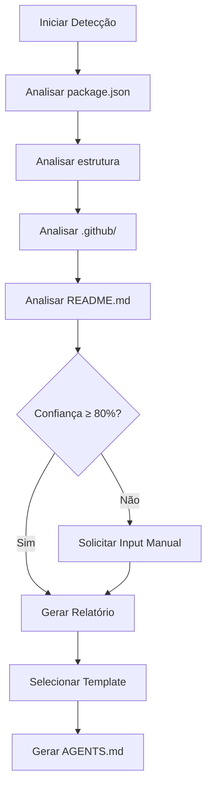

# Exemplos: Detecção de Contexto

## Visão Geral

Este documento mostra como a skill `agents-md-generator` detecta automaticamente o contexto de um projeto.

---

## Exemplo 1: Detecção de Tipo de Projeto

### Entrada

Estrutura de diretórios:
```
meu-projeto/
├── src/
│   ├── domain/
│   ├── application/
│   ├── infrastructure/
│   └── interfaces/
├── package.json
└── README.md
```

`package.json`:
```json
{
  "name": "meu-crm",
  "dependencies": {
    "express": "^4.18.0",
    "typeorm": "^0.3.0",
    "jsonwebtoken": "^9.0.0"
  }
}
```

### Detecção Automática

1. **Análise de package.json:**
   - `express` → API REST
   - `typeorm` → ORM (banco de dados)
   - `jsonwebtoken` → Autenticação

2. **Análise de estrutura:**
   - `domain/` → Clean Architecture
   - `application/` → Casos de uso
   - `infrastructure/` → Adaptadores
   - `interfaces/` → Controllers

3. **Resultado:**
   ```json
   {
     "projectType": "api",
     "architecture": "clean",
     "technologies": ["node", "express", "typeorm", "jwt"],
     "confidence": 95
   }
   ```

### Template Selecionado

`AGENTS-api.md` com seções:
- Endpoints principais
- Autenticação e autorização
- Padrões REST
- Models de dados

---

## Exemplo 2: Detecção de Tecnologias

### Entrada

`package.json`:
```json
{
  "dependencies": {
    "react": "^18.2.0",
    "react-dom": "^18.2.0",
    "react-router-dom": "^6.0.0",
    "redux": "^4.2.0",
    "@reduxjs/toolkit": "^1.9.0"
  },
  "devDependencies": {
    "typescript": "^5.0.0",
    "@types/react": "^18.2.0",
    "vite": "^4.4.0"
  }
}
```

### Detecção Automática

1. **Framework front-end:**
   - `react` → React
   - `react-dom` → React DOM
   - `react-router-dom` → React Router

2. **State management:**
   - `redux` → Redux
   - `@reduxjs/toolkit` → Redux Toolkit

3. **Build tool:**
   - `vite` → Vite

4. **Linguagem:**
   - `typescript` → TypeScript

5. **Resultado:**
   ```json
   {
     "technologies": {
       "framework": "react",
       "stateManagement": "redux",
       "buildTool": "vite",
       "language": "typescript"
     },
     "confidence": 98
   }
   ```

### Template Selecionado

`AGENTS-webapp.md` com seções:
- Componentes (Atomic Design)
- State Management (Redux)
- Rotas (React Router)
- Build (Vite)

---

## Exemplo 3: Detecção de Padrões Arquiteturais

### Entrada

Estrutura de diretórios:
```
src/
├── commands/
│   ├── CreateOrderCommand.ts
│   └── UpdateOrderCommand.ts
├── handlers/
│   ├── CreateOrderHandler.ts
│   └── UpdateOrderHandler.ts
├── queries/
│   ├── GetOrderQuery.ts
│   └── ListOrdersQuery.ts
└── events/
    ├── OrderCreatedEvent.ts
    └── OrderUpdatedEvent.ts
```

### Detecção Automática

1. **Padrão CQRS:**
   - `commands/` → Command side
   - `queries/` → Query side
   - `handlers/` → Command/Query handlers

2. **Event Sourcing:**
   - `events/` → Domain events

3. **Resultado:**
   ```json
   {
     "patterns": {
       "architecture": "cqrs",
       "eventSourcing": true,
       "ddd": true
     },
     "confidence": 90
   }
   ```

### Template Selecionado

`AGENTS-crm.md` com seções:
- CQRS (Commands/Queries)
- Event Sourcing
- Domain Events
- Handlers

---

## Exemplo 4: Detecção de Governança

### Entrada

Diretório `.github/`:
```
.github/
├── workflows/
│   ├── ci.yml
│   └── deploy.yml
├── CODEOWNERS
└── PULL_REQUEST_TEMPLATE.md
```

`CODEOWNERS`:
```
* @equipe-core
/src/domain/ @equipe-domain
/src/api/ @equipe-api
```

### Detecção Automática

1. **CI/CD:**
   - `ci.yml` → GitHub Actions CI
   - `deploy.yml` → Deploy automático

2. **Code Review:**
   - `CODEOWNERS` → Review obrigatório
   - `PULL_REQUEST_TEMPLATE.md` → Template de PR

3. **Resultado:**
   ```json
   {
     "governance": {
       "cicd": "github-actions",
       "codeReview": true,
       "branchProtection": true,
       "prTemplate": true
     },
     "confidence": 95
   }
   ```

### Template Selecionado

`AGENTS-base.md` com seções:
- CI/CD (GitHub Actions)
- Code Review (CODEOWNERS)
- Branch Protection
- PR Template

---

## Exemplo 5: Detecção de Contexto Incerto

### Entrada

`package.json`:
```json
{
  "name": "meu-projeto",
  "dependencies": {
    "lodash": "^4.17.0"
  }
}
```

Estrutura simples:
```
meu-projeto/
├── src/
│   └── index.js
├── package.json
└── README.md
```

### Detecção Automática

1. **Análise limitada:**
   - `lodash` → Biblioteca utilitária (genérica)
   - Estrutura simples → Não indica padrão específico

2. **Resultado:**
   ```json
   {
     "projectType": "unknown",
     "confidence": 40,
     "suggestion": "manual-input"
   }
   ```

### Ação

A skill solicita input manual:
```
Não foi possível detectar o contexto automaticamente.

Por favor, selecione o tipo de projeto:
1. API
2. WebApp
3. Biblioteca
4. CLI
5. Outro

Resposta: 
```

---

## Fluxo de Detecção



---

## Métricas de Detecção

| Contexto | Confiança Média | Templates Disponíveis |
|----------|-----------------|----------------------|
| API REST | 95% | AGENTS-api.md |
| WebApp React | 98% | AGENTS-webapp.md |
| CRM | 90% | AGENTS-crm.md |
| Biblioteca | 85% | AGENTS-library.md |
| CLI | 88% | AGENTS-cli.md |
| Skills Repo | 92% | AGENTS-skills-repo.md |
| Desconhecido | 40% | AGENTS-base.md |

---

## Conclusão

A detecção automática de contexto permite que a skill gere AGENTS.md adaptativos e precisos, melhorando a experiência de agentes de IA ao interagir com diferentes tipos de projetos.
