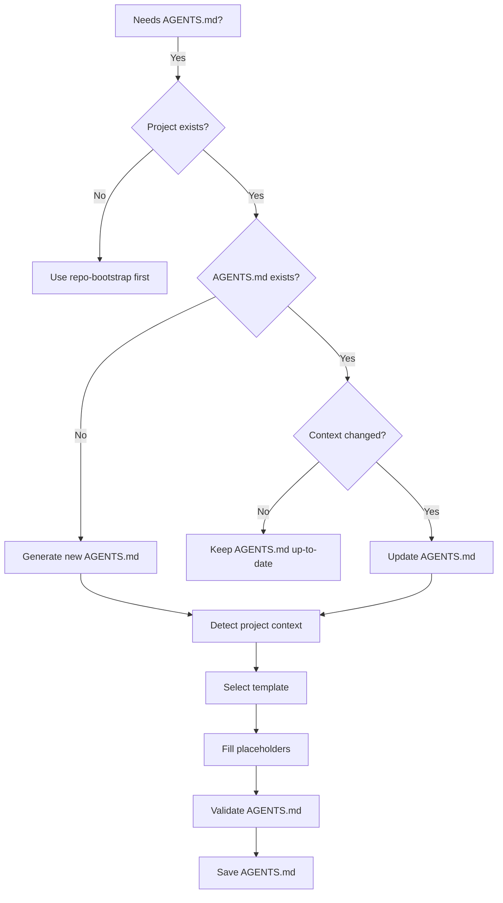

# AGENTS.md & Agent Governance Management

Management, refactoring, and generation of AGENTS.md files for agentic repositories.


## Sub-Domain / Component: `agents-md-generator`

# Agents MD Generator

Generates and maintains adaptive AGENTS.md files that adapt to the project context.

## When to Use

### Use when:
- You need to create a new AGENTS.md for a project
- You need to update an existing AGENTS.md
- The project has changed context (e.g., from CRM to API)
- You need an AGENTS.md that automatically adapts
- You need governance for AI agents

### Do not use when:
- The project already has a complete and up-to-date AGENTS.md
- The project is too small to justify an AGENTS.md
- You only need static documentation (use `documentation`)

### Related Skills:
- `repo-bootstrap` — for initial repository structure
- `governance` — for governance processes
- `documentation` — for documentation standards
- `skill-audit-bulletin` — for auditing skill quality

## Decision Tree



## Key Concepts

### Context Detection

The skill automatically detects:

- **Project Type**: CRM, API, WebApp, Library, CLI, etc.
- **Technologies**: Languages, frameworks, databases
- **Patterns**: Architecture (Clean, Hexagonal, DDD), coding standards
- **Governance**: Branching strategy, PR process, CI/CD
- **Team**: Size, structure, roles

### Adaptive Templates

Templates that adapt to the detected context:

- **AGENTS-base.md**: Generic template for any project
- **AGENTS-skills-repo.md**: For skills repositories
- **AGENTS-crm.md**: For CRM projects
- **AGENTS-api.md**: For API projects
- **AGENTS-webapp.md**: For web applications
- **AGENTS-library.md**: For libraries
- **AGENTS-cli.md**: For CLIs

### Placeholder System

Placeholders that are automatically filled:

- `{{project_description}}`: Project description
- `{{directory_structure}}`: Directory structure
- `{{code_patterns}}`: Coding patterns
- `{{important_commands}}`: Important commands
- `{{governance_rules}}`: Governance rules
- `{{recommended_skills}}`: Recommended skills
- `{{anti_patterns}}`: Anti-patterns
- `{{edge_cases}}`: Edge cases

## Workflow

### Workflow 1: Context Detection

**Objective:** Automatically detect the project context.

1. Analyze `package.json` or `Cargo.toml` for technologies
2. Analyze directory structure for architecture
3. Analyze `.github/` for governance
4. Analyze `README.md` for project description
5. Analyze `docs/` for existing documentation
6. Generate context report
7. **Checkpoint:** Context detected with confidence ≥80%

### Workflow 2: Template Selection

**Objective:** Select the most suitable template based on the context.

1. Read context report (Workflow 1)
2. Map context to available templates
3. If no template fits perfectly, use `AGENTS-base.md`
4. Select template chosen
5. **Checkpoint:** Template selected and validated

### Workflow 3: Placeholder Population

**Objective:** Automatically fill placeholders in the template.

1. Read template selected (Workflow 2)
2. Identify all placeholders
3. Fill each placeholder with context data
4. If data not available, use default value
5. Validate that all placeholders were filled
6. **Checkpoint:** All placeholders filled

### Workflow 4: AGENTS.md Generation

**Objective:** Generate the final AGENTS.md file.

1. Read template with placeholders filled (Workflow 3)
2. Validate format and structure
3. Validate that all required sections are present
4. Generate AGENTS.md file
5. **Checkpoint:** AGENTS.md generated and valid

### Workflow 5: Validation

**Objective:** Validate that the AGENTS.md is correct and complete.

1. Verify that the file exists
2. Verify that it has ≥30 lines
3. Verify that it has all required sections
4. Verify that placeholders were not forgotten
5. Verify that content makes sense for the context
6. **Checkpoint:** AGENTS.md valid and ready for use

### Workflow 6: Maintenance

**Objective:** Maintain AGENTS.md up-to-date as the project evolves.

1. Detect changes in the project that affect AGENTS.md
2. Suggest updates when context changes
3. Validate if AGENTS.md is up-to-date
4. Update if necessary
5. **Checkpoint:** AGENTS.md always up-to-date

## Anti-patterns

### Critical

#### AGENTS.md Too Generic

**What is it:** AGENTS.md that does not adapt to the project context.

**Why is it bad:** AI agents lack context to make decisions.

**How to avoid:** Use adaptive templates based on detected context.

**Example:**
```markdown
# ❌ WRONG
# AGENTS.md
This project uses JavaScript.

# ✅ CORRECT
# AGENTS.md - Project CRM
This project is a CRM system built with React + Node.js + PostgreSQL.
```

#### Ignoring Context Changes

**What is it:** Not updating AGENTS.md when the project context changes.

**Why is it bad:** AGENTS.md becomes outdated and confuses agents.

**How to avoid:** Implement automatic detection and update of AGENTS.md.

**Example:**
```markdown
# ❌ WRONG
Project changed from CRM to API, but AGENTS.md still describes CRM

# ✅ CORRECT
Project changed → detect change → suggest update → update AGENTS.md
```

### Medium

#### Unfilled Placeholders

**What is it:** AGENTS.md with placeholders like `{{project_description}}` not filled.

**Why is it bad:** Agents see placeholders instead of real content.

**How to avoid:** Validate that all placeholders were filled before saving.

**Example:**
```markdown
# ❌ WRONG
## Overview
{{project_description}}

# ✅ CORRECT
## Overview
CRM system for customer and sales management.
```

#### Wrong Template for Context

**What is it:** Using an API template for a CRM project.

**Why is it bad:** Content is not relevant to the project.

**How to avoid:** Validate template selection before filling placeholders.

**Example:**
```markdown
# ❌ WRONG
# AGENTS.md - Project CRM
## Endpoints
GET /api/users
POST /api/users

# ✅ CORRECT
# AGENTS.md - Project CRM
## Modelos de Dados
Cliente: { id, nome, email, telefone }
Venda: { id, cliente_id, data, valor }
```

### Low

#### Not Generating Execution Report

**What is it:** Finalizing generation without producing a report.

**Why is it bad:** Missed opportunity to document issues.

**How to avoid:** Always generate a report at the end.

**Example:**
```markdown
# ❌ WRONG
AGENTS.md generated. End.

# ✅ CORRECT
AGENTS.md generated with success.
- Context detected: CRM
- Template used: AGENTS-crm.md
- Placeholders filled: 8/8
- Validation: Passed
```

## Checklists

### Pre-Generation Checklist

- [ ] Project exists and has basic structure
- [ ] Technologies can be detected
- [ ] Context can be determined
- [ ] Suitable template is available

### Post-Generation Checklist

- [ ] AGENTS.md created successfully
- [ ] Has ≥30 lines
- [ ] All required sections present
- [ ] No unfilled placeholders
- [ ] Content makes sense for the context
- [ ] Validation passed

### Maintenance Checklist

- [ ] Project changes detected
- [ ] AGENTS.md still up-to-date
- [ ] If necessary, update suggested and applied

## Edge Cases

### Project without package.json or Cargo.toml

**Situation:** Project lacks a detectable configuration file.

**Solution:** Use directory structure and README.md to detect context.

**Exception:** If no context can be determined, use generic template.

### Multiple Contexts

**Situation:** Project combines multiple contexts (e.g., API + WebApp).

**Solution:** Use the most specific template or combine templates.

**Exception:** If combination is too complex, use base template and customize manually.

### AGENTS.md Too Large

**Situation:** Generated AGENTS.md has >200 lines.

**Solution:** Divide into smaller sections or use external references.

**Exception:** If content is necessary, keep as is.

### Uncertain Context

**Situation:** Context detection has confidence <80%.

**Solution:** Ask the user for confirmation before generating.

**Exception:** In prototyping context, use best estimate.

## References

- [repo-bootstrap](../repo-bootstrap/SKILL.md) — for initial repository structure
- [governance](../governance/SKILL.md) — for governance processes
- [documentation](../documentation/SKILL.md) — for documentation standards
- [ADR-007](../../docs/adr/archive/ADR-007.md) — architectural decision

---

## Sub-Domain / Component: `agent-md-refactor`

# Agent MD Refactor

Refactors bloated agent instruction files (AGENTS.md, CLAUDE.md, COPILOT.md, etc.) to follow **progressive disclosure principles** - keeping essentials at root and organizing the rest into linked, categorized files.

---

## Triggers

Use this skill when:
- "refactor my AGENTS.md" / "refactor my CLAUDE.md"
- "split my agent instructions"
- "organize my CLAUDE.md file"
- "my AGENTS.md is too long"
- "progressive disclosure for my instructions"
- "clean up my agent config"

---

## Quick Reference

| Phase | Action | Output |
|-------|--------|--------|
| 1. Analyze | Find contradictions | List of conflicts to resolve |
| 2. Extract | Identify essentials | Core instructions for root file |
| 3. Categorize | Group remaining instructions | Logical categories |
| 4. Structure | Create file hierarchy | Root + linked files |
| 5. Prune | Flag for deletion | Redundant/vague instructions |

---

## Process

### Phase 1: Find Contradictions

Identify any instructions that conflict with each other.

**Look for:**
- Contradictory style guidelines (e.g., "use semicolons" vs "no semicolons")
- Conflicting workflow instructions
- Incompatible tool preferences
- Mutually exclusive patterns

**For each contradiction found:**
```markdown
## Contradiction Found

**Instruction A:** [quote]
**Instruction B:** [quote]

**Question:** Which should take precedence, or should both be conditional?
```

Ask the user to resolve before proceeding.

---

### Phase 2: Identify the Essentials

Extract ONLY what belongs in the root agent file. The root should be minimal - information that applies to **every single task**.

**Essential content (keep in root):**
| Category | Example |
|----------|---------|
| Project description | One sentence: "A React dashboard for analytics" |
| Package manager | Only if not npm (e.g., "Uses pnpm") |
| Non-standard commands | Custom build/test/typecheck commands |
| Critical overrides | Things that MUST override defaults |
| Universal rules | Applies to 100% of tasks |

**NOT essential (move to linked files):**
- Language-specific conventions
- Testing guidelines
- Code style details
- Framework patterns
- Documentation standards
- Git workflow details

---

### Phase 3: Group the Rest

Organize remaining instructions into logical categories.

**Common categories:**
| Category | Contents |
|----------|----------|
| `typescript.md` | TS conventions, type patterns, strict mode rules |
| `testing.md` | Test frameworks, coverage, mocking patterns |
| `code-style.md` | Formatting, naming, comments, structure |
| `git-workflow.md` | Commits, branches, PRs, reviews |
| `architecture.md` | Patterns, folder structure, dependencies |
| `api-design.md` | REST/GraphQL conventions, error handling |
| `security.md` | Auth patterns, input validation, secrets |
| `performance.md` | Optimization rules, caching, lazy loading |

**Grouping rules:**
1. Each file should be self-contained for its topic
2. Aim for 3-8 files (not too granular, not too broad)
3. Name files clearly: `{topic}.md`
4. Include only actionable instructions

---

### Phase 4: Create the File Structure

**Output structure:**
```
project-root/
├── CLAUDE.md (or AGENTS.md)     # Minimal root with links
└── .claude/                      # Or docs/agent-instructions/
    ├── typescript.md
    ├── testing.md
    ├── code-style.md
    ├── git-workflow.md
    └── architecture.md
```

**Root file template:**
```markdown
# Project Name

One-sentence description of the project.

## Quick Reference

- **Package Manager:** pnpm
- **Build:** `pnpm build`
- **Test:** `pnpm test`
- **Typecheck:** `pnpm typecheck`

## Detailed Instructions

For specific guidelines, see:
- [TypeScript Conventions](.claude/typescript.md)
- [Testing Guidelines](.claude/testing.md)
- [Code Style](.claude/code-style.md)
- [Git Workflow](.claude/git-workflow.md)
- [Architecture Patterns](.claude/architecture.md)
```

**Each linked file template:**
```markdown
# {Topic} Guidelines

## Overview
Brief context for when these guidelines apply.

## Rules

### Rule Category 1
- Specific, actionable instruction
- Another specific instruction

### Rule Category 2
- Specific, actionable instruction

## Examples

### Good
\`\`\`typescript
// Example of correct pattern
\`\`\`

### Avoid
\`\`\`typescript
// Example of what not to do
\`\`\`
```

---

### Phase 5: Flag for Deletion

Identify instructions that should be removed entirely.

**Delete if:**
| Criterion | Example | Why Delete |
|-----------|---------|------------|
| Redundant | "Use TypeScript" (in a .ts project) | Agent already knows |
| Too vague | "Write clean code" | Not actionable |
| Overly obvious | "Don't introduce bugs" | Wastes context |
| Default behavior | "Use descriptive variable names" | Standard practice |
| Outdated | References deprecated APIs | No longer applies |

**Output format:**
```markdown
## Flagged for Deletion

| Instruction | Reason |
|-------------|--------|
| "Write clean, maintainable code" | Too vague to be actionable |
| "Use TypeScript" | Redundant - project is already TS |
| "Don't commit secrets" | Agent already knows this |
| "Follow best practices" | Meaningless without specifics |
```

---

## Execution Checklist

```
[ ] Phase 1: All contradictions identified and resolved
[ ] Phase 2: Root file contains ONLY essentials
[ ] Phase 3: All remaining instructions categorized
[ ] Phase 4: File structure created with proper links
[ ] Phase 5: Redundant/vague instructions removed
[ ] Verify: Each linked file is self-contained
[ ] Verify: Root file is under 50 lines
[ ] Verify: All links work correctly
```

---

## Anti-Patterns

| Avoid | Why | Instead |
|-------|-----|---------|
| Keeping everything in root | Bloated, hard to maintain | Split into linked files |
| Too many categories | Fragmentation | Consolidate related topics |
| Vague instructions | Wastes tokens, no value | Be specific or delete |
| Duplicating defaults | Agent already knows | Only override when needed |
| Deep nesting | Hard to navigate | Flat structure with links |

---

## Examples

### Before (Bloated Root)
```markdown
# CLAUDE.md

This is a React project.

## Code Style
- Use 2 spaces
- Use semicolons
- Prefer const over let
- Use arrow functions
... (200 more lines)

## Testing
- Use Jest
- Coverage > 80%
... (100 more lines)

## TypeScript
- Enable strict mode
... (150 more lines)
```

### After (Progressive Disclosure)
```markdown
# CLAUDE.md

React dashboard for real-time analytics visualization.

## Commands
- `pnpm dev` - Start development server
- `pnpm test` - Run tests with coverage
- `pnpm build` - Production build

## Guidelines
- [Code Style](.claude/code-style.md)
- [Testing](.claude/testing.md)
- [TypeScript](.claude/typescript.md)
```

---

## Verification

After refactoring, verify:

1. **Root file is minimal** - Under 50 lines, only universal info
2. **Links work** - All referenced files exist
3. **No contradictions** - Instructions are consistent
4. **Actionable content** - Every instruction is specific
5. **Complete coverage** - No instructions were lost (unless flagged for deletion)
6. **Self-contained files** - Each linked file stands alone

---

## Completion Gate

The task associated with the skill `agents-md-management` can only be declared complete when:
1. All checks in the operational verification checklist have been satisfied.
2. The deliverable has been deterministically validated through execution evidence.
3. No structural debt, unresolved placeholders, or unhandled errors remain.


## Multi-Runtime SSOT Drift Detection & Synchronization Matrix (SOTA)

Maintains real-time synchronization between the repository's Single Source of Truth (`AGENTS.md`) and runtime-specific instruction layers:

| SSOT Pillar | Canonical Source | Derivative Target | Drift Detection Mechanism |
|:---|:---|:---|:---|
| **Repository Governance** | `AGENTS.md` | `GEMINI.md` | SHA-256 header hash validation in pre-commit |
| **Skill Registry** | `skills/index.json` | `pages/index.html` | `scripts/validate-index.sh` checksum comparison |
| **Agent Policies** | `.github/governance/agent-policies.json` | `scripts/audit_engine.py` | JSON Schema validation gate |
| **Multi-Target Runtimes** | `skills/` (Source) | `~/.gemini/config/skills` | `scripts/sync_runtime.py --status` drift check |

### Automated Prompt Drift Remediation:
When `AGENTS.md` is updated, derivative instruction files (`GEMINI.md`) must be reconciled immediately to prevent hallucinated or obsolete operating boundaries.

## Domain SOTA & Industry Engineering Standards

- **Single Source of Truth (SSOT) Architecture:** Centralized governance in `AGENTS.md` with deterministic compilation to downstream instruction files (`GEMINI.md`).
- **Autonomous Agent Instruction Design:** Prompt engineering best practices, role boundary containment, and instruction hierarchy principles.
- **JSON Schema & Index Integrity:** Strict validation of `skills/index.json` against actual filesystem skill bundles.
- **Drift Detection Algorithms:** Continuous SHA-256 header hash reconciliation across multi-agent workspace roots.

### Exhaustive Heuristic Decision Rules:
1. **Rule of Thumb 1 (Precedence Invariant):** `AGENTS.md` rules take strict precedence over default model training weights.
2. **Rule of Thumb 2 (Zero Hallucination Gate):** Skill descriptions in `index.json` must exactly match frontmatter definitions in `SKILL.md`.
3. **Rule of Thumb 3 (Runtime Synchronization Gate):** Any change in `AGENTS.md` must trigger immediate synchronization of `GEMINI.md`.
4. **Rule of Thumb 4 (Modular Scaffolding Rule):** Complex skills must expose `templates/` and `examples/` subfolders for deterministic execution.