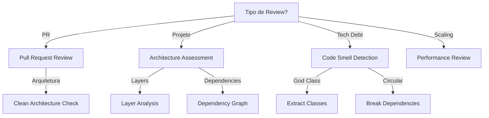

# Architecture Review

Realiza revisões arquiteturais sistemáticas de código e estruturas de projeto.

## Quando Usar

### Use quando:
- Revisão de PR com impacto arquitetural
- Análise de estrutura de projeto
- Detecção de violações de princípios SOLID
- Avaliação de aderência a padrões (Clean Architecture, Hexagonal, DDD)
- Identificação de tech debt arquitetural

### Não use quando:
- Revisão de estilo/formatting
- Bug fix simples
- Teste de unidade

### Skills relacionadas:
- `ddd` — para validar modelagem de domínio
- `adr-generator` — para documentar decisões arquiteturais

## Decision Tree



## Workflow

### Fase 1: Revisão de PR com Impacto Arquitetural

1. Receba PR para review:
   ```bash
   gh pr view 123 --json changedFiles
   ```
2. Analise mudanças:
   - Novas dependências?
   - Nova camada?
   - Mudança em contrato?
3. Execute checklist:
   - [ ] SRP respeitado
   - [ ] OCP aplicado
   - [ ] Clean Architecture
4. Comente no PR:
   ```
   ### [HIGH] God Class
   **Arquivo:** src/services/user-service.ts:45
   **Princípio violado:** SRP
   **Descrição:** UserService tem 500 linhas e 15 responsabilidades
   **Sugestão:** Quebrar em UserService, UserValidator, UserNotifier
   ```
5. **Checkpoint**: PR aprovado ou ajustes solicitados

### Fase 2: Análise de Estrutura de Projeto

1. Mapeie estrutura:
   ```
   src/
   ├── controllers/
   ├── services/
   ├── repositories/
   ├── domain/
   └── infrastructure/
   ```
2. Verifique camadas:
   - Domain sem dependências externas?
   - Controllers não têm lógica de negócio?
   - Repositories são abstrações?
3. Gere dependency graph:
   ```bash
   npx madge --image deps.png src/
   ```
4. **Checkpoint**: Estrutura validada, issues documentadas

### Fase 3: Detecção de Code Smells Estruturais

1. Procure God Class:
   ```bash
   # Classes com > 500 linhas
   find src -name "*.ts" -exec wc -l {} \; | sort -rn | head -10
   ```
2. Procure Feature Envy:
   ```bash
   # Métodos que acessam muitos atributos de outra classe
   grep -r "otherClass\." src/
   ```
3. Procure Circular Dependencies:
   ```bash
   npx madge --circular src/
   ```
4. **Checkpoint**: Smells identificados e priorizados

### Fase 4: Avaliação de Aderência a Padrões

1. Clean Architecture checklist:
   - [ ] Regras de negócio não dependem de frameworks
   - [ ] Casos de uso orquestram entidades
   - [ ] Adaptadores isolam infraestrutura
   - [ ] Inversão de dependência respeitada
2. DDD checklist:
   - [ ] Entidades com identidade própria
   - [ ] Value Objects imutáveis
   - [ ] Aggregates com boundary bem definido
   - [ ] Repositories como abstração de coleção
3. **Checkpoint**: Score de aderência calculado

### Fase 5: Criar Relatório de Revisão

1. Use template `templates/architecture-review-report.md`
2. Documente issues por severidade
3. Inclua screenshots/grafos
4. Proponha ações corretivas
5. **Checkpoint**: Relatório completo e acionável

## Conceitos Fundamentais

### SOLID Principles

#### SRP (Single Responsibility)
Cada classe/módulo tem uma única responsabilidade.

```typescript
// ❌ Viola SRP
class UserService {
  createUser() {}  // persiste
  sendEmail() {}   // notifica
  validate() {}    // valida
}

// ✅ SRP respeitado
class UserService {
  createUser() {}
}
class EmailService {
  send() {}
}
class UserValidator {
  validate() {}
}
```

#### OCP (Open/Closed)
Extensível sem modificar código existente.

```typescript
// ✅ OCP via strategy
interface PaymentMethod {
  process(amount: Money): Promise<void>;
}

class CreditCard implements PaymentMethod {
  process(amount: Money) { /* ... */ }
}

class Pix implements PaymentMethod {
  process(amount: Money) { /* ... */ }
}
```

#### LSP (Liskov Substitution)
Subtipos substituem seus tipos base.

```typescript
// ✅ LSP - Square é subtype de Rectangle
class Rectangle {
  setWidth(w: number) {}
  setHeight(h: number) {}
}

class Square extends Rectangle {
  setWidth(w: number) {
    super.setWidth(w);
    super.setHeight(w);  // mantém invariante
  }
}
```

#### ISP (Interface Segregation)
Interfaces específicas, não genéricas.

```typescript
// ❌ Interface gorda
interface UserService {
  createUser()
  createOrder()
  sendEmail()
  calculateTax()
}

// ✅ Interfaces específicas
interface UserRepository {
  save()
  findById()
}
```

#### DIP (Dependency Inversion)
Depende de abstrações, não concretos.

```typescript
// ✅ DIP
class OrderService {
  constructor(private readonly repo: OrderRepository) {}  // abstração
}
```

### Clean Architecture / Hexagonal

- Regras de negócio não dependem de frameworks
- Casos de uso orquestram entidades
- Adaptadores (gateways, controllers) isolam infraestrutura
- Inversão de dependência respeitada

### DDD

- Entidades com identidade própria
- Value Objects imutáveis
- Aggregates com boundary bem definido
- Repositories como abstração de coleção
- Domain Events para comunicação entre contextos

### Code Smells Estruturais

- **God Class / God Module**: Classe com muitas responsabilidades
- **Feature Envy**: Método que usa mais dados de outra classe
- **Data Clumps**: Mesmos dados sempre juntos
- **Shotgun Surgery**: Mudança em múltiplos arquivos
- **Circular Dependencies**: Módulos que dependem circularmente

## Templates

### architecture-review-report.md
Localização: `templates/architecture-review-report.md`

Template para relatório de revisão arquitetural.

**Uso:**
```bash
cp templates/architecture-review-report.md docs/architecture-review-report.md
```

### tech-debt-item.md
Localização: `templates/tech-debt-item.md`

Template para item de tech debt.

**Uso:**
```bash
cp templates/tech-debt-item.md docs/tech-debt/{item}.md
```

## Anti-patterns

### 🔴 Crítico

#### God Class
**O que é:** Classe com muitas responsabilidades.
**Por que é ruim:** Difícil de testar, manter e entender.
**Como evitar:** Quebra em classes menores, cada uma com SRP.
**Exemplo:**
```typescript
// ❌ ERRADO - 500 linhas, 15 responsabilidades
class UserService {
  createUser() {}
  validateUser() {}
  sendEmail() {}
  calculateDiscount() {}
  generateReport() {}
}

// ✅ CORRETO - Classes focadas
class UserService {
  createUser() {}
}
class UserValidator {
  validate() {}
}
```

#### Circular Dependencies
**O que é:** Módulo A importa B, B importa A.
**Por que é ruim:** Impossível testar isoladamente, acoplamento alto.
**Como evitar:** Extraia interface ou mova código comum.
**Exemplo:**
```typescript
// ❌ ERRADO
// user-service.ts
import { OrderService } from './order-service';

// order-service.ts
import { UserService } from './user-service';

// ✅ CORRETO
// user-service.ts
import { OrderRepository } from '../repositories/order-repository';
```

### 🟡 Médio

#### Feature Envy
**O que é:** Método que usa mais atributos de outra classe.
**Por que é ruim:** Lógica no lugar errado, violação de encapsulamento.
**Como evitar:** Mova método para classe correta.
**Exemplo:**
```typescript
// ❌ ERRADO
class ReportGenerator {
  generate(user: User) {
    return `${user.name} - ${user.email}`;  // usa dados de User
  }
}

// ✅ CORRETO
class User {
  getDisplayName() {
    return `${this.name} - ${this.email}`;
  }
}
```

#### Data Clumps
**O que é:** Mesmos dados sempre juntos em parâmetros.
**Por que é ruim:** Indica Value Object escondido.
**Como evitar:** Crie Value Object.
**Exemplo:**
```typescript
// ❌ ERRADO
function createUser(name: string, email: string, phone: string) {}

// ✅ CORRETO
function createUser(contact: Contact) {}
```

### 🟢 Baixo

#### Shotgun Surgery
**O que é:** Mudança simples requer edição em muitos arquivos.
**Por que é ruim:** Alto custo de manutenção.
**Como evitar:** Agrupe lógica relacionada.
**Exemplo:**
```typescript
// ❌ ERRADO - mudar validação requer 5 arquivos
// user-validator.ts, order-validator.ts, etc.

// ✅ CORRETO - validação centralizada
// validation/
// - user.ts
// - order.ts
```

## Checklists

### Checklist SOLID
- [ ] SRP: Cada classe/módulo tem uma única responsabilidade?
- [ ] OCP: Extensível sem modificar código existente?
- [ ] LSP: Subtipos substituem seus tipos base?
- [ ] ISP: Interfaces específicas, não genéricas?
- [ ] DIP: Depende de abstrações, não concretos?

### Checklist Clean Architecture
- [ ] Regras de negócio não dependem de frameworks
- [ ] Casos de uso orquestram entidades
- [ ] Adaptadores isolam infraestrutura
- [ ] Inversão de dependência respeitada
- [ ] UI é plugin do core

### Checklist DDD
- [ ] Entidades com identidade própria
- [ ] Value Objects imutáveis
- [ ] Aggregates com boundary bem definido
- [ ] Repositories como abstração de coleção
- [ ] Domain Events para comunicação entre contextos

### Checklist Performance
- [ ] N+1 queries identificados
- [ ] Cache implementado onde necessário
- [ ] Queries otimizadas
- [ ] Memory leaks verificados
- [ ] Concurrency tratada

### Checklist Security
- [ ] Input validado
- [ ] SQL injection prevenida
- [ ] XSS prevenido
- [ ] Auth/authorization verificado
- [ ] Secrets não expostos

## Edge Cases

### Projeto Legado sem Testes
**Situação:** Código legado sem cobertura de testes.
**Solução:** Refatore com characterization tests primeiro.
**Exceção:** Se mudança é emergencial, documente risco.

```bash
# Adicionar characterization tests
cp templates/unit-test.ts test/legacy/user-characterization.test.ts
```

### Microserviço Mal Delimitado
**Situação:** Serviço com múltiplos contextos misturados.
**Solução:** Identifique contextos, planeje separação.
**Exceção:** Se acoplamento é alto, use strangler pattern.

```markdown
## Contextos Misturados
- User Context (deve ser separado)
- Order Context (deve ser separado)
```

### Monolito que Precisa Escalar
**Situação:** Monolito com performance degradada.
**Solução:** Identifique bounded contexts, extraia serviços.
**Exceção:** Se escala horizontal resolve, mantenha monolito.

```markdown
## Serviços a Extrair
1. Auth Service (alta prioridade)
2. Notification Service (média prioridade)
```

## Referências

- `ddd` — para modelagem de domínio
- `adr-generator` — para documentar decisões
- [Clean Architecture](https://blog.cleancoder.com/uncle-bob/2012/08/13/Clean-Code.html)