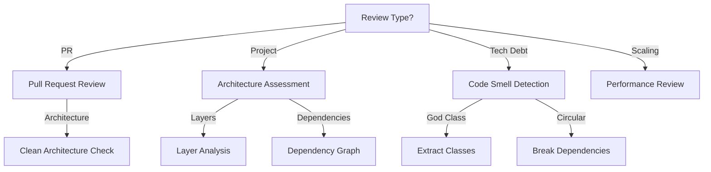

## ⚠️ Token Optimization (Skip Consolidated ADRs)
When you need to sweep the ADRs repository for context, **FIRST** read the `docs/adr/ADR-INDEX.md` or perform a `grep` on the frontmatter of the ADRs. You are **PROHIBITED** from reading the complete content (via `view_file` or `cat`) of any file with the tag `implementation_status: CONSOLIDATED` in its frontmatter YAML. Apply the 'SKIP' summary to these files, as the content is passed and static. Only perform a deep read if the user specifically requests an audit or if the current task requires modification of that exact architecture.

# Architecture Review

Performs systematic architectural code and project structure reviews.

## When to Use

### Use when:
- Architecture review with impact
- Project structure analysis
- Detection of SOLID principle violations
- Evaluation of adherence to patterns (Clean Architecture, Hexagonal, DDD)
- Identification of architectural tech debt

### Do not use when:
- Style/formatting review
- Simple bug fix
- Unit testing

### Related Skills:
- `ddd` — for validating domain modeling
- `adr-generator` — for documenting architectural decisions
- `clean-code` — for code-level refactoring and quality standards
- `refactoring` — for structural code transformation techniques
- `testing-mastery` — for test architecture and characterization suites

## Decision Tree



## Workflow

### Phase 1: Review of PR with Architectural Impact

1. Receive PR for review:
   ```bash
   gh pr view 123 --json changedFiles
   ```
2. Analyze changes:
   - New dependencies?
   - New layer?
   - Change in contract?
3. Execute checklist:
   - [ ] SRP respected
   - [ ] OCP applied
   - [ ] Clean Architecture
4. Comment on PR:
   ```
   ### [HIGH] God Class
   **File:** src/services/user-service.ts:45
   **Principle violated:** SRP
   **Description:** UserService has 500 lines and 15 responsibilities
   **Suggestion:** Break into UserService, UserValidator, UserNotifier
   ```
5. **Checkpoint**: PR approved or adjustments requested

### Phase 2: Analysis of Project Structure

1. Map structure:
   ```
   src/
   ├── controllers/
   ├── services/
   ├── repositories/
   ├── domain/
   └── infrastructure/
   ```
2. Verify layers:
   - Domain without external dependencies?
   - Controllers without business logic?
   - Repositories as abstractions?
3. Generate dependency graph:
   ```bash
   npx madge --image deps.png src/
   ```
4. **Checkpoint**: Structure validated, issues documented

### Phase 3: Detection of Structural Code Smells

1. Search for God Class:
   ```bash
   # Classes with > 500 lines
   find src -name "*.ts" -exec wc -l {} \; | sort -rn | head -10
   ```
2. Search for Feature Envy:
   ```bash
   # Methods that access many attributes of another class
   grep -r "otherClass\." src/
   ```
3. Search for Circular Dependencies:
   ```bash
   npx madge --circular src/
   ```
4. **Checkpoint**: Smells identified and prioritized

### Phase 4: Evaluation of Adherence to Patterns

1. Clean Architecture checklist:
   - [ ] Business rules do not depend on frameworks
   - [ ] Use cases orchestrate entities
   - [ ] Adapters isolate infrastructure
   - [ ] Inversion of dependency respected
2. DDD checklist:
   - [ ] Entities with their own identity
   - [ ] Value Objects immutable
   - [ ] Aggregates with well-defined boundary
   - [ ] Repositories as abstraction of collection
3. **Checkpoint**: Adherence score calculated

### Phase 5: Create Architecture Review Report

1. Use template `templates/architecture-review-report.md`
2. Document issues by severity
3. Include screenshots/graphs
4. Propose corrective actions
5. **Checkpoint**: Complete and actionable report

## Fundamental Concepts

### SOLID Principles

#### SRP (Single Responsibility)
Each class/module has a single responsibility.

```typescript
// ❌ WRONG - violates SRP
class UserService {
  createUser() {}  // persists
  sendEmail() {}   // notifies
  validate() {}    // validates
}

// ✅ CORRECT - SRP respected
class UserService {
  createUser() {}
}
class EmailService {
  send() {}
}
class UserValidator {
  validate() {}
}
```

#### OCP (Open/Closed)
Extensible without modifying existing code.

```typescript
// ✅ CORRECT via strategy
interface PaymentMethod {
  process(amount: Money): Promise<void>;
}

class CreditCard implements PaymentMethod {
  process(amount: Money) { /* ... */ }
}

class Pix implements PaymentMethod {
  process(amount: Money) { /* ... */ }
}
```

#### LSP (Liskov Substitution)
Subtypes substitute their base types.

```typescript
// ✅ CORRECT - Square is subtype of Rectangle
class Rectangle {
  setWidth(w: number) {}
  setHeight(h: number) {}
}

class Square extends Rectangle {
  setWidth(w: number) {
    super.setWidth(w);
    super.setHeight(w);  // maintains invariant
  }
}
```

#### ISP (Interface Segregation)
Specific interfaces, not generic.

```typescript
// ❌ WRONG - fat interface
interface UserService {
  createUser()
  createOrder()
  sendEmail()
  calculateDiscount()
  generateReport()
}

// ✅ CORRECT - specific interfaces
interface UserRepository {
  save()
  findById()
}
```

#### DIP (Dependency Inversion)
Depends on abstractions, not concretes.

```typescript
// ✅ CORRECT
class OrderService {
  constructor(private readonly repo: OrderRepository) {}  // abstraction
}
```

### Clean Architecture / Hexagonal

- Business rules do not depend on frameworks
- Use cases orchestrate entities
- Adapters (gateways, controllers) isolate infrastructure
- Inversion of dependency respected

### DDD

- Entities with their own identity
- Value Objects immutable
- Aggregates with well-defined boundary
- Repositories as abstraction of collection
- Domain Events for communication between contexts

### Structural Code Smells

- **God Class / God Module**: Class with many responsibilities
- **Feature Envy**: Method that uses more data from another class
- **Data Clumps**: Same data always together
- **Shotgun Surgery**: Change in multiple files
- **Circular Dependencies**: Modules that depend circularly

## Templates

### architecture-review-report.md
Location: `templates/architecture-review-report.md`

Template for architecture review report.

**Usage:**
```bash
cp templates/architecture-review-report.md docs/architecture-review-report.md
```

### tech-debt-item.md
Location: `templates/tech-debt-item.md`

Template for tech debt item.

**Usage:**
```bash
cp templates/tech-debt-item.md docs/tech-debt/{item}.md
```

## Anti-patterns

### 🔴 Critical

#### God Class
**What is it:** Class with many responsibilities.
**Why is it bad:** Difficult to test, maintain, and understand.
**How to avoid:** Break into smaller classes, each with SRP.
**Example:**
```typescript
// ❌ WRONG - 500 lines, 15 responsibilities
class UserService {
  createUser() {}
  validateUser() {}
  sendEmail() {}
  calculateDiscount() {}
  generateReport() {}
}

// ✅ CORRECT - focused classes
class UserService {
  createUser() {}
}
class UserValidator {
  validate() {}
}
```

#### Circular Dependencies
**What is it:** Module A imports B, B imports A.
**Why is it bad:** Impossible to test independently, high coupling.
**How to avoid:** Extract interface or move common code.
**Example:**
```typescript
// ❌ WRONG
// user-service.ts
import { OrderService } from './order-service';

// order-service.ts
import { UserService } from './user-service';

// ✅ CORRECT
// user-service.ts
import { OrderRepository } from '../repositories/order-repository';
```

### 🟡 Medium

#### Feature Envy
**What is it:** Method that uses more attributes of another class.
**Why is it bad:** Logic in the wrong place, encapsulation violation.
**How to avoid:** Move method to correct class.
**Example:**
```typescript
// ❌ WRONG
class ReportGenerator {
  generate(user: User) {
    return `${user.name} - ${user.email}`;  // uses User data
  }
}

// ✅ CORRECT
class User {
  getDisplayName() {
    return `${this.name} - ${this.email}`;
  }
}
```

#### Data Clumps
**What is it:** Same data always together in parameters.
**Why is it bad:** Indicates hidden Value Object.
**How to avoid:** Create Value Object.
**Example:**
```typescript
// ❌ WRONG
function createUser(name: string, email: string, phone: string) {}

// ✅ CORRECT
function createUser(contact: Contact) {}
```

### 🟢 Low

#### Shotgun Surgery
**What is it:** Simple change requires editing many files.
**Why is it bad:** High maintenance cost.
**How to avoid:** Group related logic.
**Example:**
```typescript
// ❌ WRONG - change validation requires 5 files
// user-validator.ts, order-validator.ts, etc.

// ✅ CORRECT - centralized validation
// validation/
// - user.ts
// - order.ts
```

## Checklists

### Checklist SOLID
- [ ] SRP: Each class/module has a single responsibility?
- [ ] OCP: Extensible without modifying existing code?
- [ ] LSP: Subtypes substitute their base types?
- [ ] ISP: Specific interfaces, not generic?
- [ ] DIP: Depends on abstractions, not concretes?

### Checklist Clean Architecture
- [ ] Business rules do not depend on frameworks
- [ ] Use cases orchestrate entities
- [ ] Adapters isolate infrastructure
- [ ] Inversion of dependency respected
- [ ] UI is plugin of core

### Checklist DDD
- [ ] Entities with their own identity
- [ ] Value Objects immutable
- [ ] Aggregates with well-defined boundary
- [ ] Repositories as abstraction of collection
- [ ] Domain Events for communication between contexts

### Checklist Performance
- [ ] N+1 queries identified
- [ ] Cache implemented where necessary
- [ ] Queries optimized
- [ ] Memory leaks verified
- [ ] Concurrency treated

### Checklist Security
- [ ] Input validated
- [ ] SQL injection prevented
- [ ] XSS prevented
- [ ] Auth/authorization verified
- [ ] Secrets not exposed

## Edge Cases

### Legacy Project without Tests
**Situation:** Legacy code without test coverage.
**Solution:** Refactor with characterization tests first.
**Exception:** If change is urgent, document risk.

```bash
# Add characterization test suite
mkdir -p test/legacy && touch test/legacy/user-characterization.test.ts
```

### Mal-Delimited Microservice
**Situation:** Service with mixed contexts.
**Solution:** Identify contexts, plan separation.
**Exception:** If high coupling, use strangler pattern.

```markdown
## Mixed Contexts
- User Context (should be separated)
- Order Context (should be separated)
```

### Monolith that Needs to Scale
**Situation:** Monolith with performance degradation.
**Solution:** Identify bounded contexts, extract services.
**Exception:** If horizontal scaling resolves, maintain monolith.

```markdown
## Services to Extract
1. Auth Service (high priority)
2. Notification Service (medium priority)
```

## References

- `ddd` — for domain modeling
- `adr-generator` — for documenting decisions
- [Clean Architecture](https://blog.cleancoder.com/uncle-bob/2012/08/13/Clean-Code.html)


## Completion Gate

The task associated with the skill `architecture-review` can only be declared complete when:
1. All checks in the operational verification checklist have been satisfied.
2. The deliverable has been deterministically validated through execution evidence.
3. No structural debt, unresolved placeholders, or unhandled errors remain.


## Architectural Fitness Functions & Distance Metrics (SOTA)

Evaluate architectural structural health using **Robert C. Martin's Package Coupling Metrics**:

1. **Afferent Coupling ($C_a$):** Number of external packages depending on this package.
2. **Efferent Coupling ($C_e$):** Number of external packages this package depends upon.
3. **Instability ($I$):** $I = \frac{C_e}{C_a + C_e} \quad (I \in [0, 1])$
4. **Abstractness ($A$):** $A = \frac{N_{\text{abstract}}}{N_{\text{total}}} \quad (A \in [0, 1])$
5. **Normalized Distance from the Main Sequence ($D$):**

$$D = |A + I - 1| \quad (D \in [0, 1])$$

### Fitness Gate Criteria:
- **$D \le 0.3$ (Optimal):** Package is in the balanced zone between abstractness and stability.
- **$0.3 < D \le 0.7$ (Tolerated):** Monitored tech debt.
- **$D > 0.7$ (Architectural Violation):**
  - If $A \to 0$ and $I \to 0$: **Zone of Pain** (Rigid, highly depended-on concrete code). Must extract interfaces.
  - If $A \to 1$ and $I \to 1$: **Zone of Uselessness** (Abstract code with no dependents). Must prune or consolidate.

## Domain SOTA & Industry Engineering Standards

- **Coupling & Cohesion Standards:** Robert C. Martin's Package Metric Suite (Instability $I$, Abstractness $A$, Normalized Distance $D$).
- **Clean & Hexagonal Architecture:** Ports & Adapters separation, Domain isolation from infrastructure, Dependency Rule compliance.
- **SOLID Principles:** Strict enforcement of SRP, OCP, LSP, ISP, and DIP across class and module hierarchies.
- **ACID & Distributed Systems Semantics:** Evaluation of CAP theorem trade-offs, transactional boundaries, and eventual consistency models.

### Exhaustive Heuristic Decision Rules:
- **Rule of Thumb 1 (Zero-Trust Architectural Boundaries):** Treat all external inputs, third-party payloads, and cross-module boundaries with strict zero-trust schema validation.
- **Rule of Thumb 2 (Fail-Fast & Deterministic Errors):** Reject invalid states immediately with typed, actionable error contracts rather than cascading silent failures.
- **Rule of Thumb 3 (Idempotency & AST Preservation):** State mutations and code transformations must maintain semantic idempotency across repeated executions.
- **Rule of Thumb 4 (Benchmark & Telemetry Alignment):** Measure critical execution latency ($P_{95}$) and memory overhead with structured telemetry and baseline benchmarks.
- **Rule of Thumb 5 (Event-Driven & Circuit Breaker Decoupling):** Isolate asynchronous operations behind circuit breakers and resilient retry mechanisms to prevent cascading failure.
- **Rule of Thumb 6 (Contract-First DDD Modeling):** Define clear domain aggregates, value objects, and typed interface contracts before implementing concrete logic.
- **Rule of Thumb 7 (RAG & Semantic Retrieval Precision):** Optimize context retrieval with hybrid lexical-vector search and reciprocal rank fusion to eliminate hallucinated routing.
- **Rule of Thumb 8 (OWASP & Supply Chain Verification):** Verify dependencies and data flows against OWASP Top 10 and SLSA Level 3 supply chain security standards.
- **Rule of Thumb 9 (Verification Gate Invariant):** Never declare completion without automated test execution evidence and zero compiler/linter warnings.

- **Rule of Thumb 1 (Main Sequence Invariant):** Any module with distance $D = |A + I - 1| > 0.7$ fails the architectural gate.
- **Rule of Thumb 2 (Dependency Direction Rule):** Dependencies must point inwards towards Domain entities; inner layers must have zero awareness of outer frameworks.
- **Rule of Thumb 3 (Cyclic Dependency Ban):** Cyclic package imports are categorized as Critical Anti-Patterns (`🔴 Cyclic Dependency Graph`) requiring immediate extraction of interfaces.
- **Rule of Thumb 4 (Interface Segregation Threshold):** Interfaces with $>7$ public methods must be segregated into role-specific client interfaces.