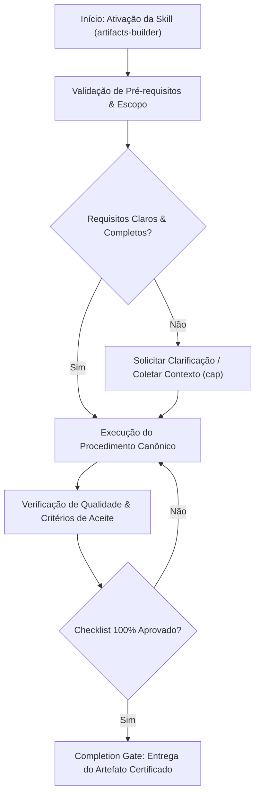

# Artifacts Builder

## When to Use

### Use when:
- Creating standalone single-file HTML/CSS/JS applications, prototypes, or visual calculators
- Building interactive demos that must execute in a browser without a build step or npm
- Visualizing complex state machines, charts, or algorithms interactively

### Do not use when:
- Building enterprise multi-page web applications with server-side routing (use Next.js / Vite)

## Overview

Generate self-contained, production-quality HTML/CSS/JS artifacts that run in any modern browser without a build step. Each artifact is a single file (or minimal file set) containing everything needed for an interactive demo, prototype, data visualization, or utility tool. Emphasis on progressive enhancement, responsive design, and clean code.

## Phase 1: Scope Definition

1. Clarify the artifact's purpose (demo, prototype, tool, visualization)
2. Determine interactivity level (static, interactive, data-driven)
3. Identify required dependencies (none, CDN-loaded, embedded)
4. Define responsive requirements (mobile, desktop, both)
5. Set constraints (file size, browser support, offline capability)

**STOP — Confirm scope and constraints with user before architecture decisions.**

### Artifact Type Decision Table

| Purpose | Complexity | Dependencies | Example |
|---|---|---|---|
| Static demo | Low | None | Product mockup, landing page |
| Interactive widget | Medium | None or Alpine.js | Calculator, form builder |
| Data visualization | Medium-High | D3.js or Chart.js | Dashboard, chart explorer |
| Prototype | Medium | Alpine.js or Petite-Vue | Clickable UI prototype |
| Utility tool | Medium-High | Varies | JSON formatter, color picker |
| Generative art | Medium | None | Canvas animation, pattern generator |
| Presentation | Medium | None or Mermaid | Slide deck, diagram viewer |

## Phase 2: Architecture

1. Choose single-file or multi-file approach
2. Select CDN dependencies (if any)
3. Plan component structure within the file
4. Define state management approach
5. Plan progressive enhancement layers

**STOP — Present architecture and dependency choices for approval.**

### Architecture Decision Table

| Constraint | Single-File | Multi-File |
|---|---|---|
| Easy sharing (email, paste) | Yes | No |
| File size < 100KB | Yes | Either |
| Multiple pages/views | Possible (SPA) | Better |
| Team collaboration | Difficult | Better |
| Offline use | Yes (self-contained) | Needs bundling |
| SEO requirements | N/A | N/A (artifacts are tools) |

### Dependency Decision Table

| Need | Recommended | CDN URL | Size |
|---|---|---|---|
| Lightweight reactivity | Alpine.js | `cdn.jsdelivr.net/npm/alpinejs@3` | ~15KB |
| Minimal Vue-like | Petite-Vue | `unpkg.com/petite-vue` | ~6KB |
| Charts | Chart.js | `cdn.jsdelivr.net/npm/chart.js@4` | ~65KB |
| Data visualization | D3.js | `cdn.jsdelivr.net/npm/d3@7` | ~90KB |
| Diagrams | Mermaid | `cdn.jsdelivr.net/npm/mermaid@10` | ~120KB |
| CSS framework (proto) | Tailwind Play CDN | `cdn.tailwindcss.com` | Runtime |
| Icons | Lucide | `unpkg.com/lucide@latest` | On-demand |
| No dependency needed | Vanilla JS | N/A | 0KB |

### CDN Usage Rules

| Rule | Rationale |
|---|---|
| Pin to major version (`@3`, `@7`) | Prevent breaking changes |
| Maximum 3 CDN dependencies | Keep artifacts lightweight |
| Add `integrity` and `crossorigin` | Security against CDN compromise |
| Provide graceful degradation | Work if CDN fails |
| Prefer smaller alternatives | Alpine over React, Petite-Vue over Vue |

## Phase 3: Implementation

1. Build semantic HTML structure
2. Add CSS (inline `<style>` or embedded)
3. Implement JavaScript functionality
4. Add error handling and fallbacks
5. Test across viewports and browsers

**STOP — Verify the artifact works correctly before delivering to user.**

### Template Structure

```html
<!DOCTYPE html>
<html lang="en">
<head>
  <meta charset="UTF-8">
  <meta name="viewport" content="width=device-width, initial-scale=1.0">
  <title>[Artifact Title]</title>
  <style>
    /* Reset */
    *, *::before, *::after { box-sizing: border-box; margin: 0; padding: 0; }

    /* Design Tokens */
    :root {
      --color-bg: #ffffff;
      --color-text: #1a1a2e;
      --color-primary: #3b82f6;
      --color-border: #e2e8f0;
      --radius: 0.5rem;
      --space: 1rem;
      --font: system-ui, -apple-system, sans-serif;
    }

    @media (prefers-color-scheme: dark) {
      :root {
        --color-bg: #0f172a;
        --color-text: #e2e8f0;
        --color-primary: #60a5fa;
        --color-border: #334155;
      }
    }

    /* Base Styles */
    body {
      font-family: var(--font);
      background: var(--color-bg);
      color: var(--color-text);
      line-height: 1.6;
    }

    /* Component Styles */
    /* ... */
  </style>
</head>
<body>
  <!-- Semantic HTML content -->

  <script>
    // Application logic
    (function() {
      'use strict';
      // ...
    })();
  </script>
</body>
</html>
```

### Responsive Design Patterns

#### Container-Based Layout

```css
.container {
  width: min(100% - 2rem, 1200px);
  margin-inline: auto;
}

.grid {
  display: grid;
  grid-template-columns: repeat(auto-fit, minmax(min(300px, 100%), 1fr));
  gap: var(--space);
}
```

#### Mobile-First Media Queries

```css
/* Base: mobile */
.layout { display: flex; flex-direction: column; }

/* Tablet and up */
@media (min-width: 768px) {
  .layout { flex-direction: row; }
  .sidebar { width: 280px; flex-shrink: 0; }
}
```

### Progressive Enhancement

| Layer | Purpose | Requirement |
|---|---|---|
| HTML | Content accessible and meaningful | Works without CSS or JS |
| CSS | Visual presentation and layout | Works without JS |
| JavaScript | Enhanced interactivity | Adds dynamic behavior |

#### Feature Detection

```javascript
// Check before using modern APIs
if ('IntersectionObserver' in window) {
  // Use lazy loading
} else {
  // Load all images immediately
}

if (CSS.supports('backdrop-filter', 'blur(10px)')) {
  element.classList.add('glass-effect');
}
```

### State Management (No Framework)

#### Simple State Pattern

```javascript
function createStore(initialState) {
  let state = { ...initialState };
  const listeners = new Set();

  return {
    getState: () => ({ ...state }),
    setState(updates) {
      state = { ...state, ...updates };
      listeners.forEach(fn => fn(state));
    },
    subscribe(fn) {
      listeners.add(fn);
      return () => listeners.delete(fn);
    },
  };
}
```

#### URL-Based State (for shareable artifacts)

```javascript
function syncStateWithURL(store) {
  const params = new URLSearchParams(location.search);
  for (const [key, value] of params) {
    store.setState({ [key]: JSON.parse(value) });
  }
  store.subscribe(state => {
    const params = new URLSearchParams();
    Object.entries(state).forEach(([k, v]) => params.set(k, JSON.stringify(v)));
    history.replaceState(null, '', `?${params}`);
  });
}
```

### Export Formats

| Format | Use Case | Method |
|---|---|---|
| Single HTML file | Sharing, embedding | Self-contained `<style>` and `<script>` |
| HTML + assets | Complex artifacts | Separate CSS/JS files |
| Data URL | Inline embedding | `data:text/html;base64,...` |
| Screenshot/PNG | Documentation | `html2canvas` or browser screenshot |
| PDF | Print/report | `window.print()` with print styles |

## Quality Checklist

- [ ] Valid HTML5 (`<!DOCTYPE html>`, `lang` attribute)
- [ ] Responsive viewport meta tag
- [ ] Works without JavaScript (content visible)
- [ ] Dark mode support (`prefers-color-scheme`)
- [ ] Keyboard navigable
- [ ] No console errors
- [ ] File size under 100KB (excluding images)
- [ ] Cross-browser tested (Chrome, Firefox, Safari)
- [ ] Print styles if applicable
- [ ] Semantic HTML elements used appropriately

## Anti-Patterns / Common Mistakes

| Anti-Pattern | Why It Is Wrong | What to Do Instead |
|---|---|---|
| React/Vue/Angular in single-file artifact | Massive overhead for simple interactions | Use Alpine.js or vanilla JS |
| Heavy framework from CDN for simple UI | Slow load, wasted bandwidth | Match dependency weight to need |
| Inline styles instead of CSS custom properties | Cannot theme, cannot dark-mode | Use CSS custom properties (tokens) |
| No error handling on user input | Crashes on bad input | Validate and provide feedback |
| Fixed pixel dimensions | Breaks on mobile, tablets | Use responsive units (%, rem, vw) |
| Missing `<meta viewport>` | Mobile renders desktop-zoomed | Always include viewport meta tag |
| Blocking `<script>` in `<head>` | Delays page rendering | Use `defer` attribute or put at end of body |
| No IIFE wrapper for script | Global scope pollution | Wrap in `(function() { ... })()` |
| Hardcoded colors without tokens | Cannot switch themes | Use CSS custom properties |

## Integration Points

| Skill | Integration |
|---|---|
| `ui-ux-pro-max` | Style selection and UX guidelines |
| `ui-design-system` | Design tokens for consistent theming |
| `canvas-design` | Canvas/SVG visualizations within artifacts |
| `senior-frontend` | Complex component patterns |
| `mobile-design` | Mobile-responsive artifact design |
| `planning` | Artifact scope is defined during planning |

## Skill Type

**FLEXIBLE** — Adapt the architecture, dependencies, and complexity to the artifact's requirements. Simple demos should remain as minimal as possible; complex tools may use lightweight frameworks and multiple CDN dependencies.


## Decision Workflow




## Anti-Patterns & Operational Guardrails

| Anti-Pattern | Severidade | Impacto Negativo | Mitigação Canônica |
|:---|:---:|:---|:---|
| **Execução Prematura sem Contexto** | 🔴 Critical | Alucinação de contexto e refatoração destrutiva | Ativar a skill `cap` para adquirir evidências mínimas antes de editar. |
| **Omissão de Checklists de Validação** | 🟡 Medium | Entrega de artefatos com inconsistências sintáticas | Executar rigorosamente o checklist passo a passo antes do handoff. |
| **Falta de Documentação de Decisões** | 🟢 Low | Perda de rastreabilidade técnica e drift arquitetural | Registrar trade-offs relevantes via skill `adr-generator`. |


## Edge Cases & Failure Modes

- **Ambiente Restrito / Read-Only:** Se o filesystem ou sandbox estiver bloqueado contra escrita, reportar o bloqueio com evidência imediata e gerar o patch em markdown diff.
- **Conflito de Especificação:** Caso encontre contradições entre a intenção do usuário e o SSOT (`AGENTS.md`), interromper e sinalizar as opções com trade-offs.
- **Timeout ou Exaustão de Contexto:** Em tarefas volumosas, decompor em sub-lotes atômicos utilizando a skill `subagent-driven-development`.


## Domain SOTA & Industry Engineering Standards

- **Single-File Architecture:** Fully self-contained HTML/CSS/JS bundles executable locally without build tools or npm dependencies.
- **Security & Sandboxing:** Strict Content Security Policy (CSP), zero external unsafe scripts, and local `iframe` isolation.
- **Modern Web APIs:** Native Web Components, Canvas 2D / WebGL rendering, CSS Grid & Custom Properties.
- **Reactive State Without Frameworks:** Lightweight Pub/Sub state machines and Proxy-based reactive data binding.

### Vanilla Reactive State Binding Pattern:

```javascript
const state = new Proxy({ count: 0 }, {
  set(target, key, value) {
    target[key] = value;
    document.querySelectorAll(`[data-bind="${key}"]`).forEach(el => el.textContent = value);
    return true;
  }
});
```

### Exhaustive Heuristic Decision Rules:
- **Rule of Thumb 1 (Zero-Trust Architectural Boundaries):** Treat all external inputs, third-party payloads, and cross-module boundaries with strict zero-trust schema validation.
- **Rule of Thumb 2 (Fail-Fast & Deterministic Errors):** Reject invalid states immediately with typed, actionable error contracts rather than cascading silent failures.
- **Rule of Thumb 3 (Idempotency & AST Preservation):** State mutations and code transformations must maintain semantic idempotency across repeated executions.
- **Rule of Thumb 4 (Benchmark & Telemetry Alignment):** Measure critical execution latency ($P_{95}$) and memory overhead with structured telemetry and baseline benchmarks.
- **Rule of Thumb 5 (Event-Driven & Circuit Breaker Decoupling):** Isolate asynchronous operations behind circuit breakers and resilient retry mechanisms to prevent cascading failure.
- **Rule of Thumb 6 (Contract-First DDD Modeling):** Define clear domain aggregates, value objects, and typed interface contracts before implementing concrete logic.
- **Rule of Thumb 7 (RAG & Semantic Retrieval Precision):** Optimize context retrieval with hybrid lexical-vector search and reciprocal rank fusion to eliminate hallucinated routing.
- **Rule of Thumb 8 (OWASP & Supply Chain Verification):** Verify dependencies and data flows against OWASP Top 10 and SLSA Level 3 supply chain security standards.
- **Rule of Thumb 9 (Verification Gate Invariant):** Never declare completion without automated test execution evidence and zero compiler/linter warnings.
## Completion Gate & Verification
Before declaring artifact deliverable complete:
- [ ] Single HTML file opens and executes cleanly in modern browsers
- [ ] Zero external insecure script CDNs; CSS/JS self-contained
- [ ] Responsive layout scales smoothly across mobile and desktop viewports