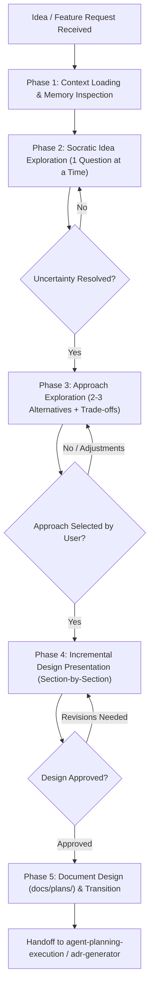
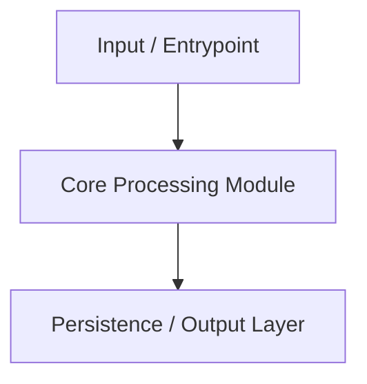

# Brainstorming Ideas Into Designs (SOTA Edition)

Structured collaborative exploration engine that transforms ambiguous ideas, goals, or feature requests into concrete, validated, and documented designs before planning or coding begins.

---

## When to Use

### Use When:
- The user describes a new feature, component, goal, or behavior modification with open-ended scope.
- Exploring alternative architectural approaches, libraries, or design trade-offs collaboratively.
- The user asks "how should we build X?", "what is the best approach for Y?", or invokes `/brainstorm`.
- Clarifying requirements, success criteria, constraints, and non-goals before formal planning.

### Do Not Use When:
- The task is a trivial 1-line bug fix with a known cause (use `systematic-debugging` or direct edit).
- Emergency P0 production incidents requiring immediate hotfix/rollback (use `systematic-debugging` or direct remediation).
- A complete, approved design or Architecture Decision Record (ADR) already exists (use `implementation`).
- The task requires executing an approved step-by-step implementation plan (use `agent-planning-execution`).
- Purely conducting competitive user research or usability testing (use `ux-researcher-designer`).

### Related Skills:
- `agent-planning-execution` — receives the approved design and decomposes it into executable roadmap tasks.
- `adr-generator` — formalizes architectural choices into MADR-style Decision Records.
- `product-spec-engineering` — converts high-level intent into formal Product Requirement Documents (PRDs).
- `architecture-review` — reviews existing codebase architecture against SOLID and clean patterns.
- `implementation` — executes planned changes with test verification.

---

## Decision Tree & 5-Phase Brainstorming Loop



---

## Phase 1: Context Loading

**Goal:** Load existing project context before asking the user anything.

1. **Check Memory Files**: Read project context (`STATE.md`, `memory/`, `learned-patterns.md`).
2. **Review Governance & Architecture**: Inspect `AGENTS.md`, `README.md`, and relevant directory structures.
3. **Inspect Prior Designs**: Check `docs/plans/` or `docs/adr/` for related work.
4. **Identify Hard Constraints**: Tech stack, dependencies, database constraints, and deployment targets.
5. **Summarize Knowns**: Note what is already established — **never** re-ask the user for facts discoverable in the repository.

```text
STOP GATE — Do NOT proceed to Phase 2 until:
[ ] Memory files and governance instructions (AGENTS.md / README.md) are loaded.
[ ] Relevant codebase areas have been inspected.
[ ] You can state what is already known about this domain.
```

---

## Phase 2: Idea Exploration

**Goal:** Understand user intent through focused, one-at-a-time questions.

1. **Ask ONE Question per Turn**: Never overwhelm the user with multiple simultaneous questions.
2. **Prefer Structured Choices**: Use multiple-choice options when possible to accelerate alignment.
3. **Define Non-Goals**: Explicitly clarify what is *out of scope* for this iteration.
4. **Convert Vague Answers to Testable Criteria**: "Fast" → "< 200ms latency", "Easy" → "< 2 clicks".

### Question Flow Decision Table

| Target Area | Question Style | Example |
|---|---|---|
| **Core Purpose** | Open-ended | "What primary problem does this feature solve for the end user?" |
| **Scope Boundaries** | Multiple Choice | "Should this handle: (A) only authenticated users, (B) all visitors, or (C) role-based?" |
| **Technical Constraints** | Yes/No + Follow-up | "Does this operation need to support offline sync or background execution?" |
| **Trade-off Priority** | Forced Ranking | "Rank the primary drivers for this module: (1) Execution speed, (2) Simplicity, (3) Extensibility." |
| **Success Criteria** | Measurable Outcome | "What does the ideal success state look like? What is the primary happy path?" |
| **Non-Goals** | Explicit Exclusion | "What functionality should we explicitly NOT build in this first version?" |

```text
STOP GATE — Do NOT proceed to Phase 3 until:
[ ] Core purpose and target audience are clear.
[ ] Constraints (stack, performance, scope) are established.
[ ] Success criteria and non-goals are explicitly documented.
```

---

## Phase 3: Approach Exploration

**Goal:** Propose 2–3 distinct architectural approaches with trade-offs and a clear recommendation.

### Approach Comparison Format

```markdown
### Approach A: [Name] (Recommended)
- **Summary**: 2–3 sentences outlining the technical mechanism.
- **Pros**: Concrete advantages (e.g., reuses existing components, zero new dependencies).
- **Cons**: Known limitations or architectural trade-offs.
- **Complexity**: Low / Medium / High
- **Estimated Operational / Token Cost**: Minimal / Moderate / Heavy
- **Risk**: Potential failure modes or edge-case costs.
- **Rationale**: Why this approach is recommended given Phase 2 constraints.

### Approach B: [Name]
- **Summary**: Alternative pattern (e.g., dedicated microservice, external library).
- **Pros & Cons**: Key differentiators.
- **Complexity / Risk**: Comparative evaluation.
- **Estimated Operational / Token Cost**: Minimal / Moderate / Heavy

### Approach C: [Name] (Optional)
- **Summary**: Radical or minimal alternative.
```

```text
STOP GATE — Do NOT proceed to Phase 4 until:
[ ] At least 2 distinct approaches with explicit trade-offs are presented.
[ ] A clear recommendation with rationale is provided.
[ ] The user has explicitly selected or validated the preferred approach.
```

---

## Phase 4: Incremental Design Presentation

**Goal:** Present the detailed design in logical sections, validating each incrementally.

### Design Presentation Structure

1. **Architecture & High-Level Topology**: Modules, boundaries, and system interactions.
2. **Components & Contracts**: Interface signatures, data schemas, and state management.
3. **Data Flow & Sequence**: How data moves end-to-end through the system.
4. **Error Handling & Failure Modes**: Edge cases, retry strategies, and user-facing error contracts.
5. **Validation & Testing Strategy**: Unit, integration, and acceptance criteria.

*Rule:* Present one or two related sections at a time. Ask for confirmation before moving to the next.

```text
STOP GATE — Do NOT proceed to Phase 5 until:
[ ] All relevant design sections have been presented and validated.
[ ] User feedback and adjustments have been incorporated.
[ ] Complete design is coherent and addresses all stated requirements.
```

---

## Phase 5: Documentation & Transition

**Goal:** Persist the design artifact and hand off cleanly to execution planning.

1. **Persist Design Document**: Write to `docs/plans/YYYY-MM-DD-<feature>-design.md`.
2. **Record Architectural Decisions**: If significant trade-offs were made, invoke `adr-generator` to create an ADR.
3. **Update Agent Memory**: Record new patterns and conventions in `STATE.md`.
4. **Handoff**: Transition to `agent-planning-execution` to generate the step-by-step task breakdown.

### Canonical Design Document Template

```markdown
# [Feature / Topic] Design Document

**Date:** YYYY-MM-DD  
**Status:** Approved  
**Selected Approach:** [Approach Name]  

## 1. Problem Statement & Objectives
[Problem summary, target user, and measurable success criteria]

## 2. Architecture & Components
[High-level structure, component roles, and interaction diagrams]



## 3. Data Flow & Contracts
[Schemas, interfaces, and state transitions]

## 4. Error Handling & Edge Cases
[Failure handling, fallbacks, and recovery mechanisms]

## 5. Non-Goals
[Explicitly excluded features for this iteration]

## 6. Next Steps
Handoff to `agent-planning-execution` for work breakdown decomposition.
```

---

## Anti-patterns

### 🔴 Critical

#### Coding Before Design Approval (Drive-by Coding)
- **What is it:** Writing code, scaffolding projects, or installing packages before the design is approved.
- **Why is it bad:** Produces immediate technical debt, wasted tokens, and architectural rework.
- **How to avoid:** Enforce the `<HARD-GATE>`: zero production code before design approval.

#### Question Overload (Interrogation Pattern)
- **What is it:** Asking 5+ open-ended questions in a single response.
- **Why is it bad:** Overwhelms the user and leads to superficial, incomplete answers.
- **How to avoid:** Ask exactly ONE focused question per turn, prioritizing multiple choice.

#### Single-Approach Anchor
- **What is it:** Presenting only 1 implementation idea as if it were the only possible solution.
- **Why is it bad:** Misses simpler or more performant alternatives.
- **How to avoid:** Always propose 2–3 viable approaches with explicit pros/cons.

### 🟡 Medium

#### Monolithic Design Dump
- **What is it:** Presenting a 500-line comprehensive specification in one massive message.
- **How to avoid:** Break the design into logical sections and confirm each section incrementally.

#### Skipping Context Loading
- **What is it:** Asking the user what stack or database is used when it is already in `package.json` / `README.md`.
- **How to avoid:** Read codebase files and memory in Phase 1 first.

---

## Anti-Rationalization Hard-Gates

<HARD-GATE>
Do NOT invoke any implementation skill, write production code, scaffold new packages, or modify existing source files until you have presented a design and the user has explicitly approved it. This applies to ALL creative or architectural requests regardless of perceived simplicity.
</HARD-GATE>

If you catch yourself rationalizing:
- *"The change seems too simple to brainstorm"* → Design can be concise (2 paragraphs), but must exist.
- *"The user already knows what they want"* → Users know WHAT they want; brainstorming defines HOW to build it safely.
- *"Let me just create the initial files first"* → Stop. Document the architecture first.

---

## Integration Matrix with Canonical Catalog

| Canonical Skill | Phase | Integration Role |
|---|:---:|---|
| `technical-documentation` | Phase 1 & 5 | Ingests `STATE.md` and repository pillars; updates persistent memory. |
| `ux-researcher-designer` | Phase 2 | Provides user persona and journey insights for frontend features. |
| `adr-generator` | Phase 3 & 5 | Converts selected architectural trade-offs into formal MADR decision sets. |
| `agent-planning-execution`| Phase 5 | Receives approved design and creates the work breakdown structure (WBS). |
| `implementation` | Post-Design | Executes the planned tasks with test-driven verification. |
