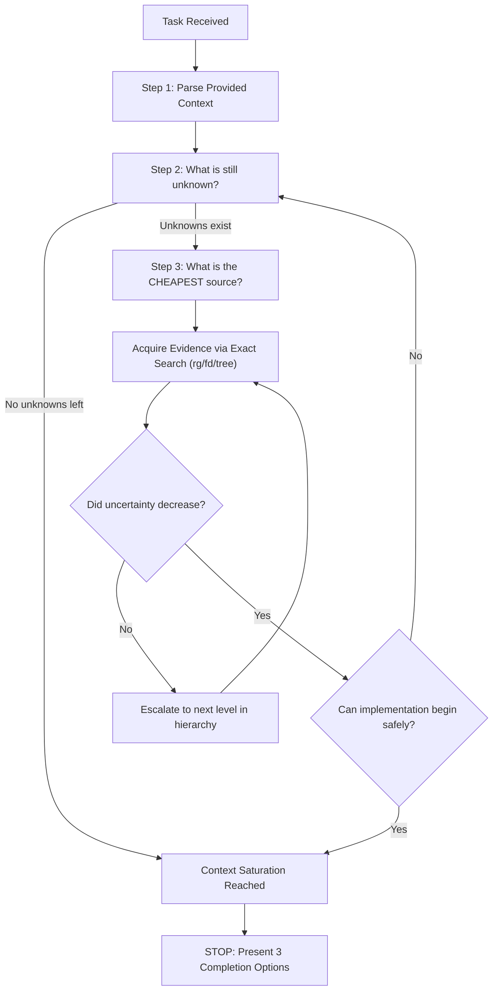

# Context Acquisition Protocol (CAP)

Minimal Context Bootstrap for AI Coding Agents. Acquire **only the information that is strictly missing** to begin execution safely.

> The supplied user request / task description is your primary source of truth. The repository exists exclusively to answer unanswered questions. Your objective is **not** to understand the whole repository; your objective is to eliminate uncertainty until implementation becomes safe, and stop immediately.

---

## When to Use

### Use When:
- Starting any coding, debugging, or refactoring task where specific implementation details are unknown.
- You need to locate exact symbols, files, imports, or API contracts with minimal token consumption.
- Bootstrapping task context from a large codebase without reading entire directories.
- Avoiding token bloat and context window pollution before executing changes.

### Do Not Use When:
- The prompt or task description already provides 100% of the necessary code, paths, and contracts.
- An exhaustive, full-repository architectural audit has been explicitly requested by the user.
- You are already in the middle of an active `implementation` execution loop.
- The task is a pure conceptual discussion or creative brainstorm with no code modifications.

### Related Skills:
- `implementation` — executes code changes once context saturation is reached.
- `agent-planning-execution` — plans complex roadmap decomposition before execution.
- `systematic-debugging` — 4-phase investigation workflow for bug triage.
- `clean-code` — code quality and refactoring standards.

---

## Decision Tree & Operating Loop



Never perform repository exploration outside this loop.

---

## Step 1 — Parse Supplied Context

Read the supplied document or prompt and extract every explicit fact:

- Objective & requested change
- Target module, package, file, or symbol
- Interfaces, public APIs, and types
- Associated ADRs, RFCs, or constraints
- Acceptance criteria & validation strategy

*Rule:* Do not search or browse the repository yet. Extract what is already known first.

---

## Step 2 — Formulate Unanswered Questions

Determine what remains unknown before searching the repository:
- *What must change?*
- *Where must it change?*
- *Which direct dependencies are affected?*
- *How will the result be validated?*

*Rule:* Repository exploration is allowed **only** to answer specific, formulated questions.

---

## Step 3 — Cheapest Evidence First (8-Level Hierarchy)

Always answer each question using the cheapest available evidence source:

| Level | Evidence Source | Operation / Tool | Token Cost |
|:---:|---|---|:---:|
| **1** | **Exact Path** | `view_file` on explicit path | Lowest |
| **2** | **Exact Symbol** | `rg "<exact_symbol>"` | Ultra-low |
| **3** | **Filesystem Metadata** | `fd <name>` or `tree -L 2` | Very low |
| **4** | **Canonical Documentation** | `README.md`, `docs/`, `ADR-*.md` | Low |
| **5** | **Public Interfaces** | Exported headers / Interface definitions | Medium |
| **6** | **Public Types** | Type signatures & schemas | Medium |
| **7** | **Tests** | Unit / Integration test assertions | Medium-High |
| **8** | **Implementation** | Full function / class body | Highest |

*Rule:* Never jump directly to reading full implementations (Level 8) if a cheaper source (Levels 1–6) can resolve the question.

---

## Preferred Deterministic Operations

```bash
# 1. Repository topology (limit depth)
tree -L 2

# 2. Locate file by name
fd <filename>

# 3. Locate exact symbol definition
rg "<symbol>"

# 4. Locate identifier references
rg "<identifier>"

# 5. Locate imports & exports
rg "^import|^from"
rg "^export"

# 6. Locate canonical documentation
fd README
fd ADR
fd docs
```

*Rule:* Only use recursive directory traversal when targeted `rg` / `fd` searches cannot answer the question.

---

## Reading Strategy & Skip Rules

### Reading Strategy
Read only the smallest fragment of code capable of answering the question:
1. Public API → 2. Interface → 3. Contract → 4. Types → 5. Tests → 6. Implementation.
*Stop reading immediately after the answer is found.*

### Skip Rules
- **If module is specified** → Skip module discovery.
- **If file path is specified** → Open it directly (do not search for other files).
- **If symbol is specified** → Search only that symbol.
- **If implementation location is specified** → Begin directly at that target.
- **If the answer already exists in memory/transcript** → Never search again.

---

## Context Saturation & Scope Control

### Context Saturation
Context acquisition ends immediately when you can answer:
1. *What must change?*
2. *Where must it change?*
3. *Why must it change?*
4. *Which direct dependencies are affected?*
5. *How will the result be validated?*

*No additional repository exploration is permitted after this threshold.*

### Scope Control
- Restrict all work strictly to the requested scope.
- Ignore unrelated tech debt, code smells, or style inconsistencies unless they break correctness.
- Do not refactor peripheral files without explicit instruction.

---

## Anti-patterns

### 🔴 Critical

#### Whole Repository Exploration
- **What is it:** Inspecting entire folder trees "to understand the architecture."
- **Why is it bad:** Wastes thousands of context tokens and introduces hallucination noise.
- **How to avoid:** Think in specific questions. Search only with targeted `rg` / `fd`.

#### Reading Past Context Saturation
- **What is it:** Continuing to open and inspect files after knowing what and where to change.
- **Why is it bad:** Dilutes attention and increases latency.
- **How to avoid:** Hard stop when the 5 saturation questions are answered.

#### Replacing Evidence with Inference
- **What is it:** Guessing file paths, function signatures, or contracts instead of quick `rg`.
- **Why is it bad:** Leads to broken imports and runtime errors.
- **How to avoid:** Query the cheapest evidence source before writing code.

### 🟡 Medium

#### Proactive Escalation
- **What is it:** Jumping straight to Level 8 (full implementation read) without checking Level 1–5 (interfaces/types).
- **How to avoid:** Follow the 8-Level hierarchy sequentially.

#### Opening Multiple Candidate Files
- **What is it:** Opening 10 files simultaneously from a loose search.
- **How to avoid:** Refine the `rg` query to pinpoint the exact single target file.

---

## Decision Rules & Checklists

### Execution Rules
- `IF` the answer already exists `THEN` do not search.
- `IF` the exact path is known `THEN` open it directly.
- `IF` a cheaper source exists `THEN` use it first.
- `IF` uncertainty is resolved `THEN` stop exploration immediately.

### Protocol Verification Checklist
- [ ] Minimal repository queries executed.
- [ ] Every query answered a specific, pre-formulated question.
- [ ] Zero unneeded files opened.
- [ ] Context acquisition stopped immediately upon saturation.

---

## Completion Gate

Once Context Saturation is reached, **do not begin implementation automatically**. Present exactly the following 3 options to the user:

1. **Proceed with simple implementation**
2. **Proceed using the `/implementation` skill**
3. **Stop and wait for further user instructions**

*Execute only the option explicitly selected by the user.*


## Edge Cases & Failure Modes

- **Ambiente Restrito / Read-Only:** Se o filesystem ou sandbox estiver bloqueado contra escrita, reportar o bloqueio com evidência imediata e gerar o patch em markdown diff.
- **Conflito de Especificação:** Caso encontre contradições entre a intenção do usuário e o SSOT (`AGENTS.md`), interromper e sinalizar as opções com trade-offs.
- **Timeout ou Exaustão de Contexto:** Em tarefas volumosas, decompor em sub-lotes atômicos utilizando a skill `subagent-driven-development`.

