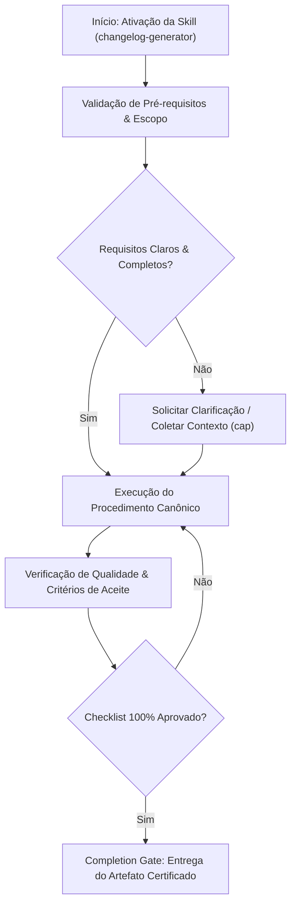

# Changelog Generator

This skill transforms technical git commits into polished, user-friendly changelogs that your customers and users will actually understand and appreciate.

## When to Use This Skill


## Decision Workflow



- Preparing release notes for a new version
- Creating weekly or monthly product update summaries
- Documenting changes for customers
- Writing changelog entries for app store submissions
- Generating update notifications
- Creating internal release documentation
- Maintaining a public changelog/product updates page

## What This Skill Does

1. **Scans Git History**: Analyzes commits from a specific time period or between versions
2. **Categorizes Changes**: Groups commits into logical categories (features, improvements, bug fixes, breaking changes, security)
3. **Translates Technical → User-Friendly**: Converts developer commits into customer language
4. **Formats Professionally**: Creates clean, structured changelog entries
5. **Filters Noise**: Excludes internal commits (refactoring, tests, etc.)
6. **Follows Best Practices**: Applies changelog guidelines and your brand voice

## How to Use

### Basic Usage

From your project repository:

```
Create a changelog from commits since last release
```

```
Generate changelog for all commits from the past week
```

```
Create release notes for version 2.5.0
```

### With Specific Date Range

```
Create a changelog for all commits between March 1 and March 15
```

### With Custom Guidelines

```
Create a changelog for commits since v2.4.0, using my changelog 
guidelines from CHANGELOG_STYLE.md
```

## Example

**User**: "Create a changelog for commits from the past 7 days"

**Output**:
```markdown
# Updates - Week of March 10, 2024

## ✨ New Features

- **Team Workspaces**: Create separate workspaces for different 
  projects. Invite team members and keep everything organized.

- **Keyboard Shortcuts**: Press ? to see all available shortcuts. 
  Navigate faster without touching your mouse.

## 🔧 Improvements

- **Faster Sync**: Files now sync 2x faster across devices
- **Better Search**: Search now includes file contents, not just titles

## 🐛 Fixes

- Fixed issue where large images wouldn't upload
- Resolved timezone confusion in scheduled posts
- Corrected notification badge count
```

**Inspired by:** Manik Aggarwal's use case from Lenny's Newsletter

## Tips

- Run from your git repository root
- Specify date ranges for focused changelogs
- Use your CHANGELOG_STYLE.md for consistent formatting
- Review and adjust the generated changelog before publishing
- Save output directly to CHANGELOG.md

## Related Use Cases

- Creating GitHub release notes
- Writing app store update descriptions
- Generating email updates for users
- Creating social media announcement posts


## Anti-Patterns & Operational Guardrails

| Anti-Pattern | Severidade | Impacto Negativo | Mitigação Canônica |
|:---|:---:|:---|:---|
| **Execução Prematura sem Contexto** | 🔴 Critical | Alucinação de contexto e refatoração destrutiva | Ativar a skill `cap` para adquirir evidências mínimas antes de editar. |
| **Omissão de Checklists de Validação** | 🟡 Medium | Entrega de artefatos com inconsistências sintáticas | Executar rigorosamente o checklist passo a passo antes do handoff. |
| **Falta de Documentação de Decisões** | 🟢 Low | Perda de rastreabilidade técnica e drift arquitetural | Registrar trade-offs relevantes via skill `adr-generator`. |


## Edge Cases & Failure Modes

- **Ambiente Restrito / Read-Only:** Se o filesystem ou sandbox estiver bloqueado contra escrita, reportar o bloqueio com evidência imediata e gerar o patch em markdown diff.
- **Conflito de Especificação:** Caso encontre contradições entre a intenção do usuário e o SSOT (`AGENTS.md`), interromper e sinalizar as opções com trade-offs.
- **Timeout ou Exaustão de Contexto:** Em tarefas volumosas, decompor em sub-lotes atômicos utilizando a skill `subagent-driven-development`.


## Operational Verification Checklist

- [ ] Todos os pré-requisitos e arquivos-alvo foram inspecionados antes da modificação.
- [ ] O procedimento seguiu estritamente as regras e boas práticas da especialização.
- [ ] As diretrizes de segurança, tipagem e estilo foram preservadas.
- [ ] Os testes unitários ou comandos de validação foram executados com sucesso.
- [ ] O artefato final foi inspecionado contra o completion gate.

