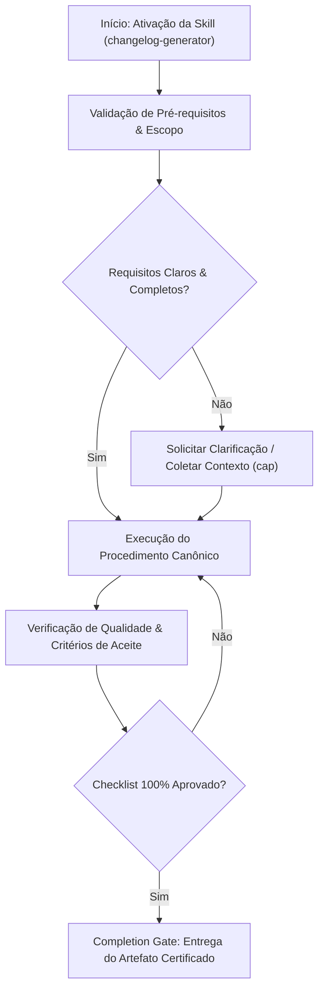

# Changelog Generator

This skill transforms technical git commits into polished, user-friendly changelogs that your customers and users will actually understand and appreciate.

## When to Use This Skill


## Decision Workflow



- Preparing release notes for a new version
- Creating weekly or monthly product update summaries
- Documenting changes for customers
- Writing changelog entries for app store submissions
- Generating update notifications
- Creating internal release documentation
- Maintaining a public changelog/product updates page

## What This Skill Does

1. **Scans Git History**: Analyzes commits from a specific time period or between versions
2. **Categorizes Changes**: Groups commits into logical categories (features, improvements, bug fixes, breaking changes, security)
3. **Translates Technical → User-Friendly**: Converts developer commits into customer language
4. **Formats Professionally**: Creates clean, structured changelog entries
5. **Filters Noise**: Excludes internal commits (refactoring, tests, etc.)
6. **Follows Best Practices**: Applies changelog guidelines and your brand voice

## How to Use

### Basic Usage

From your project repository:

```
Create a changelog from commits since last release
```

```
Generate changelog for all commits from the past week
```

```
Create release notes for version 2.5.0
```

### With Specific Date Range

```
Create a changelog for all commits between March 1 and March 15
```

### With Custom Guidelines

```
Create a changelog for commits since v2.4.0, using my changelog 
guidelines from CHANGELOG_STYLE.md
```

## Example

**User**: "Create a changelog for commits from the past 7 days"

**Output**:
```markdown
# Updates - Week of March 10, 2024

## ✨ New Features

- **Team Workspaces**: Create separate workspaces for different 
  projects. Invite team members and keep everything organized.

- **Keyboard Shortcuts**: Press ? to see all available shortcuts. 
  Navigate faster without touching your mouse.

## 🔧 Improvements

- **Faster Sync**: Files now sync 2x faster across devices
- **Better Search**: Search now includes file contents, not just titles

## 🐛 Fixes

- Fixed issue where large images wouldn't upload
- Resolved timezone confusion in scheduled posts
- Corrected notification badge count
```

**Inspired by:** Manik Aggarwal's use case from Lenny's Newsletter

## Tips

- Run from your git repository root
- Specify date ranges for focused changelogs
- Use your CHANGELOG_STYLE.md for consistent formatting
- Review and adjust the generated changelog before publishing
- Save output directly to CHANGELOG.md

## Related Use Cases

- Creating GitHub release notes
- Writing app store update descriptions
- Generating email updates for users
- Creating social media announcement posts


## Anti-Patterns & Operational Guardrails

| Anti-Pattern | Severidade | Impacto Negativo | Mitigação Canônica |
|:---|:---:|:---|:---|
| **Premature Execution Without Context** | 🔴 Critical | Context hallucination and destructive refactoring | Activate `cap` to acquire minimal evidence before editing. |
| **Omission of Validation Checklists** | 🟡 Medium | Delivering artifacts with syntax inconsistencies | Rigorously execute the checklist step-by-step before handoff. |
| **Falta de Documentação de Decisões** | 🟢 Low | Perda de rastreabilidade técnica e drift arquitetural | Registrar trade-offs relevantes via skill `adr-generator`. |


## Edge Cases & Failure Modes

- **Restricted / Read-Only Environment:** If the filesystem or sandbox is write-locked, report the constraint immediately with evidence and generate changes as a markdown diff patch.
- **Specification Conflict:** If contradictions emerge between user intent and the SSOT (`AGENTS.md`), halt and present trade-off options.
- **Context Exhaustion / Timeout:** For massive tasks, decompose into atomic sub-batches utilizing `subagent-driven-development`.


## Domain SOTA & Industry Engineering Standards

- **Specification Standards:** Keep a Changelog (v1.1.0) and Semantic Versioning (SemVer v2.0.0).
- **Commit Parsing Standards:** Conventional Commits (v1.0.0) format (`feat`, `fix`, `docs`, `refactor`, `perf`, `test`, `chore`).
- **Release Categorization:** Automatic grouping into `Added`, `Changed`, `Deprecated`, `Removed`, `Fixed`, and `Security`.
- **Breaking Change Semantics:** Automatic Major bump detection on `BREAKING CHANGE:` or `!` commit syntax.

### SemVer 2.0.0 Automated Bump Decision Matrix:

| Commit Types in Release Range | SemVer Bump | Example Version Transition |
|:---|:---:|:---|
| Any commit with `BREAKING CHANGE:` or `type!:` | **MAJOR** | `1.4.2` $	o$ `2.0.0` |
| Contains `feat:` commits with zero breaking changes | **MINOR** | `1.4.2` $	o$ `1.5.0` |
| Only `fix:`, `perf:`, `refactor:` commits | **PATCH** | `1.4.2` $	o$ `1.4.3` |

### Exhaustive Heuristic Decision Rules:
- **Rule of Thumb 1 (Zero-Trust Architectural Boundaries):** Treat all external inputs, third-party payloads, and cross-module boundaries with strict zero-trust schema validation.
- **Rule of Thumb 2 (Fail-Fast & Deterministic Errors):** Reject invalid states immediately with typed, actionable error contracts rather than cascading silent failures.
- **Rule of Thumb 3 (Idempotency & AST Preservation):** State mutations and code transformations must maintain semantic idempotency across repeated executions.
- **Rule of Thumb 4 (Benchmark & Telemetry Alignment):** Measure critical execution latency ($P_{95}$) and memory overhead with structured telemetry and baseline benchmarks.
- **Rule of Thumb 5 (Event-Driven & Circuit Breaker Decoupling):** Isolate asynchronous operations behind circuit breakers and resilient retry mechanisms to prevent cascading failure.
- **Rule of Thumb 6 (Contract-First DDD Modeling):** Define clear domain aggregates, value objects, and typed interface contracts before implementing concrete logic.
- **Rule of Thumb 7 (RAG & Semantic Retrieval Precision):** Optimize context retrieval with hybrid lexical-vector search and reciprocal rank fusion to eliminate hallucinated routing.
- **Rule of Thumb 8 (OWASP & Supply Chain Verification):** Verify dependencies and data flows against OWASP Top 10 and SLSA Level 3 supply chain security standards.
- **Rule of Thumb 9 (Verification Gate Invariant):** Never declare completion without automated test execution evidence and zero compiler/linter warnings.
## Operational Verification Checklist

- [ ] All prerequisites and target files inspected before modification.
- [ ] Procedure strictly adheres to specialization rules and best practices.
- [ ] Security, typing, and architectural style guidelines preserved.
- [ ] Unit tests or validation commands executed successfully.
- [ ] Final deliverable verified against the completion gate.


## Completion Gate & Verification
Before concluding changelog generation:
- [ ] Keep a Changelog categories (`Added`, `Changed`, `Fixed`, etc.) respected
- [ ] SemVer bump calculated accurately based on commit types
- [ ] Clickable links included for PRs, issues, and commit SHAs