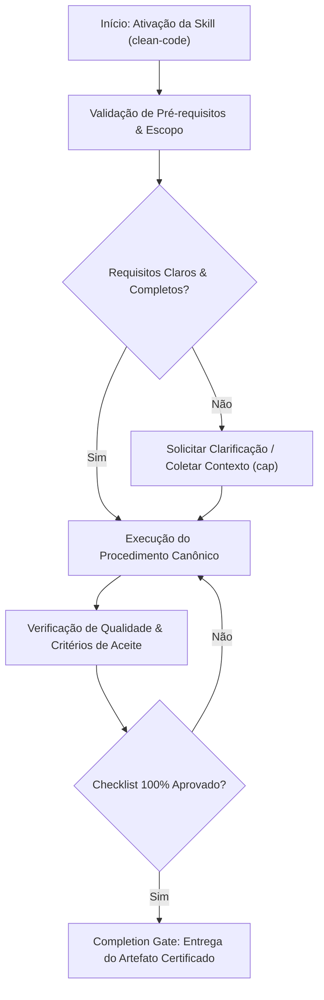

# Clean Code

## When to Use

### Use when:
- Writing new code or reviewing existing code against SOLID and Clean Code standards
- Reducing cognitive and cyclomatic complexity ($CC \le 10$)
- Standardizing naming conventions, function hygiene, and error handling

### Do not use when:
- Low-level kernel drivers or extreme performance-critical inner loops where abstraction is prohibited

## Overview

Apply clean code principles to produce readable, maintainable, and testable software. This skill covers SOLID principles, DRY application, code smell identification, refactoring patterns, naming conventions, error handling, and complexity management. Based on the works of Robert C. Martin, Martin Fowler, and Kent Beck.

**Announce at start:** "I'm using the clean-code skill to improve code quality."

---

## Phase 1: Analyze Current Code

**Goal:** Read and understand the code in full context before changing anything.

### Actions

1. Read the code in its full context (not just the snippet)
2. Identify the code's responsibility and purpose
3. Measure cyclomatic complexity
4. Map coupling and dependencies
5. Note any existing tests

### STOP — Do NOT proceed to Phase 2 until:
- [ ] Code is read in full context
- [ ] Purpose and responsibility are understood
- [ ] Complexity hotspots are identified
- [ ] Existing test coverage is known

---

## Phase 2: Identify Code Smells

**Goal:** Catalog all code smells using the reference tables below.

### Bloaters

| Smell | Detection | Refactoring |
|-------|-----------|------------|
| Long Method | > 30 lines | Extract Method |
| Large Class | > 300 lines or > 5 responsibilities | Extract Class |
| Long Parameter List | > 3 parameters | Introduce Parameter Object |
| Data Clumps | Same params appear together | Extract Class |
| Primitive Obsession | Primitives instead of small objects | Replace with Value Object |

### Object-Orientation Abusers

| Smell | Detection | Refactoring |
|-------|-----------|------------|
| Switch Statements | Switch on type | Replace with Polymorphism |
| Parallel Inheritance | Every subclass requires parallel subclass | Merge hierarchies |
| Refused Bequest | Subclass ignores inherited methods | Replace Inheritance with Delegation |

### Change Preventers

| Smell | Detection | Refactoring |
|-------|-----------|------------|
| Divergent Change | One class changed for multiple reasons | Extract Class (SRP) |
| Shotgun Surgery | One change touches many classes | Move Method, Inline Class |

### Dispensables

| Smell | Detection | Refactoring |
|-------|-----------|------------|
| Dead Code | Unreachable or unused | Remove |
| Speculative Generality | Unused abstractions "just in case" | Collapse Hierarchy, Remove |
| Comments explaining bad code | Comments compensating for unclear code | Rename, Extract Method |

### STOP — Do NOT proceed to Phase 3 until:
- [ ] All code smells are cataloged
- [ ] Each smell has a priority (high/medium/low)
- [ ] Refactoring approach is identified for each

---

## Phase 3: Apply Refactoring

**Goal:** Apply refactoring patterns one at a time, verifying tests after each.

### Actions

1. Apply ONE refactoring at a time
2. Run tests after each change
3. If any test fails, revert immediately
4. Continue until code is clean
5. Review naming, structure, and documentation

### STOP — Refactoring complete when:
- [ ] All high-priority smells are resolved
- [ ] All tests pass after each change
- [ ] No behavior was changed during refactoring
- [ ] Code is readable to a new team member

---

## SOLID Principles

### S — Single Responsibility Principle

A class/module should have one, and only one, reason to change.

**Smell:** A class that changes for multiple unrelated reasons.
**Fix:** Extract responsibilities into separate classes.

### O — Open/Closed Principle

Open for extension, closed for modification.

**Smell:** Switch statements that grow with new types.
**Fix:** Polymorphism, strategy pattern, or plugin architecture.

### L — Liskov Substitution Principle

Subtypes must be substitutable for their base types.

**Smell:** Subclass overrides method to throw "not supported."
**Fix:** Restructure hierarchy; prefer composition over inheritance.

### I — Interface Segregation Principle

No client should depend on methods it does not use.

**Smell:** Interfaces with many methods; implementors leave some as no-ops.
**Fix:** Split into smaller, focused interfaces.

### D — Dependency Inversion Principle

Depend on abstractions, not concretions.

**Smell:** High-level modules importing low-level modules directly.
**Fix:** Inject dependencies via interfaces/abstract classes.

---

## Naming Conventions

### Rules

| Element | Convention | Example |
|---------|-----------|---------|
| Variables | Nouns describing what they hold | `userCount`, not `n` |
| Booleans | Prefixed with is/has/can/should | `isActive`, `hasPermission` |
| Functions | Verbs describing what they do | `calculateTotal`, `fetchUsers` |
| Constants | UPPER_SNAKE_CASE | `MAX_RETRY_COUNT` |
| Classes | PascalCase nouns | `UserRepository`, `PaymentService` |
| Interfaces | Describe capability | `Serializable`, `Cacheable` |

### Name Length Guidelines

| Scope | Length | Example |
|-------|--------|---------|
| Loop counters | 1-2 chars | `i`, `j` (tiny loops only) |
| Lambda params | 1-3 chars when context clear | `users.filter(u => u.active)` |
| Local variables | Short but descriptive | `total`, `result` |
| Function names | Medium, descriptive | `calculateMonthlyRevenue` |
| Class names | As long as needed | `AuthenticationTokenValidator` |

---

## Function Guidelines

### Size and Structure

- Functions should do one thing
- Ideal: 5-15 lines (excluding boilerplate)
- Maximum: 30 lines (beyond this, extract)
- Maximum parameters: 3 (beyond this, use options object)

### Guard Clauses (Early Return)

```typescript
// Bad: nested conditions
function getDiscount(user) {
  if (user) {
    if (user.isPremium) {
      if (user.orderCount > 10) {
        return 0.2;
      }
    }
  }
  return 0;
}

// Good: guard clauses
function getDiscount(user) {
  if (!user) return 0;
  if (!user.isPremium) return 0;
  if (user.orderCount <= 10) return 0;
  return 0.2;
}
```

---

## Error Handling Patterns

### Decision Table

| Approach | Use When | Example |
|----------|----------|---------|
| Result type | Functional style, expected failures | `Result<T, E>` return type |
| Specific exceptions | OOP style, exceptional cases | `throw new ValidationError(...)` |
| Error codes | C-style APIs, cross-language | Return code + message |
| Option/Maybe | Value may or may not exist | `Option<User>` |

### Result Type Pattern

```typescript
type Result<T, E = Error> =
  | { success: true; data: T }
  | { success: false; error: E };

function parseConfig(raw: string): Result<Config, ParseError> {
  try {
    const config = JSON.parse(raw);
    if (!isValidConfig(config)) {
      return { success: false, error: new ParseError('Invalid config structure') };
    }
    return { success: true, data: config };
  } catch {
    return { success: false, error: new ParseError('Invalid JSON') };
  }
}
```

### Error Handling Never List

- Never catch and swallow errors silently
- Never use exceptions for control flow
- Never return null to indicate an error
- Never log and rethrow without adding context

---

## Complexity Metrics

| Range | Risk Level | Action |
|-------|-----------|--------|
| 1-5 | Low | No action needed |
| 6-10 | Moderate | Consider refactoring |
| 11-20 | High | Should refactor |
| 21+ | Critical | Must refactor |

### Reducing Complexity

1. Extract complex conditions into named booleans
2. Replace nested conditionals with guard clauses
3. Use polymorphism instead of type checking
4. Decompose into smaller functions
5. Use lookup tables instead of switch/if chains

---

## DRY Application Decision Table

| Situation | Apply DRY? | Rationale |
|-----------|-----------|-----------|
| Exact duplication of logic | Yes | Same logic should live in one place |
| Three or more occurrences | Yes | Rule of Three confirms the pattern |
| Two occurrences only | Wait | May be coincidental similarity |
| Similar structure, different purpose | No | Different reasons to change |
| Abstracting adds more complexity | No | Clarity over DRY |

---

## Comment Philosophy

### Good Comments

| Type | Example |
|------|---------|
| Why (reasoning) | `// Use binary search because list is pre-sorted and >10K items` |
| Legal | Copyright, license headers |
| TODO with ticket | `// TODO(PROJ-123): Add rate limiting` |
| Warning | `// WARNING: This is not thread-safe` |
| Public API docs | JSDoc/TSDoc for public interfaces |

### Bad Comments (remove and fix code instead)

| Type | Example |
|------|---------|
| Restating code | `// increment counter` before `counter++` |
| Commented-out code | Use version control instead |
| Journal comments | Use git log instead |
| Closing brace comments | `} // end if` |

---

## Anti-Patterns / Common Mistakes

| Anti-Pattern | Why It Is Wrong | Correct Approach |
|-------------|----------------|-----------------|
| Premature abstraction | DRYing code that differs in intent | Wait for Rule of Three |
| God classes | Know everything, do everything | Split by responsibility (SRP) |
| Feature envy | Method uses another class's data more than its own | Move method to the data owner |
| Stringly typed data | Strings where enums/types belong | Define proper types |
| Magic numbers | Unclear meaning, error-prone | Named constants |
| Boolean trap | Function with boolean params that change behavior | Use named options or separate functions |
| Over-engineering | Abstractions for problems that do not exist | YAGNI — You Ain't Gonna Need It |

---

## Integration Points

| Skill | Relationship |
|-------|-------------|
| `code-review` | Review identifies code smells for clean-code to resolve |
| `test-driven-development` | TDD ensures behavior preservation during refactoring |
| `senior-frontend` | Frontend components follow clean code principles |
| `senior-backend` | Backend services follow SOLID and clean architecture |
| `performance-optimization` | Clean code enables easier performance optimization |
| `systematic-debugging` | Clean code is easier to debug |

---

## Immutability Preferences

- Default to `const` (JavaScript/TypeScript)
- Use `readonly` properties and `ReadonlyArray`
- Prefer spread/destructuring over mutation
- Use immutable update patterns for state
- Only mutate when performance profiling demands it

---

## Skill Type

**FLEXIBLE** — Apply principles based on context. Not every function needs to be 5 lines; not every pattern needs to be SOLID. Use judgment and optimize for team readability over theoretical purity.


## Decision Workflow




## Anti-Patterns & Operational Guardrails

| Anti-Pattern | Severidade | Impacto Negativo | Mitigação Canônica |
|:---|:---:|:---|:---|
| **Execução Prematura sem Contexto** | 🔴 Critical | Alucinação de contexto e refatoração destrutiva | Ativar a skill `cap` para adquirir evidências mínimas antes de editar. |
| **Omissão de Checklists de Validação** | 🟡 Medium | Entrega de artefatos com inconsistências sintáticas | Executar rigorosamente o checklist passo a passo antes do handoff. |
| **Falta de Documentação de Decisões** | 🟢 Low | Perda de rastreabilidade técnica e drift arquitetural | Registrar trade-offs relevantes via skill `adr-generator`. |


## Edge Cases & Failure Modes

- **Ambiente Restrito / Read-Only:** Se o filesystem ou sandbox estiver bloqueado contra escrita, reportar o bloqueio com evidência imediata e gerar o patch em markdown diff.
- **Conflito de Especificação:** Caso encontre contradições entre a intenção do usuário e o SSOT (`AGENTS.md`), interromper e sinalizar as opções com trade-offs.
- **Timeout ou Exaustão de Contexto:** Em tarefas volumosas, decompor em sub-lotes atômicos utilizando a skill `subagent-driven-development`.


## Domain SOTA & Industry Engineering Standards

- **Complexity Metrics:** Thomas McCabe's Cyclomatic Complexity ($CC$), SonarSource Cognitive Complexity, and Halstead Volume.
- **Design Principles:** SOLID (Single Responsibility, Open-Closed, Liskov Substitution, Interface Segregation, Dependency Inversion), DRY, KISS, and YAGNI.
- **Naming Conventions:** Intent-revealing names, domain-driven terminology, pronounceable identifiers (PEP 8, Google Style Guides).
- **Function Hygiene:** Single Level of Abstraction Principle (SLAP), command-query separation (CQS), and maximum parameter count $\le 3$.

### Cyclomatic Complexity Formula & Quality Gates:

$$CC = E - N + 2P$$

Where $E$ is edges, $N$ is nodes, and $P$ is connected components in the control flow graph.

| Metric | Target / Threshold | Action when Breached |
|:---|:---:|:---|
| **Cyclomatic Complexity ($CC$)** | $\le 10$ per function | Mandatory refactoring / function extraction. |
| **Cognitive Complexity** | $\le 15$ per function | Flatten nested conditionals via guard clauses. |
| **Function Length** | $\le 30$ lines | Extract coherent sub-routines (SLAP). |
| **Parameter Count** | $\le 3$ params | Encapsulate into Parameter Object or Options Dict. |

### Exhaustive Heuristic Decision Rules:
- **Rule of Thumb 1 (Zero-Trust Architectural Boundaries):** Treat all external inputs, third-party payloads, and cross-module boundaries with strict zero-trust schema validation.
- **Rule of Thumb 2 (Fail-Fast & Deterministic Errors):** Reject invalid states immediately with typed, actionable error contracts rather than cascading silent failures.
- **Rule of Thumb 3 (Idempotency & AST Preservation):** State mutations and code transformations must maintain semantic idempotency across repeated executions.
- **Rule of Thumb 4 (Benchmark & Telemetry Alignment):** Measure critical execution latency ($P_{95}$) and memory overhead with structured telemetry and baseline benchmarks.
- **Rule of Thumb 5 (Event-Driven & Circuit Breaker Decoupling):** Isolate asynchronous operations behind circuit breakers and resilient retry mechanisms to prevent cascading failure.
- **Rule of Thumb 6 (Contract-First DDD Modeling):** Define clear domain aggregates, value objects, and typed interface contracts before implementing concrete logic.
- **Rule of Thumb 7 (RAG & Semantic Retrieval Precision):** Optimize context retrieval with hybrid lexical-vector search and reciprocal rank fusion to eliminate hallucinated routing.
- **Rule of Thumb 8 (OWASP & Supply Chain Verification):** Verify dependencies and data flows against OWASP Top 10 and SLSA Level 3 supply chain security standards.
- **Rule of Thumb 9 (Verification Gate Invariant):** Never declare completion without automated test execution evidence and zero compiler/linter warnings.
## Completion Gate & Verification
Before concluding Clean Code audit:
- [ ] Cyclomatic complexity verified $\le 10$ per function
- [ ] Zero magic literals or undocumented constants
- [ ] Single Level of Abstraction Principle (SLAP) respected